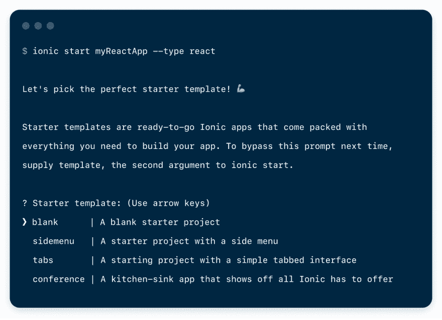
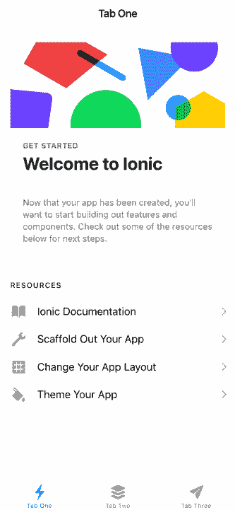

# 宣布离子反应释放候选人！

> 原文：<https://dev.to/ionic/announcing-the-ionic-react-release-candidate-2ok5>

今天，我们很高兴地宣布，Ionic React 的候选版本已经发布，现已上市！

我们在二月份发布了 Ionic React 的第一个测试版，从那以后，我们收到了来自社区的大量反馈和贡献。基于这些反馈，我们一直致力于使 Ionic React 不仅对 React 开发人员，而且对任何希望投身 web 开发的人都是一个很好的体验。

Ionic React RC 标志着我们的愿景的第一次重大发布，将 Ionic 开发带给其他框架上的更多开发者。Ionic v4.0 使这成为可能，它完全是从零开始重新编写的，专注于 web 标准，不依赖于特定的框架。Ionic v4.0 使我们有可能面向许多框架，同时仍然让我们的核心组件成为所有这些框架共享的单一代码库。

## 为什么离子会起反应？

如果可以和任何框架一起使用 Ionic，为什么还有像`@ionic/react`这样的专门包？这是一个很好很公平的问题。

虽然您可以将核心的 Ionic 组件直接导入到 React 项目中，但是在使用 Ionic 时，开发人员的体验并不是我们认为的那样。虽然在 React 中使用 web 组件是可能的，但是您必须编写一些样板代码才能正确地与 web 组件通信。

Ionic React 是我们核心组件的一个薄薄的包装器，将它们导出为原生 React 组件，并为您处理这些样板代码。因此，在 React 中使用`@ionic/react`感觉很自然，并且提供了许多核心组件中没有的 React 范例。

还有一些特性仍然需要在原生框架中编写，比如页面生命周期管理和生命周期方法。为了实现这一点，我们用`@ionic/react-router`扩展了流行的`react-router`包。值得注意的是，我们并没有创建一个新的路由器，而是扩展了 React Router，以便在使用 Ionic 应用程序时提供更好的体验。

## 入门

如果您还没有这样做，请获取 Ionic CLI 的最新 [v5 版本](https://ionicframework.com/blog/ionic-cli-v5-brings-react-beta-support/):

```
npm i ionic -g 
```

并通过指定“React”的类型创建一个 Ionic React 项目:

```
ionic start MyReactApp --type=react 
```

您将看到我们所有的标准入门模板都在那里，选择您最喜欢的(我将选择选项卡)。

[](https://res.cloudinary.com/practicaldev/image/fetch/s--ACS_85gS--/c_limit%2Cf_auto%2Cfl_progressive%2Cq_auto%2Cw_880/https://blog.ionicframework.com/wp-content/uploads/2019/08/start_ionic_react_app_cli.png)

Ionic CLI 将为您创建项目并安装依赖项。在幕后，CLI 使用 [Create React App](https://facebook.github.io/create-react-app/) (CRA)来初始化项目的 React 位。如果你熟悉 CRA，那么你可以在 Ionic React 中使用 CRA 脚本提供的所有功能。

接下来，进入新文件夹(MyReactApp)，运行`ionic serve`。您的应用将被编译并在新的浏览器窗口中启动:

[](https://res.cloudinary.com/practicaldev/image/fetch/s--NyU_Qnce--/c_limit%2Cf_auto%2Cfl_progressive%2Cq_auto%2Cw_880/https://blog.ionicframework.com/wp-content/uploads/2019/08/ionic-react-rc-starter.png)

要获得更深入的入门教程，请查看我们在文档中针对 Ionic React 的[构建您的第一个应用](https://ionicframework.com/docs/react/your-first-app)指南。

## 接下来是什么？

既然 Ionic React RC 已经发布，我们希望您对其进行测试，并将您的反馈发送给我们。要报告问题或评论，请前往 [GitHub repo](https://github.com/ionic-team/ionic/issues) 并为问题贴上“package react”标签。你也可以去[论坛](https://forum.ionicframework.com/)提问或开始讨论。

对于 Ionic 团队，我们的重点是“尽快”发布 Ionic React final。我们将密切关注在 RC 阶段出现的任何问题，并致力于一些最终的代码稳定和小错误修复。我们不希望任何 API 有任何更大的变化。

我们还计划在文档中创建更多的内容和指南，以帮助我们在使用 Ionic React 时发现的一些最佳实践。

在此之前，请继续向我们发送您的反馈和快乐编码！

**P.S.** 如果您要去参加 8 月 22-23 日的 [React 集会](https://www.reactrally.com/)，请到我们的展位前打个招呼！核心团队的几名成员将在那里，我们很乐意聊天！到时候我们甚至可以聊些新的话题...

* * *

在一个方便的小地方链接以上资源:

[在 Github](https://ionicframework.com/docs/react/your-first-app)
[上构建你的第一个 Ionic React 应用](https://forum.ionicframework.com/)
[Ionic React 项目【离子论坛](https://github.com/ionic-team/ionic/tree/master/packages/react)
[创建 React 应用](https://facebook.github.io/create-react-app/)