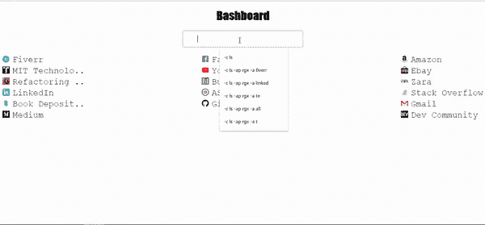
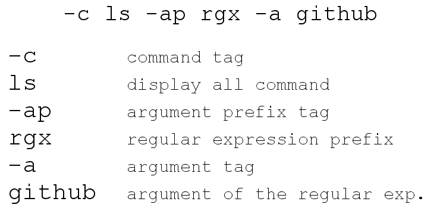

# 被 Chrome 书签管理器惹恼后，我创建了自己的书签管理器。我应该释放它吗？

> 原文：<https://dev.to/juricakenda/annoyed-by-chrome-bookmark-manager-i-created-my-own-should-i-release-it-50ba>

我对 Chrome 上过于拥挤的书签栏感到恼火，所以我决定创建自己的书签管理器。在创建初始版本后，我认为让它接受类似 CLI 的命令来过滤和打开某些书签会很有趣。
 
为此，我创建了自己的命令表单及其解析器。

目前执行的命令有:
ls -显示所有命令
opn -打开命令

您可以使用修饰符来修改这些命令:
rgx -查找正则表达式(适用于 ls 和 opn)
tag -查找页面情感中的特定标签(适用于显示)

修饰符接受字符串参数，并基于它们创建将修改命令执行的谓词。

可解析命令看起来是这样的:

我应该公开发布这个吗？拥有哪些功能或命令会很有趣？