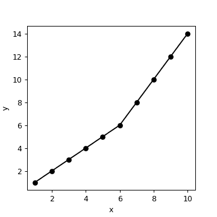

# 答案:寻找斜率变化的点作为自由参数- Python

> 原文：<https://dev.to/towry/answer-finding-the-point-of-a-slope-change-as-a-free-parameter-python-2bpd>

<header>

#  [ 回答 re:寻找斜率变化的点作为自由参数——Python](https://stackoverflow.com/questions/45063260/finding-the-point-of-a-slope-change-as-a-free-parameter-python/45063636#45063636)

Jul 12 '17[7](https://stackoverflow.com/questions/45063260/finding-the-point-of-a-slope-change-as-a-free-parameter-python/45063636#45063636) </header>

这是你的数据图:

[](https://i.stack.imgur.com/JK0Sf.png)

你需要找到两个斜率(==取两个导数)。首先，求每两点之间的斜率(使用`numpy`):

```
import numpy as np 
x = np.array([1, 2, 3, 4, 5, 6, 7, 8, 9, 10],dtype=np.float)
y = np.array([1, 2, 3, 4,
```

…<button class="ltag__stackexchange--btn" type="button">[Open Full Answer](https://stackoverflow.com/questions/45063260/finding-the-point-of-a-slope-change-as-a-free-parameter-python/45063636#45063636)</button>