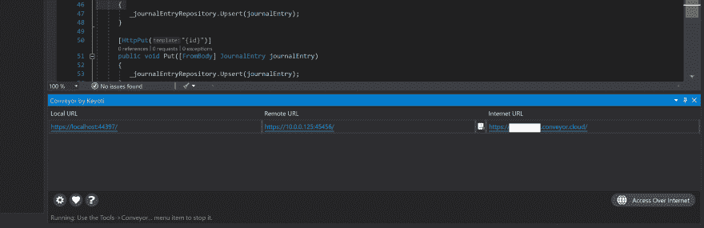

# 传送带开发中的 API 访问

> 原文：<https://dev.to/codingcoach/api-access-in-development-with-conveyor-1kkf>

在我的工作流程中，当我用 Visual Studio 开发一个 API 时，我需要从移动应用程序访问它，通常我会在 Azure 中发布它，或者我需要做许多步骤来配置我的 IIS express。

这是因为默认情况下，IIS express 在 localhost 端点中发布您的 API，并且不能从您的开发机器外部访问它。

在寻找一个快速解决方案时，我发现了 [Conveyor，一个 Visual Studio 扩展](https://marketplace.visualstudio.com/items?itemName=vs-publisher-1448185.ConveyorbyKeyoti)，它是测试版，现在是免费的，会自动将我们的 API 提供给我们网络中的任何设备，如果你注册了一个帐户，你就可以从互联网上访问。

安装完扩展后，当我们以调试模式启动项目时，它就会运行。
在下一张截图中，我们可以看到启用的端点。

如果我们想使用 https，我们也可以配置证书。

对我的 Visual Studio 工具箱的一个很好的补充，非常有用，并且易于使用和安装。