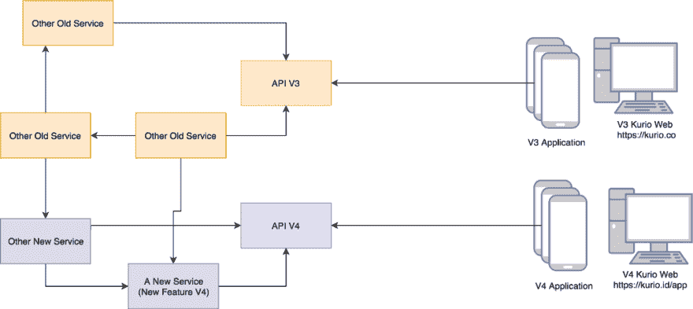
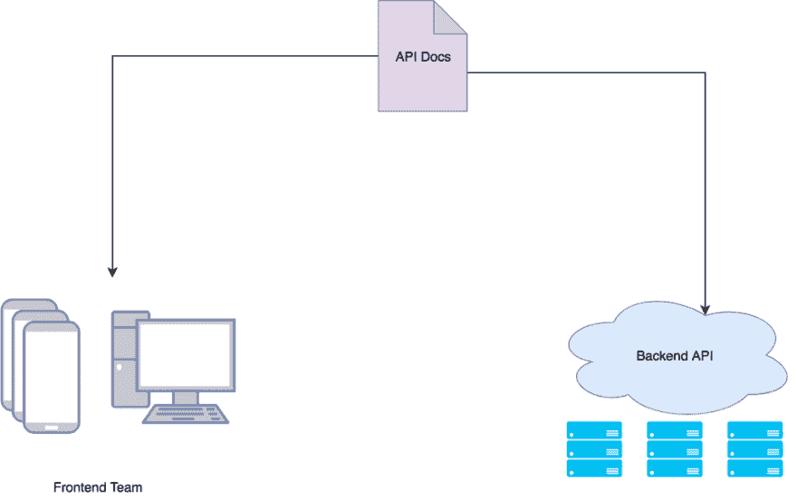
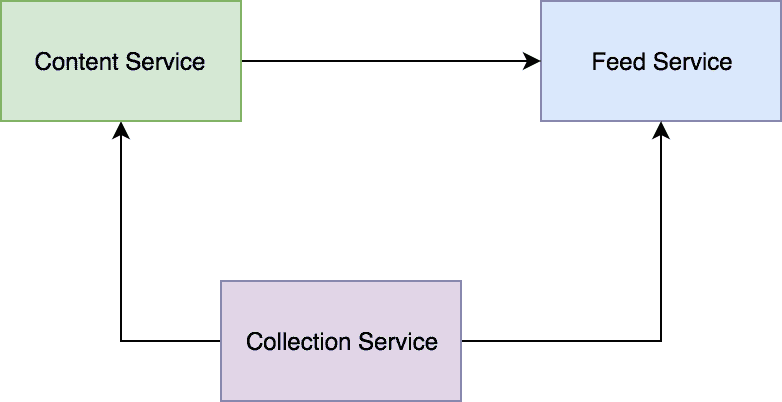

# Kurio 中的 API 驱动开发:使用 Open API 3 加速开发过程

> 原文：<https://dev.to/bxcodec/api-driven-development-in-kurio-speeding-up-the-development-process-with-open-api-3-23p2>

 

<figcaption>照片由[拉洛·埃尔南德斯](https://unsplash.com/@lalonchera?utm_source=medium&utm_medium=referral)于 [Unsplash](https://unsplash.com?utm_source=medium&utm_medium=referral)</figcaption>

我们刚刚发布了新版本的应用程序 Kurio。仅供参考，对于仍然不知道 Kurio 是什么的读者来说，它是一个印度尼西亚新闻聚合器。如果你熟悉 Flipboard 的工作方式，那么你也会熟悉 Kurio。

一个月前，我们刚刚发布了我们的新版本 Kurio，Kurio 4.0。在这个版本中，UX/用户界面有很多变化，这是我们应用程序中的一个突破性的变化。

因为这是一个突破性的版本变化，所以也有许多与 API 相关的变化需要我们去构建(甚至重建和重构)。如果你曾经使用过 Kurio，Kurio 3.0 和 Kurio 4.0 之间的对比布局和 UX 可以在下面看到。

 

<figcaption>Kurio V3(第一)和 Kurio V4(第二和第三)</figcaption>

### 发展过程

我们有 3 个团队一起为新版本的 Kurio 工作。有移动工程师、后端工程师和 Web 开发人员。

移动团队将开发 Kurio 4.0 应用程序，web 开发人员将构建我们应用程序的 Web 版本(可以在[https://kurio.id/app](https://kurio.id/app)中看到)，后端团队将为移动和 Web 开发 API。

即使我们已经有一个现有的 API 提供 Kurio 3.0 的 API，但为了避免不必要的问题会被提出并影响旧版本，我们决定创建一个新的 API，只为 V4 服务。

因此，将有 2 个 API 网关将被前端访问。V3 的旧版本和将为 V4 开发的新版本。后端团队将为 V4 开发新版本的 API。

<figcaption>V4 应用的新 API 网关</figcaption>

#### API 驱动开发

由于我是后端工程师，我和我的团队将从事 API 方面的工作。我们必须确保 API 必须尽快准备好，以便前端(移动和网络)可以在他们这边工作。

但是因为我们同时开始冲刺(三个团队)。所以很明显，后端团队将阻止其他团队(移动和 Web)工作，因为移动和 Web 都将依赖后端来提供 API。

这就是我们如何使用 API 驱动的开发方法来解决我们的问题。所以每个团队都可以并行工作。

API 驱动的开发被认为是 API 优先的设计原则。这意味着我们必须首先设计我们的 API。我们必须在后端和前端(移动和 Web)之间创建一个协议合同。该合同是双方团队(后端和前端)都将使用的 API 文档。

它包含 API 规范和签名、认证和授权、资源和方法、参数、类型和数据结构等。该合同由后端和前端双方创建和定义，也基于产品功能。

如果双方已经同意，那么我们将开始独立工作。前端(移动和 Web)将基于 API 文档开发前端和应用程序，后端将开发履行合同的 API(API 文档)。而且有了这种方法，我们可以并行工作，不会互相妨碍。

此外，我们还在后端实现了 API 驱动的开发方法。

因此，在为 V4 开发 API 时，在后端，将会开发许多新的服务，如 V4 中引入的新功能，对结构不佳的旧系统的重建，等等。因此，我们为这个新版本开发了一些新服务，总共有 3 个新服务，收集服务，订阅服务和内容服务，这 3 个服务相互连接。

提要服务依赖于内容和收集服务。而内容服务依赖于收集服务。通常，人们会认为先做收藏服务，再做内容服务，然后再做订阅服务。

但是，我们不是这样做的。我们刚刚把队伍分成了三个小组。每个团队将负责每项服务。甚至当我们开会时，我们会讨论所有 3 个服务，每个人都可以在任何服务中工作，但为了便于管理和交付，我们将一些人分开，只专注于特定的服务。

然后，这 3 个团队(后端团队)将基于我们在 sprint 开始时同意并定义的 API 文档独立并行工作。这就是我们整个团队从后端(由 3 个团队组成)到前端如何使用 API 驱动的开发方法。无论是与前端的 it，还是与我们后端团队之间的 it，我们都使用商定的合同(即 API 文档)独立工作。

#### 使用开放 API 3

Open API 3 是一个 API 规范。这是 Swagger 的新版本，之前命名为 Swagger 2。Swagger 团队没有使用像 Swagger 3 这样的新名字，而是使用术语 Open API 3。不管是什么原因，你都可以在他们的官方网站上读到更多。

简单来说，不要混淆 Swagger 3 和 Open API 3，它们只是用了不同的术语。

所以，回到我们在 Kurio 的话题。以前，在 Kurio 3.0 的 Kurio 中，我们使用 APIB (API 蓝图)来编写 API 文档。但是，在开发这个新版本的 Kurio 4.0 时。我们同意使用开放 API 3。因为 APIB 不常见而且已经被抛弃了，除了背后的社区，还没有 OpenAPI 3 有那么大。Open API 3 现在被更广泛地采用。

关于 Open API 3 规范的任何细节都可以在官方网站上找到。那边解释的很好。自 Swagger 2 以来引入的差异和新功能也很好地解释了这一点。

那么，我们使用这个开放 API 3 的好处是什么呢？

#### 用 Open API 3 生成 SDK

就像这个帖子[由](https://toolbox.kurio.co.id/levelling-up-api-documentation-7c26b37715bb) [M Rifad Ainun Nazieb](https://medium.com/u/c244e0555136) 整理 API 文档一样，我们基于 API 文档生成 SDK。在那篇文章中，你会发现我们是如何编写 API 文档的。

但是，它在 Kurio v3 中。当时我们仍然使用 APIB (API Blueprint)作为我们的 API 规范，它将被转换成 Swagger 2，然后生成 SDK。这个 SDK 可以作为任何需要它的项目的库。(阅读这篇文章可以更好地理解:D 的意思)

我们还需要用 Open API 3 做同样的事情，因为在开发 V4 时，我们使用 Open API 3。我们还需要找到与使用 APIB 时相同的工具。一个从 API 规范生成 SDK 的工具。

幸运的是我们找到了这个项目[https://github.com/OpenAPITools/openapi-generator](https://github.com/OpenAPITools/openapi-generator)。这个项目将生成 SDK 客户端，这将帮助我们做一个 API 调用。我们不会费心自己创建一个 API 调用处理程序，因为这个项目已经生成了我们需要的所有样板文件。

实际上，这个特性在 Swagger 2 中已经存在，但是因为我们使用的是 Open API 3，这是唯一一个真正让我们满意的工具。即使在使用它的时候，我们在内部使用时也做了一些**“定制”，但是这个已经帮了我们很多了。**

 **但是我们为什么需要 SDK 呢？

* * *

在从事微服务项目时，意味着有许多服务相互连接。每个服务根据自己的需要对其他服务进行 API 调用。因此，我们创建 SDK 来帮助我们创建一个库，它将帮助我们构建对任何服务的 API 调用请求。因此，我们不必再创建任何请求构建器，我们只需导入 SDK 并使用它。

比如说。这是一个使用 Golang 从我们的内容服务中获取内容的例子(我们在 Kurio 中使用 Golang)，而没有使用 SDK。**