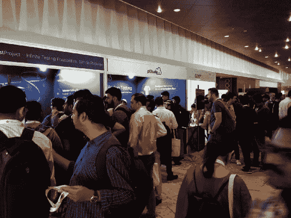
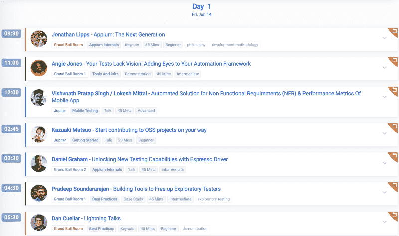
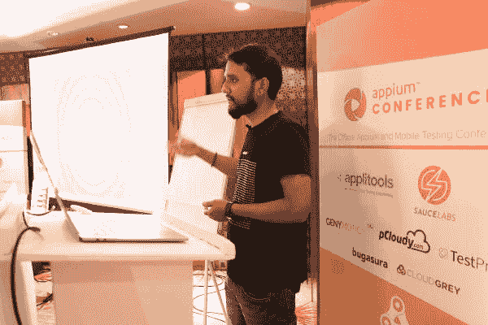
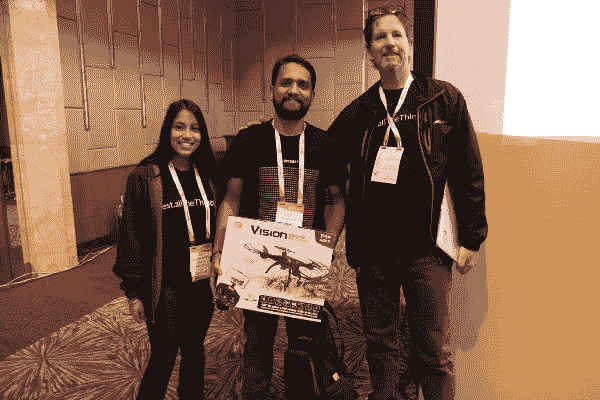
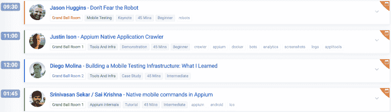
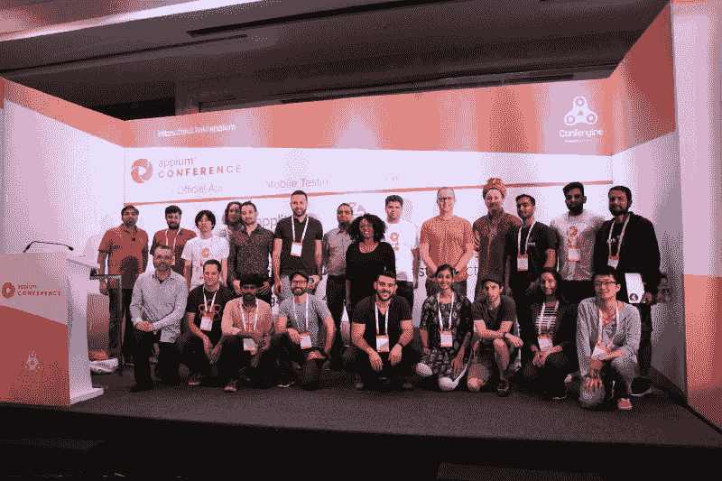

# Appium Conf 2019 Bengaluru:我的经历

> 原文：<https://dev.to/automationhacks/appium-conf-2019-bengaluru-my-experience-35oi>

我第一次在测试自动化会议上发言的经历，以及我学到的令人敬畏的演讲和工具。

<figure> 

<figcaption>参会人员查看赞助商展位。</figcaption>

</figure>

Appium Conf 于 2019 年 6 月 13 日至 15 日在印度的花园城市举办了第二届会议，来自世界各地的[演讲者](https://confengine.com/appium-conf-2019/speaker)阵容令人印象深刻，与社区分享了如此多的精彩内容。这篇文章总结了我个人参加的会议，以及我从中学到的东西，同时也是我第一次在会议上发表演讲的感受。

有了这个背景，让我们直接开始吧。

由于设置了三个平行的专题讲座，不可能参加所有的讲座，所以我根据对我个人有更高要求的主题或演讲者来选择我的时间表。ConfEngine 应用程序有这个可爱的网络/移动应用程序，可以让你看到现在正在播放的会议，以及你**想要参加的会议**，并将它们添加为日历邀请，所以浏览它们一点也不痛苦。

所有这些会议都被记录了下来，所以我很高兴我们可以回到过去，听听其中丰富的信息。

### 第 1 天

#### [乔纳森·立普斯—阿皮姆:下一代](https://confengine.com/appium-conf-2019/proposal/9574/appium-the-next-generation)

[视频](https://www.youtube.com/watch?v=zWXQ_TRYKic)已经出了。但除了让 appium 更具可插拔性的计划和确保其跟上移动技术变化的愿景之外。这个主题演讲的最大亮点是 Jonathan 展示了一个用于 raspberry Pi 的 Appium 驱动程序，以及他如何使用它来播放现场鼓序列。点击查看[代码。](https://github.com/jlipps/appium-raspi-driver)

#### [安吉·琼斯——你的测试缺乏远见:给你的自动化框架添加眼睛](https://confengine.com/appium-conf-2019/proposal/9067/your-tests-lack-vision-adding-eyes-to-your-automation-framework)

Angie Jones **现场演示了如何使用 Applitools 为 UI 测试添加额外的智能，以及如何轻松地控制验证中所需的粒度级别。为了打败这一切，当 appium 测试运行时，她听了超级酷的节拍。**

> 在 appium 脚本的现场演示运行时播放很酷的音乐是个好主意。别出心裁的[@ tech girl 1908](https://twitter.com/techgirl1908?ref_src=twsrc%5Etfw)[@ appium _ conf](https://twitter.com/appium_conf?ref_src=twsrc%5Etfw)[# appium conf](https://twitter.com/hashtag/AppiumConf?src=hash&ref_src=twsrc%5Etfw)[pic.twitter.com/YFxTEUO7pU](https://t.co/YFxTEUO7pU)
> 
> —高拉夫·辛格(@ _ _ 高拉夫 _ 辛格)[2019 年 6 月 14 日](https://twitter.com/__gaurav_singh/status/1139410462825598978?ref_src=twsrc%5Etfw)

此外，她是一个很棒的人，可以和她一起出去聊天。作为测试倡导者和测试自动化大学主任的一部分，她为社区做出了很大贡献。测试自动化大学是一个社区驱动的站点，在 Applitools 上主持测试自动化课程

> 很高兴见到 [@techgirl1908](https://twitter.com/techgirl1908?ref_src=twsrc%5Etfw) 本人！能够在测试自动化领域见到如此出色的领导者真是太棒了！pic.twitter.com/8isuwSdM63[# AppiumConf](https://twitter.com/hashtag/AppiumConf?src=hash&ref_src=twsrc%5Etfw)[@ AppiumConf](https://twitter.com/appium_conf?ref_src=twsrc%5Etfw)
> 
> —高拉夫·辛格(@ _ _ 高拉夫 _ 辛格)[2019 年 6 月 15 日](https://twitter.com/__gaurav_singh/status/1139777388756140033?ref_src=twsrc%5Etfw)

#### [Vishvnath Pratap Singh/loke sh Mittal——非功能性需求的自动化解决方案(NFR) &移动应用的性能指标](https://confengine.com/appium-conf-2019/proposal/9082/automated-solution-for-non-functional-requirements-nfr-performance-metrics-of-mobile-app)

哇哦。这是一次非常技术性的演讲，演讲者简要介绍了他们如何使用 Espresso/整套其他技术来收集性能指标。这是[幻灯片](https://drive.google.com/a/go-jek.com/file/d/1qEHNgFToydAyNkf7sppCmIQ1_cbDQfS3/view?usp=drive_open)，这绝对是一个值得关注的视频。

#### [gaur av Singh——如何在 Appium 中杀死 test flake？](https://confengine.com/appium-conf-2019/proposal/8698/how-to-kill-test-flake-in-appium)

嗯，我必须参加这个活动，因为我是举办这个活动的人。  我的目标是给出一套策略，工程师可以遵循这些策略来确保他们能够将测试碎片减少到最低限度，这在很大程度上(如果不是全部的话)受到了 appium 团队在 [appium pro](https://appiumpro.com/editions) 上写的一系列文章以及 Jonathan 提供的其他网络研讨会的启发。做这个演讲是一次很好的公共演讲练习，我不仅学到了很多东西，还意识到我可以在众人面前演讲并传达一个想法。期待在未来的会谈中帮助社区。如果你想看的话，这里有[幻灯片](https://www.slideshare.net/slideshow/embed_code/key/zA1rir4oIv97k6?feature=oembed)。

哦哦！我有没有提到，对我来说，赶上乔纳森是这次会议的一个亮点。

> 哇哦。很荣幸见到乔纳森·李普斯本人[@ jlipps](https://twitter.com/jlipps?ref_src=twsrc%5Etfw)[@ appium _ conf](https://twitter.com/appium_conf?ref_src=twsrc%5Etfw)[# appium conf](https://twitter.com/hashtag/AppiumConf?src=hash&ref_src=twsrc%5Etfw)
> 
> 他的主题演讲以一个在 rasberry pi 上运行 appium 服务器的设备现场击鼓结束，非常酷。[pic.twitter.com/4AF7ueuxHt](https://t.co/4AF7ueuxHt)
> 
> —高拉夫·辛格(@ _ _ 高拉夫 _ 辛格)[2019 年 6 月 14 日](https://twitter.com/__gaurav_singh/status/1139423401490018304?ref_src=twsrc%5Etfw)

#### [丹尼·格拉汉姆——用 Espresso Driver 开启新的测试功能](https://confengine.com/appium-conf-2019/proposal/9284/unlocking-new-testing-capabilities-with-espresso-driver)

Dan 的精彩演讲，他解释了 espresso 的许多功能可以在 appium 中轻松利用，并且这种支持只会越来越好。他对浓缩咖啡工作原理的解释和闲置资源的例子非常有帮助。

#### 

这个男孩是一个很好的交谈对象。他谈了很多关于测试背后的理论，并分享了他多年来作为一名测试人员在不同公司解决难题的经历。对我来说，关键的收获是不要被问题空间所限制，而是思考我们如何创建工具/实用程序来使我们作为测试人员的生活变得更加容易。

#### 丹·库埃拉尔— [闪电对话](https://confengine.com/appium-conf-2019/proposal/9583/lightning-talks)

对我来说，这一天以一系列令人惊叹的闪电演讲结束，这些演讲不是别人，正是 appium 的创始人丹·库埃拉尔组织和管理的，他们太棒了。会等着这段视频出来。

结束这一天。我赢得了一次幸运抽奖，获得了一架视觉无人机，作为酱实验室赠送的一部分。这一天以最美好的方式结束:

> 哇哦。刚刚赢得了视觉无人机作为酱实验室的一部分。我想今天是我的幸运日。非常感谢！[@ saucelabs](https://twitter.com/saucelabs?ref_src=twsrc%5Etfw)[@ appium _ conf](https://twitter.com/appium_conf?ref_src=twsrc%5Etfw)[# appium conf](https://twitter.com/hashtag/AppiumConf?src=hash&ref_src=twsrc%5Etfw)[pic.twitter.com/drOitBthgF](https://t.co/drOitBthgF)
> 
> —高拉夫·辛格(@ _ _ 高拉夫 _ 辛格)[2019 年 6 月 14 日](https://twitter.com/__gaurav_singh/status/1139504346503114752?ref_src=twsrc%5Etfw)

### 第二天

#### 杰森·哈金斯:[不要害怕机器人](https://confengine.com/appium-conf-2019/proposal/9580/dont-fear-the-robot)

你并不是每天都能听到创作者亲自和 Selenium，Sauce Labs 和 Tapster 的创始人交流，这对我来说是这次会议的亮点之一。他谈到了他的公司 [Tapster robotics](https://www.tapster.io/) 如何制造机器人来执行不同用例的自动化，这非常酷。

Jason 还现场演示了在 arduino 上运行的 Appium 驱动程序使用 IOS 13 鼠标的动作，以展示对愤怒的小鸟应用程序的测试！都活了！。这是本次会议期间在如此短的时间内完成的第二个 IOT 车手。

> 哇哦。在 arduino 上使用 appium 驱动程序来使用 IOS 13 鼠标操作。[@拥抱](https://twitter.com/hugs?ref_src=twsrc%5Etfw)这个 [@appium_conf](https://twitter.com/appium_conf?ref_src=twsrc%5Etfw) 太酷了。pic.twitter.com/mBEPjUY3Tp
> 
> —高拉夫·辛格(@ _ _ 高拉夫 _ 辛格)[2019 年 6 月 15 日](https://twitter.com/__gaurav_singh/status/1139755150543769600?ref_src=twsrc%5Etfw)

亲自和他聊天是梦想成真。他是这样一个有成就的人，一个可以与之交谈的人，从他那里直接听到许多关于硒项目的历史是令人难以置信的。

> 和[@拥抱](https://twitter.com/hugs?ref_src=twsrc%5Etfw)开了个粉丝见面会，聊了聊。非常有趣的对话！
> 
> 很高兴能就如何杀死 appium 中的测试片发表演讲 [@appium_conf](https://twitter.com/appium_conf?ref_src=twsrc%5Etfw) 。不要害羞！明天开会的时候过来打个招呼。pic.twitter.com/iOAl2k6wtI[# AppiumConf](https://twitter.com/hashtag/AppiumConf?src=hash&ref_src=twsrc%5Etfw)
> 
> —高拉夫·辛格(@ _ _ 高拉夫 _ 辛格)[2019 年 6 月 13 日](https://twitter.com/__gaurav_singh/status/1139224995349946368?ref_src=twsrc%5Etfw)

#### Justin Ison — [Appium 原生应用爬虫](https://confengine.com/appium-conf-2019/proposal/8262/appium-native-application-crawler)

Justin 分享了他如何构建一个应用程序爬虫来遍历一个应用程序，并找出该应用程序是否没有正确本地化。为了击败它，它是完全开源的，可以在 GitHub 上获得

#### [迭戈·莫利纳](https://github.com/diemol)——[构建移动测试基础设施:我学到了什么](https://confengine.com/appium-conf-2019/proposal/9248/building-a-mobile-testing-infrastructure-what-i-learned)

我曾听过一个早期的试讲播客，其中有 [diego 谈到 Zalenium](https://www.joecolantonio.com/testtalks/208-selenium-grid-zalenium-diego-molina/) 并分享了许多关于如何设置和构建移动基础设施的实用技巧。重点是他讨论堆栈和使用的工具/技术的深度以及所有这些的实用性。

以下是他提到的一些工具:

*   木偶、厨师、Ansible(以下简称代码)
*   QEmu (Linux world)、Docker 或 Virtualbox (VMs)
*   普罗米修斯(应用程序监控)

#### [Srinivasan Sekar/Sai Krishna—Appium 中的本地移动命令](https://confengine.com/appium-conf-2019/proposal/8946/native-mobile-commands-in-appium)

这些令人惊叹的演讲者就如何使用[本地移动命令](http://appium.io/docs/en/commands/mobile-command/)处理一些难以自动化的场景给出了实用的建议

#### [乔纳·斯提农——所有期望的能力](https://confengine.com/appium-conf-2019/proposal/8673/all-desired-capabilities)

男孩，这是我最喜欢的演讲。Jonah 在 90 分钟的演讲中讲述了大约 180 个 appium 期望的功能，甚至演示了他如何找到每个功能，同时保持演讲非常有趣。他还设置了 [caps.cloudgrey.io](https://caps.cloudgrey.io) 来托管所有这些不同复杂程度的标签，我确信这将是一个非常棒的社区资源。

我对这次演讲的确切感受是:

> 乔纳的记忆力真好。给那个人一枚勋章！
> 
> —高拉夫·辛格(@ _ _ 高拉夫 _ 辛格)[2019 年 6 月 15 日](https://twitter.com/__gaurav_singh/status/1139832069683437570?ref_src=twsrc%5Etfw)

对我来说，那是一个包裹。

<figure>

<figcaption>Appium Conf 2019 演讲嘉宾</figcaption>

</figure>

总的来说，这对我来说是一次非常积极的经历，我要特别感谢[项目委员会](https://confengine.com/appium-conf-2019/program-committee)的出色人员、[赞助商](https://confengine.com/appium-conf-2019/sponsor)以及为  买单的人、[演讲者](https://confengine.com/appium-conf-2019/speaker)和所有与会者，是他们让这次活动变得如此精彩。当视频出来时，我一定会去看看，并期待着未来的会议。

如果你觉得这篇文章有用或有启发性，为什么不与你的朋友或同事分享呢？

在另一篇未来的帖子中再见！在那之前，祝测试和编码愉快！干杯！