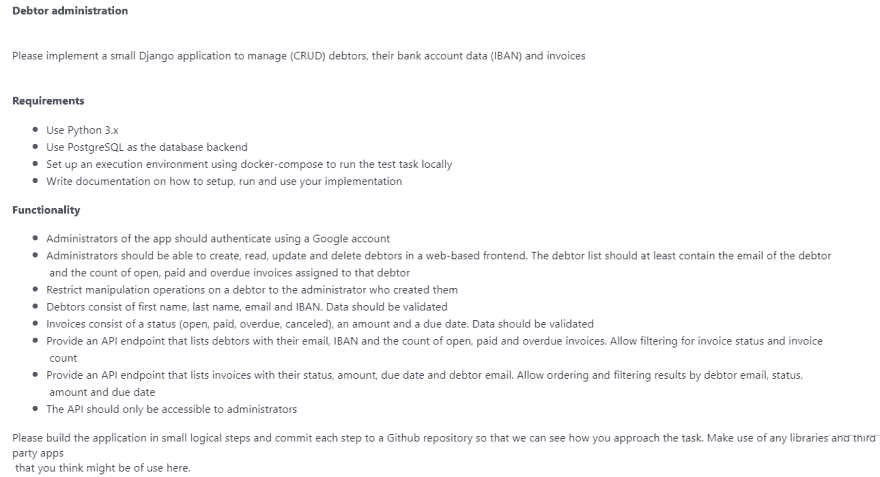
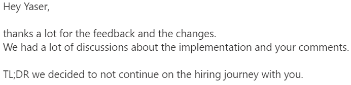
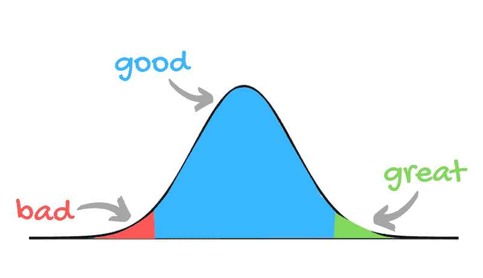

# 你是一个平庸的开发者吗？我也是

> 原文：<https://dev.to/yaser/are-you-a-mediocre-developer-me-too-34ed>

## 故事时间

最近，我申请了一份工作...

我被要求做这个测试任务:

很简单，我用了一些额外的奖励，比如使用 Vue.js 和部署到 Heroku 上。[这里是回购网址:债务人管理人](https://github.com/yaseralnajjar/Debtor-Administrator)

我得到的回应是:

*   如果你想听完整的故事，我已经写在评论里了。

## 设置栏

 
*原图:[https://timcoffeyart . WordPress . com/2011/10/26/setting-the-bar-high/](https://timcoffeyart.wordpress.com/2011/10/26/setting-the-bar-high/)*

别误会，我不是说他们应该雇用我...

我只是说他们的酒吧看起来不现实！

最近，许多公司只是把标准定得太高了。

当他们开始发明像这样的东西时，你会意识到这一点:

1.  10x 工程师。
2.  全栈 DevOps 开发者(我不是开玩笑！).
3.  充满激情的工程师(他们加班并利用空闲时间学习)。...等等

真的吗？！

## 好 vs 伟大

好和伟大之间只有一线之隔，描述它的最佳方式是 Steph 在她的精彩帖子中解释的:

> 或许“伟大”只是“好”，但却是可重复的。

嗯，有多少人是“好”的？又有多少人是“伟大”的？

大多数人有多优秀的现实就在这条曲线上:

*   这在统计学中被称为“正态分布”,你可能根本不在乎😄

你看这里，好人和坏人的比例非常小。

很有可能，大多数情况下，我和你都属于优秀的开发人员。

因此，与其追逐成为“忍者开发者”的梦想:

*   你怎么样**停止追逐那个愚蠢的梦想**，真的！

*   你怎么样**喜欢做一个优秀的开发者，反复**。

*   投资你自己，每天学习新的东西，怎么样？

*   你接受这样一个事实怎么样:有时候休息一下是很好的。