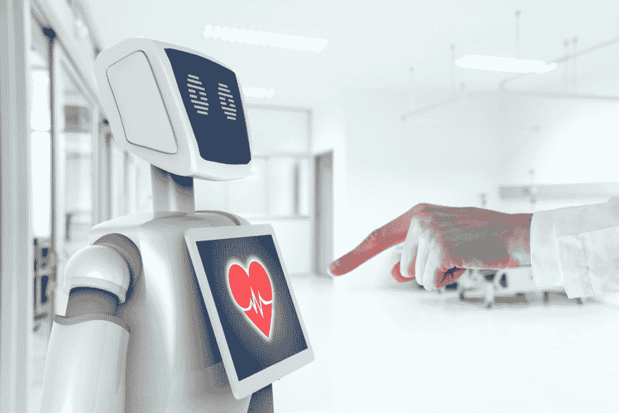

# 医疗保健中的人工智能:革命来了

> 原文：<https://dev.to/eric_chambers/artificial-intelligence-in-healthcare-the-revolution-is-here-37mf>

人工智能和机器学习被广泛应用于外包公司，如 Innovecs、物流、航空和许多其他行业。多重市场预测证明确实如此。因此，国际数据公司(IDC)声称，人工智能全球支出将增加到 54.2%，到 2018 年达到 191 亿美元。

医疗保健中人工智能的资金也大幅增长。根据英国咨询机构埃森哲共享的数据，到 2021 年，医疗保健市场将向人工智能项目投资高达 66 亿美元。这个巨大的数字表明，创新是非常必要的，因为许多医疗机构在十九世纪末使用过时的程序和医疗设备。
幸运的是，我们已经做了很多工作来改善现有的工作流程、治疗程序、诊断等。让我们快速浏览一下过去和现在取得的成就。

医疗保健中人工智能的简要时间表

医疗专家和软件工程师正在积极讨论医疗保健中的人工智能及其影响。难怪致力于人工智能在医疗保健中的作用的活动越来越多。
因此，AMIA 2018 年度研讨会揭示了如何应用人工智能来防止药物转移，而斯坦福大学将举办 2018 年医疗保健机器学习，并讨论如何使用 NLP(自然语言处理)将复杂的医疗数据转化为可操作的知识。但是人工智能在几十年前还没有这么流行。
Dendral 是 20 世纪 60 年代开发的第一个具有解决问题功能的程序。它成为了医疗保健中定位严重细菌感染的人工智能前身 MYCIN 的基础。尽管有明显的好处，但霉素从未被应用。而这一切的发生并不是因为它表现不好。没有人对程序未能做出正确的诊断负责。随着时间的推移，新的理论和方法得到了发展。智能计算出现后，出现了一些重大改进:

*   数据处理速度加快；
*   医疗设备和系统改进；
*   基因组测序数据库的丰富；
*   人工智能和机器学习技术进一步发展；

今天，许多世界知名的医疗保健公司使用人工智能来开发尖端的解决方案。主要的市场参与者仍然非常熟悉:IBM、微软和谷歌。这里只是对他们正在进行的工作的一个快速概述:

*   IBM 应用人工智能为癌症和慢性病治疗以及新药开发创造解决方案；
*   微软对 AI 如何帮助预测癌症治疗反应和开发可编程细胞进行了深入研究；
*   谷歌创建了一个平台，根据移动软件收集的数据来检测患者的健康风险；

当然，不仅领先的公司提出人工智能项目的想法。初创公司和外包机构也在名单之列。因此，总部位于英国的初创公司 BenevolentAI 刚刚筹集了令人印象深刻的 1.15 亿美元，用于发现罕见癌症和其他严重疾病的新疗法。问题是除了新药发现之外，人工智能还能在哪些方面有所帮助？我们在下面列出了一些广泛的应用。

人工智能在医疗保健中的主要用途

医疗保健中的机器学习技术使用特定的算法和软件工具来达到类似人类的认知。这些技术被进一步应用于诊断和治疗，甚至更进一步。

*   数据管理

人工智能具有强大的数据处理能力。这就是为什么研究人员想到应用基于人工智能的软件来收集、管理和存储临床试验数据。这种系统的方法将有助于开发新的有效药物。

*   流程自动化

保健专家花太多时间做日常工作，而不是更多地关注病人。人工智能软件可以轻松处理这种单调的工作，并管理管理任务，如培训，计费，处理注册，等等。

*   治疗计划设计

通过对输入数据进行人类无法做到的深度和彻底分析，人工智能可以帮助为每位患者制定个性化的治疗计划。

*   发现新药

强大的分析功能可用于创造新药，并以最有益的方式组合成分。药物开发可能会花费大量资金，并需要数年时间，但有了人工智能，时间会更少，成本效益会更高。

*   健康监控

健康追踪器非常受欢迎。当由人工智能驱动时，这些设备可以通过共享关于患者健康指标的精确报告，变成良好的医疗助手。

*   在线咨询

通过处理病人的病史和当前的健康状况，人工智能可以提供一些基本的在线咨询或充当虚拟护士。

*   基于基因的诊断

DNA 是一个无穷无尽的信息来源，人类可能很难探索。但是一个复杂的人工智能足够强大，可以分析数据并预测可能的疾病。当然，这份清单并不详尽。未来将显示医疗保健中其他人工智能应用的需求，这意味着软件开发外包公司也应该扩展这一专业知识。

*   人工智能开发外包

创建基于人工智能开发的项目的想法永远不应该被放弃，因为这些想法塑造了我们的未来。机器学习技术已经足够成熟，那么剩下的唯一问题就是如何选择一家软件开发公司来将你的想法变成现实。

在选择医疗保健软件开发公司时，要密切关注客户证明、项目组合、团队资质、安全政策和定价。
为了节省预算，获得优质服务，考虑实施人工智能&机器学习项目的外包选项。来自东欧的外包公司已经证明能够为客户提供高质量的解决方案。所以做出正确的选择不会花太长时间。