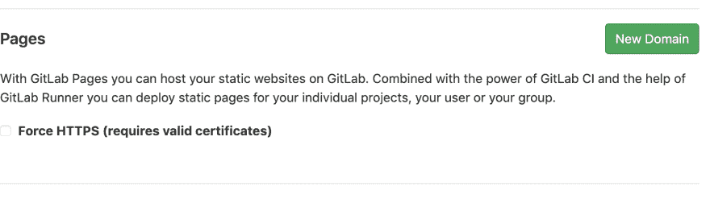
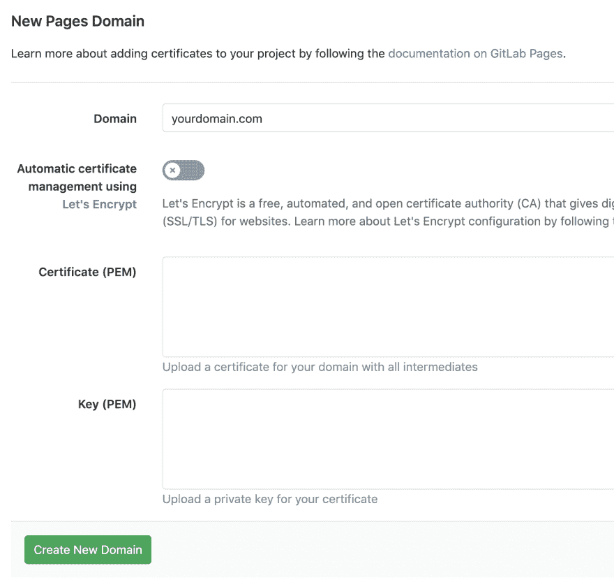
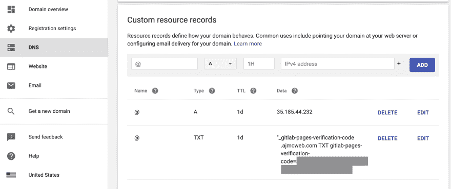

# 给 GitLab 页面分配一个 Google 域

> 原文：<https://dev.to/stmcallister/assigning-a-google-domain-to-gitlab-pages-22ap>

在我开始讲述如何将一个注册了谷歌域名的域名添加到一个 T2 网站之前，我想分享一个背景故事。如果你对阅读我如何以及为什么通过 GitLab 页面了解定制域的人性一面不感兴趣，请跳到 [GitLab 页面部分](#gitlab-pages)。

## 背景故事

几年前，我回到家，八岁的儿子兴奋地告诉我，他在图书馆找到了一本关于 HTML 的书，并建立了一个网站。这完全是一个惊喜，没有任何来自他的软件开发者父亲的刺激。看到网站后，对话框是这样的。

我跟他说:“太好了！要我帮你放在服务器上吗？”

“那是什么！?"他问。

“在服务器上，任何人都可以访问你的网站，”我解释道。

“是啊！”

当时，我使用的是一个要求我通过 FTP 上传文件的网络主机。这被证明是我儿子工作流程中的一个瓶颈。每次他有更新，他都会烦我把它上传到服务器。

最后，我明智地避开了他。我把他的代码放在一个 [GitLab](https://gitlab.com) 存储库中，并建立了一个 [GitLab Pages](https://about.gitlab.com/product/pages/) 站点。然后，我向他展示了命令行——他认为这非常酷——并教了他一些简单的 Git 命令。瞧啊。我儿子可以随心所欲地发布修改，而不用等他老爸。

这个过程对我们双方来说都很好。但是最近，我想让他对自己的网站有更多的掌控感。你看，他建立的所有网站都是从我的通用 GitLab 域名[https://stmcallister.gitlab.io/webkid/](https://stmcallister.gitlab.io/webkid/)提供服务的。所以，我不想让我的儿子看起来像是在盗用我的网站，我想让他拥有自己的领域。

我们去了谷歌域名，找了很久很久才找到他想要的名字，然后到了 http://ajmcweb.com。它很短。很容易拼写。最重要的是，他喜欢它！

现在，我需要弄清楚如何将域名分配给站点。这就是本文的说明部分开始的地方。

## GitLab 页

在 Pages 站点的 GitLab 存储库中，转到 Settings -> Pages。在“设置”页面上，单击右上角的绿色“新域”按钮。

在 New Pages Domain 页面上，输入您希望用于 GitLab pages 站点的域。还有输入证书和私钥的选项。因为我们的站点只是静态的，不处理任何类型的信息，所以我们没有设置这两个值。准备就绪后，单击创建新域。

在 Pages 域页面上，您会看到一个 DNS 表单条目，显示指向 GitLab Pages 域的新域的 CNAME 条目。DNS 字段的正下方是验证状态。复制验证状态的值，您需要将其添加到您的 Google 域帐户，以验证您想要使用的域的所有权。

## 谷歌域名

在 Google 域中，选择您的域，转到 DNS 部分，向下滚动到自定义资源记录。您将添加两个资源记录来将您的 Google 域指向您的 GitLab 页面站点。

首先，获取从 GitLab 验证状态中复制的值，并创建 TXT 类型的资源记录。将 GitLab 验证码粘贴到文本字段中。TTL 的默认值设置为 1H，但如果您想更快地看到变化，请将其更改为 1m。然后，单击添加。

TTL 代表生存时间，它代表记录的副本在被丢弃之前在缓存中停留的时间。这意味着，如果您将 TTL 设置为 1m，那么每分钟都会查找该资源。因此，在将值更改为 1m 以查看 DNS 更改填充后，最好将其改回 1H 值，甚至 1D 值，以减少查找次数。

要添加的下一个资源记录是 DNS A 记录，它为您的域提供了 GitLab 页面的 IP 地址。在撰写本文时，该值为`35.185.44.232`。您可能还想检查 GitLab 页面上的 [DNS A 记录](https://docs.gitlab.com/ee/user/project/pages/getting_started_part_three.html#dns-a-record)文档，以确保该值仍然是当前值。

在 Google Domains 中设置了这两个记录后，返回到 GitLab 上的 Pages Domain 页面，并单击 reload circle 箭头来检查域现在是否通过验证。未验证的消息应变成绿色，并更改为已验证。最后一个测试，将你的浏览器指向你的新域，你应该会看到你的 GitLab 页面站点。

现在，我的儿子很高兴他的网站有一个自定义域。并且——希望——您很高兴在一篇文章中找到了所有这些信息。不客气；)