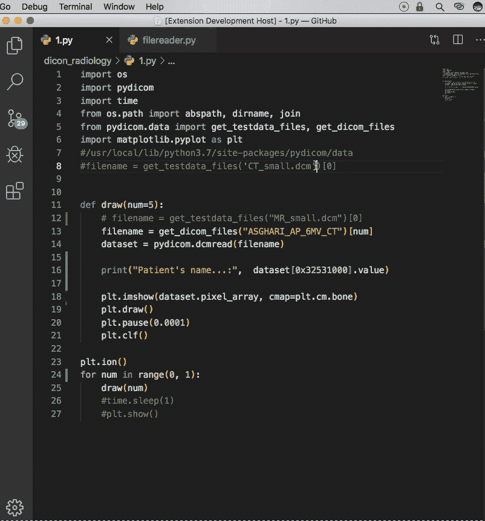
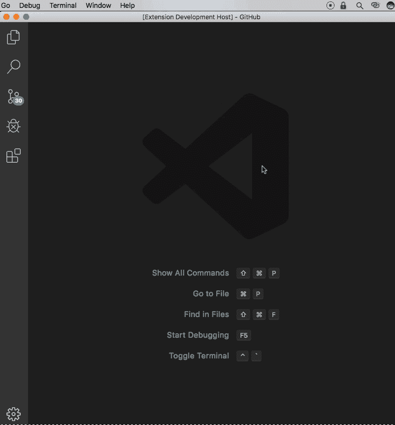

# vscode 的小行星游戏扩展

> 原文：<https://dev.to/arashmidos/asteroid-game-extension-for-vscode-5b9k>

你好

我写了一个小行星游戏扩展，可以运行到你的`vscode`。

好好享受，把你的反馈给我。

这是两种游戏模式，

## 1)当你破坏你的代码时😰

## 2)破坏一个网站😅。

[链接](https://marketplace.visualstudio.com/items?itemName=arashmidos.asteriods)安装

[链接](https://github.com/Arshiamidos/Asteroids_vscode_extension)到 github