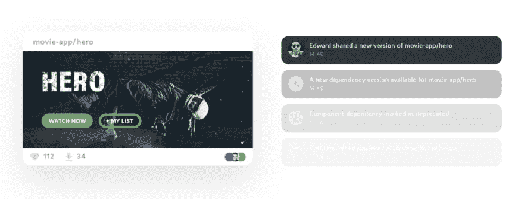

# 使用 React 和 Bit 的原子设计:简化复杂的 UI

> 原文：<https://dev.to/giteden/atomic-design-with-react-and-bit-simplify-a-complex-ui-1k1f>

*最初发表于[《碎片》](https://blog.bitsrc.io)作者:斯捷潘·戈尔曼*

### 如何分解你的用户界面的复杂性，轻松管理它，分类它的组件并把它们组合在一起。

## 问题

前端开发的世界正变得越来越复杂。每当我决定阅读一些新闻和推文来赶上进度时，都会有新的框架、工具、技术和用户需求。

在那种快速且不断变化的环境中寻找方向是很困难的。找到稳定基础的一个方法是通过一些标准或者一个**设计系统**组织代码。

## 原子设计

这是一个认识到每一个组成部分的层次、重要性、类型和作用的系统。这些成分以一种类似我们宇宙结构的方式结合在一起。

*   原子

*   分子

*   有机体

*   模板

*   页

### 为什么

当我们开始被项目中的组件数量淹没时，就需要某种设计系统了。在有一百或两百个组件的项目中，记住所有的东西并不容易。

[](https://res.cloudinary.com/practicaldev/image/fetch/s--E2n2AbHl--/c_limit%2Cf_auto%2Cfl_progressive%2Cq_66%2Cw_880/https://cdn-images-1.medium.com/max/2000/1%2AZS4ABYgdD0UGa1ZmUOFOuw.gif)

### 起源

这个系统背后的头脑是布拉德·弗罗斯特，如果你想了解更多，请在这里停下来，首先阅读他关于这个主题的深入帖子。甚至还有一本[书](https://shop.bradfrost.com/collections/frontpage/products/atomic-design-print-ebook)。

## 示例界面

在我寻找完美的 UI 来重新创建的过程中，我找不到任何让我完全满意的东西。这是我能找到的最近的了。

[](https://res.cloudinary.com/practicaldev/image/fetch/s--4WocGAeo--/c_limit%2Cf_auto%2Cfl_progressive%2Cq_auto%2Cw_880/https://cdn-images-1.medium.com/max/2000/1%2AR_vfjcCvkrcJQdZCDkRp0Q.jpeg)

我不会试图像素完美，也不会实现完全相同的布局。这里的目标是展示组件的分离。

### 击穿

我不认为这是一个确定的过程。我确信有更好的方法将 UI 分解成组件，但本质是一样的，让它们更易于管理。我将使用自上而下的方法。

*   **一页** -仪表板

*   **两个模板** -标题和工作区

*   **许多生物**——工具、时间、地图、…

*   **更多分子** -工具按钮、温度信息、进料项目……

*   可能更多的原子 -标签、图标、链接、标题……

### **编目**

让每一个组件在一个在线目录中分离和可用，将使未来的开发者更容易找到和使用它们。

## 用 Bit 共享和组合 UI 组件

Bit 是一个开源工具( [GitHub](https://github.com/teambit/bit) )和[平台](https://bit.dev/)，可以让你创建一个你喜欢的 UI 组件的集合来发现和分享。

使用 Bit，你可以共享来自不同项目的可重用组件，在一个真实的操场上在线使用它们，并在任何项目中使用它们。

组件很容易被隔离，托管和提供 NPM 安装在任何地方。您还可以使用[位](https://bit.dev)本身来开发和同步您正在处理的任何项目中的组件变更。

它解决了管理组件系统的常见问题，并在提高开发人员生产力的同时，使他们免于重新发明轮子。下面是一个被推送到 Bit 范围的渲染组件的例子。欲了解更多信息，请观看此[https://www.youtube.com/embed/E5lgoz6-nfs](https://www.youtube.com/embed/E5lgoz6-nfs) 。

[](https://res.cloudinary.com/practicaldev/image/fetch/s--0Kqt0og5--/c_limit%2Cf_auto%2Cfl_progressive%2Cq_auto%2Cw_880/https://cdn-images-1.medium.com/max/3688/1%2A_n63DWa0X35Q5crRQk2ukg.png)

### 结果

最后，我创建了 15 个组件，这些组件可以组合起来从示例 UI 构建视图。没有包括这些图表，因为它们超出了本文的范围。组件被分类并可在此[链接](https://bitsrc.io/stjepangolemac/atomic-design)上获得。包含全部代码的回购可以在[这里]找到

开发完成后，制作自己的组件目录真的很容易。你只需要[注册](https://bit.dev/signup)到 bit.dev，然后输入几个简短的命令就可以了。

```
# Navigate to the project directory and initialize Bit
$ cd project_dir

$ bit init
$ bit login

# Add the components to the local scope
$ bit add src/components/atoms/*
  ...
$ bit add src/components/pages/*

# Check if all components are added
$ bit status

# Tag the version and upload the components to Bit
$ bit tag --all 1.0.0
$ bit export <your_username>.<your_scope> 
```

在这个[链接](https://bit.dev/stjepangolemac/atomic-design)上可以看到结果。这是一个集合，可以把它想象成导出组件的名称空间。您可以拥有任意多的收藏，并且可以将其设为私有或公共。

让我们看看`<Panel />`组件[这里的](https://bit.dev/stjepangolemac/atomic-design/atoms/panel)。它支持组件文档、测试、构建和编译。您甚至可以探索文件结构和代码。

```
$ bit init
$ bit import <your_username/<your_scope/avatar-image \
  --path src/components/avatar-image 
```

现在，您只需导入组件，就可以在任何未来的项目中使用这些组件。您确实需要确保您正在导入组件的项目支持所使用的资源绑定。例如，导入上面链接中的组件。css 文件。

你一定要探索 Bit 提供的特性，比如组件**渲染**、**测试**和**文档**。最好的起点是[官方文档](https://docs.bit.dev/docs/quick-start.html)。

[ ](https://res.cloudinary.com/practicaldev/image/fetch/s--UHE3H8E0--/c_limit%2Cf_auto%2Cfl_progressive%2Cq_66%2Cw_880/https://cdn-images-1.medium.com/max/2000/1%2AuXIIGogL-Ss0BkNjbKqrQw.gif) *挺酷的吧？*

## 总结

[Bit](https://bit.dev/) 是一个令人耳目一新的新工具，它使得以标准化的方式管理**模块化**和**可重用**组件变得更加容易。开发人员应该关注项目需求和高质量的代码交付，他们不应该担心他们的组件在其他项目中的使用或被其他人使用。

### 最后一件事……

我在 [splotch.dev](https://splotch.dev) 建立了自己的博客。我会在那里继续我的写作，所以一定要去看一看！👋

### 了解更多

[](https://medium.com/bitsrcio/maximizing-code-reuse-in-react-35ee20ad362c) [## React 中代码重用的最大化。如何通过分享加快发展……|伊登·艾拉|点点滴滴

### 伊甸艾拉<time datetime="2020-03-04T15:23:54.750Z">2020 年 3 月 4 日</time>6 分钟读T3】中](https://medium.com/bitsrcio/maximizing-code-reuse-in-react-35ee20ad362c)