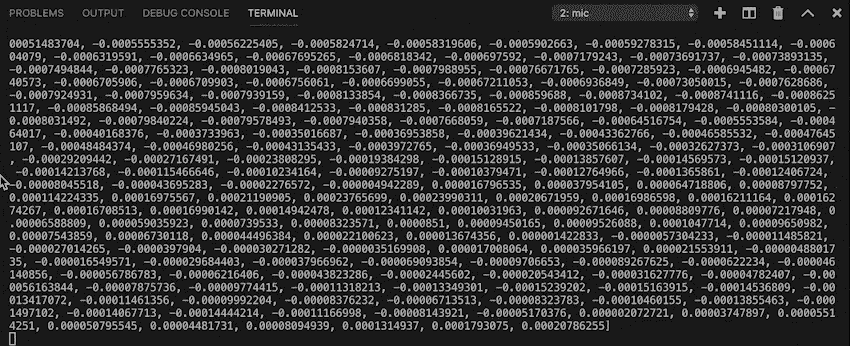

# Rust 音频可视化

> 原文：<https://dev.to/maniflames/audio-visualization-with-rust-4nhg>

从今年年初开始，我就下定决心要学习更多关于铁锈的知识。我知道我想做一些关于音频的事情，但是不知道从哪里开始。谢天谢地，贾斯汀·韦尼克发明了生锈的麦克风，并为此写了一篇 T2 博客。我决定用一个不同的图形库来构建自己简单的“麦克风可视化”。如果你发现了可以改进的地方，请告诉我，我很乐意学习！

如果你只是想看看代码，你可以看看我为这个小项目做的回购:

##  [【火焰】](https://github.com/maniflames)/[【micviz】](https://github.com/maniflames/MicViz)

### Rust 中内置的一个简单的实时音频可视化应用程序。

<article class="markdown-body entry-content container-lg" itemprop="text">

# 米尔维兹

Rust 中内置的一个简单的实时音频可视化应用程序。
这只是用 [(rust) portaudio](https://github.com/RustAudio/rust-portaudio) 和 [three(-rs)](https://github.com/three-rs/three/issues) 实现的一个小而简单的东西。

[](https://github.com/maniflames/MicVizassets/mic.gif)

## 入门指南

### 环境设置

您应该能够为任何操作系统编译这个项目。现在这个文档将集中在如何在 MacOS 上设置环境。

要设置环境，请运行以下命令(并非所有命令都适用于您):

```
# Clone this repository
git clone https://github.com/maniflames/MicViz.git

# Install Rust with homebrew
brew install rust

# Install portaudio with homebrew
brew install portaudio

# Unpack MacOS SDK headers 
open /Library/Developer/CommandLineTools/Packages/macOS_SDK_headers_for_macOS_10.14.pkg

```

Enter fullscreen mode Exit fullscreen mode

### 编译并运行

现在你已经设置好了，你可以运行这个:

```
# Navigate to project
cd MicViz

# Compile and run with cargo
cargo run
```

Enter fullscreen mode Exit fullscreen mode

享受<g-emoji class="g-emoji" alias="grin" fallback-src="https://github.githubassets.cimg/icons/emoji/unicode/1f601.png">😁</g-emoji>

</article>

[View on GitHub](https://github.com/maniflames/MicViz)

# 依赖关系

对于这个项目，我将使用两个板条箱: [portaudio](https://crates.io/crates/portaudio) 用于音频工作和[三个](https://crates.io/crates/three)。因此，请将以下内容放入您的`Cargo.toml` :

```
[dependencies]
portaudio = "0.7.0"
three = "0.4.0" 
```

Enter fullscreen mode Exit fullscreen mode

通常这就是你要做的一切，但在这种情况下，事情有点不同。portaudio 板条箱仅包含 portaudio 实际安装的铁锈绑定，因此您必须自己安装。你可以[下载](http://www.portaudio.com/download.html)和[编译](http://portaudio.com/docs/v19-doxydocs/tutorial_start.html) portaudio 用于 Windows、Linux 和 MacOS。然而，如果你碰巧在 mac 上开发，通过自制的 pkg-config 来安装可能更容易。

```
brew install pkg-config
brew install portaudio 
```

Enter fullscreen mode Exit fullscreen mode

# 读取音频输入

让我们先从您电脑的默认麦克风读取输入。通过 portaudio 的非阻塞 inputstream 来实现这一点。我将尽可能清晰地逐行注释代码。

```
use portaudio;
use std::sync::mpsc::*;

fn main() {

    // Construct a portaudio instance that will connect to a native audio API
    let pa = portaudio::PortAudio::new().expect("Unable to init PortAudio"); 
    // Collect information about the default microphone
    let mic_index = pa.default_input_device().expect("Unable to get default device");
    let mic = pa.device_info(mic_index).expect("unable to get mic info");

    // Set parameters for the stream settings.
    // We pass which mic should be used, how many channels are used,
    // whether all the values of all the channels should be passed in a 
    // single audiobuffer and the latency that should be considered 
    let input_params = portaudio::StreamParameters::<f32>::new( mic_index, 1, true, mic.default_low_input_latency);

    // Settings for an inputstream.
    // Here we pass the stream parameters we set before,
    // the sample rate of the mic and the amount values we want to receive
    let input_settings = portaudio::InputStreamSettings::new(input_params, mic.default_sample_rate, 256);

    // Creating a channel so we can receive audio values asynchronously
    let (sender, receiver) = channel(); 

    // A callback function that should be as short as possible so we send all the info to a different thread
    let callback = move |portaudio::InputStreamCallbackArgs {buffer, .. }| {
        match sender.send(buffer) {
            Ok(_) => portaudio::Continue, 
            Err(_) => portaudio::Complete
        }
    };

    // Creating & starting the input stream with our settings & callback
    let mut stream = pa.open_non_blocking_stream(input_settings, callback).expect("Unable to create stream"); 
    stream.start().expect("Unable to start stream");

    //Printing values every time we receive new ones while the stream is active
    while stream.is_active().unwrap() {
       while let Ok(buffer) = receiver.try_recv() {
            println!("{:?}", buffer); 
       }
    }
} 
```

Enter fullscreen mode Exit fullscreen mode

跑步本应该是这样的:

[](https://res.cloudinary.com/practicaldev/image/fetch/s--fVfAu2jD--/c_limit%2Cf_auto%2Cfl_progressive%2Cq_66%2Cw_880/http://assets.imanidap.nl/dev/micviz-terminal.gif)

# 可视化音频

如果你仔细观察，你会注意到你从麦克风得到的是一个包含-1.0 到 1.0 之间的数字的`slice`。这些数字代表了声波在一段时间内如何操纵麦克风内的运动部件。有不同的方法来观想这种变化，但是为了简单起见，让我们为每个及时发生的变化画一条线。当我们收到新的变化时，我们将通过简单地删除它们并绘制新的线条来制作线条动画。

```
use portaudio;
use std::sync::mpsc::*;
use three;

//struct for storing the application state
#[derive(Debug)]
struct State {
    sound_values: Vec<f32>,
    scene_meshes: Vec<three::Mesh>
}

fn main() {
    // Receiving audio input 
    let pa = portaudio::PortAudio::new().expect("Unable to init PortAudio"); 
    let mic_index = pa.default_input_device().expect("Unable to get default device");
    let mic = pa.device_info(mic_index).expect("unable to get mic info");

    let input_params = portaudio::StreamParameters::<f32>::new(mic_index, 1, true, mic.default_low_input_latency);
    let input_settings = portaudio::InputStreamSettings::new(input_params, mic.default_sample_rate, 256);

    let (sender, receiver) = channel();

    let callback = move |portaudio::InputStreamCallbackArgs {buffer, .. }| {
        match sender.send(buffer) {
            Ok(_) => portaudio::Continue, 
            Err(_) => portaudio::Complete
        }
    };

    let mut stream = pa.open_non_blocking_stream(input_settings, callback).expect("Unable to create stream"); 
    stream.start().expect("Unable to start stream"); 

    // Create a full screen window with a black background
    let mut builder = three::Window::builder("My Mic"); 
    builder.fullscreen(true); 
    let mut win = builder.build(); 
    win.scene.background = three::Background::Color(0x000000);

    // Create a variable that will contain the state off the app
    let mut state = State {
        sound_values: Vec::new(),
        scene_meshes: Vec::new()
    };

    // Create a camera that will be put in the scene on location 0.0, 0.0
    let camera = win.factory.orthographic_camera([0.0, 0.0], 1.0, -1.0 .. 1.0); 

    //Animation loop that will run until you press ESC or exit the program
    while win.update() && !win.input.hit(three::KEY_ESCAPE) {
        // Put new lines in the scene temporarily save them in the state
        update_lines(&mut win, &mut state);
        // Show the lines
        win.render(&camera);
        // Remove all lines from the scene and the state
        remove_lines(&mut win, &mut state);

        //Update state
        while let Ok(buffer) = receiver.try_recv() {
            update_sound_values(&buffer, &mut state); 
       }
    }
}

// Pass new samples into the state by overriding the vector
fn update_sound_values(samples: &[f32], state: &mut State) {
   state.sound_values = samples.to_vec(); 
}

// Put new lines in the scene temporarily save them in the state
fn update_lines(win: &mut three::window::Window, state: &mut State) {
    for (index, y_position) in state.sound_values.iter().enumerate() {

        // calculate the x position of the line by calculating a normalized x position between 0.0 and 1.0 (i / num_samples)
        // With the scale variable the size of the visualization can be changed. 
        let i = index as f32; 
        let num_samples = state.sound_values.len() as f32; 
        let scale = 3.0; 
        let x_position = (i / (num_samples / scale)) - (0.5 * scale);

        // create the geometry for a line with the calculated positions
        // three is a 3D graphics library so we pass the x, y, z values
        let geometry = three::Geometry::with_vertices(vec![
            [x_position, y_position.clone(), 0.0].into(),
            [x_position, -y_position.clone(), 0.0].into()
        ]);

        // create material so for our line, in this case white line material
        let material = three::material::Line {
            color: 0xFFFFFF,
        };

        // create a 3D object from the geometry and the material
        let mesh = win.factory.mesh(geometry, material);

        // Put the line in the scene and store it in the state
        win.scene.add(&mesh); 
        state.scene_meshes.push(mesh); 
    }
}

// Remove all lines from the scene and the state
fn remove_lines(win: &mut three::window::Window, state: &mut State) {
    for mesh in &state.scene_meshes {
        win.scene.remove(&mesh); 
    }

    state.scene_meshes.clear(); 
} 
```

Enter fullscreen mode Exit fullscreen mode

如果您运行该脚本，它应该看起来像这样:

[](https://res.cloudinary.com/practicaldev/image/fetch/s--bqOK5x74--/c_limit%2Cf_auto%2Cfl_progressive%2Cq_66%2Cw_880/https://github.com/maniflames/MicViz/blob/master/assets/mic.gif%3Fraw%3Dtrue)

享受你的 MicViz，如果你有时间的话，展示一下你的版本😄👀

同样，如果你碰巧对 Rust 有所了解，请告诉我任何改进代码的方法！