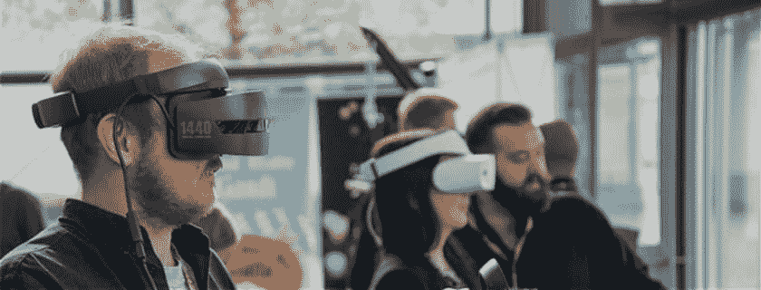

# 增强现实和虚拟现实——区别，这是我们未来的现实吗？

> 原文：<https://dev.to/sysbunny1/augmented-reality-and-virtual-reality-difference-and-is-this-going-to-the-reality-of-our-future-5h56>

市场上充斥着这些术语，它们在日常生活中被广泛使用，并统治着世界。技术是解决人类世界问题的新工具。

“准备好感受火星或尝试新的妆容了吗？VR 和 AR 行业正是伴随着这些现实变化而兴起的。成为最流行和最受喜爱的技术之一，给了我们一种“普遍的体验”。我们对此感到高兴。你读过我们关于这个的新博客文章吗？(插入博客链接)绝对棒极了。”

**增强现实-**

我们正在谈论的技术已经在使用，有没有想过是什么让你在 Snapchat filter 上成为一只可爱的狗？只需轻轻一触，就能在手机上为您提供地理过滤器和文化信息？伙计们，我们看到的是增强现实。这使得我们的现实被改变和增强，但是在许多艰苦的工作之后；允许人们在他们的物理环境中加入数字世界。

那些 Snapchat/Instagram 滤镜？是的，那是增强现实。神奇宝贝 go？完全增强现实。Oculus Rift？嘿，不，那是虚拟现实，我们以后再谈。

增强现实技术发展迅速，被用于商业需求和个人需求的许多其他目的。AR 市场投资的增加以及零售、医疗保健和娱乐行业不断增长的需求是这方面的主要驱动力。

谷歌已经制造了自己的谷歌眼镜——一种可穿戴的增强现实设备，只需点头就能获得数字信息。几个月后，Snapchat 还添加了 Geofilter，为我们的图片添加了图形位置。随着引入镜头——根据 2017 年的报告，每天有 1.87 亿人使用 Snapchat。AR 并没有就此结束，它是一项流行的技术，多个社交网络、企业和零售商都在使用这项技术。外面还有很多。

你对 AR 的体验一天比一天好，你需要的只是像 iPhone X 的原深感摄像头那样可以读取图像的相机，深度信息可以让你获得真实的体验。

**AR 的一些很好的例子有:**

Lenskart 3D- Lenskart 经营眼镜和镜片，它推出了 3D 人脸试用版，你可以在屏幕上阅读你的脸后使用。(又是增强现实)应用程序然后让你相应地尝试你选择的帧。几秒钟内尝试 1000 种眼镜款式。# tryitlikekatrina

[https://www.lenskart.com/compare-looks](https://www.lenskart.com/compare-looks)

**欧莱雅彩妆应用-** 致所有想尝试彩妆但又不确定结果如何的彩妆达人？好吧，欧莱雅化妆应用程序在提供各种化妆造型方面表现突出。

[https://www.youtube.com/watch?v=R5OnjiDa71s](https://www.youtube.com/watch?v=R5OnjiDa71s)

**IKEA App-** 这个家具品牌推出了 AR，让买家了解某个地方的架子或桌子是什么样子。这有助于那些想在小空间工作的人，或者想让房间的颜色组合与他们的主题相匹配的人。

[https://www.youtube.com/watch?v=UudV1VdFtuQ](https://www.youtube.com/watch?v=UudV1VdFtuQ)

你知道吗？美国宇航局使用增强现实仪表板为 X-38 导航。宇航员斯科特·凯利用这个仪表板从太空向任务控制中心汇报。

**虚拟现实—**

你可能会去火星，和海豚一起游泳，或者登上珠穆朗玛峰。虚拟现实将在下一个宇宙中帮助你，因为计算已经被创造出来让你起鸡皮疙瘩。然而，虚拟现实是一种技术，你可以四处走动，向每个方向看，让你感觉好像你在精神上存在于那里。

计算机技术创造了一个刺激的环境，让用户置身于一个全新的世界。它刺激使用者的感官，如听觉、视觉、触觉，有时甚至是嗅觉。是不是很酷？这可以是人造的，也可以是任何真实的拍摄地，给你一种与世隔绝的体验。

根据 VR statistics 2019，2017 年 VR 市场估值为 51 亿美元。除了游戏和娱乐，虚拟现实产业正在参与医疗保健领域，如治疗抑郁症，焦虑症，自闭症，甚至尼古丁成瘾。这对于 VR 行业来说太牛逼了！基于位置的虚拟现实支出预计将增加 7 亿美元。VR 应用和基于位置的 VR 的总支出预计将从 2019 年的 25.4 亿美元上升到 2021 年的 37.7 亿美元。

截至 2018 年底，最畅销的三款虚拟现实耳机是索尼的 PlayStation VR (PSVR)、脸书的 Oculus Rift、三星 Gear VR 和 HTC Vive。

[https://www.youtube.com/watch?v=FXxm45aAx_Y](https://www.youtube.com/watch?v=FXxm45aAx_Y)

虚拟现实有许多类型和许多用途，无论是娱乐还是严肃用途。这项技术变得非常便宜、普及和普遍。在不久的将来，我们还可以期待它的许多创新和有趣的用途。多亏了虚拟现实。

**结论—**

VR 和 AR 以两种截然不同的方式完成了两件不同的事情。我们认为，这是两个非常强大的行业，还没有在消费者中引起巨大反响。我们还认为，这些行业中的新开发者项目可能会出现，而且不知道这项技术会有多受欢迎。