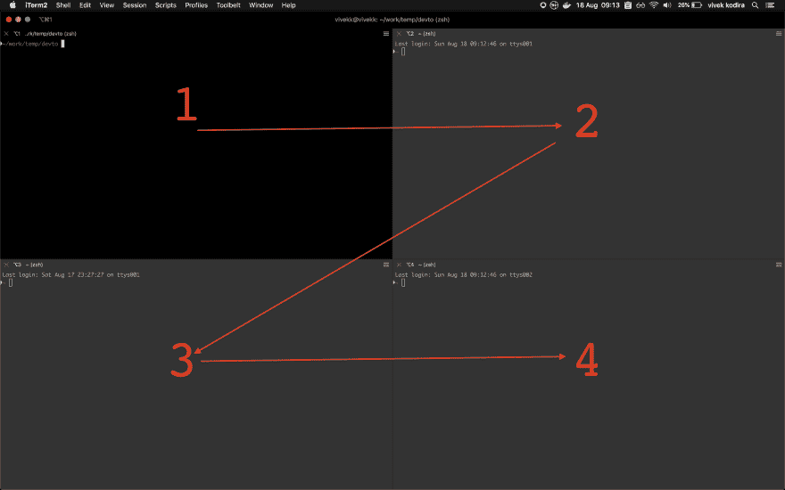

# 在 iTerm2 上实现多窗口体验的自动化

> 原文：<https://dev.to/vivekkodira/automate-a-multi-window-experience-on-iterm2-2j9e>

## TLDR

这个帖子是一个教程。最终结果将是一个脚本，它在一台远程机器上创建几个会话，并行运行命令。跳到结尾看最终的脚本，或者继续阅读一步一步的教程

## 您为什么想要 iTerm automation？

下面是我自己工作流程中的一个例子:

我最近测试的安装脚本启动了几个容器，创建了不同用户权限的文件夹，并在挂载的文件夹之间来回复制文件。

这些是我每次开始测试时需要做的步骤

*   在 iTerm 选项卡中创建 4 个会话
*   ssh 到我正在测试的远程机器*
*   切换到 sudo*
*   安装我将需要的软件(`docker`、`docker-compose`等)。)
*   配置`watch`在一个会话中监控 docker 容器
*   配置`tree`查看另一个文件夹的结构
*   用`cat`配置`watch`来监控第三个中的一些文件
*   并在最后一个容器中运行安装脚本

*在每个会话中重复！

你可以看到一遍又一遍地做这些变得多么乏味。Shell 脚本将能够自动完成上面的一些步骤，但还不够。

AppleScript 来救援了！

## 你好世界！

让我们从一个 hello world 开始。

*   用以下内容创建一个文件`hello_world.scpt`:

```
#!/usr/bin/osascript
tell application "iTerm2"
    set contentToPrint to "hello world"
end tell
do shell script "echo " & contentToPrint 
```

*   运行这个脚本(`osascript hello_world.scpt`)。您应该会在终端中看到`hello world`

上面的代码不言自明，所以让我们直接进入下一个例子。

## 你好世界..又来了？

*   用以下内容创建一个文件`hello_world2.scpt`:

```
#!/usr/bin/osascript
tell application "iTerm2"
    tell current session of current tab of current window
        write text "echo 'hello world again!'"
    end tell
end tell 
```

*   运行这个脚本(`osascript hello_world2.scpt`)。你应该看看

```
~ osascript hello_world2.scpt
echo 'hello world again!'
~ echo 'hello world again!'
hello world again! 
```

虽然最终的输出是相似的，但是这个版本也多打印了几行。这和之前的剧本有什么不同？

按“向上箭头”查看终端历史记录中的最后一条命令。它会显示

`echo 'hello world again'`。

再次按下**这个**时间你会看到

`osascript hello_world2.scpt`。

不同之处在于:`hello_world2.scpt`执行我们在终端上给出的指令。`echo`被添加到终端历史中。

就个人而言，我更喜欢第二种方法——它可读性更强，而且如果需要的话，我希望能够搜索并执行这些单独的命令。

## 创建多个会话

现在让我们自动创建多个会话

*   用下面的内容创建一个文件`sessions.scpt`

```
#!/usr/bin/osascript
tell application "iTerm2"
    tell current session of current tab of current window
        split horizontally with default profile
    end tell
end tell 
```

运行它，您会看到它将终端分成两个水平会话

类似地，运行包含以下内容的脚本会将终端分成两个垂直会话。

```
#!/usr/bin/osascript
tell application "iTerm2"
    tell current session of current tab of current window
        split vertically with default profile
    end tell
end tell 
```

## Sessionception！

您可以向每个会话发出命令。让我们在每个水平会话中创建两个垂直会话。

*   用下面的内容创建一个文件`sessionsception.scpt`

```
#!/usr/bin/osascript
tell application "iTerm2"
    tell current session of current tab of current window
        split horizontally with default profile
        split vertically with default profile
    end tell
    tell third session of current tab of current window
        split vertically with default profile
    end tell
end tell 
```

可能令人困惑的部分是弄清楚哪一个是第二、第三和第四次会议。请记住，会话不是按照创建的顺序编号的。第一行的会话编号是从左到右，随后的行也是如此。

这就是为什么即使水平会话是第二个创建的，当在脚本中寻址它时，命令是`tell third session`

[](https://res.cloudinary.com/practicaldev/image/fetch/s--iUExMOsh--/c_limit%2Cf_auto%2Cfl_progressive%2Cq_auto%2Cw_880/https://thepracticaldev.s3.amazonaws.com/i/24nnqseppufckrn1xx06.png)

## 回到未来

让我们跳到我需要的最终脚本。下面是

```
#!/usr/bin/osascript
tell application "iTerm2"
    tell current session of current tab of current window
        write text "setupTargetMc"
        write text "sshmc2"
        write text "sudo su"
        write text "./installStuff.sh"
        write text "watch -n1 'docker ps --format=\"{{.Names}} {{.Ports}} {{.Status}}\"'"
        split horizontally with default profile
        split vertically with default profile
    end tell
    tell second session of current tab of current window
        write text "sshmc2"
        write text "sudo su"
        write text "watch -n1 'tree -u -d  ~/.temp -L 3'"
        split vertically with default profile
    end tell
    tell third session of current tab of current window
        write text "sshmc2"
        write text "sudo su"
        write text "watch -n1 'cat ~/.temp/key'"
    end tell
    tell fourth session of current tab of current window
        write text "sshmc2"
        write text "sudo su"
        write text "clear"
    end tell
end tell 
```

到目前为止，上面的大部分内容应该很容易理解。但是这里，如果你需要的话，是一些不熟悉的行的分解

*   `write text "setupTargetMc"` -调用`setupTargetMc` -我事先创建的别名，将我需要的脚本(`installStuff.sh`)复制到目标机器上
*   `write text "sshmc2"` -调用`sshmc2` -一个我预先创建的别名，以`ssh`进入目标机器
*   `write text "./installStuff.sh"` -触发器`./installStuff.sh`。这是我们在第一步中复制的脚本。它将按照我的要求设置机器，包括安装我需要的所有软件
*   `watch`在多个会话中使用，与其他命令一起持续监控 docker 容器、文件夹结构和文件内容

## 结论

iTerm 自动化节省了我大量的时间和精力。希望这篇文章能激励你去尝试，并给你写自己的方法。祝你好运！

## 参考文献

*   [iTerm](https://www.iterm2.com/documentation.html)
*   [AppleScript](https://developer.apple.com/library/archive/documentation/AppleScript/Conceptual/AppleScriptLangGuide/introduction/ASLR_intro.html)
*   [手表](https://linuxize.com/post/linux-watch-command/)
*   [树](https://formulae.brew.sh/formula/tree)