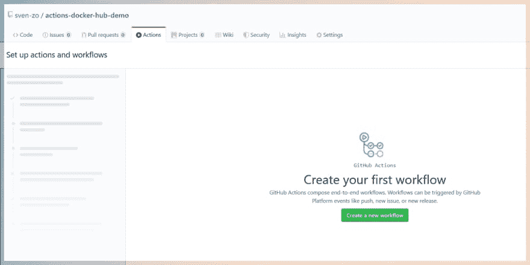
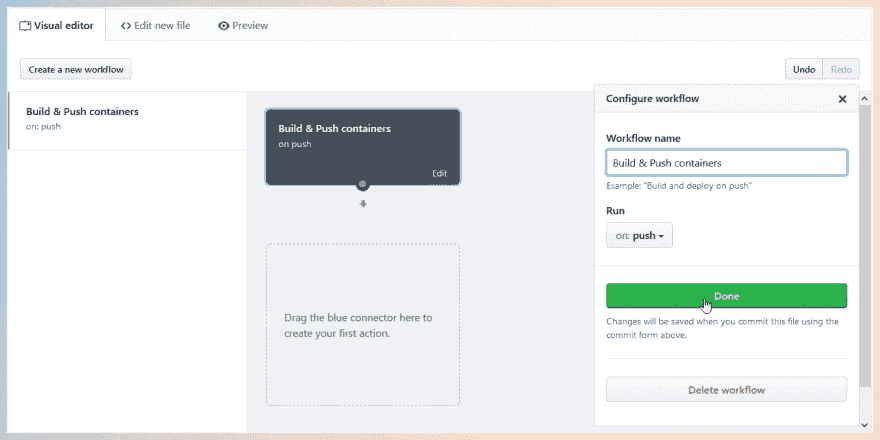
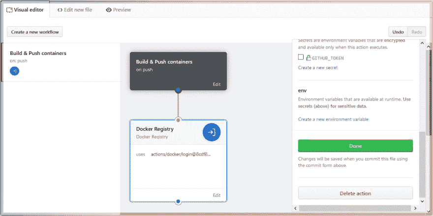
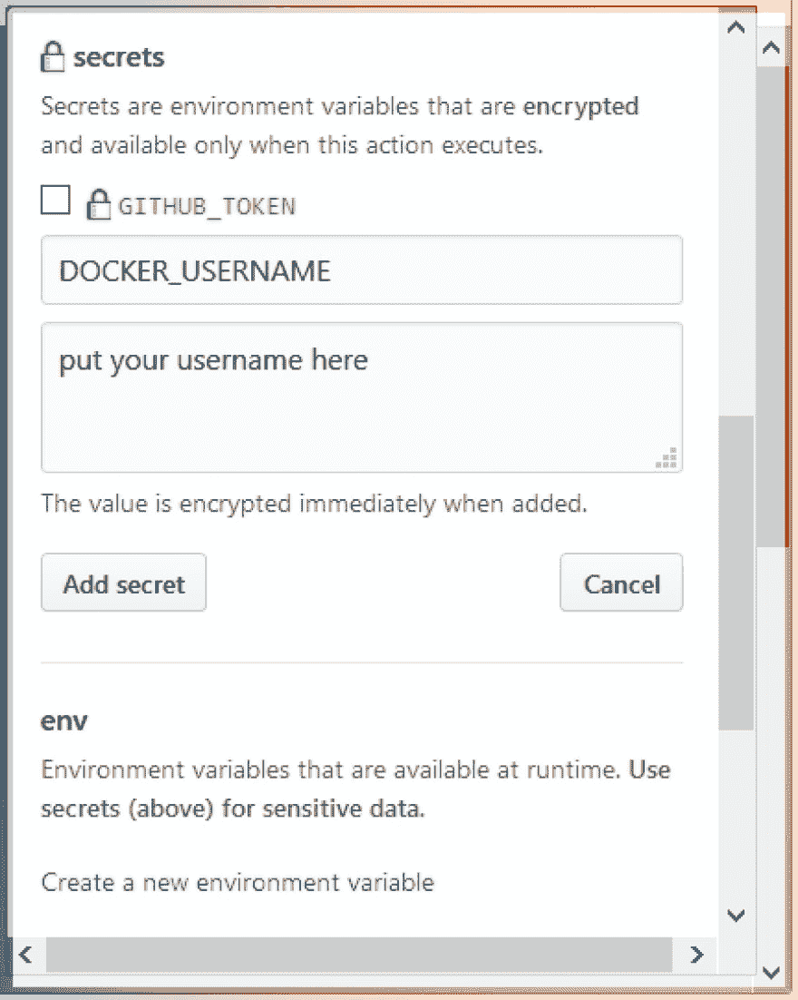
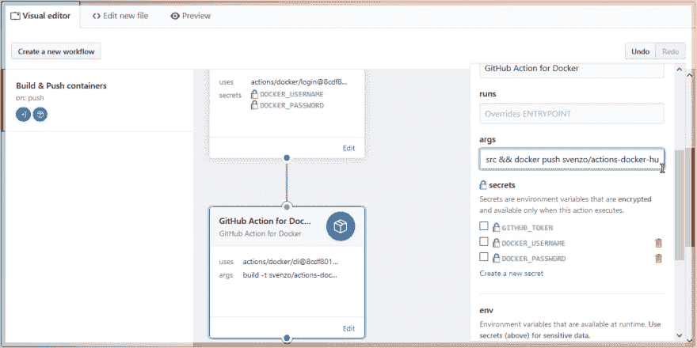
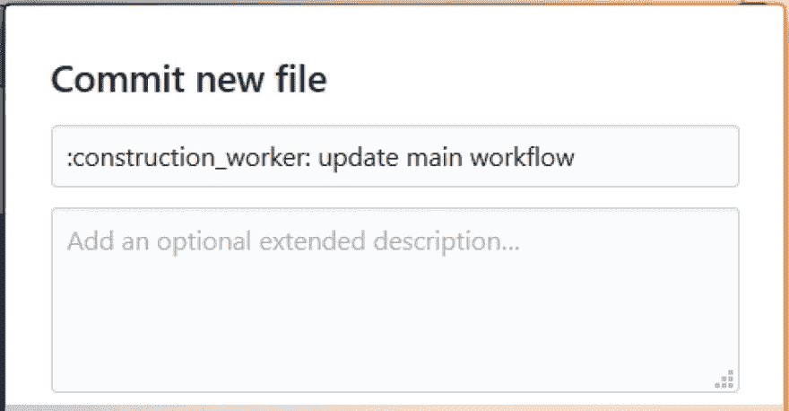
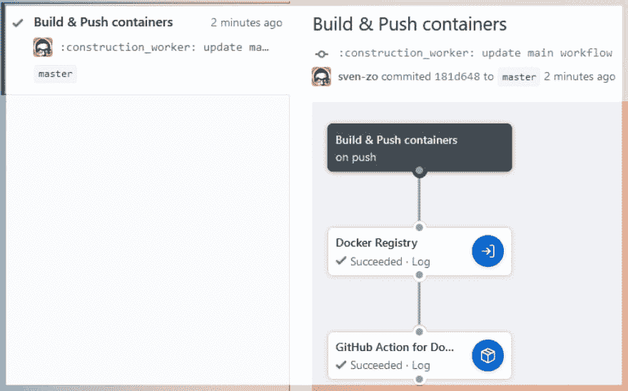
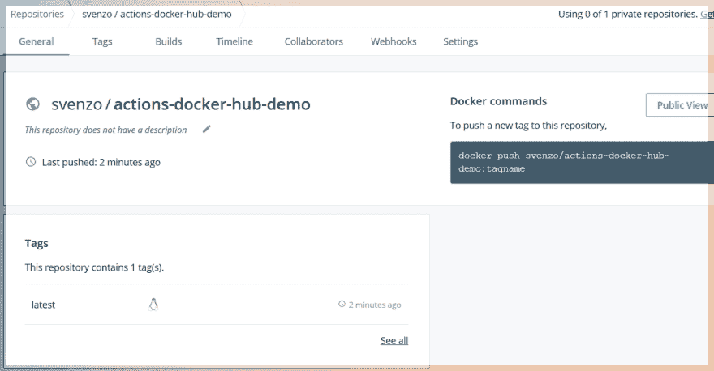

# 使用 GitHub 动作自动构建和推送 Docker 容器

> 原文：<https://dev.to/sven/automate-building-pushing-docker-containers-using-github-actions-202j>

欢迎来到我的第二篇文章！花了一些时间，但我希望你会喜欢这一个。

你可能会想，“码头集装箱？那些是什么？”很抱歉，我不会在这篇文章中解释什么是容器。也就是说，我正在考虑写一个关于容器和无服务器计算的初学者友好系列。所以如果你对此感兴趣，请告诉我！

今天，我将带您了解如何使用 [GitHub Actions](https://github.com/features/actions) 自动构建并推送在 GitHub 存储库中定义的容器到您的 [Docker Hub](https://hub.docker.com/) 帐户。

使用这种方法，您可以将 Docker Hub 映像与存储库保持同步。每次推送到存储库时，容器都会被构建并推送到 Docker Hub。

# 让我们烤个蛋糕吧

为了更容易理解，我们将假设我们正在阅读一份食谱。我将首先列出所有的成分(要求)，然后我将使用更详细的步骤来解释这个过程。

# 配料

(又称*要求*。)

#### 你将需要:

*   有权访问 GitHub 操作的 GitHub 帐户(您可以在此请求访问权限
*   可以访问 GitHub 操作的存储库
*   存储库中的有效`Dockerfile`
*   坞站中心帐户

# 让我们自动化吧！

所有的配料都准备好了吗？厉害！
让我们使用 GitHub 动作来自动构建容器并将其推送到 Docker Hub。

首先，导航到您的存储库并点击顶部的`Actions`。
你会看到一个类似于这个的界面。创建新的工作流文件。
T3T5】

我们将创建一个工作流，当有人将某些东西推送到存储库时，该工作流就会运行。
[T3】](https://res.cloudinary.com/practicaldev/image/fetch/s--uEXgEnPh--/c_limit%2Cf_auto%2Cfl_progressive%2Cq_auto%2Cw_880/https://thepracticaldev.s3.amazonaws.com/i/hhrs14vzbkdk7jv9dhaa.png)

向下拖动蓝色连接器，并添加“Docker 注册表”操作。
[T3】](https://res.cloudinary.com/practicaldev/image/fetch/s--7ajhaaQS--/c_limit%2Cf_auto%2Cfl_progressive%2Cq_auto%2Cw_880/https://thepracticaldev.s3.amazonaws.com/i/sv27untseku6y9hunbxy.png)

此操作将使用`DOCKER_USERNAME`和`DOCKER_PASSWORD`密码让您登录 Docker Hub。添加您的用户名和密码作为密码。小心点！不要将它们作为环境变量添加，否则它们将是可见的！
T3T5】

接下来，在“Docker Registry”动作下添加另一个动作。这次我们将使用“Docker 的 GitHub 操作”操作。使用此操作，您可以像在终端中一样运行 Docker 命令。
您想要运行的命令需要进入`args`字段。动作会自动把`docker`放在你的命令前面，所以一定不要。

让我们假设我们将构建我们的容器并将其推入终端一会儿。

在我们能够推动容器之前，我们需要首先构建它。为此，我们将对我的[范例库](https://github.com/sven-zo/actions-docker-hub-demo)使用命令`docker build -t [username]/[container name] [path to Dockerfile]`
，这将是:`docker run build -t svenzo/actions-docker-hub-demo src`。如果你的 Dockerfile 在资源库的根目录下，你可以放一个`.`(点号)来代替文件夹路径。

我们将运行的第二个命令是 push 命令:`docker push [username]/[container name]`。同样，对于我的[范例库](https://github.com/sven-zo/actions-docker-hub-demo)，这将如下:`docker push svenzo/actions-docker-hub-demo`。

为了让这些命令在`args`字段中工作，我们需要删除命令前面的第一个`docker`，并用`&&`将两个命令组合起来。你最终会得到这样的结果:`build -t [username]/[container name] [path to Dockerfile] && docker push [username]/[container name]`。
对于我的[范例库](https://github.com/sven-zo/actions-docker-hub-demo)，这将是:`build -t svenzo/actions-docker-hub-demo src && docker push svenzo/actions-docker-hub-demo`。

最后，使用右上角的菜单提交工作流文件。
[T3】](https://res.cloudinary.com/practicaldev/image/fetch/s--T-tIwATV--/c_limit%2Cf_auto%2Cfl_progressive%2Cq_auto%2Cw_880/https://thepracticaldev.s3.amazonaws.com/i/7r6xq407shlpfz8wx4yn.png)

如果您等待几秒钟并导航到`Actions`选项卡，您将看到您的操作正在运行。如果一切顺利，您存储库中的容器将被推送到您的 Docker Hub 帐户。如果出了问题，您将能够查看日志来检查出了什么问题。

您可以导航到您的 Docker Hub 帐户，查看为您推送的容器图像 GitHub 操作。
[T3】](https://res.cloudinary.com/practicaldev/image/fetch/s--WedT2yiD--/c_limit%2Cf_auto%2Cfl_progressive%2Cq_auto%2Cw_880/https://thepracticaldev.s3.amazonaws.com/i/0n8lh0ye3mz60ih3s1si.png)

# 最后的想法

嘿，你喜欢看这篇文章吗？我希望这个教程对你有用。请在评论中告诉我你的想法。此外，我正在考虑写一个初学者友好的系列文章，主题是“容器和无服务器”。你会感兴趣吗？也请让我知道！

总之，[这里有一首你可能会喜欢的歌](https://song.link/i/284000387)。

一会儿见，保重✌

* * *

# 归属

横幅图片背景由[凯尔瑞安](https://unsplash.com/photos/pSyfecRCBQA)在 Unsplash
GitHub 图标由[Icomoon](https://www.flaticon.com/authors/icomoon)from[flat icon](https://www.flaticon.com/)T7】Docker 图标由 [Icons8](https://icons8.com)

* * *

感谢阅读！如果你想的话，可以给❤留言或者给🖊留言。而且最重要的是；如果 GitHub Actions 不像你想的那样工作，不要放弃！