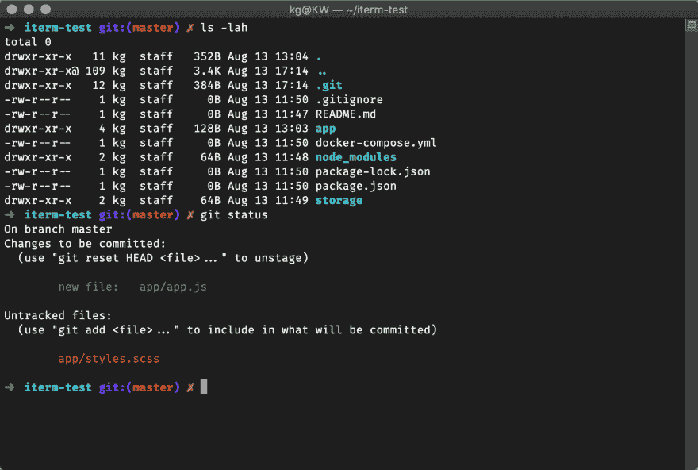

# 自动生成我的 ZSH 主题截图

> 原文：<https://dev.to/kovah/automatically-generating-oh-my-zsh-theme-screenshots-1cj3>

哦，我的 ZSH 是基本 Bash shell 的更受欢迎的替代品之一。它提供了许多有用的功能来加速你使用 shell 的工作。为了完成这个包，shell 还提供了主题，这些主题改变了 shell
的外观以及它显示的输出。[对应的维基页面](https://github.com/robbyrussell/oh-my-zsh/wiki/Themes)
包含了超过 100 个主题，这些主题实际上已经内置到了《哦，我的 ZSH》中。

“问题”:你无法轻易比较所有这些主题，因为截图差别太大，无法对它们有一点点客观的看法。我试图解决这个问题。

## 批量生成截图

自动化是生成大量截图的唯一可能方式，而无需花费数周时间。令人欣慰的是，macOS
配备了 Automator，这是一个自动化任务的便捷工具。我用这个工具建立了一个简单的工作流程，帮助我为几乎所有的内置主题生成了 131 张截图。

### 资产

👉在这里下载自动机脚本

👉带有示例文件的存储库:[Kovah/oh-my-zsh-theme-test](https://github.com/Kovah/oh-my-zsh-theme-test)

### 端子测试设置

所有截图都是用标准的 macOS Terminal.app 应用程序生成的，所有设置都设置为默认的
设置。唯一显著的变化是字体。我使用了 13pt 大小的 Fira 代码来实现对一些使用特殊字符的
主题的高级支持。

所有终端窗口的大小都是 100x31。

### 自动机脚本

该脚本包含以下步骤:

*   询问主题名称，并将其保存为变量
*   启动终端
*   运行一个 AppleScript
    *   告诉终端应用程序
        *   切换到包含一些文件的准备好的文件夹，并初始化 Git
        *   通过使用`ZSH_THEME`环境变量，用变量中的新主题重新初始化 shell
        *   打印一个转义序列来清除终端输入
        *   打印一系列命令以生成输出
    *   然后，为截图设置一些变量和路径
    *   最后在启用仅窗口模式的情况下切换屏幕截图命令。

这并不多，但它有助于防止任何重复的任务。此时，您必须与脚本交互两次:
一次用于提供主题名称，一次用于选择屏幕截图的终端窗口。

我非常确定有一种方法可以在没有用户交互的情况下截取单个窗口的屏幕截图，也许是通过使用
屏幕截图命令以及 x 和 y 坐标(可以从终端应用程序窗口获得),但是我
不能足够快地做出一个解决方案，所以我选择了手动模式，它也可以工作。

包含所有样本文件的文件夹可以在[这个库](https://github.com/Kovah/oh-my-zsh-theme-test)中找到。
我创建这个回购是为了让其他用户也能生成和我一模一样的截图。

## 新截图为哦我的 ZSH

不幸的是，这些变化还没有生效。当前的维护者在一期、
中提到，一些主题有显示特殊功能或特定配色方案的截图。完全
可以理解。目前，新版本的维基可以在[我的维基之叉](https://github.com/Kovah/oh-my-zsh-wiki/blob/master/Themes.md)上查看。

我希望“开源”我的工作流程将有助于获得官方维基页面上的新截图。如果你想对这个问题提出一些想法，请随意发表评论。

* * *

*这篇文章最初发表在[博客上。](https://blog.kovah.de/en/2019/generating-shell-theme-screenshots/)kovah . de*