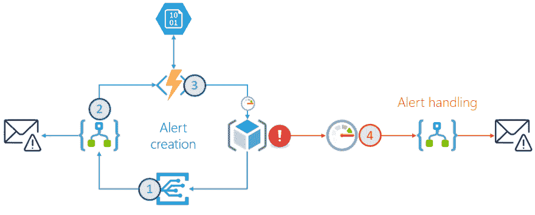
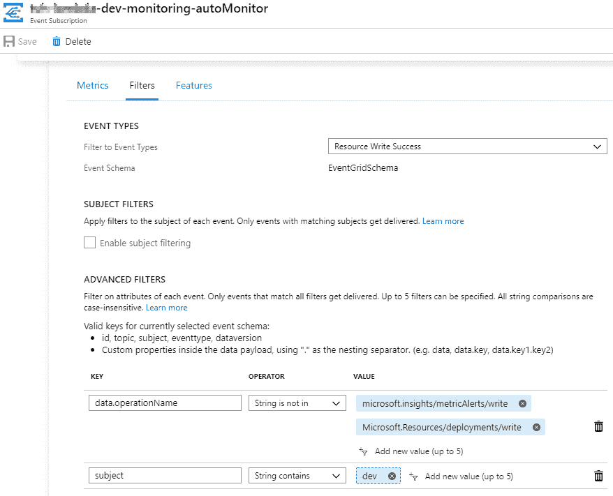
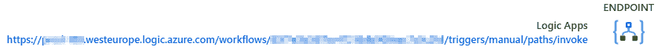
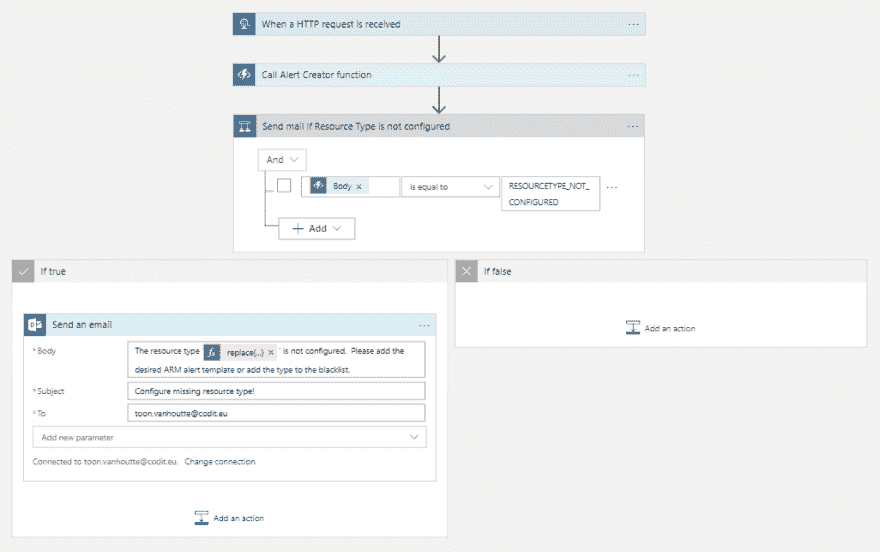
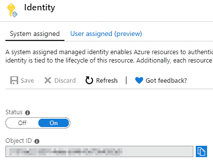
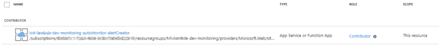
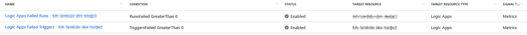
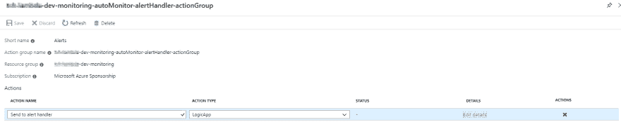
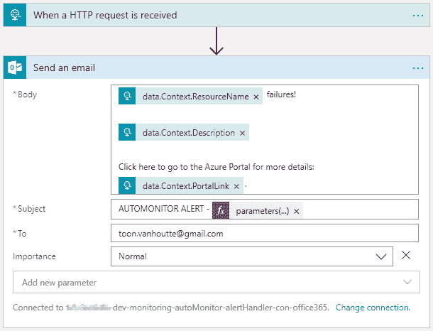

# 为您的 Azure 解决方案自动提供 Azure Monitor 警报规则！

> 原文：<https://dev.to/toonvanhoutte/automatically-provision-azure-monitor-alert-rules-for-your-azure-solutions-cl8>

本文是 [#ServerlessSeptember](https://dev.to/azure/serverless-september-content-collection-2fhb) 的一部分。在这个无服务器的内容集合中，您可以找到其他有用的文章、详细的教程和视频。9 月份，每天都有来自社区成员和云倡导者的新文章发布，没错，每天都有。
在[https://docs.microsoft.com/azure/azure-functions/](https://docs.microsoft.com/azure/azure-functions/?WT.mc_id=servsept_devto-blog-cxa)了解更多关于微软 Azure 如何实现你的无服务器功能。

监控是云解决方案的一个极其重要的方面。这篇博客展示了如何为订阅中创建的每个资源自动创建 Azure Monitor 提醒。根据资源类型，会自动配置适当的警报规则。该解决方案使用 Azure Event Grid 对订阅中的资源事件做出反应，使用 Logic Apps 编排工作流，并使用 Azure Function 的 PowerShell 支持(在 preview 中)根据最佳实践应用警报规则。这是高级解决方案图，更多细节将在下面解释。

[](https://res.cloudinary.com/practicaldev/image/fetch/s--NDNB9LNm--/c_limit%2Cf_auto%2Cfl_progressive%2Cq_auto%2Cw_880/https://toonvanhoutte.files.wordpress.com/2019/09/severless-01.png)

## 创建事件网格订阅(1)

事件网格允许您对订阅中发生的事件做出反应。在这种情况下，我们希望在创建资源时触发一个流程。查阅文档后，订阅级别的资源写入成功似乎是订阅的正确事件类型。在高级过滤器中，排除度量预警和部署事件，因为它们会创建太多不需要的事件。

[](https://res.cloudinary.com/practicaldev/image/fetch/s--N-MZm3kz--/c_limit%2Cf_auto%2Cfl_progressive%2Cq_auto%2Cw_880/https://toonvanhoutte.files.wordpress.com/2019/09/severless-02.png)

将 Alert Creator Orchestrator 逻辑应用程序配置为接收和处理所有事件的应用程序。

[](https://res.cloudinary.com/practicaldev/image/fetch/s--mV60QZsd--/c_limit%2Cf_auto%2Cfl_progressive%2Cq_auto%2Cw_880/https://toonvanhoutte.files.wordpress.com/2019/09/severless-03.png)

## 配置警报创建器 Orchestrator 逻辑 App (2)

逻辑应用程序通过 HTTP 请求订阅传入事件。首先，调用一个 Azure 函数，所有复杂的逻辑都被卸载到这个函数中。如果该功能的结果表明没有为警报规则创建配置特定的资源类型，则会向负责人发送一封电子邮件，以便他/她可以采取措施。

[](https://res.cloudinary.com/practicaldev/image/fetch/s--kRxMV5Xw--/c_limit%2Cf_auto%2Cfl_progressive%2Cq_auto%2Cw_880/https://toonvanhoutte.files.wordpress.com/2019/09/severless-04.png)

## 创建 Azure 监控器警报规则(3)

警报创建者 Azure 函数负责根据资源类型创建 Azure Monitor 警报规则。

[](https://res.cloudinary.com/practicaldev/image/fetch/s--HXrkPYgT--/c_limit%2Cf_auto%2Cfl_progressive%2Cq_auto%2Cw_880/https://toonvanhoutte.files.wordpress.com/2019/09/severless-05.png)

为了使其完全可配置，使用了存储帐户。这是 Azure 函数应用的逻辑:

1.  检查资源类型是否在黑名单中。如果它在黑名单上(=一个 JSON 配置文件)，可以安全地忽略该事件。返回 RESOURCETYPE _ 黑名单作为响应。

2.  如果资源类型未列入黑名单，请搜索具有该资源类型名称的 ARM 模板。部署具有三个输入参数的 ARM 模板并返回 ALERTS _ CREATED:
    -resourceId:Azure 资源的唯一 Id
    -action groupid:处理警报的 Azure Monitor 操作组的 Id
    -enabled:启用/禁用警报规则的标志(通常您不希望为开发环境启用它们)

3.  如果没有找到相应的 ARM 模板，则返回 RESOURCETYPE_NOT_CONFIGURED 响应。

Azure 函数是用 PowerShell 写的。

```
using  namespace  System.Net  # Input bindings are passed in via param block.  param($Request,  $TriggerMetadata)  try  {  #Retrieve input parameters from request body  $resourceName  =  $Request.Body.resourceName  $resourceId  =  $Request.Body.resourceId  $resourceType  =  $Request.Body.resourceType  #Set Azure Auto Monitor variables from app settings  $storageAccountConnectionString  =  $env:storageAccountConnectionString  $containerName  =  $env:containerName  $blackListedResourceTypesFileName  =  $env:blackListedResourceTypesFileName  $resourceTypeTemplatesFolderName  =  $env:resourceTypeTemplatesFolderName  $actionGroupId  =  $env:actionGroupId  $resourceGroupName  =  $env:resourceGroupName  $alertsEnabled  =  [boolean]$env:alertsEnabled  #Initialize variables  $resourceType  =  $resourceType.ToLower()  $supportedResourceTypes  =  @()  $ErrorActionPreference  =  "Stop"  #AzLogin using Managed Service Identity  Connect-AzAccount  -Identity  #Connect to storage account  $storageContext  =  New-AzStorageContext  -ConnectionString  $storageAccountConnectionString  #Get all blacklisted resource types  Get-AzStorageBlobContent  -Container  $containerName  -Blob  $blackListedResourceTypesFileName  -Destination  $blackListedResourceTypesFileName  -Force  -Context  $storageContext  $blackListedResourceTypes  =  Get-Content  $blackListedResourceTypesFileName  |  ConvertFrom-Json  if($blackListedResourceTypes  -contains  $resourceType)  {  Write-Host  "Blacklisted resource type, no further actions"  $body  =  "RESOURCETYPE_BLACKLISTED"  }  else  {  #Get all available resource type templates  $resourceTypeTemplateFiles  =  Get-AzStorageBlob  -Container  $containerName  -Prefix  "$($resourceTypeTemplatesFolderName)/"  -Context  $storageContext  foreach  ($template  in  $resourceTypeTemplateFiles  |  Select-Object  -ExpandProperty  Name){  $supportedResourceTypes  +=  $template.Replace("$($resourceTypeTemplatesFolderName)/",  "").Replace(".json","").Replace("_","/")  }  if($supportedResourceTypes  -contains  $resourceType)  {  $templateName  =  $resourceTypeTemplatesFolderName  +  "/"  +  $resourceType.Replace('/',  '_').ToLower()  +  ".json"  $templateSasToken  =  New-AzStorageBlobSASToken  -Container  $containerName  -Blob  $templateName  -Permission  r  -StartTime  (Get-Date).AddDays(-1.0)  -ExpiryTime  (Get-Date).AddDays(1.0)  -Context  $storageContext  $templateUrl  =  $storageContext.BlobEndPoint  +  $containerName  +  "/"  +  $templateName  +  $templateSasToken  $guid  =  [GUID]::NewGuid()  New-AzResourceGroupDeployment  -Name  "AzureAutoMonitorAlerts_$($guid)"  -ResourceGroupName  $resourceGroupName  -TemplateUri  $templateUrl  -resourceId  $resourceId  -actionGroupId  $actionGroupId  -enabled  $alertsEnabled  $body  =  "ALERTS_CREATED"  }  else  {  $body  =  "RESOURCETYPE_NOT_CONFIGURED"  }  }  $status  =  [HttpStatusCode]::OK  }  catch  {  $body  =  $_.Exception.Message  $status  =  [HttpStatusCode]::InternalServerError  }  # Associate values to output bindings by calling 'Push-OutputBinding'.  Push-OutputBinding  -Name  Response  -Value  ([HttpResponseContext]@{  StatusCode  =  $status  Body  =  $body  }) 
```

此 Azure 函数使用托管服务身份对 Azure 资源管理器进行授权:

[](https://res.cloudinary.com/practicaldev/image/fetch/s--7mFST35---/c_limit%2Cf_auto%2Cfl_progressive%2Cq_auto%2Cw_880/https://toonvanhoutte.files.wordpress.com/2019/09/severless-06.png)

Azure 函数的托管服务身份被授予订阅的贡献者权限:

[](https://res.cloudinary.com/practicaldev/image/fetch/s--YoXFDhVP--/c_limit%2Cf_auto%2Cfl_progressive%2Cq_auto%2Cw_880/https://toonvanhoutte.files.wordpress.com/2019/09/severless-061.png)

这是一个为所有逻辑应用程序创建 Azure Monitor 警报规则的 ARM 模板示例。您应该为要监视的每种资源类型创建一个类似的模板(例如 SQL 数据库磁盘空间-内存- cpu)。

```
{  "$schema":  "https://schema.management.azure.com/schemas/2015-01-01/deploymentTemplate.json#",  "contentVersion":  "1.0.0.0",  "parameters":  {  "resourceId":  {  "type":  "string"  },  "actionGroupId":  {  "type":  "string"  },  "enabled"  :  {  "type":  "bool"  }  },  "variables":  {  "resourceName"  :  "[split(parameters('resourceId'), '/')[sub(length(split(parameters('resourceId'), '/')), 1)]]"  },  "resources":  [  {  "type":  "microsoft.insights/metricAlerts",  "name":  "[concat('Logic Apps Failed Runs - ', variables('resourceName'))]",  "apiVersion":  "2018-03-01",  "location":  "global",  "properties":  {  "description":  "[concat('There are failed runs for the Logic App ', variables('resourceName'), '.')]",  "severity":  3,  "enabled":  "[parameters('enabled')]",  "scopes":  [  "[parameters('resourceId')]"  ],  "evaluationFrequency":  "PT1M",  "windowSize":  "PT5M",  "criteria":  {  "odata.type":  "Microsoft.Azure.Monitor.SingleResourceMultipleMetricCriteria",  "allOf":  [  {  "name":  "Failed runs",  "metricName":  "RunsFailed",  "dimensions":  [],  "operator":  "GreaterThan",  "threshold":  "0",  "timeAggregation":  "Total"  }  ]  },  "actions":  [  {  "actionGroupId":  "[parameters('actionGroupId')]",  "webHookProperties":  {}  }  ]  }  },  {  "type":  "microsoft.insights/metricAlerts",  "name":  "[concat('Logic Apps Failed Triggers - ', variables('resourceName'))]",  "apiVersion":  "2018-03-01",  "location":  "global",  "properties":  {  "description":  "[concat('There are failed triggers for the Logic App ', variables('resourceName'), '.')]",  "severity":  3,  "enabled":  "[parameters('enabled')]",  "scopes":  [  "[parameters('resourceId')]"  ],  "evaluationFrequency":  "PT1M",  "windowSize":  "PT5M",  "criteria":  {  "odata.type":  "Microsoft.Azure.Monitor.SingleResourceMultipleMetricCriteria",  "allOf":  [  {  "name":  "Failed triggers",  "metricName":  "TriggersFailed",  "dimensions":  [],  "operator":  "GreaterThan",  "threshold":  "0",  "timeAggregation":  "Total"  }  ]  },  "actions":  [  {  "actionGroupId":  "[parameters('actionGroupId')]",  "webHookProperties":  {}  }  ]  }  }  ],  "outputs":  {  }  } 
```

例如，以下 Azure Monitor 警报规则被自动添加到我新创建的 Logic 应用程序中:

[](https://res.cloudinary.com/practicaldev/image/fetch/s--ycCE2fE8--/c_limit%2Cf_auto%2Cfl_progressive%2Cq_auto%2Cw_880/https://toonvanhoutte.files.wordpress.com/2019/09/severless-07.png)

## 处理 Azure Monitor 警报(4)

所有警报规则指向的 Azure Monitor 操作组被配置为将警报事件发送到单个逻辑应用程序:

[](https://res.cloudinary.com/practicaldev/image/fetch/s--7kukbcpq--/c_limit%2Cf_auto%2Cfl_progressive%2Cq_auto%2Cw_880/https://toonvanhoutte.files.wordpress.com/2019/09/severless-08.png)

目前，这个逻辑应用程序被配置为仅发送一封警告电子邮件。在这种方法的未来扩展中，这种提醒可以扩展到发送 SMS、呼叫某人、开始 Skype 对话或通过团队/空闲频道通知人们。

[](https://res.cloudinary.com/practicaldev/image/fetch/s--3iKi6ypo--/c_limit%2Cf_auto%2Cfl_progressive%2Cq_auto%2Cw_880/https://toonvanhoutte.files.wordpress.com/2019/09/severless-09.png)

## 结论

通过结合事件网格、逻辑应用和 Azure 功能的魔力，您可以轻松构建一个预算友好的解决方案，自动监控您的 Azure 解决方案。开发者可以专注于创建强大的 Azure 解决方案，而无需担心监控。

希望你喜欢这个！
香椿