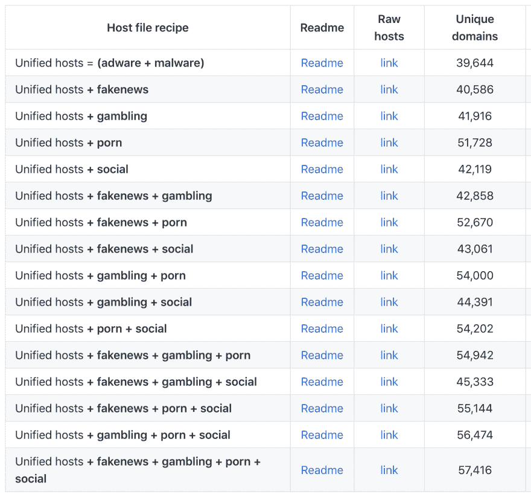
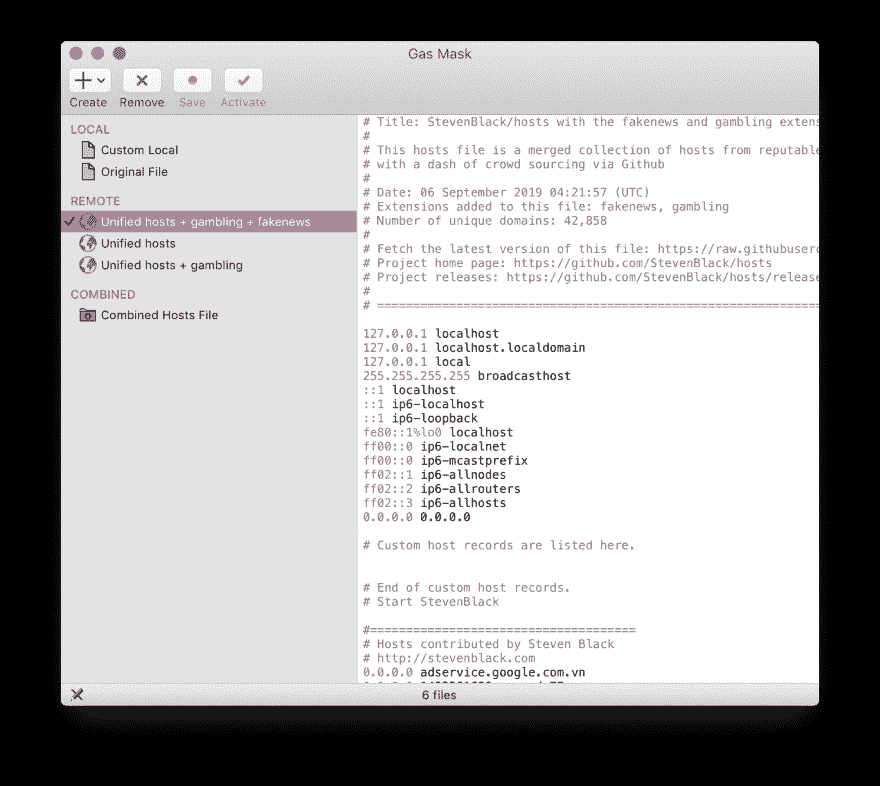
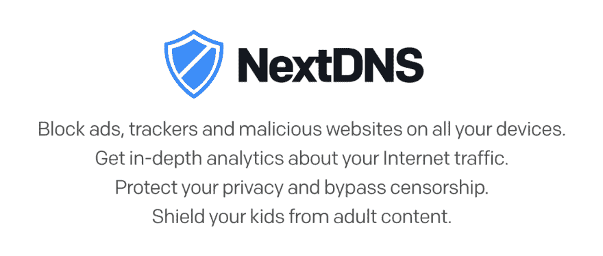

# 避免在网络上被跟踪

> 原文：<https://dev.to/mrmartineau/avoid-being-tracked-on-the-web-1pdm>

## 几个让你更加隐形的小贴士

所以，你不想在网上被跟踪🙅由广告商和分析脚本等？你是做什么的？你需要阻止他们。有许多不同的方法来实现这一点，但我使用一些不同的工具和服务来阻止所有这些家伙。

➡️访问[github . com/Steven black/hosts # list-of-all-hosts-file-variants](https://github.com/StevenBlack/hosts#list-of-all-hosts-file-variants)，找到你想要的“主机”食谱。“统一主机=(广告软件+恶意软件)”应该足够了，但您也可以找到阻止色情和/或赌博内容的主机。

如果你在苹果电脑上，顺时针从[下载防毒面具(免费)。如果你用的是 Windows，你可以试试 github.com/ScriptTiger/Unified-Hosts-AutoUpdate](http://clockwise.ee/)[的统一主机自动更新。两者都允许您选择一个主机列表(如上所述)，并让它定期自动更新。](https://github.com/ScriptTiger/Unified-Hosts-AutoUpdate)

⚠️防毒面具可以引用远程托管的文件，但前提是它们不是 https，所以使用来自[Github . com/Steven black/hosts # list-of-all-hosts-file-variants](https://github.com/StevenBlack/hosts#list-of-all-hosts-file-variants)的“非 github 镜像”链接，就像这个:[sbc.io/hosts/hosts](http://sbc.io/hosts/hosts)。

有了这个设置，访问一个充斥着广告的网站，比如 theverge.com 的[、mashable.com 的](http://theverge.com/)或者 T2 的，你会发现已经没有广告了。

顺便说一下，这些主机文件不仅可以阻止广告，还可以阻止跟踪器、恶意软件、假新闻等对您和其他用户隐藏的内容。

你可能会发现它不工作，所以看看这些说明，看看你是否需要重置你电脑上的一些东西:[github.com/StevenBlack/hosts#reloading-hosts-file](https://github.com/StevenBlack/hosts#reloading-hosts-file)。

如果你想更进一步，你可以设置一个洞。它是一个运行在 Raspberry Pi 或类似设备上的网络级阻塞应用程序。你网络上的任何设备(智能手机或笔记本电脑)都是受保护的，不需要安装我在上面的帖子中提到的应用程序。

在[pi-hole.net](https://pi-hole.net/)找到关于 Pi-hole 的信息

如果你不想设置一个漏洞，试试 [nextdns.io](https://nextdns.io/) 。我已经用了几个月了，非常喜欢。

NextDNS 可以在你的智能手机和个人电脑上使用，并且有许多不同的配置。一些规则是基于 StevenBlack 规则(来自上面)，但是还有更多。这是我推荐的解决方案。

如果你想更进一步，我建议使用像 [NordVPN](https://nordvpn.com/) 这样的 VPN。NordVPN 非常便宜，不会记录你的活动(这一点很重要)，而且非常注重隐私。

如果你想在网上保持更多的自我隐私，我建议你访问 [privacytools.io](https://www.privacytools.io/) 找到许多其他工具。

* * *

👨‍💻这篇文章的来源最初是我的一个 Twitter 帖子:[twitter.com/MrMartineau/status/1128578179730423808](https://twitter.com/MrMartineau/status/1128578179730423808)

* * *

这篇文章最初发表在[我的博客](https://zander.wtf/writing/not-tracked-online)上