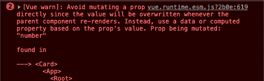
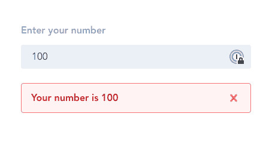
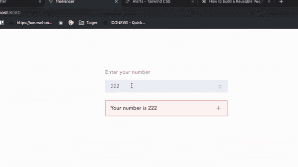
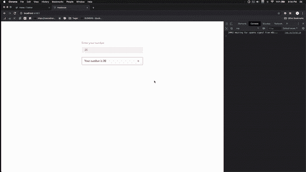
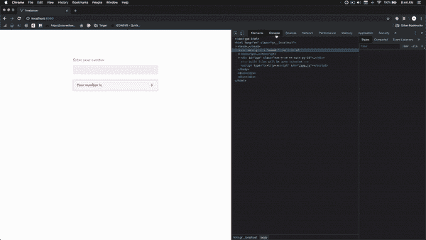

# 如何修复 Vue 中的“避免直接变异道具”

> 原文：<https://dev.to/jakzaizzat/avoid-mutating-a-prop-directly-ab9>

[](https://res.cloudinary.com/practicaldev/image/fetch/s--vSsHyx8X--/c_limit%2Cf_auto%2Cfl_progressive%2Cq_auto%2Cw_880/https://i.ibb.co/4Rd4d9L/featured.png)

你有没有面对过这个错误-

> 避免直接改变道具，因为只要父组件重新渲染，该值就会被覆盖。相反，使用基于属性值的数据或计算属性。

[](https://res.cloudinary.com/practicaldev/image/fetch/s--8YcUogqI--/c_limit%2Cf_auto%2Cfl_progressive%2Cq_auto%2Cw_880/https://i.ibb.co/Q8xFfQ9/error.png)

Vue 不建议修改`prop`数据的原因是因为如果父组件有不同的值，子组件中的数据将被重新渲染。

## 如何解决？

我将创建一个简单的 Vue 组件，由附加了`v-model`的输入和另一个接受`v-model`数据作为`props`并显示它的卡组件组成。

这就是界面看起来的样子。
[T3】](https://res.cloudinary.com/practicaldev/image/fetch/s--KRqTrKIz--/c_limit%2Cf_auto%2Cfl_progressive%2Cq_auto%2Cw_880/https://i.ibb.co/yqDYC6q/interface.png)

*app . vista*

```
<template>
  <div id="app" class="max-w-sm mx-auto py-16">
    <div class="flex flex-col mb-6">
      <div class="mb-2">
        <label for="inline-full-name">Enter your number</label>
      </div>
      <div class="w-full">
        <input
          v-model="number"
          id="inline-full-name"
          class="input"
          type="number"
        />
      </div>
    </div>
    <Card :number="number" />
  </div>
</template>

<script>
import Card from "@/components/Card";

export default {
  name: "app",
  components: {
    Card
  },
  data() {
    return {
      number: 20
    };
  }
};
</script>

<style lang="postcss">
#app {
  font-family: "Avenir", Helvetica, Arial, sans-serif;
  -webkit-font-smoothing: antialiased;
  -moz-osx-font-smoothing: grayscale;
  text-align: center;
  color: #2c3e50;
  margin-top: 60px;
}

label {
  @apply blocktext-gray-500font-boldmb-1pr-4text-left;
}
.input {
  @apply bg-gray-200appearance-noneborder-2border-gray-200roundedw-fullpy-2px-4text-gray-700leading-tight;
}
.input:focus {
  @apply outline-nonebg-whiteborder-purple-500;
}
</style> 
```

*卡。视图*

```
<template>
  <div
    class="bg-red-100 flex justify-between items-center border border-red-400 text-red-700 px-4 py-3 rounded relative"
    role="alert"
  >
    <strong class="font-bold">Your number is {{ number }}</strong>
    
      <path
        class="heroicon-ui"
        d="M1711a1100102h-4v4a11001-20v-4H7a110010-2h4V7a1100120v4h4z"
      />
    
  </div>
</template>

<script>
export default {
  props: {
    number: {
      required: true
    }
  },
  methods: {
    addNumber() {
      this.number++;
    }
  }
};
</script> 
```

这就是界面的工作方式。

[](https://res.cloudinary.com/practicaldev/image/fetch/s--FaT1SHxk--/c_limit%2Cf_auto%2Cfl_progressive%2Cq_66%2Cw_880/https://i.ibb.co/SK9vrjD/part-1.gif)

每次用户在输入时，它都会直接反映在下面的卡片上。这是因为我们在`Card`组件中将`v-model: number`作为`prop`传递。

用户输入的任何值都会立即反映出来。

我的下一个问题是，如果我们要操作子组件(即`Card`组件)中的数据，会发生什么。

我将在`Card`组件中添加一个按钮，它触发一个增加`value`的`method`。

*卡。视图*

```
<script>
export default {
  props: {
    number: {
      required: true
    }
  },
  methods: {
    addNumber() {
      this.number++;
    }
  }
};
</script> 
```

令人惊讶的是，这就是正在发生的事情。

[](https://res.cloudinary.com/practicaldev/image/fetch/s--ELVi8PN4--/c_limit%2Cf_auto%2Cfl_progressive%2Cq_66%2Cw_880/https://i.ibb.co/KwqP80s/part-2.gif)

当我们想增加子组件中的值时，Vue 会给我们一个错误消息，提示这不是推荐的方式。

### 为什么不推荐？

如果父组件中的数据 *v-model* 发生变化，子组件中的数据将重新呈现。

例如，我在输入中添加任意数字，并使用加号按钮增加`number`。如果我在`input`中添加一个新值会发生什么？

我们刚才增加的值是从输入中得到一个新值。

明白了吗？

[](https://res.cloudinary.com/practicaldev/image/fetch/s--GsRqxOWu--/c_limit%2Cf_auto%2Cfl_progressive%2Cq_66%2Cw_880/https://i.ibb.co/48ZkH2v/part-3.gif)

### 我们怎么解决？

由于我们不能直接修改 props 数据，所以我们需要将`props`数据复制到一个变量中。

在`addNumber`方法中，将道具赋给一个新变量，并进行计算。

```
let myNumber = this.number;
myNumber++; 
```

下一个问题是，我们如何将新的数值发送给父节点？🤔

感谢上帝，有一个自定义事件来解决它。我们需要在`addNumber`方法中添加自定义事件。

```
this.$emit("update-number", myNumber); 
```

这意味着我们通过`update-number`事件名称发送一个`myNumber`数据。因为我们正在发送一个定制数据，父组件需要监听`update-number`事件。

在`App.vue`中，将监听器添加到`Card`组件中。

```
<Card:number="number" @update-number="update"/> 
```

如果子组件中有一个名为`update-number`的`emit`事件被触发，就会调用`update`函数。

在`App.vue`文件中，在`methods`部分添加`update`函数。

```
methods:{
    update(number){
        this.number=number;
    }
} 
```

记住，当我们发送自定义事件时，我们发送的是参数`myNumber`。所以，在`update`函数中需要有一个参数来获取数据。

```
this.$emit("update-number", myNumber); 
```

之后，我们从自定义事件中获得的新值将被赋给`number`数据。因为，如果每次`props`数据改变时，子组件数据将被重新呈现，我们可以在`Card`组件中看到即时更新。

[](https://res.cloudinary.com/practicaldev/image/fetch/s--__i4az5G--/c_limit%2Cf_auto%2Cfl_progressive%2Cq_66%2Cw_880/https://i.ibb.co/8jmVSXW/part-4.gif)

## 源代码

App .视图〔t0〕

```
<template>
  <div id="app" class="max-w-sm mx-auto py-16">
    <div class="flex flex-col mb-6">
      <div class="mb-2">
        <label for="inline-full-name">Enter your number</label>
      </div>
      <div class="w-full">
        <input
          v-model="number"
          id="inline-full-name"
          class="input"
          type="number"
        />
      </div>
    </div>
    <Card :number="number" @update-number="update" />
  </div>
</template>

<script>
import Card from "@/components/Card";
export default {
  name: "app",
  components: {
    Card
  },
  data() {
    return {
      number: 20
    };
  },
  methods: {
    update(number) {
      this.number = number;
    }
  }
};
</script>

<style lang="postcss">
#app {
  font-family: "Avenir", Helvetica, Arial, sans-serif;
  -webkit-font-smoothing: antialiased;
  -moz-osx-font-smoothing: grayscale;
  text-align: center;
  color: #2c3e50;
  margin-top: 60px;
}

label {
  @apply block text-gray-500 font-bold mb-1 pr-4 text-left;
}
.input {
  @apply bg-gray-200 appearance-none border-2 border-gray-200 rounded w-full py-2 px-4 text-gray-700 leading-tight;
}
.input:focus {
  @apply outline-none bg-white border-purple-500;
}
</style> 
```

卡.视图〔t0〕

```
<template>
  <div
    class="bg-red-100 flex justify-between items-center border border-red-400 text-red-700 px-4 py-3 rounded relative"
    role="alert"
  >
    <strong class="font-bold">Your number is {{ number }}</strong>
    
      <path
        class="heroicon-ui"
        d="M17 11a1 1 0 0 1 0 2h-4v4a1 1 0 0 1-2 0v-4H7a1 1 0 0 1 0-2h4V7a1 1 0 0 1 2 0v4h4z"
      />
    
  </div>
</template>

<script>
export default {
  props: {
    number: {
      required: true
    }
  },
  methods: {
    addNumber() {
      let myNumber = this.number;
      myNumber++;
      this.$emit("update-number", myNumber);
    }
  }
};
</script> 
```

最初发表于[https://jakzaizzat.com](https://jakzaizzat.com/avoid-mutating-a-prop-directly)