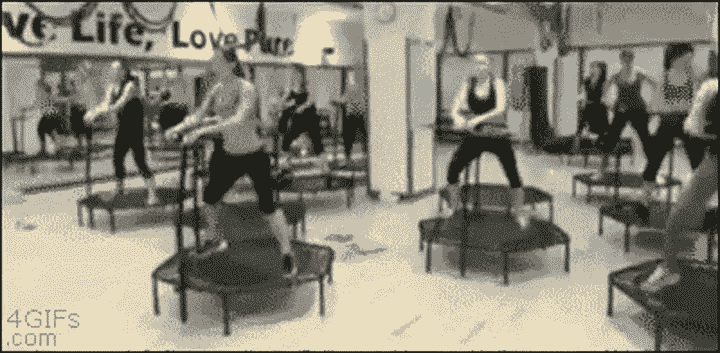

# 用简单的伪代码避免低俗的代码

> 原文：<https://dev.to/majeemaj/avoid-sleazy-code-with-easy-pseudo-code-12b7>

曾经想过像尼古拉·里姆斯基·科萨科夫在钢琴上演奏他的《大黄蜂的飞行》那样在键盘上编码吗？你希望你的代码像 Tyler Joseph 的说唱诗“淹没”一样流畅吗？你希望和你的电脑有一段像雌雄大盗那样的关系吗？你有没有觉得自己像个塑料袋？

 
你不使用 masterful 伪代码时的感受。在阅读这篇博文之前，大约在 2019 年着色。

人机之间的垫脚石；伪代码在你思考的方式和你的计算机理解的方式之间架起了一座桥梁。使用伪代码编写，如果做得正确，将帮助您创建具有定义的路径和方向的结构化代码，并阻止您感觉像一个塑料袋(随风飘荡，想要重新开始)。
如何不写伪代码行
在开始学习如何用伪代码演奏“魔鬼去了乔治亚”之前，我们将讨论如何保持良好的状态，为自己的成功做准备。我们不希望你把灵魂交给魔鬼或类似的东西。

你能做的最糟糕的事情就是过度使用你的伪代码。伪代码应该直接，简单，就像好的 GPS 导航方向。在不增加理解难度的情况下，你可以随意让它变得有趣，就像在这里为你的 Waze GPS 安装凯文·哈特的语音包一样。

 
从左到右:你非常牛逼搞笑的伪码骑散弹枪，和你一样牛逼搞笑。大约在 2019 年，当你读完这篇博文后，它被着色了。

如何实际编写你的伪代码行
假设我们正在为你写代码，让你在早上挑选一件漂亮的上衣来搭配你的衣服。你的代码应该足够简短，便于你理解。当你开会已经迟到，而且你公司的“商务休闲装”定义不允许你赤膊上阵时，你不会想破译你的伪代码。
这里有一个糟糕的例子:
//用你的右手打开壁橱的门，右手位于你身体的右侧，也与你的手臂相连。不要写你不需要的东西。你只是在向你自己解释，也许还有一些其他人会阅读你的代码。你的伪代码行应该看起来更像下面这样:
//打开壁橱
确保不要过度简化你的代码，因为那可能需要同样长的时间来破译。这里再举一个不好的例子:
//pk st
拼出来。这样更容易阅读。
//挑衫
从哪里获取你的几行伪代码以及如何构造它们
既然你已经知道了如何编写你的几行代码，那就来谈谈如何导出它们吧。
每一行伪代码应该描述不少于一行(duh)，通常不超过几行。偶尔你的伪代码行将描述一个简单但很长的代码块，这没关系，这正是你想要的。您的伪代码行应该只描述当前正在进行的操作。不要像孩子们在充气城堡里那样到处乱跳，你的伪代码应该留在本地范围内，就像一个成年人在迷你蹦床上一样。

这是一个早上穿好衣服难题的糟糕例子，接下来是为我赢得黄金伪代码小提琴的惊人结构的伪代码。
//打开衣柜从里面挑上衣。
//打开门后看看你挑选的上衣
//意识到你只有 13 件同样的 t 恤，因为你是一名程序员，你过着那样的生活
//仍然在会议上迟到。抱歉。交通被疯狂
^就是坏例子。有点无处不在，描述性太强，但我听说原著作者个性很好…

//打开衣柜
//挑选出所有适合的衣服作为上衣
//减去所有不适合你今天心情的上衣
//从收藏中挑选你最喜欢的上衣
//将其他上衣放回衣柜
//关闭衣柜(不想占用太多内存，我们必须提防那些使用谷歌 chrome 的兄弟，当他们打开 2 个标签时，只有 1.3 兆的内存可用。我希望在读完这篇文章时，你已经开怀大笑了一两次，并对伪代码有了新的认识。记得使用简单明了的术语描述解决方案的当前模块，不要害怕有时会有点滑稽。最后，做对你有用的事，到时候你会发现的。希望下一次你用伪代码解决难题时，感觉不会像在太空中与尼尔·德格拉斯·泰森下 3D 象棋，但如果是这样，我希望他让你先走。

