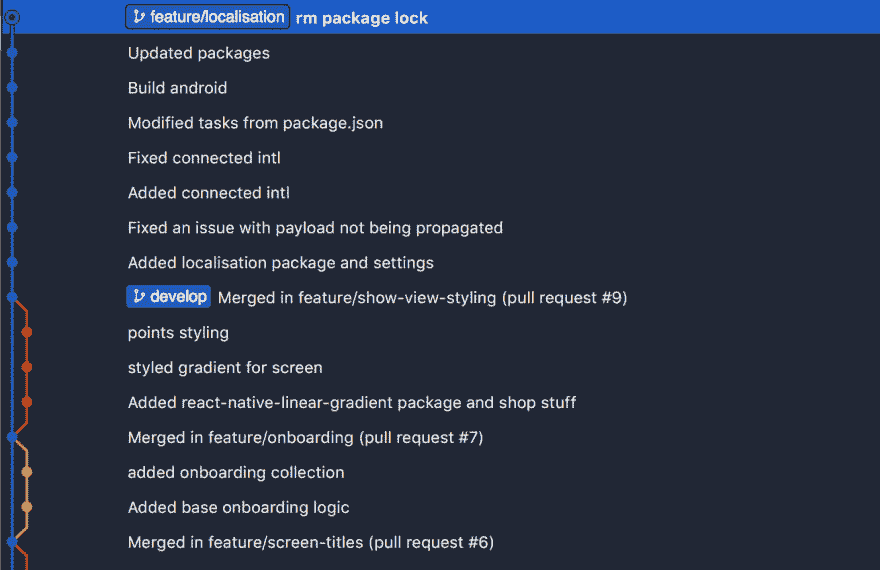
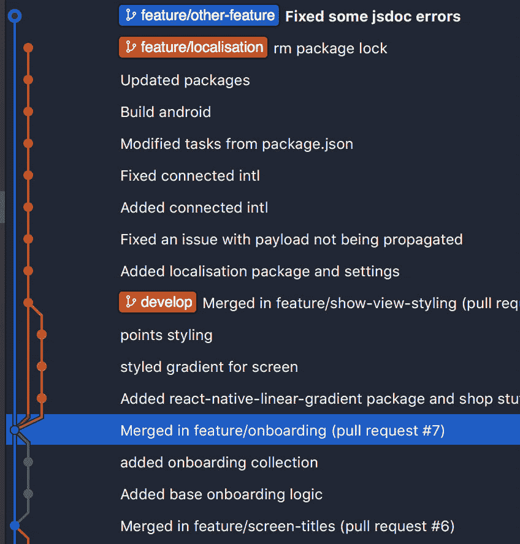

# 避免混乱的 git 历史

> 原文：<https://dev.to/prototyp/avoiding-the-messy-git-history-470d>

# 避开杂乱的饭桶历史

如果我们试着说出那些明确定义了现代软件开发的东西，源代码控制肯定会排在最前面，尤其是 git，它可能是当今使用最广泛的版本控制系统。

将我们的代码版本保存在本地不同的文件夹中的日子已经一去不复返了，这种情况经常容易导致损坏。然而，许多开发人员只是将 git 作为一种远程存储源文件的手段，而没有真正利用它的一些更高级的特性，这些特性使我们拥有一个伟大的、易读的 git 历史。

本文将介绍一种 git-flow 方法，主要基于 git rebase，它将允许您获得更简化的 git 体验，尤其是在团队内部工作时。这是一种严格的方法，需要一段时间来适应。

这种经验来自于在更大的项目中工作，基于我们在[原型](https://prototyp.digital/)的内部实践。我们非常重视代码审查和代码库中发生的所有变更的可读性。

该方法的主要目标是:

*   更干净的 git 历史

*   更少的合并冲突

*   实施代码审查

*   增加分支稳定性

本文中的所有示例都是通过命令行完成的，但是在 git 提供者仪表板中会有关于如何实现该过程的某些部分的链接和参考。

## 初始化 git 流

旅程的第一步是明确地初始化存储库上的 Git 流。

由原作者撰写的关于这个问题的更全面的文档可以在这里找到。

简而言之，这是一个分支模型，在过去对我们来说非常适用，并被广泛采用。

为了从命令行使用它，您很可能需要安装 git-flow。GUI 解决方案(如 Tower 或 Sourcetree)通常集成了这一功能。

你可以点击查看安装说明[。](https://danielkummer.github.io/git-flow-cheatsheet/)

示例:

```
// initialises git on your repository
git init

// initialises git flow on your git repo
git flow init 
```

在您的存储库上初始化 git 流之后，您将被要求输入默认的分支名称。我们在内部使用默认值，只是在标签前加上字母**“v”**，所以我们的版本是 v1.0.0、v1.0.1 等。

请随意使用对您的团队和产品最有意义的版本管理系统。然而，语义版本控制(semantic versioning)或 [semver](https://semver.org/) 已经成为我们选择的武器有一段时间了，虽然它对于较小的一次性项目来说可能有点大材小用，但事实证明它对于在我们公司内部发布 SaaS 产品或移动应用的新功能非常有用。

git flow 引入的每个分支在生态系统中都有自己的位置，了解何时使用每个分支是必须的！

```
// New features
Feature branches? [feature/]

// Tags a version and merges develop to master. 
// A short lived branch. Versions bumps are ok inside it.
Release branches? [release/]

// A branch done from master directly, for fast hotfix push
// We use bugfix/ name for a bugfix branch that is branched from  
// develop
Hotfix branches? [hotfix/]

// Need to add some client specific code ? Use a support branch
Support branches? [support/]

// Tag for release branches
Version tag prefix? [v] 
```

> 请记住，git 不是某种能让所有问题自行消失的魔杖，如果您一开始就不知道如何处理它们，拥有多个分支也没有任何意义。

## 锁定开发和主分支

对于不习惯这种方法的人来说，这可能有点争议，但我肯定地指出这是该过程中最重要的步骤之一。

保护** *开发* *

它还将使您避免许多潜在的“不稳定”问题，当人们将一个 ***“小而无足轻重的修复，不能打破任何东西”*** 直接推给这些分支之一时，往往会发生这些问题。当事情出错时，这会产生很多挫败感，这是迟早会发生的。

如何做到这一点，不同的提供商有所不同，但下面是更流行的一些方法的概要:

**bit bucket:**[https://blog . bit bucket . org/2016/12/05/protect-your-master-branch-with-merge-checks/](https://blog.bitbucket.org/2016/12/05/protect-your-master-branch-with-merge-checks/)

**GitHub**:[https://help . GitHub . com/articles/configuring-protected-branches/](https://help.github.com/articles/configuring-protected-branches/)

**git lab:**[https://docs . git lab . com/ee/user/project/protected _ branch . html](https://docs.gitlab.com/ee/user/project/protected_branches.html)

我建议启用一些合并检查，比如在合并任何代码之前，至少要经过另一个开发人员的一次代码审查和批准。

## 通过特征分支添加新代码

考虑到没有代码可以直接推送到开发或主分支，所以需要创建一个新的特性分支来为应用程序添加新的功能。

你既可以从命令行完成，也可以使用工具中的集成功能，如 [Sourcetree](https://www.sourcetreeapp.com/) 或 [Tower](https://www.git-tower.com/mac) 。

**源分支:**开发
**命名:**特征/特征名

示例:

```
git checkout develop
git branch feature/my-new-feature 
```

在您成功地创建了您的特性分支之后，您可以随意地将代码推进到它，直到您准备好让您的特性被团队中的另一个成员所合并。

## 合并您的代码

为了通过这种方法合并代码，在您完成您的特性之后，您将首先需要对它进行重新构建。这是一个多步骤的过程。

### 开发商重置基础

作为创建特性的开发人员，您通常希望从开发分支中提取同时发生的最新变更，并测试您的特性是否仍在工作。

```
git checkout develop
git pull
git checkout feature/your-feature-name

// This line will return a hash of commit where your branch diverged // from develop
git merge-base develop feature/your-feature-name

// {hash} is the result from the previous step
git rebase --onto develop {hash} 
```

这将启动 rebase 过程，其中来自 develop 的变更被集成到您自己的特性分支中，**通过 commit** 提交。

一旦您理解了重定基数的步骤，还有更短的替代方法，例如:

```
git checkout feature/your-feature-name
git pull --rebase origin develop 
```

你可以点击查看完整的 rebase 文档[。](https://git-scm.com/docs/git-rebase)

为什么不简单地使用 merge？

有效的观点。当然，您可以将 develop 合并到您自己的特性分支中，并获得类似的结果。然而，有几个关键的区别，为什么我们在这个场景中更喜欢重定分支而不是合并。

重设基数:

*   逐个提交地集成更改。

*   冲突也是一次又一次地发生，很容易问你的同事，为了更有效地一起解决冲突，做了哪些改变。

*   Rebase 可以很容易地中止和重新开始，恢复所有的变化，你做了，如果你不确定你搞砸了。

    ```
    // After you stage files, you can continue to next commit
    git rebase --continue

    // Skips the current commit entirely
    git rebase --skip

    // Reverts all rebase changes that you did
    // Returns the branch to pre-rebase state
    git rebase --abort 
    ```

*   如果您认为输入的提交是不必要的或者被您的更改所取代，您可以重命名输入的提交或者完全跳过它们，因此在重新设置基础时您有更大的灵活性。

*   如果您经常将变更集成到您的特性分支中，它不会创建不必要的合并提交。

*   如果没有任何冲突，它将通过所有的提交，这个过程就像 git merge 一样简单。

合并混乱:

[](https://res.cloudinary.com/practicaldev/image/fetch/s--AnDSxyzH--/c_limit%2Cf_auto%2Cfl_progressive%2Cq_66%2Cw_880/https://cdn-images-1.medium.com/max/2000/1%2AJzp7pSDzzJI5sTvGzucoQQ.gif)

Merge 将所有的更改粘在一起，导致大量潜在的冲突文件，解决这些差异通常是一件苦差事。此外，如果发生冲突，就很难理解是谁以及出于什么原因更改了文件。

然而，不管您的选择如何，在创建拉请求之前测试特性的负担肯定是在开发人员身上，不应该被跳过。

### 创建拉请求(在某些提供者中合并请求)

从特性分支创建一个 pull 请求，在 git 提供者的接口内开发(或从其分支的分支)。

**bit bucket:**[https://confluence . atlassian . com/bit bucket/create-a-pull-request-to-merge-your-change-774243413 . html](https://confluence.atlassian.com/bitbucket/create-a-pull-request-to-merge-your-change-774243413.html)

**GitHub**:【https://help.github.com/en/articles/creating-a-pull-request T2】T3】

**GitLab:**[https://docs . GitLab . com/ee/GitLab-basics/add-merge-request . html](https://docs.gitlab.com/ee/gitlab-basics/add-merge-request.html)

> Gitlab 在他们的界面中提供了自动重定基础选项，这是一个我非常喜欢的特性，例如，如果在 BitBucket 中看到它，我会兴奋不已。

### 由审核人重新确定基数

这一步是获得可读和简化的 git 历史的主要技巧。

与用于解决潜在冲突和用最新的更改测试您的特性的开发人员 rebase 不同，这主要是出于可读性的原因，尽管它也可以在问题发生时捕获问题。

我们认为这是这个过程中的关键一步，因为在你创建一个公关之后，你不知道别人需要多长时间来审核和合并它。

通常，在这种情况发生之前，会有新的特性合并到您的开发分支中，这意味着:

*   新功能可能会引入需要解决的冲突

*   从你第一次重定基数的那一刻起，git 的历史就已经改变了

如果评审者做了另一个重定基础，它应该改进特性的测试，最小化合并后特性不工作的可能性，并为您提供一个非常干净和线性的 git 历史。

## 实际情况如何

下面是 Sourcetree 的一个小截图，展示了通过这种方法合并的特征，以及*开发*、*主*和*其他分支*之间的相互关系。

[](https://res.cloudinary.com/practicaldev/image/fetch/s--aeZNPoik--/c_limit%2Cf_auto%2Cfl_progressive%2Cq_auto%2Cw_880/https://cdn-images-1.medium.com/max/3100/1%2AbrfzRnafwUrh3sEpSJNDjA.png)

如你所见:

*   可读性很强

*   可以快速找到带有从开发到母版标签的发布点

*   您可以很容易地看到您的功能或错误修复被合并的顺序。如果您不确定哪个特性破坏了项目中的其他东西，这将非常有帮助。如果事情发展到那一步，它甚至让使用 [*git 平分](https://git-scm.com/docs/git-bisect) *变得更加容易。

**挤压或不挤压**

这里显示的例子使用了由 GitLab 自动提供的特性 *squash* ,尽管如果需要，您可以在本地压缩提交，如下所示:

```
git checkout feature/my-new-feature // If you are not on it
git rebase -i HEAD~1 
```

这将把整个分支挤压成一个提交。一句忠告，**如果这是你想要的，内部讨论。**

从我们的角度来看，只要您遵循 rebase 流程，挤压不会显著影响 git 图的可读性，除非您的特性有 100 多个提交。

> 在这种情况下，也许您在一个特性中捆绑了太多的东西:)。

我更喜欢在做 PR 之前在一个分支中粉碎提交，因为如果你搞砸了，它会迫使你去找一个新的 *bugfix/* 或 *hotfix/* 分支。同样，不管你的开发人员是做原子提交还是巨兽提交，这都无关紧要。

然而，将所有这些都压缩到一个提交中并不是强制性的。如果它是一个更大的特性，您可以通过交互式 rebase 手工将您的分支压缩为几个重要的提交。

```
git checkout feature/your-feature-name
git merge-base develop feature/your-feature-name // returns {hash}
git rebase -i {hash} 
```

您将看到这样的屏幕:

```
pick be8606b Added localisation package and settings
pick 48e6aec Fixed an issue with payload not being propagated
squash 6085ce3 Added connected intl
squash 60ec657 Fixed connected intl
squash ba09d22 Modified tasks from package.json
pick 0bea497 Build android
pick 52c67b9 Updated packages
pick 21aa18c rm package lock 
```

只需将 *pick* 改为 *squash* 即可将一个提交与其之前的提交合并。

这通常用于压缩提交副本或使用愚蠢名称的提交，例如 *removed console.log* ，以便维护相关的信息丰富的 git 历史。

## 不相信这是一条路要走？

如果你没有以这种方式使用过 git，这是很容易理解的。至少尝试一下，在你用了几天或者单个项目之后，试着对它做出一个评价。

它确实让我们在 [PROTOTYP](http://prototyp.digital) 上提高了 git 的使用率，并以更少的冲突实现了更好的 git 可读性。当它们真的发生时，它们会很快得到解决，让我们更有效率，更专注于功能，而不是拔头发。

在所有项目上转换到流程的过程并不容易，而且需要一些时间。过了一段时间，每个人都对它给我们团队带来的结果感到满意。

这里是关于这个过程的一些最后的事情。

### 关于 Git rebase 的几句话

哦天啊。不是 rebase，对吧？

对我们来说， **git rebase** 是 git 最强大的特性之一。把它想象成一个管理你的 git 历史的瑞士工具。

然而，对这种功能的看法通常是非常固执的，这可能会导致一些误解。

以下是一些例子:

> 不要用 rebase，这是破坏性的操作！

这有一些优点。Rebase 重写 git 历史，如果使用不当，会导致灾难性的结果！

然而，git 的很多东西都具有潜在的破坏性。这并不意味着不应该使用它们，只是你需要了解**如何**和**何时**使用它们，以及如果它们真的发生了如何减轻问题。

注意在公共存储库和开源项目中使用这种方法，在这些项目中有许多不同的人在推动代码，并且不是每个人都使用相同的原则。这需要整个团队遵守纪律。

此外，如果几个人正在处理同一个特性，如果你完全确定每个人都提交了他们的修改，那么只需在拉请求或**之前重新设定**即可。** Rebase 确实改写了你自己分支的历史，因此它可能会导致对分支的大量拉力和推力，这可能会给它自己带来挫败感。**

> 这个流只是让 git 图变得更好，并没有带来任何价值。

出于多种原因，我强烈反对这个观点。

首先，你可以写好的代码和难看的代码，但两者都可以是功能性的。但是，一定要问问自己，哪一种理解和重构更快，更不容易出现问题？

同样的逻辑也适用于此。增加简洁很少是一件坏事。

此外，实施 rebase 的全部目的是最大限度地减少冲突问题，因为通过这种方法解决这些问题要容易得多。好看的图只是整个过程的一个很大的副作用。

> 如果使用 rebase 打乱了我的分支和项目怎么办？

老实说，把一个项目或一个分支完全搞乱是非常非常困难的，尤其是当很多人都在做这个项目，并且有他们自己的本地版本的时候。他们总能强行推动改变来重置你的状态。

如果您使用 merge 并提交这些更改，但是您没有正确地解决问题，您也可能会弄乱分支。

然而，如果你设法去做不可思议的事情，解决这些问题往往是一件非常容易的事情。

**Git reflog**

看哪，这支神奇的橡皮擦笔记录了我们对自己的宝库所做的一切坏事。

```
git reflog 
```

点击该命令将显示您的分支所在的所有州的散列值，最长可达 90 天。您可以简单地检出分支或将分支重置为合并或重定基础之前的状态，并通过在进行任何破坏性操作之前找到最后一个散列来重新开始。

> 这里有些奇怪。有时我需要重定基数，有时不需要。有什么条件？

如果你的分支在 develop 的 tip 的**前面**，你不需要去做。在下面的场景中，确保您已经从 develop 中提取了所有的变更，如果您仍然在它的前面，只需要做一个 Pull 请求。

[](https://res.cloudinary.com/practicaldev/image/fetch/s--QuBGy_eW--/c_limit%2Cf_auto%2Cfl_progressive%2Cq_auto%2Cw_880/https://cdn-images-1.medium.com/max/2620/1%2AQb5X8sEsfN3wfnMCVWRXjg.png)

如果你的分支落后于开发的顶端，你将需要调整基础。观察*特征/其他特征*如何不连接到展开的最前面的点，而是连接到其尖端后面的点。

[](https://res.cloudinary.com/practicaldev/image/fetch/s--jWpwYhxA--/c_limit%2Cf_auto%2Cfl_progressive%2Cq_auto%2Cw_880/https://cdn-images-1.medium.com/max/2000/1%2AgGFdRS_FtAE1QONsEB4OXw.png)

## 结束语

我们希望这篇文章根据我们的经验概述了这个过程及其利弊。

如果你正在寻找一个新的过程，可以提高你的 git 过程的可读性和稳定性，使你和你的团队在这个过程中更有效率，试试吧。它可以走很长的路！

如果您的团队有类似或不同的工作流程，我们希望了解一下，看看有什么不同。