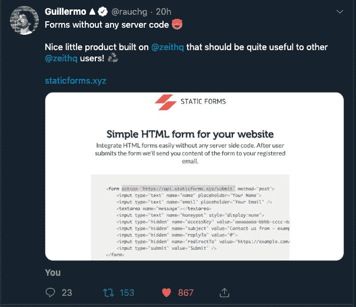
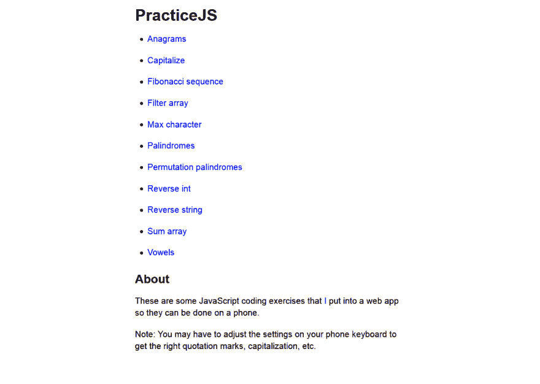
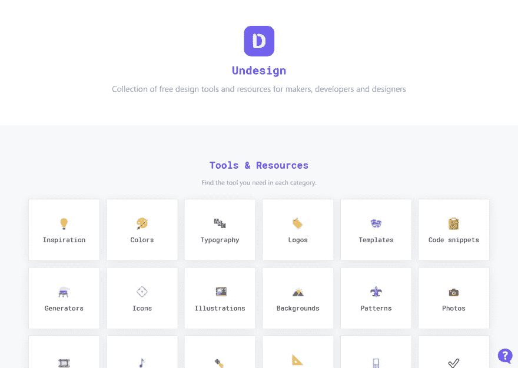
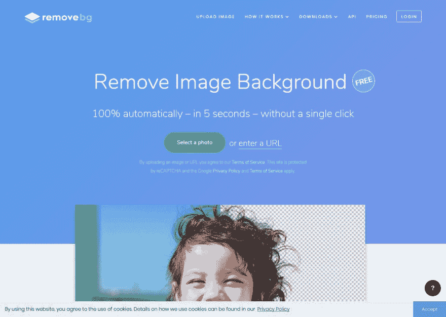
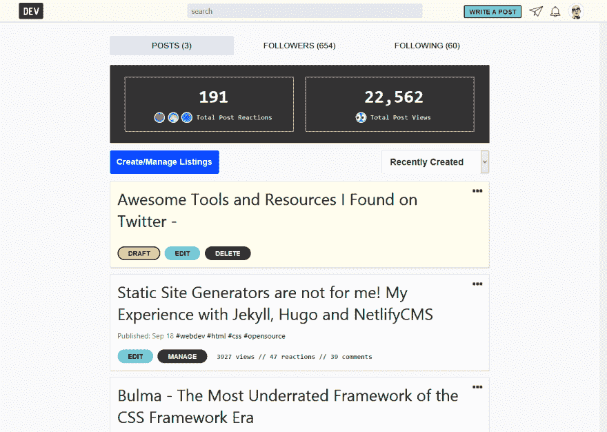

# 我在推特上找到了很棒的工具和资源-

> 原文：<https://dev.to/justaashir/awesome-tools-and-resources-i-found-on-twitter-3am8>

我从 2019 年 6 月开始使用 [Twitter](https://twitter.com/justaashir) ，我发现它非常有用，因为这是保持你在线状态的一种非常简单和高效的方式，我在 Twitter 上花了将近 3 个月，在这里写作之前没有太多粉丝。仅仅是内容的无限滚动，**我在 Twitter 上发现了一些很好的*很棒的*网络技术。**
他们没有任何特定的顺序:

*   [静态表单](https://www.staticforms.xyz/)到
*   [PracticeJs](https://practicejs.com/)
*   [取消设计](https://undesign.learn.uno/)
*   [Remove.bg](https://www.remove.bg/)
*   [开发](https://dev.to)

* * *

### [静态形态](https://www.staticforms.xyz/)

我刚刚在推特上冲浪，我在关注吉列尔莫，他分享了 T4 侯赛因法克鲁丁的 T2 静态表单，然后我试了试，我被这个震惊了，在你的静态网站上很容易建立。然后我研究了一下，读了[隐私政策](https://www.staticforms.xyz/privacy)。它是平的，所以没有隐私问题，现在我被它迷住了。

* * *

### [PracticeJs](https://practicejs.com/)

非常好的在线练习集，由 Duane Hilton 创建，你可能听说过它的名字，它出现在 T2 黑客新闻的主页上。如果你想挑战 Javascript，那就试试吧。

* * *

### [未设计](https://undesign.learn.uno/)

我真的很幸运找到了这个资源，现在这个资源对我真的很有帮助。这是许多类型的设计资源的精选列表。我几乎在这个资源上找到了我设计所需的一切，这个资源是由著名的 [Darkmode.js](https://darkmodejs.learn.uno/) 的创作者[桑多切·阿迪坦恩](https://www.sandoche.com/)制作的。他创造了如此多的项目。

* * *

### [Remove.bg](https://www.remove.bg/)

移除图像背景对我来说很难，在我发现这个之前，我通常在 Photoshop 中做，这改变了我的工作流程，现在我可以轻松地上传文件，一键移除背景，完成！现在就试试。

* * *

### 开发到

我很久以前就想写博客了，但是很难在你的网站上开始写博客，搜索引擎优化问题，然后我在 twitter 上找到了一些关于 Dev 的文章，在 Google 上的搜索排名也很好，所以我尝试了 Dev，这个社区太棒了，难以处理，现在我在这里。

* * *

这就是全部，如果我发现了更多的工具，我会在这里与你分享——在 Twitter 上关注我:[https://twitter.com/justaashir](https://twitter.com/justaashir)