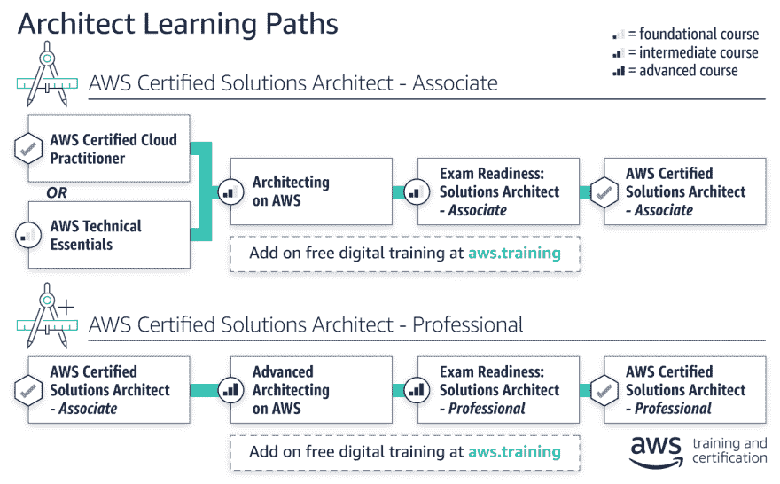

# AWS 认证解决方案架构师:助理学习指南

> 原文：<https://dev.to/dietertroy/aws-certified-solutions-architect-associate-study-guide-38c2>

将我的 [AWS 认证解决方案架构师:专业人员](https://aws.amazon.com/certification/certified-solutions-architect-professional/)安排在 2019 年 9 月下旬，我想我最终会为 [AWS 认证解决方案架构师:助理](https://aws.amazon.com/certification/certified-solutions-architect-associate/)编辑所有笔记和收集的内容。

作为参考，以下是 AWS 认证解决方案架构师的认证学习路径:

一般初步提醒:

*   确保您在考试前有 AWS 的实际操作经验
*   随着 AWS 发布新的服务，下面的内容可能会发生变化。这是我在`December 2018.`年参加考试时的最新数据
*   有些内容是混乱的，我们仍在努力使其组织有序。
*   其中的一部分是从各种渠道收集来的。我把它带来给你，来帮忙！:)

## 基础知识(101)

*AWS 全球基础设施*
*你永远不会被测试数字(例如区域/可用区的数量)*

 *->地域(巴西、欧洲、亚洲等)。每个区域由两个或多个可用区(AZ)组成。不在同一个物理空间(如果发生洪水，其他数据中心仍可响应)
可用性区域- >数据中心*

 **北美地区:*

*   美国东部(北弗吉尼亚)
*   美国东部(俄亥俄州)地区
*   美国西部(俄勒冈州)地区
*   美国西部(北加州)地区
*   AWS 政府云(美国西部地区)
*   加拿大(中部)

*边缘位置* - > CDN(内容分发网络)。他们一直在添加新的，目前已经超过 100 个了。边缘位置比区域多得多。
亚马逊提供的主要服务。基于 2017 年末/2018 年初。

*Route53* : DNS 服务

*EC2* :虚拟机和/或计算

*ECS* :虚拟机+ docker

*弹性豆茎*:部署应用，不用担心基础设施。适合入门用户。

*λ*:无服务器。上传代码，无需配置任何服务器/虚拟机。由亚马逊 Echo 使用

*Lightsail* :开箱云。具有固定配置的虚拟服务器

## 储存

S3:云中的虚拟磁盘。基于对象的存储

冰川:存档-低成本，但访问不是即时的

EFS:弹性文件服务，安装磁盘没有特定的大小，自动(弹性)增长

存储网关:具有 S3 支持的内部虚拟机。

缓存网关:缓存来自驻地 s3 的信息

## 数据库

RDS: Mysql，MariaDB，微软 sql，Oracle，Aurora 等。

DynamoDB:没有关系数据库(NoSQL 数据库)

红移:数据仓库。复制您自己的数据以创建报告

elastic Cache:Cache(可以使用两种技术:redis 或 memcached)

## 迁移

雪球:亚马逊发给你的便携盘，你填好寄回去，他们导入。几种风格(取决于您需要移动多少数据)

DMS:数据库迁移服务:将数据库迁移到 AWS

SMS:服务器迁移服务:将虚拟机迁移到 AWS

## 分析学

雅典娜:在 S3 上运行 SQL 查询。CVS 或 XML。将平面文件转换成数据库

Elastik Map Reduce (EMR):大数据处理。数据量大。在后面使用 HADOP/ Apache Spark

## 搜索

ElasticSearch:使用 Lucene。开放源码

云搜索:完全由 AWS 管理。与 ES 相同的技术

Kinesis:流和分析流数据。大数据

感知分析:社交媒体流

数据管道:将数据从一个地方移动到另一个地方。将 S3 移动到 DynamoDB，反之亦然

Quicksight:分析数据、创建仪表板等。

## 安全和身份

IAM:身份验证、权限等。

检查员:检查虚拟机(状态等)

证书管理器:管理 SSL 证书

目录服务:活动目录管理

WAF(网络应用防火墙):应用网络防御 DDOS，黑客攻击。在网络防火墙之上

工件:符合性文档

## 管理工具

Cloudwatch:获取 VM、CPU、内存等信息。存储不同种类的日志

云的形成:把服务器变成代码。构建整个网络/服务器的模板

云跟踪:审计 AWS 资源

OpWorks:配置管理服务，提供 Chef 和 Puppet 的实例。自动化部署

服务目录:管理组织中的映像(vm)和授权服务器

值得信赖的顾问:自动提示和性能优化。针对问题/安全问题的自动扫描环境

## 应用服务

步骤功能:可视化 app/微服务内部的步骤。无服务器编排

简单工作流服务。促进任务的自动化(工作)和人工化(例如，从仓库中挑选东西)

API 网关:AWS 服务、后端服务或 AWS 中您自己的代码的入口。可以调用 Lambda 函数，例如

AppStream:将桌面应用流式传输给用户

弹性转码器:视频工具。改变格式、调整大小等。

## 开发者工具

代码提交:将代码存储在云中。饭桶

代码构建:按分钟付费，在不同环境下编译代码

代码部署:将代码部署到 EC2。自动建筑等。

代码管道:跟踪不同环境之间的代码差异，构建管道(例如，提交代码时触发编译，运行单元测试等)

## 人工智能

Polly:将文本转换成 Mp3 服务

机器学习:数据集，分析数据，预测

图像识别和处理

## 消息传递

SNS:简单的通知服务-警报系统，通过短信，HTTP 端点，电子邮件等。

SQS:简单队列服务:消息队列

简单电子邮件服务:SMPT

API 网关

*   在设定的时间段(TTL)内缓存来自端点的响应
*   缓存可以加密，可以刷新，您可以定义大小
*   您不能重新生成缓存
*   低成本、高效
*   轻松扩展
*   抑制请求以防止攻击
*   连接到 CloudWatch 以记录请求和故障排除
*   包含默认 DDOS 保护

跨产地资源共享(CORS)

*   另一端的服务器可以放宽同源策略
*   允许网页上的受限资源来自另一个域的机制

## AWS CLI

配置 AWS 的命令行

您不使用控制台用户和密码，而是使用添加 IAM 用户
时提供的安全和访问密钥。如果您丢失了这些值，您必须重新生成它们，只有在添加用户后才会显示。AWS 配置

配置资源的详细视图

*   使用所需设置评估配置
*   获取 AWS 帐户中当前配置的快照
*   检索历史配置
*   创建、修改或删除资源时接收通知
*   查看资源之间的关系计算 EC2 -弹性计算云，AWS Lightsail 中的虚拟/专用机器-虚拟专用服务器，带 SSH/RDP 访问的固定 IP 的哑服务器未充分利用 AWS 服务弹性容器服务-大规模运行和管理 docker 容器 Lambda -代码上传到云，您可以控制它何时执行(无需担心下面的机器)批处理-用于云中的批处理计算弹性 Beanstalk -开发人员可以上传应用程序，AWS 可以自动配置

## 储存

S3 -简单存储服务，基于对象的存储。文件上传到 AWS 存储桶
EFS -弹性文件系统，网络连接存储(NFS)
Glacier -数据归档，用于不常访问的数据，价格便宜
雪球-将大量数据引入 AWS 的方式，物理雪球被发送到数据中心，然后发送到 AWS，AWS 在那里为您导入存储网关
虚拟设备，您在办公室安装的虚拟机，数据被复制回亚马逊

## 数据库

RDS -关系数据库服务(MySQL、MSSQL、PostgreSQL、Aurora、Oracle 等。)
dynamo db——非关系数据库(Redis 等。)
elastic cache-缓存来自数据库服务器的常用查询的东西(前 10 名产品等。)
红移——数据仓库/商业智能、复杂查询(做 P & L 分析、时间密集型查询等。)

## 迁移

*   AWS 迁移中心-在应用程序迁移到 AWS 应用程序发现服务(ADS)时跟踪应用程序的跟踪服务-检测应用程序类型和相关依赖关系数据库的自动化工具
    *   迁移服务(DMS) -将数据库从内部迁移到 AWS 服务器的简单方法迁移服务-将虚拟/物理服务器迁移到 AWS 云的简单方法滚雪球-与存储类似，这有助于将大量数据迁移到云中

## 联网&内容交付

*   VPC(虚拟私有云)-基本上是一个虚拟数据中心(配置防火墙、AZ、地址范围、网络 ACL、根表等)。).*需要明白这个里里外外才能过关！*
    *   CloudFront——亚马逊的内容交付网络，通过存储接近用户的内容，向用户交付媒体资产(视频文件、音频文件等)
*   Route53 -亚马逊的 DNS 服务
    *   API Gateway——Amazon 为服务创建 API 的方式
    *   直连——亚马逊将专线从您的企业接入 AWS 的方式

## 开发者工具

*   CodeStar -面向开发人员的代码项目管理
*   CodeCommit -存储代码(源代码控制)的地方，私有 git 存储库
*   code build——编译、测试代码并构建准备部署的包
*   code deploy——将应用程序部署到 EC2、Lambda 内部的部署服务
*   代码管道——软件发布的建模/可视化/自动化步骤的持续交付
*   x 射线-用于通过显示跟踪来调试/分析无服务器应用程序
*   在 AWS 控制台内部开发代码的 Cloud9 - IDE 环境

## 管理工具

*   CloudWatch -监控服务，SysOps Admin 考试必备知识
*   cloud formation——在 AWS 中部署服务器/服务的自动化方式，使部署在任何地方都更快
*   CloudTrail——AWS 中发生的一切都被记录在 cloud trail 中，便于跟踪您环境中发生的事情
*   配置-监控整个 AWS 环境的配置，并保存整个 AWS 环境的快照(可视化 AWS 环境)
*   ops works——类似于 elastic beanstalk，用于自动配置环境(在 Sysops Admin 测试中介绍)
*   服务目录——在 AWS 中管理 IT 批准的服务目录的方式。通常用于大型组织的治理/法规遵从性
*   系统经理——管理 AWS 资源(例如，EC2 补丁维护)。资源可以按部门或应用程序分组
*   值得信赖的顾问-将在许多不同领域提供建议。请务必了解可信顾问和检查员管理服务之间的区别——Amazon 将负责 EC2，自动扩展

## 媒体服务

*弹性转码器*

*   MediaConvert -具有广播级功能的基于文件的视频转码
*   媒体直播-广播级直播视频处理服务(视频流)
*   MediaPackage -准备和保护通过互联网传送的视频
*   MediaStore -存储媒体的地方(针对媒体优化的存储)
*   media tailor——允许在视频流中做有针对性的广告，而不牺牲广播质量

## 机器学习

*   sage maker——让开发人员在为他们的环境编写代码时更容易使用深度学习——围绕数据的情感分析
*   DeepLens -人工感知相机(可以理解它在看什么-本地化检测，不在云物理硬件中运行)
*   Lex - Powers 亚马逊 Alexa 服务，人工智能机器学习-不同于深度学习，入门级。AWS 将分析数据集并预测结果
*   Polly -获取文本并转换成 speach
*   上传一个文件，它会做文件分析(上传海滩上狗的照片，它会告诉你“狗”，“海滩”，等等。)
*   亚马逊翻译-机器翻译服务，类似谷歌翻译，但来自亚马逊
*   亚马逊转录-用于那些听力困难的人-获取音频并创建文本

## 分析学

*   Athena -对 S3 存储桶中的项目运行 SQL 查询(无服务器)
*   EMR - Elastic Map Reduce，用于处理大量数据 cloud Search-Search Service for AWS Elastic Search Service-Elastic Search Service for AWS
*   Kinesis -将大量数据摄取到 AWS(即特定标签的社交媒体源)Kinesis 视频流中的方法-允许您摄取大量关于人们流媒体的数据 QuickSight - BI 工具，比竞争对手便宜得多
*   数据管道——在不同 AWS 服务之间移动数据的方式
*   Glue——用于 ETL(提取、转换、加载), glue 被优化来实现这一点

## 安全&身份&合规

*   IAM -身份访问管理认知-进行设备身份验证的方式(双因素身份验证)保护职责-监控 AWS 帐户上的恶意活动
*   安装在 EC2 实例上的检查代理，对其运行测试以检查漏洞——这些可以是预定的 Macie——扫描 S3 桶中的任何个人身份信息(PII)并向您发出警报
*   证书管理器-通过 Route53 注册的免费 SSL 证书
*   CloudHSM - Cloud 硬件安全模块，用于存储您的私有/公共密钥或其他密钥的专用硬件，也可以使用密钥来加密 AWS 上的对象
*   目录服务-将微软活动目录与 AWS 相结合
*   WAF - Web 应用防火墙(7 层防火墙)，监控应用层
*   Shield - DDoS 缓解神器-用于审计和合规，下载审计和合规报告

## 移动服务

*   移动中心-移动服务管理控制台
*   提高移动参与度的精准推送通知
*   AWS AppSync -自动更新 web/移动应用程序中的数据，并将在离线用户重新连接时更新他们的数据
*   设备农场——在真实、实时的设备上测试应用
*   移动分析-移动设备的分析服务

## AR/VR

苏美尔语-用于 AR/VR 3D 应用程序设计

## 应用集成

*   step Functions——管理 lambda 函数的方法和遍历它的步骤
*   Amazon MQ——消息队列(像 RabbitMQ)
*   SNS -触发时的通知服务
*   SQS——解耦内部结构、接收消息并允许 EC2 实例轮询数据的方式
*   SWF -创建一个工作流来模仿你所拥有的过程

## 客户参与度

Amazon Connect -联系中心即服务(CCaaS)
* * *简单的电子邮件服务-发送大量电子邮件的简便方法

## 商业生产力

*   Alexa 的商业-使用拨入房间，通知它的问题-在工作场所
*   亚马逊钟声-亚马逊视频会议
*   工作文档——如用于 AWS 的 Dropbox
*   面向亚马逊的类似工作邮件的 O365/Gmail

## 桌面& App 流媒体

*   工作区-可在云中访问的 VDI (Virdual Desktop)
*   AppStream 2.0 -将应用实时传输到设备(如 Citrix)

## 物联网

物联网-可以让设备发送回信息
物联网设备管理-用于管理 AWS 物联网设备
亚马逊 FreeRTOS -亚马逊的实时操作系统
Greengrass -以安全的方式运行本地计算服务的软件

## 游戏开发

GameLift -帮助开发 AWS 共享责任游戏服务的服务:

AWS 负责:

*   碱基超视觉
*   区域
*   网络
*   地区
*   RDS 数据库中的操作系统和补丁
*   等等

您负责:

*   加密
*   EC2 实例中的操作系统
*   防火墙
*   客户数据
*   等等。

## AWS 可信顾问

向现有 AWS 客户学习的应用程序
检查 AWS 环境并提出以下建议

*   省钱
*   提高性能
*   关闭安全漏洞

快速部署、监控和扩展应用程序
高度抽象关注基础架构
简化基础架构管理，使用 GUI 进行配置。适合 AWS 经验不多的人
*在后台使用 CloudFormation。*
可用于工人/岗位

预配置的实例支持:

*   NodeJS，Python，PHP，Ruby，Tomcat，。NET (Win IIS)，JAva，Go，Packet
*   Docker 图像
*   通用码头工人

您的应用程序可以有多个版本
可以分为多个层(Web /应用程序/数据库层/前端/后端等)
您可以在创建后更新配置

更新可以是

*   一次一个实例
*   实例的百分比
*   不可变(再次从 0 启动所有应用)

如果 Beanstalk 创建了您的 RDS，当您删除 EBS 实例时，将会被删除

云的业务优势

*   前期基础设施投资几乎为零
*   即时基础设施
*   更有效的资源利用
*   基于使用的构成
*   缩短上市时间

云的技术优势

*   自动化(可脚本化的基础设施)
*   自动缩放
*   主动扩展
*   更高效的开发生命周期
*   改进的可测试性
*   灾难恢复和业务连续性
*   将流量“溢出”到云结构

允许将硬件转换为代码
创建/管理 AWS 资源的简单方法
可以将版本控制应用于 AWS 基础架构(如代码)

模板->图表

堆栈->图表的结果

格式:JSON 或 YAML

模板元素:

*   必填:AWS 资源列表
*   可选:
    *   版本，文件格式
    *   模板参数(最多 60 个)
*   输出
    *   公共 IP、ELB 地址(最多 60 个)

命名

*   您可以分配本地名称，在创建资源时会部分使用这些名称。
*   名称不是固定的/强制的，以避免冲突。存在一些例外(即存储桶名称)。

您可以使用一组引导脚本来安装软件。

包括与厨师和木偶的集成

支持标记，EBS 卷会被自动标记

调配后，您就可以控制资源了

*   默认情况下，错误时自动回滚是打开的(如果发生错误，所有内容都会被删除)。请记住，您需要为错误付费，但是使用
*   云的形成是免费的
*   堆栈可以等待应用程序使用 WaitCondition Route53 进行配置
*   还支持 IAM 角色创建
*   可以为资源定义删除策略，当您删除堆栈时，资源不会被删除
*   最多 200 叠，可以要求更多

如果你想对 Cloudtrail/Cloudwatch 隐藏一些东西，用`NOECHO`标记参数

*与弹性豆茎的区别？*

*   CloudFormation 和 Elasticbeanstalk 相互补充 beanstalk 在云中部署和运行应用程序，与开发工具集成，管理应用程序的生命周期 CloudFormation 是一种配置 AWS 资源的机制，是构建整个基础架构(包括 Beanstalk 应用程序)的模板

# 内容分发网络(CDN)

边缘位置-内容将被缓存的位置；分离到 AWS 区域/AZ

*   Origin——CDN 将分发的所有文件的来源。这可以是 S3 桶、EC2 实例、弹性负载平衡器或 Route53，也可以不使用 AWS
*   Web 分发-通常用于网站
*   RTMP -用于媒体流(adobe flash)
*   边缘位置不仅仅是只读的，你也可以写入它们
*   对象在 TTL 生命周期内被缓存-默认值:24 小时-最大值:365 天
*   你可以清除云上的物体，但是你需要付费
*   限制查看者访问-签名的 URLs 签名的 Cookies
*   地理限制

Cloudtrail 用于记录 AWS 内部进行的所有 API 调用，主要用于审计

因为您通过控制台更改的所有设置实际上都是对内部 AWS API 的 API 调用，所以如果您启用 Cloudtrail，您可以获得通过控制台或特定 API 调用所做的所有事情的所有信息。

您可以为您的 AWS 帐户打开所有地区的线索。Cloudtrail 会将所有地区的日志文件交付到 S3 存储桶和您指定的可选 Cloudwatch 日志组。

*   标准监控= 5 分钟
*   详细监控= 1 分钟

想要*详细监控*就要付费

在 Cloudwatch 中，您可以

*   创建仪表板
*   创建警报
*   创建事件(例如 AWS 资源的状态变化)日志(聚集、监控和存储日志)Aurora
*   MySQL 兼容
*   结合了高端商业数据库的速度和可用性
*   具有开源数据库的简单性和成本效益
*   性能比 MySQL 高五倍，价格是商业数据库的十分之一
*   存储容量从 10GB 开始，以 10GB 为增量扩展至 64TB
*   计算可扩展至 32 个 vCPU 和 244GB 内存
*   每个 AZ 中有 2 份数据副本，最少 3 份
*   旨在透明地处理 2 个拷贝的丢失，而不影响数据库写入可用性
*   旨在透明地处理 3 个拷贝的丢失，而不影响读取可用性
*   自愈；持续扫描数据块/磁盘以发现错误并自动修复

*极光复制品特征*

*   极光复制品
    *   15 个 MySQL 读取副本
    *   5DynamoDB
*   NoSQL 数据库可在任何规模下实现一致的个位数毫秒级延迟
*   存储在固态硬盘上
*   分布在 3 个地理位置不同的数据中心
*   最终一致读取
    *   数据的所有拷贝在一秒钟内完全一致。短时间后重复读取将返回更新的数据(最佳读取性能)
*   强一致性读取
    *   返回反映在读取之前收到成功响应的所有写入的结果
*   支持自动调用(%目标利用率，最小值/最大值)

*DynamoDB 定价*

*   调配的吞吐量容量
    *   每 10 个单位的写入吞吐量为每小时 0.0065 美元
    *   每 50 个单位的读取吞吐量为每小时 0.0065 美元
*   存储成本
    *   前 25 GB ->免费
    *   每月 0.25GB
*   自由层:25 个读取单位/ 25 个写入单位

*DynamoDB 流*

*   24 小时内捕获对 DynamoDB 的更改。审计跟踪(添加、更改(之前和之后)、删除)。如果您想存储数据超过 24 小时，请使用 LAMBDA

每个带有属性的物品的最大尺寸:`400KB`
BatchWriteItem:`25 items, 16MB`
BatchGetItem:`100 items, 16MB`

scan:
finally or consistency，add parameter consistent read
Iterator:返回 1MB 和 LastEvaluatedKey(分页)

数据类型:
数字、字符串、二进制、布尔、NULL
JSON:存储为文档，可以创建键并按属性过滤，可以更新子元素，可以使用文档 SDK 作为包装器(JS)

索引:
全局二级索引:
每个表最多可添加`5`
本地二级索引
每个表最多可添加`5`，创建时(以后不能添加)
`10GB`每个分区

# 安全

精细的访问控制允许 IAM 中的用户访问/拒绝信息(表、项目甚至属性)

预留容量可以折扣价购买。局限于单个地区。

支持触发器(使用 DynamoDB w/Lambda)

可以在表上指定 TTL。需要有时间戳

DAX:在内存缓存中(在 SDK Node.js & Java 中)ElastiCache

*   Memcached
    *   不支持多 AZ
*   雷迪斯
    *   多 AZ 支持

当被问及使用哪种服务来减轻数据库的压力/负载时:

*   如果数据库的读取量很大，并且不容易频繁更改，那么 Elasticache 是一个不错的选择
*   如果数据库承受压力的原因是因为管理人员一直在自动备份上运行 OLAP 事务，那么红移是一个好方法
*   允许您将数据库恢复到保留期(1-35 天)内的任意时间点
*   拍摄完整的每日快照
*   存储事务日志
*   默认启用
*   存储在 S3，免费等于数据库的大小
*   删除 RDS 实例时删除

*快照*

*   数据库快照是手动完成的(即使在删除 RDS 实例后仍会存储)

*恢复备份*

*   使用任一还原选项时，数据库的还原版本将是具有新 DNS 端点的新 RDS 实例

*加密*

*   使用 AWS 密钥管理服务完成(KMS)
*   目前不支持加密现有 RDS

*多 AZ RDS*

*   仅用于灾难恢复(DR)
*   有效性
    *   SQL Server
    *   神谕
    *   MySQL 服务器
    *   一种数据库系统
    *   MariaDB

**读取副本**

*   用于缩放，而非灾难恢复
*   必须打开自动备份才能部署读取复制副本
*   您可以拥有任何数据库的多达 5 个读取副本
*   允许您拥有数据库的只读副本
*   使用异步复制实现
*   用于性能提升、读取密集型数据库工作负载
*   每个读取副本都有自己的 DNS 端点
*   您可以读取具有多 AZ 的副本
*   您可以创建多 AZ 源数据库的读取副本
*   读取副本可以提升为它们自己的数据库(中断复制)
*   你可以在另一个区域读取副本红移
*   数据库
*   列数据。协议

*   单节点(160GB)

*   多节点

    *   领导者节点，管理客户端连接并接收查询
    *   计算节点、存储数据并执行查询和计算
    *   多达 128 个计算节点
*   柱状数据存储

*   大规模并行处理(MPP)——跨所有节点自动分配数据和查询负载

*   目前仅在一个州提供

*   在停机时可以将快照恢复到新的 AZ

**费用**

*   计算机节点小时数
*   支持
*   数据传输(在 VPC 内部，而不是外部)

**加密**

*   使用 SSL 在传输中加密
*   使用 AES-256 进行静态加密
*   红移负责密钥管理

**可用性:**

*   单一 AZ
*   可以将快照恢复到其他 AZ
*   为恢复启用跨区域快照

**VPC:**
为 VPC 端点打开增强型 VPC 路由(这样数据就不会离开你自己的 VPC)AWS 数据库类型
最大大小:16 TB。如果更大，考虑红移

**RDS - OTLP(在线交易处理)**

*   SQL Server
*   神谕
*   关系型数据库
*   一种数据库系统
*   亚马逊极光
*   MariaDB
    *   DynamoDB
    *   红移 OLAP(在线分析处理、数据仓库)
    *   弹性缓存

**非关系数据库结构**

*   数据库ˌ资料库
    *   集合(表格)
        *   文档(行)
        *   键/值对(字段)

**数据仓库**

*   用于商业智能(Cognos，Jaspersoft 等。)
*   OLTP 与 OLAP - OLTP(在线事务处理)-订单号 2120121 -提取一行数据(名称、日期、地址、状态)- OLAP(在线分析处理，用于数据仓库)-提取大量记录-使用不同类型的数据库和基础架构

**弹性缓存**

*   Web 服务使得在云中部署、操作和扩展内存缓存变得容易
*   类型
    *   Memcached
    *   雷迪斯

汇总
数据库类型

*   RDS (OLTP)
    *   结构化查询语言
    *   关系型数据库
    *   一种数据库系统
    *   神谕
    *   奥罗拉
    *   MariaDB
*   DynamoDB (NoSQL)
*   红移(OLAP)
*   弹性缓存(内存中)
    *   Memcached
    *   雷迪斯

**多 AZ**

*   用于灾难恢复
*   不用于性能提升

**读取副本**

*   用于扩展、性能提升
*   您最多可以有 5 个读取副本
*   您可以拥有副本的副本(更高的延迟)
*   可以在不同的地区

**极光标度**

*   每个 AZ 2 份数据，最少 3 份(共 6 份)
*   旨在透明地处理损失
*   自我修复存储

**极光复制品**

*   多达 15 个副本

**MySQL 副本**

*   最多 5 个副本

**DynamoDB vs RDS**

*   DynamoDB 提供“按钮”缩放
*   RDS 需要更大的实例大小或添加读取副本

**DynamoDB**

*   存储在固态硬盘上
*   分布在 3 个地理位置不同的数据中心
*   类型
    *   最终一致读取(默认)
    *   强一致性读取

**红移配置**

*   单节点(160GB)
*   多节点
    *   领导者节点(管理客户端连接)
    *   计算节点(存储数据，执行查询，最多 128 个节点)

**弹性缓存**

*   Memcached
    *   多 AZ 不可用
*   雷迪斯
    *   多 AZ 可用

**两种类型的备份:**

*   自动->保留期:1 至 35 天
*   存储在 S3 的数据库快照。删除 RDS 实例时不会删除

静态加密:KMS。无法在现有数据库上启用加密。必须执行拷贝并对恢复的拷贝启用加密。
SOA 记录存储:

*   为区域提供数据的服务器的名称
*   区域管理员
*   数据文件的当前版本
*   辅助名称服务器在检查更新之前应该等待的秒数
*   在重试失败的区域转移之前，辅助名称服务器应该等待的秒数
*   在数据必须刷新或过期之前，辅助名称服务器可以使用数据的最大秒数
*   资源记录中生存时间(TTL)文件的默认秒数

**NS 记录(名称服务器记录)**

*   由顶级域服务器用来将流量定向到包含权威 DNS 记录的内容 DNS 服务器

**一条记录(地址记录)**

*   用于将域名转换为 IP 地址

**TTL 记录(生存时间记录)**

*   记录在解析服务器或用户本地 PC 上缓存的长度

**CName 记录(规范名称记录)**

*   可用于将一个域名解析为另一个域名

**别名记录**

*   与 CName record 类似，您可以将一个 DNS 名称映射到另一个名称
*   CName 不能用于裸域名，不能有 CName 用于 violetfamily.com，它必须是一个记录或别名

**EBS Vs 实例商店**

*   所有 AMI 都被归类为由 Amazon EBS 支持或由实例商店支持
*   EBS 卷:-从 AMI 启动的实例的根设备是从 Amazon EBS 快照创建的 Amazon EBS 卷
*   实例存储卷:-从 AMI 启动的实例的根设备是从存储在亚马逊 S3 中的模板创建的实例存储卷-有时称为临时存储-如果主机出现故障，您会丢失数据
*   只能停止 EBS 支持的实例
*   两种类型的实例都可以重新启动
*   默认情况下，根卷将在终止时被删除，但是对于 EBS 卷，您可以告诉 AWS 保持根设备卷自动调用

在自动呼叫组上启动配置->选择 AMI
不能更改 AMI ID，它是在创建时选择的

宽限期:实例预热的时间。威尔会在这段时间后开始检查。

您可以在中找到与自动缩放相关的加载日志

*   云观察(指标)
*   访问日志
*   请求跟踪
*   云轨迹日志

如何注册 LB 群？

*   实例 Id
*   实例的 IP 地址

扩展服务器的 3 种方式

*   手动缩放
*   动态扩展-在目标跟踪扩展中，您选择一个指标并设置一个目标值，EC2 自动调用设置 Cloudwatch 警报以根据您设置的指标(或尽可能接近的指标)触发扩展-分步扩展允许您“逐步增加”服务器的数量(即，添加 2 个、再添加 2 个、再添加 2 个等)，具体取决于警报突破-简单的扩展基于单个扩展调整增加了组的当前容量。如果可以的话，即使只有一个指标，也要使用步长。
*   计划的扩展——您可以预测负载的变化以及它需要运行多长时间(例如，在周一到周五上午 9 点到下午 12 点之间再添加 2 台服务器)

**卷&快照**

*   卷存在于 EBS 虚拟硬盘上
*   快照存在于 S3
*   快照是卷的时间点副本
*   快照是增量数据块，即自保存最新快照以来发生更改的数据块

**根设备卷的快照**

*   可以从卷和快照创建 AMI
*   可以动态更改卷大小，包括大小和存储类型。如果您即时更改卷，您必须等待 6 个小时才能再次更改。无法更改磁盘标准硬盘的卷类型
*   卷必须位于与 EC2 实例相同的 AZ 中
*   如果您需要将 EBS 卷恢复/移动到另一个 AZ，您需要创建该卷的快照，并在另一个 AZ 中基于该快照创建一个新卷

**加密**

*   要加密根卷，您需要首先创建引导磁盘的 AMI 映像，或者使用第三方软件进行加密

**卷与快照-安全性**

*   加密卷的快照会自动加密
*   从加密快照恢复的卷会自动加密
*   您只能共享未加密的快照，快照可以与其他 AWS 帐户共享或公开

默认选项是在实例终止时删除卷。可以在 EC2 设置中关闭

EBS 卷只能按比例增加；无法缩小大小
弹性文件系统(EFS)-EC2 实例的文件存储服务。

*   支持 NFSv4
*   只需为使用的存储付费
*   可以扩展到 Pb
*   支持数千个并发 NFS 连接
*   多个 EC2 可以指向同一个 EFS
*   数据存储在一个区域内的多个 AZ 中。
*   写后读一致性
*   可以将权限限制在文件级或目录级
*   不能以 VPC 的倍数挂载 EFS；一次只能一个
*   使用端口 2049 (NFS) -文件系统和 VPC 必须在同一地区
*   两种类型:-通用:低延迟-最大 IO:较高延迟，但对大数据应用程序负载平衡器有用
*   最适合负载平衡 http 和 https 流量
*   在第 7 层运行
*   应用感知

**网络负载平衡器**

*   最适合负载平衡 TCP 流量
*   在第 4 层运行
*   每秒可处理数百万个请求，延迟低

**经典负载平衡器**

*   传统弹性负载平衡器
*   负载平衡 HTTP/https
*   在第 7 层运行
*   可以使用严格的第 4 层负载平衡
*   如果应用程序停止响应，ELB 用 504 进行响应
*   X-Forwarded-For 头可以传递用户的公共 IP 地址

***负载均衡器不响应吗？*T3】**

*   面向 Internet 的负载平衡器连接到专用子网(应该在公共子网中)
*   安全组 ACL 不允许流量放置组:
*   只有特定类型的实例可以在放置组中启动(计算、GPU、内存、存储)
*   AWS 推荐同构实例
*   无法合并位置组
*   无法将现有实例移动到放置组中
*   可以从实例创建 AMI，并将其放入放置组

**集群放置组:**

*   单个 AZ 中的实例分组。建议用于需要低网络延迟和/或高网络吞吐量的应用程序
*   不能分散多个 AZ

**跨页放置组:**

*   一组实例，每个实例位于不同的底层硬件上。建议用于具有少量应相互隔离的关键实例的应用程序
*   可以跨越多个 AZExam 音符
*   安全组更新会立即应用
*   安全组是有状态的(添加入站规则会自动添加出站规则)
*   默认情况下，会阻止所有入站流量
*   允许所有出站流量
*   安全组中任意数量的 EC2 实例
*   一个实例可以附加多个安全组
*   安全组是有状态的，而网络访问控制列表是无状态的
*   无法使用安全组阻止特定的 IP 地址
*   您可以指定允许规则，但不能拒绝 rulesEC2 - web 服务，该服务在云中提供可调整大小的计算能力

**按需**

*   对于需要低成本和灵活性的用户
*   具有短期、峰值、不可预测工作负载的应用程序
*   EC2 的初始测试

**保留实例**

*   使用稳定或可预测的应用
*   需要预留容量的应用程序
*   用户可以预先付款以降低总成本
*   标准保留实例-高达 75%的按需成本折扣
*   可转换的保留实例——高达 54%的按需成本折扣——能够更改保留实例的属性，只要交换导致创建相等或更大价值的保留实例
*   预定的保留实例—可在您预定的时间窗口内启动—允许您将容量保留与可预测的重复计划相匹配

**斑点实例**

*   灵活的开始和结束时间
*   只有在非常低计算机价格下才可行
*   迫切需要大量额外计算能力的用户

**专用主机**

*   适用于可能不支持多租户虚拟化的法规要求
*   对于不支持云部署的许可非常有用
*   可以按需购买
*   可作为预订购买，最高可享受点播价格 70%的折扣

*实例类型*
`F` - FPGA(现场可编程门阵列)
`I` - IOPS
`G` -显卡
`H` -高磁盘吞吐量
`T` -廉价通用(想 T3 微)
`D` -密度
`R` - RAM
`M` -通用应用的主要选择
`C` -计算
`P` -显卡(想 Pics)
`X` -极致内存

**EBS -弹性块存储**

*   将块存储附加到 EC2 实例
*   放置在特定的 AZ 中，自动复制以保护您免受单个组件故障的影响
*   如果 windows/linux 安装在磁盘上，它被称为“根设备卷”
*   无法在多个 EC2 实例上装载 1 个 EBS 卷。用 EFS 代替

**EBS 卷类型**

*   通用固态硬盘(GP2) -通用，性价比平衡- 3 IOPS/GB 高达 10，000 IOPS，对于 3334GB+ -小于 500 MiB/s 的卷，可长时间猝发高达 3，000 IOPS
*   调配的 IOPS SDD(IO1)—专为 IO 密集型应用程序或 NoSQL 数据库设计—在需要超过 10，000 个 IOPS 时使用—可调配高达 20，000 个 IOPS/卷—超过 500 MiB/s
*   吞吐量优化硬盘(ST1) -大数据-数据仓库-日志处理-无法启动卷
*   冷硬盘(SC1) -成本最低、不常访问的存储设备-通常是文件服务器
*   磁性(标准)—所有可启动卷的每 GB 成本最低—从这里开始开发，当您准备好时再继续

**实例元数据**

*   [http://169 . 254 . 169 . 254/最新/元数据/](http://169.254.169.254/latest/meta-data/)

**状态检查:**

*   系统状态检查:底层(TCP 等，查看实例是否接收网络包)
*   实例状态检查:软件和网络

终止保护被 defaultECS(弹性容器服务)关闭

*   弹性集装箱服务
*   弹性容器注册
*   任务定义:蓝图
*   服务:启动和维护任务定义的副本
*   集群:任务运行的地方。运行 ECS 服务的一组容器
*   任务:任务定义的实例

**ECS 集群**

*   容器实例\ -任务服务/-任务
*   容器实例/ -任务

## 万英尺纵览

了解 EC2 定价模式

*   按需-按秒或小时付费
*   储备-储备容量，合同期限为 12-36 个月
*   现货-设置一个投标价格，如果现货价格符合您的出价，它将被提供-当现货价格超出范围时终止实例-如果 AWS 终止实例，将不会收费，但如果您终止它，将会收费
*   专用主机—在许可或多租户存在问题时使用

**了解 EC2 实例类型**

*   (`FIGHT DR MCPX`)

**了解 EBS**

*   存储类型-固态硬盘，通用 GP2(高达 10，000 IOPS，低于 500 兆字节/秒)-固态硬盘，配置 IOPS IO1(超过 10，000 IOPS，超过 500 兆字节/秒)-硬盘，吞吐量优化 ST1(频繁访问的工作负载)-硬盘，磁性标准(便宜，不常访问的存储)
*   无法将 EBS 卷装入多个 EC2 实例；用 EFS 代替
*   默认情况下，终止保护是关闭的，您必须将其打开
*   在 EBS 支持的实例上，默认操作是在实例终止时删除根 EBS 卷
*   默认 AMI 的 EBS 根卷无法加密(但是可以使用第三方工具进行加密)
*   EBS 卷也可以拷贝，然后在那时加密
*   可以加密其他卷

**了解卷与快照**

*   卷存在于 EBS 上，即云中的虚拟硬盘
*   快照存在于 S3
*   您可以拍摄卷的快照，该快照将存储在 S3 上
*   快照是卷的时间点副本
*   快照是增量的
*   第一个快照需要一些时间
*   安全性-加密卷的快照会自动加密-从加密快照恢复的卷会自动加密-快照可以共享，但前提是它们没有加密
*   根设备卷的快照-在拍摄根卷的快照之前停止实例
*   EBS 与实例存储(临时存储)-实例存储卷无法停止-如果实例存储中的底层主机出现故障，您将丢失数据- EBS 可以停止-两者都可以重新启动，您不会丢失数据-两者都将在终止时删除，但 EBS 提供了保留选项
*   拍摄 RAID 阵列快照—冻结文件系统—卸载 RAID 阵列—关闭 EC2 实例

**认识亚马逊机器图像(AMI)**

*   区域，但可以复制到其他区域

**知云观察(监控)**

*   标准(5 分钟)
*   详细(1 分钟)
*   CloudWatch 用于性能监控
*   与用于审计 AWS 的 CloudTrail 不同
*   仪表盘
*   警告
*   事件
*   日志

**了解角色**

*   比在实例上存储访问密钥和秘密访问密钥更安全
*   更易于管理
*   可以在配置后分配给 EC2 实例
*   区域通用

**知道实例元数据**

*   用于获取有关实例的信息
*   curl[http://169 . 254 . 169 . 254/最新/元数据/](http://169.254.169.254/latest/meta-data/)
*   curl[http://169 . 254 . 169 . 254/latest/user-data/](http://169.254.169.254/latest/user-data/)

**了解 EFS 的特点**

*   支持 NFSv4.1 协议
*   只需为使用的存储付费
*   可以扩展到 Pb
*   可以支持数千个并发 NFS 连接
*   跨多个 AZ 存储的数据
*   写后读一致性

**知道λ**

*   事件驱动计算服务
*   计算服务，运行代码以响应请求

**了解放置组(如果没有提到，假设聚类是隐含的)**

*   集群放置组—始终在一个 AZ 中，用于大数据(低延迟、高吞吐量)
*   分散放置组-独立硬件上的重要 EC2 实例

**了解弹性容器服务(ECS)**

S3 考试小贴士

*   S3 是基于对象的
*   文件可以是 0B 到 5TB
*   无限存储
*   文件存储在桶中
*   通用命名空间，名称必须唯一
*   新对象 put 的写后读一致性—能够立即读取对象
*   覆盖、放置和删除的最终一致性(传播需要时间)-如果您更新对象，然后尝试读取，您可能会得到旧对象
*   写入 S3 会返回 HTTP200，表示写入成功
*   启用多部分上传时，加载文件会更快

**Route53 考试提示**

*   您只能通过转到 ELB 的 DNS 名称来解析它
*   ELB 从来没有 IPv4 地址，只有 DNS 名称
*   理解别名记录和 CName 记录之间的区别
*   如果可以选择，请始终选择别名记录而不是 CName 记录
*   了解路由策略及其使用案例

**VPC 考试小贴士**

*   将 VPC 视为 AWS 中的逻辑数据中心
*   包括 IGW(或虚拟专用网关)、路由表、NACL、子网、安全组
*   1 个子网= 1 个 AZ
*   安全组是有状态的；NACL 人是无国籍的
*   无传递对等
*   如果您需要从另一个 AWS 帐户访问资源，您需要在两个帐户之间执行 VPC 对等。

**负载平衡器提示**

*   3 种类型的负载平衡器-应用负载平衡器(第 7 层)-网络负载平衡器(第 4 层)-传统负载平衡器(第 7 层和第 4 层)
*   504 表示网关超时。这意味着应用程序在空闲超时时间内没有响应。-排除故障。是 web 服务器还是数据库服务器？
*   如果您需要最终用户的 IPv4 地址，请查找 X-Forwarded-For 标头
*   ELB 监控的实例被报告为正在使用或停止使用
*   通过与实例对话来检查实例的运行状况
*   ELB 有自己的 DNS 名称
*   阅读常见问题

**考试提示**

*   ELB 没有预定义的 IPv4 地址，必须使用 DNS 名称进行解析
*   理解别名记录和 CName 记录的区别
*   如果有选择，请始终选择别名记录而不是 CNameRoles 不绑定到特定区域(用户也不绑定)可以将角色应用到正在运行的实例如果您将角色应用到实例，则无需配置访问密钥/密钥来获得使用 AWS 服务的权限(即访问专用 S3 存储桶)->更安全的身份访问管理(IAM) -允许您管理用户及其对 AWS 控制台的访问级别。
*   AWS 帐户的集中控制
*   对 AWS 帐户的共享访问
*   粒度权限
*   识别联盟(广告、FB、LinkedIn 等。)
*   多因素认证
*   为用户/设备/服务提供临时访问
*   允许您设置密码轮换策略
*   集成了许多服务
*   支持 PCI DSS 合规性

**关键术语**
用户-最终用户
组-一组权限(管理员、人力资源等)下的用户集合。)
角色——创建角色并将它们分配给 AWS 资源(即，赋予 EC2 实例角色以写入 EC2)
策略——定义一个或多个权限的文档。将策略应用于用户、组和角色

IAM 不使用区域概念。

您可以创建跨帐户角色(例如，您雇佣一家公司来执行审计，您提供给审计员的用户可以是跨帐户的)

不要在日常使用中使用您的 root 帐户。总是创建新用户

记住:添加用户确认窗口(显示安全和访问密钥)只显示一次。如果失去访问权限，您必须重新生成密钥。
**身势**

*   动力流
*   Kinesis 消防软管
*   运动学分析

**Kinesis 流**

*   默认情况下，数据存储 24 小时
*   存储在碎片中的数据
*   数据消费者(ec2 实例)将碎片转换成数据进行分析
*   每秒 5 个读取事务，最大总速率为 2mb/秒，最多 1，000 条写入记录

**Kinesis 消防软管**

*   自动化的
*   不要处理碎片

**运动分析**

*   使用类似 SQL 的查询在 Kinesis 中分析数据的方法考试技巧
*   Lambda 自动向外扩展(不是向上扩展)
*   λ函数是独立的
*   Lambda 没有服务器
*   了解哪些 AWS 服务是无服务器的
*   Lambda 函数可以触发其他 lambda 函数
*   Lambda 是事件驱动的(运行代码以响应事件)
*   架构可能会变得复杂，AWS X 射线有助于调试
*   Lambda 可以在全球范围内做事情
*   了解你的触发器——API Gateway、Alex Skills Kit、IoT、S3、DynamoDB、Cloudwatch、Cloudfront、DynamoDB 等。
*   支持的代码:JS - Java - Python、C#、C++
*   定价:前 100 万点击量->免费。之后每百万 0.20 美元
*   持续时间:不能超过 15 分钟(最近提出，之前是 5 分钟)
*   运行该功能所需的内存/持续时间越多，负载平衡器的成本就越高

负载平衡器的类型:

*   应用程序负载平衡器(http / https 级别)
*   传统网络负载平衡器(TCP))
*   网络负载平衡器(TCP/UDP)

可以是外部的(可通过互联网访问)或内部的(例如，平衡子网后面的后端实例)

执行健康检查

*   不健康的 threadhold:连续检查失败的次数
*   健康线程保持:认为健康的连续 OK 的数量

负载平衡器只有主机名，没有 IP 地址。这是因为如果一个 AZ 出现故障，它可以毫无问题地移动到另一个 AZ
路由策略:

*   简单-创建新记录集时的默认路由策略。当您有一个为您的域执行给定功能的单个资源(例如，一个为 violetfamily.com 提供内容的 web 服务器)时，最常用的可以指向一个 ELB，该稍后将在 N 个服务器之间平衡负载，但它仍然指向单个项目
*   加权-允许您根据不同的权重分配流量
*   延迟-允许您根据最终用户的最低延迟(响应时间最快的区域)来路由流量
*   故障切换—当您想要创建主动/被动设置时使用(例如，在 US-EAST-1 中使用主站点，在 US-WEST-1 中使用辅助灾难恢复站点)。
*   地理定位

别名可以指向:

*   英国文学学士（bachelor of english literature）
*   云锋
*   S3 水桶

CNAME:收费$$$
别名:免费 3 -简单存储服务，为开发者和 IT 团队提供安全、持久、高度可扩展的平面对象存储。

*   基于对象的存储:-关键字-值-版本 ID -元数据-子资源:- -访问控制列表-种子
*   无限存储
*   文件可以是 0 字节到 5tb
*   存储在存储桶中的文件(基本上只是文件夹/逻辑分隔)
*   存储桶名称必须是全局唯一的
*   成功上传将收到 HTTP200 代码
*   新对象 put 的写后读一致性
*   覆盖放置和删除的最终一致性(可能需要一些时间)
*   为 99.99%的可用性而构建
*   亚马逊保证 99.999999999%的耐用性(不太可能丢失文件)(11 个 9)
*   可用的分层存储
*   生命周期管理
*   版本控制
*   加密
*   使用访问控制列表和存储桶策略保护您的数据
*   文件不会继承存储桶标签

**S3 存储层**

*   S3 标准:- 99.99%可用，99.999999999%耐用
*   S3 IA(不常访问):-不常访问但需要快速访问的数据。费用低于 S3，但收取检索费。
*   S3 一区 IA:-IA 的低成本选项，但不需要多个 AZ 电阻
*   冰川:-超级便宜，仅用于存档。检索时间需要 3-5 个小时

**S3 的指控**

*   储存；储备
*   要求
*   存储管理定价(标签)
*   数据转移定价(跨区域复制)
*   传输加速-使用 CloudFront 进行长距离快速传输
*   如果您使用多个 AWS 帐户和在它们之间传输信息的多个存储桶，则可以将存储桶配置为请求支付

**S3 版本**

*   存储对象的所有版本(即使您删除了对象)
*   一旦启用，就不能禁用版本控制，只能暂停
*   与生命周期规则集成
*   版本控制的 MFA 删除功能使用 MFA，可用于提供额外的安全层

**S3 跨区域复制**

*   必须在源存储桶和目标存储桶上启用版本控制
*   区域必须是唯一的
*   现有存储桶中的文件不会自动复制，所有新的和更新的文件都会自动复制
*   您不能复制多个存储桶或菊花链复制
*   复制删除标记
*   已删除的单个版本或标记将不会被复制

**S3 生命周期管理**

*   可以与版本控制一起使用
*   可以应用于当前和以前的版本
*   如果文件大于 128k，30 天后可以过渡到 IA
*   30 天后存档到冰川是可能的
*   N 天后可以永久删除

**S3 安全&加密**

*   默认情况下，所有新创建的存储桶都是私有的
*   您可以使用存储桶策略和 ACL 为存储桶设置访问控制
*   可以配置存储桶来创建访问日志，记录对存储桶的请求。
*   加密方法-传输中- SSL/TLS -静态-服务器端- S3 管理密钥 SSE-S3-AWS 密钥管理服务，管理密钥 SSE-KMS -使用客户提供的密钥进行服务器端加密 SSE-C -客户端加密

**S3 转移加速度**

*   使用 CloudFront Edge 网络加速 yoru 向 S3 的上传

**S3 静态网站托管**

*   [bucket name]. S3-网站-[地区].amazonaws.com
*   cors:您可以在 bucket 上启用 CORS，以允许其他站点从 bucket 中获取文件
*   如果您想在 S3 托管一个静态网站，只需创建一个带有 URL 的 bucket 名称(例如，如果您想托管 something.com，创建一个带有该名称的 bucket 名称)并为该 bucket 创建一个别名。

双栈:支持 IPV4 和 IPV6

**存储层**
——S3 标准
——99.99 可用，99.999999999 耐用，设计用于承受同时失去两个设施
——S3 IA(不常访问)
——访问频率较低，需要时快速访问。费用低于 S3，但收取检索费。
- S3 One Zone IA
- -想要低成本的非频繁数据，但不需要多个 AZ 弹性
--Glacier
--便宜，仅用于存档。3-5 小时检索时间

**S3 核心基础:**
- Key
- Value
-版本 ID
-元数据
-子资源
-访问控制列表
- Torrent 文件

*   *版本控制*
    -基于对象的存储(仅文件，非操作系统或数据库)
    -存储、写入和删除对象的所有版本
    -一旦启用，版本控制将无法禁用，只能暂停
    -与生命周期规则集成
    -版本控制的 MFA 删除功能可用于提供额外的安全层
    -跨区域复制，需要在源和目标存储桶上进行版本控制

*   *生命周期管理*
    -可与版本控制
    结合使用-可应用于当前/先前版本
    -可执行的操作:
    -30 天后过渡到标准 S3 IA
    -30 天后存档到 Glacier
    -永久删除

**CloudFront**
-边缘位置-内容将被缓存的位置
-源-CDN 将分发的所有文件的源
-分发-由边缘位置集合组成的 CDN 的名称
-Web 分发-通常用于网站
-RTMP 分发-媒体流/flash 文件
-边缘位置不仅是只读的，还可以写入它们
-对象在 TTL 生命周期内被缓存(默认为 24 小时)

**安全存储桶**
-新创建的存储桶默认为私有
-您可以使用
- -存储桶策略
- -访问控制列表
设置访问控制-存储桶可以配置为创建访问日志

**加密**
-传输中
--SSL/TLS
--静态
- -服务器端加密
--S3 管理密钥 SSE-S3
--AWS 密钥管理服务，管理密钥 SSE-KMS
- -使用客户提供的密钥 SSE-C 的服务器端加密

# 存储网关

文件网关-平面文件，直接在 S3 上
-卷网关
-存储的卷-整个数据集存储在站点上，异步备份到 S3。将数据作为亚马逊 EBS 快照存储在 S3
——缓存卷——整个数据集存储在 S3，最新数据存储在现场
——网关虚拟磁带库(VTL)——用于备份，并使用 NetBackup、Backup Exec、Veeam 等流行的备份应用程序。
-网络要求:端口 443、80(仅激活)、3260 (iSCSI 目标)、UPD53 (dns)

**雪球**
——进口到 S3 或从 S3 出口
——雪球
——80TB，无计算
——雪球边缘
——100TB，有计算
——雪地车
——100PB，半卡车，仅在美国提供

**S3 转移加速**
——利用 S3 转移加速加速转移到 S3。额外费用，对偏远地区的人影响很大。

**S3 静态网站**

*   无服务器
*   便宜，自动扩展
*   仅静态，无计算机安全令牌服务(SKS)

授予用户对 AWS 服务的有限和临时访问权限

*   联合(通常是 Active Directory) -无需创建 IAM 帐户。AWS 控制台上的单点登录。将一个域中的用户与另一个域中的用户合并
*   与移动应用联盟- FB，AMZ，谷歌或其他 OpenID 提供商
*   交叉帐户访问:来自其他 AWS 帐户的用户

身份代理:允许从 A 获取身份并将其加入(联合)到 b 的服务。

身份存储:FB、Google、Active Directory 等都存储身份。

身份:用户本身。

身份代理需要编程。
IAM 策略返回的临时令牌在 1 到 36 小时内有效
STS 如果成功返回 4 个值:
1)访问密钥
2)秘密访问密钥
3)令牌
4)持续时间

步骤:

1.  开发身份中断以与 LDAP 和 AWS 通信
2.  身份代理(IB) *总是*首先使用 LDAP 进行身份验证，然后使用 AWS STS
    1.  应用程序获得 AWS 资源的临时访问权限

**收集**:

> 安全断言标记语言

移动应用的网络身份联盟:你可以使用 FB 之类的东西来认证应用，当然你需要对它进行编码

**ARN** :

> 亚马逊资源名称

`AssumeRoleWithWebIdentity`:用 FB 认证后需要调用这个方法。之后，您可以访问 AWS 资源。

雪球规模的数据传输解决方案，使用安全设备将大量数据传入和传出 AWS。解决大规模数据传输的挑战，包括高网络成本、长传输时间和安全问题。

*   仅存储，最高可达`80TB`雪球边缘-雪球，但具有板载计算功能
*   存储高达`100TB`Snowmobile-Snowball Pb/exoby 量的数据

## -存储最大值`100PB`

**考试笔记**

*   了解雪球是什么
*   了解什么是进出口(雪球的旧称)
*   雪球罐:
    -进口到 S3
    -从 S3SNS 出口

*   通知服务。数据类型:JSON

*   发布/订阅范例

*   推动机制。瞬间

*   推送通知

*   发送短信或电子邮件、SQS 或任何 HTTP 端点

*   跨多个 AZ 冗余存储的消息

*   主题:接入点

*   现收现付
    -每 100 万个请求 0.50 美元
    -每 100 条短信 0.75 美元
    -每 10 万个 HTTP 请求 0.06 美元
    -每 10 万封电子邮件 2 美元

*   可以对不同的协议使用不同的格式(http/s，email，email json，SQS，lambda)

*   每个消息包含:
    -名称
    -类型
    -值

话题->订户 1 (http)
- >订户 2(电子邮件)
- >订户 3 (SQS)

您可以在主题订阅中应用过滤策略(即，只将关键错误发送给经理)

## SNS Vs SQS

*   SNS 是推送
*   SQS 是民意测验

**SQS**

*   消息队列系统。邮件最多保留 14 天
*   256K 的文本。按 64K 块计费
*   不保证先进先出。如果你需要，使用先进先出 SQS 队列
*   SQS 获取信息
*   支持自动缩放
*   可见性超时窗口:最长 12 小时，默认为 30 秒
*   “至少一次”——每条消息至少发送一次，但可能更多。记住这一点
*   第一个百万 SQS 点击率:免费。之后每月每百万 0.50 美元
*   单个请求可以包含 1 到 10 条消息。

*   使用“ChangeMessageVisibility”方法更改可见性超时

*   启用长轮询(20 秒)以等待消息变得可用。当消息到达时引发一个事件，有利于省钱/请求。

*   有 SNS 整合，SQS 订阅 SNS 话题。当 SNS 消息到达时，将消息分发到订阅的 SQS 队列。1 SNS -> N SQS
    存储网关-连接内部软件设备和基于云的存储的服务，在组织的 IT 环境和 AWS 存储基础架构之间提供无缝、安全的集成。

存储网关的类型

*   文件网关(NFS)
*   卷网关(iSCSI) -存储的卷-缓存的卷
*   磁带网关(VTL)

文件网关-文件作为对象存储在您的 S3 存储桶中，通过 NFS 挂载点访问。一旦文件被传输，它们就可以作为本机 S3 对象进行管理。
卷网关——使用 iSCSI 块协议为您的应用程序提供磁盘卷。
-可以异步备份为您的卷的时间点快照
-存储在云中为 EBS 快照
-存储的卷
-在本地存储整个副本，异步备份到 AWS。现场保存数据的完整副本。
-缓存卷
- - S3 是主数据存储器，仅在本地存储最新副本。本地不需要大型存储阵列。
磁带网关—经久耐用、经济高效的解决方案使用现有的基于磁带的备份解决方案，虚拟磁带被发送到 S3 并存储在那里。

**考试学习笔记**
文件网关——对于平面文件，直接存储在 S3
卷网关:

*   存储卷—整个数据集存储在现场并异步备份到 S3
*   缓存卷—整个数据集存储在 S3，最新数据缓存在现场网关虚拟磁带库(VTL):
*   用于备份，使用 NetBackup、Backup Exec、Veeam 等常用备份应用程序。简单工作流程

工作流系统

参与者:
启动/启动工作流的应用程序
可以是网站或移动应用程序，例如

工作人员:与 WF
交互的程序/人员获取任务
流程收到任务
返回结果

决策者:
控制协调任务
排序、并发、调度

一项任务被指定一次，永不重复

域:
你的 WF 运行的容器
将一组类型、执行和任务列表与相同帐户中的其他内容隔离开来
格式:JSON

工作流可以运行一年(以秒为单位)

SQS 和主权财富基金的区别

**SWF:**
*面向任务的 API
*任务运行 1 次(从不重复)
*跟踪任务和事件
*需要时进行人工交互(即“从存储中挑选项目”)

**SQS**
*面向消息的 API
*消息可能会重复
*实施手动应用程序跟踪解决方案架构师助理(了解 VPC 的内部和外部)

*   分析学
*   管理工具
*   移民
*   计算
*   桌面和应用流
*   应用集成
*   安全性、身份识别和合规性
*   网络和内容交付
*   储存；储备
*   数据库

**安全组**

*   在实例级别运行
*   仅支持允许规则
*   宏伟威严的
*   在决定是否允许流量之前，评估所有规则
*   仅适用于实例考试提示
*   无法为与您的 VPC 对等的 VPC 启用流量日志，除非对等 VPC 在您的帐户中
*   您不能标记流日志
*   创建流日志后，您不能更改其配置
*   并非所有 IP 流量都受到监控
*   未监控来自 169.254.169.254 的流量
*   不监控 DHCP 流量
*   不监控发往 VPC 路由器保留 IP 地址的流量示例提示
*   NAT 用于向私有子网中的 EC2 实例提供互联网流量
*   Bastion 用于安全地管理私有子网(跳箱)NAT 网关中的 EC2
*   企业首选
*   自动扩展至 10Gbps
*   不需要修补
*   不与安全组关联
*   自动分配一个公共 ip 地址
*   记得更新路由表并指向 NAT 网关
*   无需禁用源/目的地检查
*   比 NAT 实例更安全
*   AWS 云的逻辑隔离部分，您可以在自己定义的虚拟网络中启动 AWS 资源。
*   云中的虚拟数据中心
*   当你创建账户时，亚马逊会在每个地区为你提供一个默认的 VPC
*   可以在企业数据中心和您的 VPC 之间创建硬件 VPN，将 AWS 作为您的扩展

可以做些什么:

*   将实例启动到选择的子网中
*   为每个子网分配自定义 IP 地址范围
*   配置子网之间的路由表
*   创建互联网网关，并将其附加到我们的 VPC，每个 VPC 一个
*   对 AWS 资源进行更好的安全控制
*   实例安全组
*   子网访问控制列表(ACL)

路由表决定子网是否可达
网络 ACL 决定流量是否可以进入子网

**默认 VPC 与定制 VPC**

*   默认 VPC 是用户友好的，允许您立即 deply
*   默认 VPC 中的所有子网都有通往 internet 的路由
*   每个 EC2 实例都有公共和私有 IP 地址

**VPC 凝视着**

*   允许您使用专用 IP 地址通过直接网络路由将一个 VPC 与另一个连接起来
*   实例的行为就像它们在同一个专用网络上一样
*   您可以将 VPC 的帐户与其他 AWS 帐户以及同一帐户中的其他 VPC 帐户进行比较
*   对等是星型配置:1 个中央 VPC 对等与 4 个其他对等-没有可传递对等
*   使用 C5 或 M5 实例进行 VPC 对等

堡垒主机
堡垒主机用于通过 SSH 或 RDP 安全管理 EC2 实例。也可以叫跳箱。比向 SSH/RDP 开放所有服务器更安全

**NAT 实例**

*   创建 NAT 实例时，禁用实例上的源/目标检查
*   NAT 实例必须在公共子网中
*   必须有一条从专用子网到 NAT 实例的路由，这样才能工作
*   NAT 实例可以支持的流量取决于实例的大小
*   您可以使用以下方式创建 HA:

    *   自动缩放组
    *   不同 az 中的多个子网
    *   自动化故障转移的脚本
    *   在安全组后面
    *   **NAT 网关**
*   企业首选

*   自动扩展至 10Gbps

*   不需要修补

*   不与安全组关联

*   自动分配一个公共 ip 地址

*   记得更新路由表并指向 NAT 网关

*   无需禁用源/目的地检查

*   比 NAT 实例更安全

**NAT 网关和互联网网关的区别**

*   两者都是高度可用的架构
*   两者都用于使私有子网中的实例能够连接到互联网或其他 AWS 服务
*   互联网网关(IGW)允许您的 VPC 内的资源访问互联网，**反之亦然**。
    *   为了实现这一点，需要有一个允许子网访问 IGW 的路由表条目。
*   NAT 网关只是从实例到 internet(你可以从 EC2 下载东西，但是 internet 不能访问服务器)。
    *   除非您明确允许，否则互联网一般无法通过您的 NAT 访问您的私有资源。
*   Nat 网关最多只能扩展到 45GB。请记住，如果带宽是一个问题。

**网络 ACL 的**

*   VPC 自动附带默认网络 ACL，默认情况下允许所有入站/出站流量
*   您可以创建自定义网络 ACL。默认情况下，每个网络 ACL 拒绝所有入站/出站流量
*   VPC 的每个子网必须与一个网络 ACL 相关联，默认情况下使用默认 ACL
*   您可以将网络 ACL 与多个子网关联，但是子网一次只能与一个 ACL 关联
*   将子网添加到第二个 ACL 会自动将其从之前的 ACL 中删除
*   网络 ACL 包含按顺序评估的规则编号列表，从最低编号开始
*   网络 ACL 总是有单独入站和出站规则
*   网络 ACL 是无状态的

    *   VPC 界面端点——API 网关、Cloudwatch、Config、Kinesis、SNS 等。
    *   VPC 网关端点这是用来使流量不会出去到互联网和回来(留在专用网络，更快，更安全)- S3 - DynamoDb*