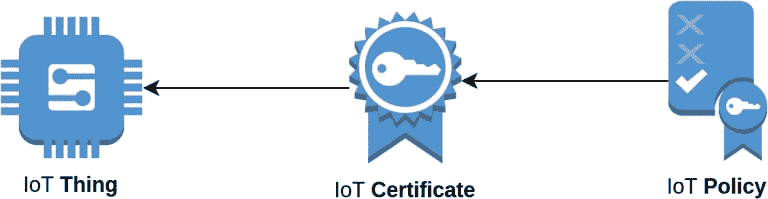
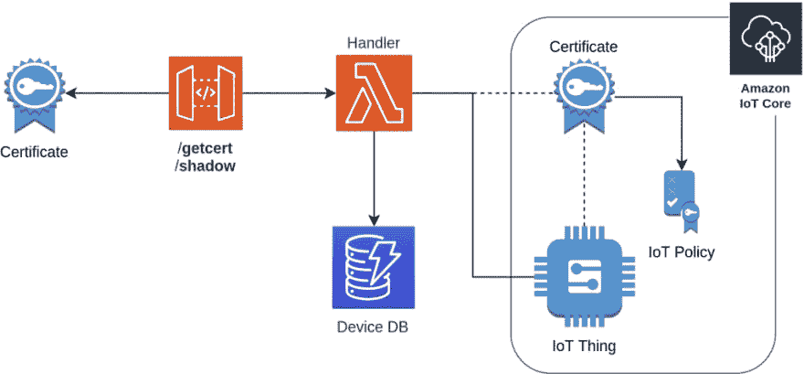
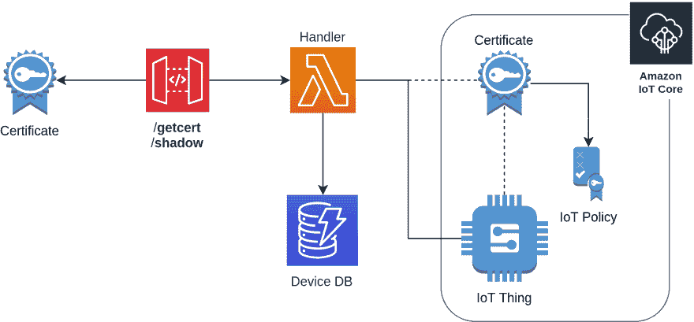

# AWS 物联网-证书销售

> 原文：<https://dev.to/t04glovern/aws-iot-certificate-vending-2dc7>

*这个帖子最初写于[devo pstar](https://devopstar.com/)T3。来看看[这里](https://devopstar.com/2019/09/07/aws-iot-certificate-vending/)*

如果你曾经经历过用 [AWS 物联网核心](https://aws.amazon.com/iot/)设置新设备的过程，那么你可能会回忆起为你的设备创建新证书时的不安感。我主张允许人们创建和管理自己的设备，但是需要一套防护栏来确保一定程度的一致性。因此，AWS 证书销售是我所有项目的核心部分。

在这篇文章中，我将描述一种叫做**证书出售**的模式，它可以帮助以一种**安全** & **可重复**的方式创建和管理一个账户中的许多设备。

## AWS 物联网简介

创建新的 AWS 物联网设备通常如下所示:

[](https://res.cloudinary.com/practicaldev/image/fetch/s--W_c9ds5f--/c_limit%2Cf_auto%2Cfl_progressive%2Cq_auto%2Cw_880/https://thepracticaldev.s3.amazonaws.com/i/cy3lhz2h7bmj55ceej8q.png)

*   **Thing** -表示您计划连接到 AWS IoT 的新设备
*   **证书** -一个[私有和公共 x509](https://docs.aws.amazon.com/iot/latest/developerguide/managing-device-certs.html) 密钥，用于认证你的设备。
    *   附在东西上
*   **策略** -证书的权限范围。
    *   策略可以包含一个或多个证书。

虽然在 UI 中设置这些设置很简单，但它确实给人为错误留下了空间。因此，我们将学习如何使用证书出售来管理这一切。

## 证件自动贩卖机

证书自动售货机(CVM)最初是 AWS 实验室的一个项目。久而久之，它没有得到应有的爱和关怀；拉取请求被搁置了几个月。

**注意** : *这段代码的很大一部分是基于 [brightsparc](https://github.com/brightsparc) 在他的 AWS-IOT-certificate-vending-machine 中所做的工作。*

[](https://res.cloudinary.com/practicaldev/image/fetch/s--wtQAVReQ--/c_limit%2Cf_auto%2Cfl_progressive%2Cq_auto%2Cw_880/https://thepracticaldev.s3.amazonaws.com/i/hjf62r151967d7ki58uw.png)

## 先决条件

在部署之前，您需要下拉项目的存储库

## [t04g lovern](https://github.com/t04glovern)/[server less-CVM](https://github.com/t04glovern/serverless-cvm)

### 基于 aw slabs/AWS-IOT-certificate-vending-machine；此部署使用无服务器框架

<article class="markdown-body entry-content p-5" itemprop="text">

# 无服务器证书自动售货机

基于[aw slabs/AWS-IOT-certificate-vending-machine](https://raw.githubusercontent.com/t04glovern/serverless-cvm/master/awslabs/aws-iot-certificate-vending-machine)这种部署使用无服务器框架

无服务器证书自动售货机是一种以安全和可重复的方式管理 AWS 物联网设备的模式。了解如何部署您自己的 CVM 和机载新设备。

[](https://raw.githubusercontent.com/t04glovern/serverless-cvm/master/img/cvm.png)

## 设置无服务器

```
npm install -g serverless
serverless config credentials --provider aws --key <ACCESS KEY ID> --secret <SECRET KEY>
```

## 要求

```
serverless plugin install -n serverless-pseudo-parameters
```

将以下内容添加到`serveress.yml`文件中

```
plugins
  - serverless-pseudo-parameters
```

### 环境文件

创建一个`env.yml.sample`的副本作为`env.yml`，并用下面命令中的端点地址更新`IOT_DATA_ENDPOINT`变量

```
aws iot describe-endpoint --endpoint-type iot:Data-ATS
# {
#     "endpointAddress": "XXXXXX-ats.iot.us-east-1.amazonaws.com"
# }
```

## 部署

```
npm install
serverless deploy
# api keys:
#   None
# endpoints:
#   GET - https://XXXXXX.execute-api.us-east-1.amazonaws.com/dev/getcert
#   ANY - https://XXXXXX.execute-api.us-east-1.amazonaws.com/dev/shadow
# functions:
#   cvm: serverless-cvm-dev-cvm
# layers:
#   None
```

## 创建设备

替换设备令牌…

</article>

[View on GitHub](https://github.com/t04glovern/serverless-cvm)

```
git clone https://github.com/t04glovern/serverless-cvm 
```

还要确保您具备以下条件:

*   [AWS CLI 设置](https://docs.aws.amazon.com/cli/latest/userguide/cli-chap-configure.html) &已认证
*   [NodeJS 已安装](https://nodejs.org/en/download/) &更新

### 无服务器设置

无服务器证书自动售货机(CVM)使用[无服务器](https://serverless.com/)框架进行部署。这可以在您的本地系统上使用以下命令进行设置:

```
npm install -g serverless
serverless config credentials --provider aws --key {ACCESS KEY ID} --secret {SECRET KEY} 
```

有几个用于证书销售的环境变量必须在名为`env.yml`的配置文件中设置。制作一个`env.yml.sample`的副本作为基础，然后用您的亚马逊信任服务端点更新`IOT_DATA_ENDPOINT`。

您可以通过运行以下命令获得您的端点:

```
aws iot describe-endpoint --endpoint-type iot:Data-ATS

# {
#     "endpointAddress": "XXXXXX-ats.iot.us-east-1.amazonaws.com"
# } 
```

下面可以看到一个`env.yml`的例子:

```
dev:
  IOT_DATA_ENDPOINT: XXXXXX-ats.iot.us-east-1.amazonaws.com 
```

### CVM 部署

部署无服务器证书自动售货机就像运行以下命令一样简单:

```
npm install serverless deploy

# api keys:
#   None
# endpoints:
#   GET - https://XXXXXX.execute-api.us-east-1.amazonaws.com/dev/getcert
#   ANY - https://XXXXXX.execute-api.us-east-1.amazonaws.com/dev/shadow
# functions:
#   cvm: serverless-cvm-dev-cvm
# layers:
#   None 
```

输出显示了用于生成证书和更新设备影像的端点。

### CVM 创造装置

要创建一个新设备，我们需要向管理设备证书的 DynamoDB 表中添加一条记录。

*   **序列号** -正在添加的设备的唯一 ID
*   **deviceToken** -稍后将提供的秘密令牌，用于进行更改和生成证书

通过运行以下命令创建一个新设备进行测试:

```
aws dynamodb put-item \
  --table-name iot-cvm-device-info \
  --item '{"deviceToken":{"S":"1234567890"},"serialNumber":{"S":"devopstar-iot-01"}}' 
```

### CVM 取回证书

要检索证书详细信息，请导航到后面的端点(替换为您的端点 ID):

```
https://XXXXXX.execute-api.us-east-1.amazonaws.com/dev/getcert?serialNumber=devopstar-iot-01&deviceToken=1234567890 
```

或者，可以使用下面的脚本，它利用 [jq](https://stedolan.github.io/jq/) 来解析响应，并为您将它们保存到文件中

```
#!/bin/bash

# https://XXXXXX.execute-api.us-east-1.amazonaws.com/dev/getcert?serialNumber=devopstar-iot-01&deviceToken=1234567890
ENDPOINT_URL="$1"

# Retrieve Certs
certificates=$(curl $ENDPOINT_URL)
certificatePemCrt=$(echo $certificates | jq '.certificatePem')
certificatePemKey=$(echo $certificates | jq '.keyPair.PrivateKey')
certificateRootCa=$(echo $certificates | jq '.RootCA')

# Save to files
echo -n $certificatePemCrt | sed 's/\\n/\n/g' | sed 's/"//g' &gt; certs/iot-certificate.pem.crt
echo -n $certificatePemKey | sed 's/\\n/\n/g' | sed 's/"//g' &gt; certs/iot-private.pem.key
echo -n $certificateRootCa | sed 's/\\n/\n/g' | sed 's/"//g' &gt; certs/iot-root-ca.crt 
```

可以使用以下脚本和参数执行:

```
./create_certs.sh "https://XXXXXX.execute-api.us-east-1.amazonaws.com/dev/getcert?serialNumber=devopstar-iot-01&deviceToken=1234567890" 
```

这将在下面的`certs`文件夹中创建证书

*   **IOT-certificate . PEM . CRT**:certificate PEM
*   **IOT-private . PEM . key**:key pair。私钥
*   **iot-root-ca.crt** : RootCA

这三个文件是将您的设备连接到 AWS IoT 所需的全部内容。

## 了解更多

如果您有兴趣了解更多信息或继续您的物联网冒险，请务必查看以下一些利用这一点的教程:

*   [亚马逊 Alexa 控制的物联网红绿灯](https://devopstar.com/2019/03/08/amazon-alexa-controlled-iot-traffic-lights/)
*   [AWS 苏美尔魔方](https://devopstar.com/2019/02/07/aws-sumerian-magic-cube/)
*   [使用 AWS 物联网按钮、SNS & CloudFormation](https://devopstar.com/2019/01/12/create-a-private-vpn-using-aws-iot-button-sns-cloudformation/) 创建私有 VPN

我鼓励你去看看我在 [AWS IoT 上制作的课程:家庭自动化爱好者指南](https://www.udemy.com/aws-iot-automation/)