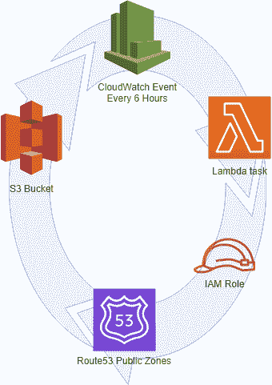

# 路线 53 -> S3 的 AWS Lambda 备份

> 原文：<https://dev.to/dietertroy/aws-lambda-backups-of-route53-s3-1id7>

需要自动备份 AWS Route53 公共 DNS 区域的方法吗？别再犹豫，以下 AWS 产品的组合可以满足您的需求:

*   希腊字母的第 11 个
*   53 号公路
*   云观察
*   S3

这里有一个流程图:
[](https://res.cloudinary.com/practicaldev/image/fetch/s--45D-zsIm--/c_limit%2Cf_auto%2Cfl_progressive%2Cq_auto%2Cw_880/https://www.troydieter.com/static/backup.png) 
这将每 6 个小时执行一次 Lambda 函数(或者您设置的 CloudWatch 事件)。它将使用 IAM 角色将您的 Route53 公共区域作为 CSV & JSON 导出到您选择的 S3 存储桶。

1.  创建一个 S3 专用存储桶，因为它将是您的备份目的地。
2.  将 *s3_bucket_name* 变量设置为您的 AWS S3 存储桶名称。
3.  将 *s3_bucket_region* 变量设置为您的 AWS S3 地区。
4.  为 Route53 只读和 S3 读/写创建一个 IAM 角色，并为您的 S3 存储桶附加一个策略。我在这里提供了一个例子。
5.  每 6 小时(或所需的重复持续时间)创建一个 CloudWatch 事件。
6.  上传下面的 Lambda Python 函数(比如复制保存为 *aws_s3_route53.py* )。
7.  将执行角色分配给在步骤 4 中创建的 IAM 角色，并使用在步骤 5 中创建的计划的 CloudWatch 事件触发器。
8.  检查您的备份的 S3 桶并验证。

现在你可以睡得更安稳一点了，因为你知道如果你在你的托管公共区域打破了一个记录， ***你会有一个备份的*** ！

**AWS _ S3 _ route 53 _ backups . py**

```
"""AWS Route 53 Lambda Backup"""

import os
import csv
import json
import time
from datetime import datetime
import boto3
from botocore.exceptions import ClientError

# Set environmental variables

s3_bucket_name = ''
s3_bucket_region = ''

try:
    s3_bucket_name = os.environ['s3_bucket_name']
    s3_bucket_region = os.environ['s3_bucket_region']
except KeyError as e:
    print("Warning: Environmental variable(s) not defined")

# Create client objects

s3 = boto3.client('s3', region_name='us-east-1')
route53 = boto3.client('route53')

# Functions

def create_s3_bucket(bucket_name, bucket_region='us-east-1'):
    """Create an Amazon S3 bucket."""
    try:
        response = s3.head_bucket(Bucket=bucket_name)
        return response
    except ClientError as e:
        if(e.response['Error']['Code'] != '404'):
            print(e)
            return None
    # creating bucket in us-east-1 (N. Virginia) requires
    # no CreateBucketConfiguration parameter be passed
    if(bucket_region == 'us-east-1'):
        response = s3.create_bucket(
            ACL='private',
            Bucket=bucket_name
        )
    else:
        response = s3.create_bucket(
            ACL='private',
            Bucket=bucket_name,
            CreateBucketConfiguration={
                'LocationConstraint': bucket_region
            }
        )
    return response

def upload_to_s3(folder, filename, bucket_name, key):
    """Upload a file to a folder in an Amazon S3 bucket."""
    key = folder + '/' + key
    s3.upload_file(filename, bucket_name, key)

def get_route53_hosted_zones(next_zone=None):
    """Recursively returns a list of hosted zones in Amazon Route 53."""
    if(next_zone):
        response = route53.list_hosted_zones_by_name(
            DNSName=next_zone[0],
            HostedZoneId=next_zone[1]
        )
    else:
        response = route53.list_hosted_zones_by_name()
    hosted_zones = response['HostedZones']
    # if response is truncated, call function again with next zone name/id
    if(response['IsTruncated']):
        hosted_zones += get_route53_hosted_zones(
            (response['NextDNSName'],
            response['NextHostedZoneId'])
        )
    return hosted_zones

def get_route53_zone_records(zone_id, next_record=None):
    """Recursively returns a list of records of a hosted zone in Route 53."""
    if(next_record):
        response = route53.list_resource_record_sets(
            HostedZoneId=zone_id,
            StartRecordName=next_record[0],
            StartRecordType=next_record[1]
        )
    else:
        response = route53.list_resource_record_sets(HostedZoneId=zone_id)
    zone_records = response['ResourceRecordSets']
    # if response is truncated, call function again with next record name/id
    if(response['IsTruncated']):
        zone_records += get_route53_zone_records(
            zone_id,
            (response['NextRecordName'],
            response['NextRecordType'])
        )
    return zone_records

def get_record_value(record):
    """Return a list of values for a hosted zone record."""
    # test if record's value is Alias or dict of records
    try:
        value = [':'.join(
            ['ALIAS', record['AliasTarget']['HostedZoneId'],
            record['AliasTarget']['DNSName']]
        )]
    except KeyError:
        value = []
        for v in record['ResourceRecords']:
            value.append(v['Value'])
    return value

def try_record(test, record):
    """Return a value for a record"""
    # test for Key and Type errors
    try:
        value = record[test]
    except KeyError:
        value = ''
    except TypeError:
        value = ''
    return value

def write_zone_to_csv(zone, zone_records):
    """Write hosted zone records to a csv file in /tmp/."""
    zone_file_name = '/tmp/' + zone['Name'] + 'csv'
    # write to csv file with zone name
    with open(zone_file_name, 'w', newline='') as csv_file:
        writer = csv.writer(csv_file)
        # write column headers
        writer.writerow([
            'NAME', 'TYPE', 'VALUE',
            'TTL', 'REGION', 'WEIGHT',
            'SETID', 'FAILOVER', 'EVALUATE_HEALTH'
            ])
        # loop through all the records for a given zone
        for record in zone_records:
            csv_row = [''] * 9
            csv_row[0] = record['Name']
            csv_row[1] = record['Type']
            csv_row[3] = try_record('TTL', record)
            csv_row[4] = try_record('Region', record)
            csv_row[5] = try_record('Weight', record)
            csv_row[6] = try_record('SetIdentifier', record)
            csv_row[7] = try_record('Failover', record)
            csv_row[8] = try_record('EvaluateTargetHealth',
                try_record('AliasTarget', record)
            )
            value = get_record_value(record)
            # if multiple values (e.g., MX records), write each as its own row
            for v in value:
                csv_row[2] = v
                writer.writerow(csv_row)
    return zone_file_name

def write_zone_to_json(zone, zone_records):
    """Write hosted zone records to a json file in /tmp/."""
    zone_file_name = '/tmp/' + zone['Name'] + 'json'
    # write to json file with zone name
    with open(zone_file_name, 'w') as json_file:
        json.dump(zone_records, json_file, indent=4)
    return zone_file_name

## HANDLER FUNCTION ##

def lambda_handler(event, context):
    """Handler function for AWS Lambda"""
    time_stamp = time.strftime("%Y-%m-%dT%H:%M:%SZ",
        datetime.utcnow().utctimetuple()
    )
    if(not create_s3_bucket(s3_bucket_name, s3_bucket_region)):
        return False
    #bucket_response = create_s3_bucket(s3_bucket_name, s3_bucket_region)
    #if(not bucket_response):
        #return False
    hosted_zones = get_route53_hosted_zones()
    for zone in hosted_zones:
        zone_folder = (time_stamp + '/' + zone['Name'][:-1])
        zone_records = get_route53_zone_records(zone['Id'])
        upload_to_s3(
            zone_folder,
            write_zone_to_csv(zone, zone_records),
            s3_bucket_name,
            (zone['Name'] + 'csv')
        )
        upload_to_s3(
            zone_folder,
            write_zone_to_json(zone, zone_records),
            s3_bucket_name,
            (zone['Name'] + 'json')
        )
    return True

if __name__ == "__main__":
    lambda_handler(0, 0) 
```

Enter fullscreen mode Exit fullscreen mode