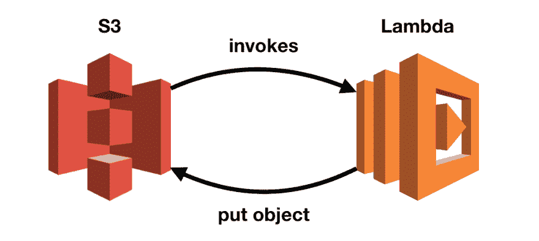
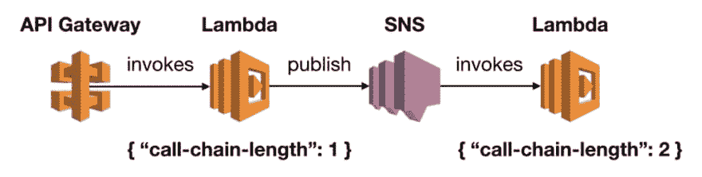
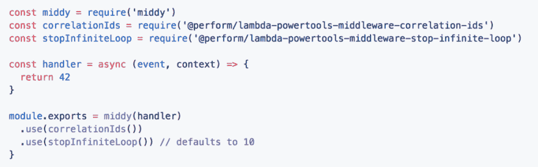
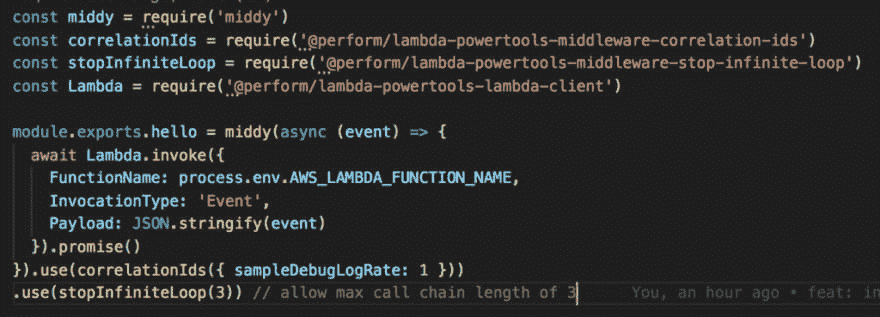
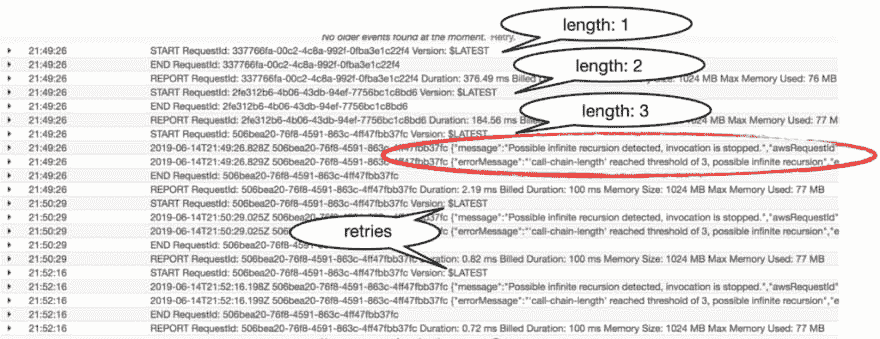
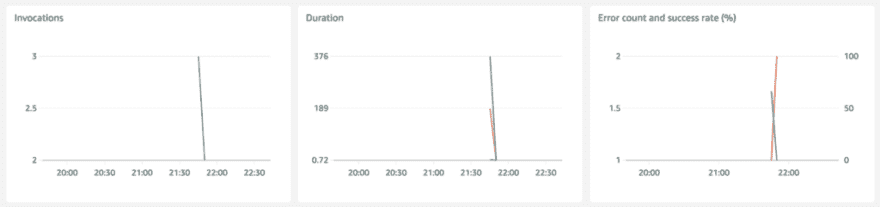

# AWS Lambda:如何检测和停止意外的无限递归

> 原文：<https://dev.to/theburningmonk/aws-lambda-how-to-detect-and-stop-accidental-infinite-recursions-2clc>

Lambda 使得构建事件驱动的架构变得容易。每个功能只需要照看好自己的职责。我们通过 API、队列、流和其他事件源将它们链接在一起。这是用简单组件构建复杂系统的好方法。我们只需要托管服务，并且只在使用时才付费。

但是，有时候，我们会犯错误。不久前，一些博客帖子在社交媒体上流传开来。一些人偶然在一次无限递归中得到他们的函数。随后，AWS 很快就收到了一份数额可观的账单。

在一个事件中，S3 触发了一个 Lambda 函数，将修改过的文件放回同一个桶中。这触发了相同的功能，将文件放回到相同的桶中。如此循环往复。

除非有办法跟踪调用链上的调用次数，这样我们就可以在调用太长时暂停！

# dazn-lambda-powertools

我们(在 DAZN)最近开源了我们的 [**Lambda powertools 项目**](https://github.com/getndazn/dazn-lambda-powertools) 。该项目的目标是让我们的工程师能够构建生产就绪的无服务器应用程序。可观察性是很重要的一部分。

该项目为您提供了自动提取和转发关联 id 的工具。它还支持整个调用链的日志采样。因此，即使您在更高的级别进行日志记录，您也总是会有一个调试日志消息的样本。在生产中，您通常会在`WARN`或`ERROR`级别登录以节省成本。更多详情可点击 [**这里**](https://github.com/getndazn/dazn-lambda-powertools/#dazn-lambda-power-tools) 。

## 跟踪呼叫链的长度

用于传递相关 id 的相同机制可以帮助跟踪调用链的长度。我们所需要的只是传递一个计数器和其他相关 id。每当我们提取相关 id 时，我们将把计数器加 1。

## 停止无限循环

一旦我们能够跟踪呼叫链的长度，我们就可以在它们变得太长时停止它们。我们 [**增加了一个中间件**](https://github.com/getndazn/dazn-lambda-powertools/tree/master/packages/lambda-powertools-middleware-stop-infinite-loop) 来在调用链长度达到一个`threshold`时停止调用。

因为大多数调用链都很短，所以默认的`threshold`值被设置为 10。但是您可以根据需要覆盖它。你可以像其他任何中间件一样应用这个中间件。你也可以把它和其他中间件结合使用。

# 给我看，别告诉我！

为了看到这一点，我创建了一个非常简单的演示项目。源代码可在 [**这里**](https://github.com/theburningmonk/lambda-infinite-loop-demo) 。

这个演示项目由一个函数组成，它每次都调用自己。此函数缺少终止条件。如果不检查，它将无限循环。幸运的是，`stop-indefinite-loop`中间件将在第三次调用时停止调用链。

在我用`sls invoke -f hello`触发函数后，我能够在日志中验证预期的行为。在第三次递归时，调用立即停止。它甚至停止了后续的重试(Lambda retries 失败了两次异步调用)！

您可以看到指标中的调用也停止了。

### 限制

中间件不支持 SQS 和 Kinesis 功能。这些事件源批量向 Lambda 发送事件，需要特殊处理。调用链长度仍然如您所料地传递和增加。但是停止长调用链的中间件在这里不起作用。相反，您需要在处理单个记录时应用该逻辑。

### 投稿

我们希望这些工具也能在您的无服务器之旅中帮助您。我们欢迎您的贡献，请随时建议功能或报告错误。如果你想帮我们一把，也请看看我们的[投稿指南](https://github.com/getndazn/dazn-lambda-powertools/blob/master/CONTRIBUTING.md)！