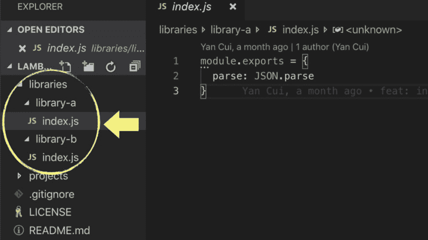
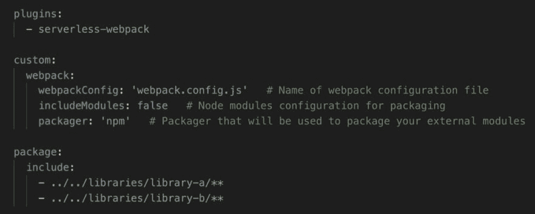
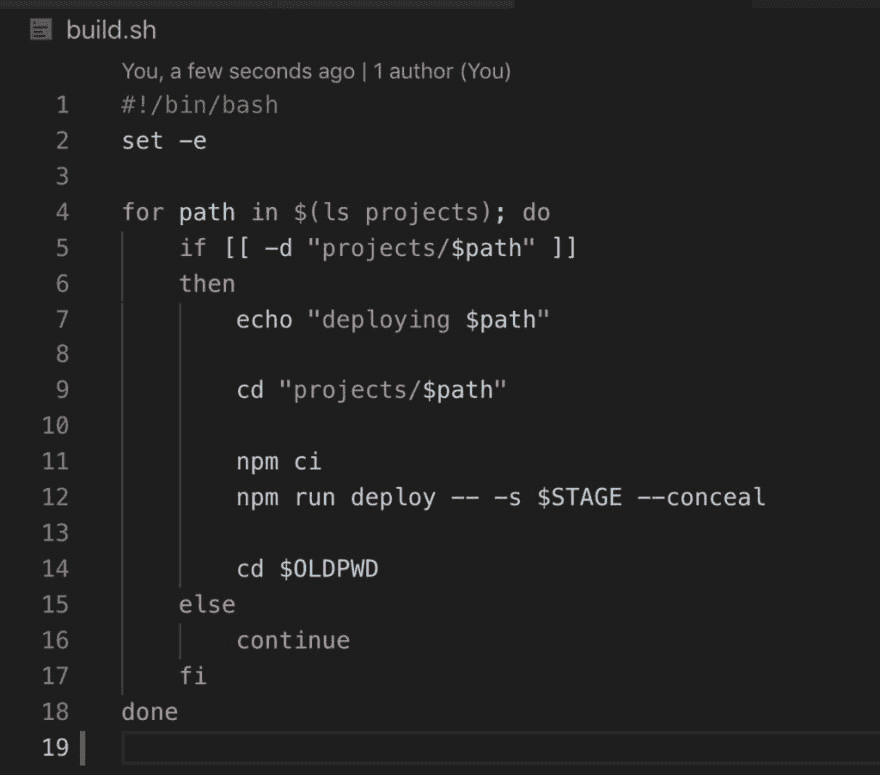

# AWS Lambda:如何在 monorepo 中的函数间共享代码

> 原文：<https://dev.to/theburningmonk/aws-lambda-how-to-share-code-between-functions-in-a-monorepo-4474>

不久前，一位客户问我“如何在 Node.js monorepo 中的服务之间共享业务逻辑？”。TL；它的博士是:

*   将共享的业务逻辑封装到模块中，并将它们放在单独的文件夹中。

*   在 Lambda 处理函数中，使用相对路径引用共享模块。

*   使用 webpack 来解析它们并将其捆绑到部署包中。如果你使用无服务器框架，那么看看[无服务器 webpack](https://github.com/serverless-heaven/serverless-webpack) 插件。例如:

*   **在每次提交时部署每个服务**。您可以使用如下的简单脚本来实现这一点。

要了解一切是如何组合在一起的，请查看这个演示报告。它已经通过 [drone.io](http://drone.io) 设置了 CI/CD，您可以在这里看到 monorepo [中所有服务的最新部署。](https://cloud.drone.io/theburningmonk/lambda-monorepo-code-sharing-demo/3)

但是等等！我如何在单一回购和按服务回购之间做出选择？

别担心，我也为你准备好了；-)你可以在这里阅读我对这两种方法的看法。

查看 theburningmonk.com 的更多文章。