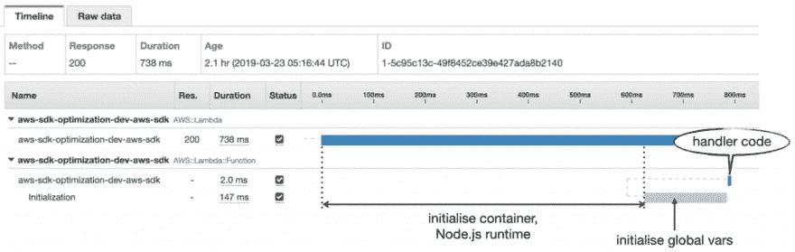
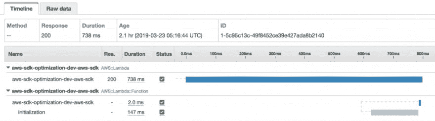
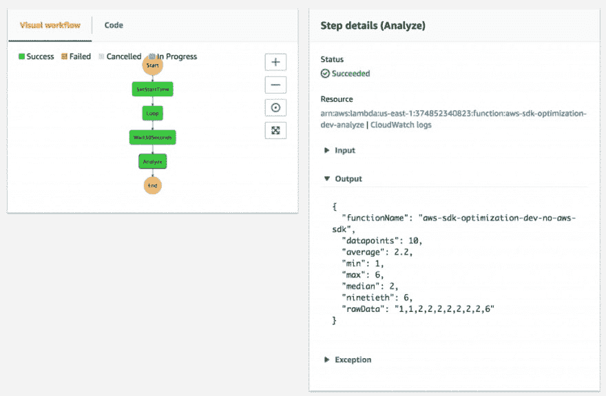
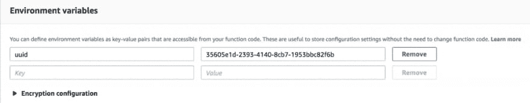
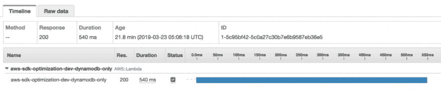
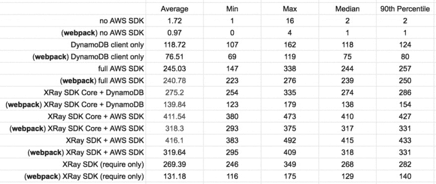
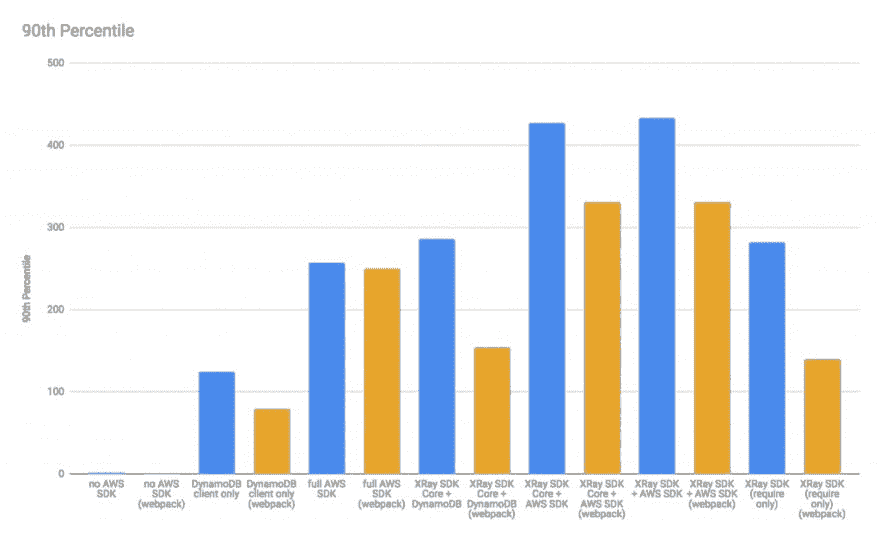

# AWS 无服务器:Vale 是 AWS SDK 的重要供应商吗？

> 原文：<https://dev.to/oieduardorabelo/aws-serverless-vale-a-pena-importar-o-aws-sdk-7nk>

## 导致最终尺寸较小的 lambdas

*如果不熟悉 AWS Lambda 上下文中的冷启动(cold start)[请先阅读本帖子](https://theburningmonk.com/2018/01/im-afraid-youre-thinking-about-aws-lambda-cold-starts-all-wrong/)。*

**2019 年 3 月 24 日更新:测试现在包括[【无服务器网页包】](https://github.com/serverless-heaven/serverless-webpack)。**

当 Node.js 的 lambda 函数冷起动(*冷起动*时，会发生几件事:

*   Lambda 服务需要找到一台容量足够容纳新容器的服务器
*   将初始化新容器
*   Node.js 的执行环境已启动
*   初始化模块/处理程序，包括初始化在处理程序函数之外声明的任何全局变量和函数

如果为 Lambda 函数启用跟踪功能，则可以看到在 x 射线中这些步骤所花费的时间。不幸的是，初始化容器所需的时间和 Node.js 的运行时间并未记录为线程。但你可以计算出持续时间的差异。

下面，`Initialization`是指初始化模块/处理程序所需的时间:

[](https://res.cloudinary.com/practicaldev/image/fetch/s--fPq4neEA--/c_limit%2Cf_auto%2Cfl_progressive%2Cq_auto%2Cw_880/https://theburningmonk.com/wp-content/uploads/2019/03/img_5c964abe4bf42-1024x325.png)

以上跟踪是针对以下函数，该函数需要 [AWS SDK](https://www.npmjs.com/package/aws-sdk) 而不需要其他任何内容。如你所见，这个简单的`require` **在冷启动时增加了 147 毫秒**。

```
const AWS = require("aws-sdk");
module.exports.handler = async () => {}; 
```

当您的角色需要与 AWS 功能交互时，请考虑这种业务成本。但是，如果您只需要与一个服务(例如 DynamoDB)进行交互，则可以使用单线功能节省一些引导时间:

```
const DynamoDB = require("aws-sdk/clients/dynamodb");
const documentClient = new DynamoDB.DocumentClient(); 
```

以上我们直接导入 DynamoDB 客户端，而不启动整个 AWS SDK。我做了一个实验，看看这个简单的改变能节省多少冷启动时间。

*学分授予同事[【Justin caldicott】](https://www.linkedin.com/in/justin-caldicott-96b36a9/)是因为激发了我的兴趣，做了很多初步分析。*

除 AWS SDK 外，我们通常还需要 XRay SDK，并使用它自动检测 AWS SDK。不幸的是，`aws-xray-sdk`包里还有一些我们不需要的额外行李。默认情况下，它支持 Express.js、MySQL 和 Postgres 应用程序。如果您只对 AWS SDK 和模块`http` / `https`感兴趣，则只需要`aws-xray-sdk-core`。

[](https://res.cloudinary.com/practicaldev/image/fetch/s--7MRnBOWp--/c_limit%2Cf_auto%2Cfl_progressive%2Cq_auto%2Cw_880/https://theburningmonk.com/wp-content/uploads/2019/03/img_5c964b0bde622-e1553353537965.png)

# 方法论

我测试了几个配置

*   [sem SDK da AWS](https://github.com/theburningmonk/aws-sdk-coldstart-overhead/blob/master/functions/no-aws-sdk.js)
*   [客户动力的重要性](https://github.com/theburningmonk/aws-sdk-coldstart-overhead/blob/master/functions/dynamodb-only.js)
*   [AWS SDK complete 的重要说明](https://github.com/theburningmonk/aws-sdk-coldstart-overhead/blob/master/functions/aws-sdk.js)
*   [仅导入 XRay SDK(不含 AWS SDK)](https://github.com/theburningmonk/aws-sdk-coldstart-overhead/blob/master/functions/aws-xray-sdk-require-only.js)
*   [x 射线 SDK e 仪器和 AWS SDK 的重要性](https://github.com/theburningmonk/aws-sdk-coldstart-overhead/blob/master/functions/aws-xray-sdk.js)
*   [x 射线 SDK 核心 e 仪器和 AWS SDK 的重要性](https://github.com/theburningmonk/aws-sdk-coldstart-overhead/blob/master/functions/aws-xray-sdk-core.js)
*   [x 射线 SDK 核心和仪器的重要性以及客户动力数据库的可用性](https://github.com/theburningmonk/aws-sdk-coldstart-overhead/blob/master/functions/trace-dynamodb-only.js)

这些功能中的每一个都由 x 射线跟踪。取样率(*取样率*设定为 100%，这样我们就不会损失任何东西。我们只对区段`Initialization`的持续时间感兴趣，因为它是初始化这些相依性的时间。

[](https://res.cloudinary.com/practicaldev/image/fetch/s--4-Yo5In5--/c_limit%2Cf_auto%2Cfl_progressive%2Cq_auto%2Cw_880/https://theburningmonk.com/wp-content/uploads/2019/03/img_5c964b69140eb-1024x285.png)

案件`sem SDK da AWS`是我们的对照组。我们可以看到每增加一个依赖项，持续时间为`Initialization`。

为了收集一组统计意义重大的数据，我决定使用步骤函数( *Step Functions* )来自动化该过程。

[](https://res.cloudinary.com/practicaldev/image/fetch/s--HYE1I_-D--/c_limit%2Cf_auto%2Cfl_progressive%2Cq_auto%2Cw_880/https://theburningmonk.com/wp-content/uploads/2019/03/img_5c964ba43891e-1024x669.png)

*   状态机接收到一个条目`{ functionName, count }`。
*   步骤`SetStartTime`将当前 UTC 时间戳添加到运行状态。这是必要的，因为我们需要实验的开始时间来寻找 x 射线的相关痕迹。
*   步骤`Loop`触发指定函数所需数目的冷调用。要执行冷调用，在调用函数之前，我将按编程方式更新环境变量。这样，我保证每个电话都有一个寒冷的开始。

[](https://res.cloudinary.com/practicaldev/image/fetch/s--glhWtDxt--/c_limit%2Cf_auto%2Cfl_progressive%2Cq_auto%2Cw_880/https://theburningmonk.com/wp-content/uploads/2019/03/img_5c964c2c836d5-1024x199.png)

*   步骤`Wait30Seconds`确保在尝试分析之前，所有的跟踪都发布在 X-Ray 上。
*   步骤`Analyze`搜索 x 射线中的所有相关跟踪，并围绕持续时间`Initialization`生成各种统计数据。

每种配置都经过 1000 个冷呼叫的测试。有时，x 射线跟踪不完整(见下文)。在步骤`Analyze`中排除了这些不完整的跟踪。

[](https://res.cloudinary.com/practicaldev/image/fetch/s--c875MLAP--/c_limit%2Cf_auto%2Cfl_progressive%2Cq_auto%2Cw_880/https://theburningmonk.com/wp-content/uploads/2019/03/img_5c964c4e90568-1024x212.png)
*AWS::lambda:功能段在哪里？*

每个配置还通过 WebPack(使用插件[服务器无服务器 webpack](https://github.com/serverless-heaven/serverless-webpack) 进行测试。*感谢 Erez Rokah 在评论中提出的建议。*

# 结果

以下是对所有测试案例的“`Initialization`”的分析:

[](https://res.cloudinary.com/practicaldev/image/fetch/s--ZMxOkvxA--/c_limit%2Cf_auto%2Cfl_progressive%2Cq_auto%2Cw_880/https://theburningmonk.com/wp-content/uploads/2019/03/img_5c97ab80261a6-1024x433.png)

[](https://res.cloudinary.com/practicaldev/image/fetch/s--EpfO0TnA--/c_limit%2Cf_auto%2Cfl_progressive%2Cq_auto%2Cw_880/https://theburningmonk.com/wp-content/uploads/2019/03/img_5c97ab9946bd1-1024x631.png)

你看

*   WebPack 通常可缩短初始化时间。
*   没有依赖项，`Initialization`的平均时间只有 1.72 毫秒(不含 WebPack)和 0.97 毫秒(含 WebPack)。
*   将 AWS SDK 添加为唯一依赖项将平均添加 245 毫秒而不使用 WebPack。这是相当有意义的。添加 WebPack 也不会显着改善事情。
*   仅要求 DynamoDB 客户端(更改前面讨论的行)最多可节省 176 毫秒！在 90%的情况下，节约时间超过 130 毫秒。有了 WebPack，经济更加戏剧性。
*   导入 X-Ray SDK 的成本几乎与 AWS SDK 相同。
*   使用完整的 X-Ray SDK 和 X-Ray SDK 核心之间没有统计学意义。不管有没有网页包。

* * *

# 克雷蒂托

*   完整的 AWS SDK 到底有多贵？，escrito origination por[@ the burning monk](https://dev.to/theburningmonk)