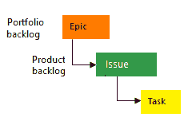
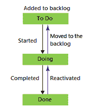
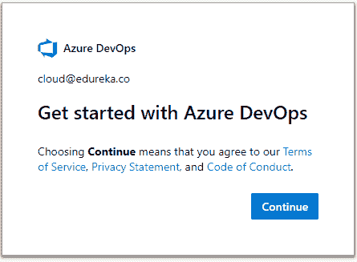
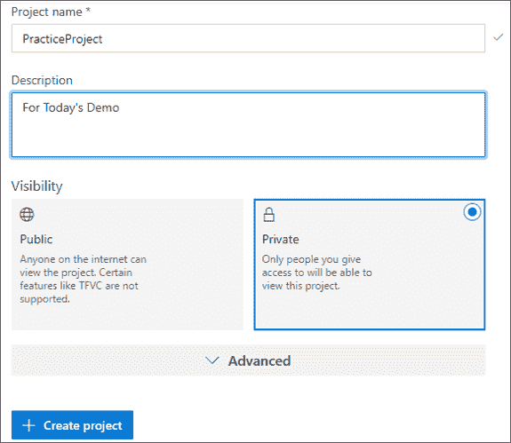
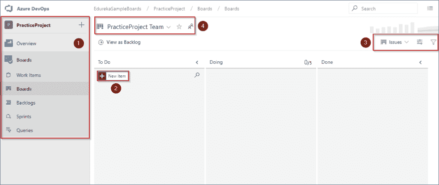
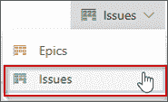
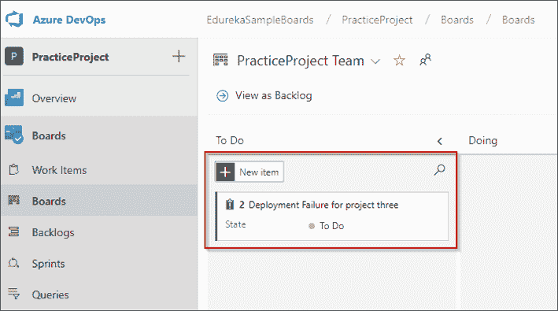
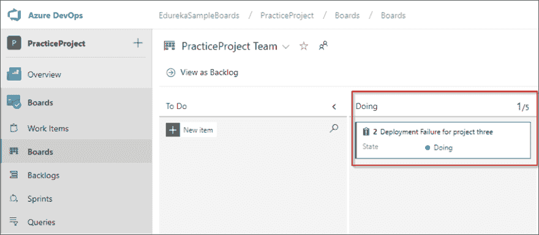
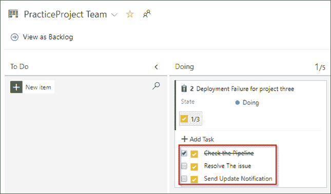

# Azure Boards:如何在 Azure 上开始敏捷规划？

> 原文：<https://dev.to/vishalservicenow/azure-boards-how-to-get-started-with-agile-planning-on-azure-28m7>

什么是 Azure Boards？嗯，你可以把它想象成一个界面，让你跟踪任务、特性，甚至可能与你的项目有关的错误。这里有三种工作项类型为您提供帮助:

史诗
问题
任务
以下是以图像形式的描绘(图片来源:Microsoft.com):

此外，随着工作的完成，状态会从以下位置逐步更新:

做
做
做
下面是描绘同样情况的图片(图片来源:Microsoft.com):

每当我们创建或添加一个问题、任务或史诗，这意味着我们正在创建一个工作项目。我们创建的每个工作项都代表一个对象。该对象存储在工作项数据存储区中。这里的每个项目都有一个标识符，分配给它。这些 id 对于特定的项目是唯一的。

如果您希望跟踪重要的特性或需求，您可以添加 epics。另一方面，问题用于跟踪用户故事、bug 或其他较小的工作项目。同样，任务意味着跟踪少量的工作。追踪器可用于每小时和每天的追踪。

现在让我们来看看 Azure Boards 的一些特性。

# 青板的特点

## 看板实施

用 Azure Boards 实现和使用看板非常容易。它简化了两项重要任务，即:

-更新问题的状态
-优先处理您积压的问题

这意味着分配工作变得更加容易，您可以更好地共享信息，并通过提供的拖放功能优先处理您的工作。

## 使用 Azure 板进行协作

-讨论区让您可以更好地与项目中的人员协作
-您可以创建仪表板并跟踪已完成工作的状态和趋势。-获得已创建、已更改或已解决问题的即时提醒
-您可以设置通知，以便在创建或更改问题时获得提醒

## 在 sprints 中工作和实施 Scrum 的灵活性

-通过适当的分配
来计划冲刺变得更加容易-您可以使用工作评估来预测工作
-可以批量分配问题或任务

## 与 GitHub 集成

很容易连接到 GitHub，这意味着:

-您可以轻松执行拉、推和提交请求
-您可以轻松链接到 GitHub 提交和拉请求

现在让我们进一步看看如何使用 Azure Boards 来实现我们上面讨论的一些特性。

## 演示:Azure Boards 入门

第一步:首先在你的浏览器[https://aex.dev.azure.com/signup/boards'](https://aex.dev.azure.com/signup/boards%E2%80%99)中打开这个链接。您将被重定向到此页面。点击继续。

第二步:接下来，你会被要求输入组织名称和你的经营地点。输入这些信息，然后单击继续。

步骤 3:下一步是创建一个项目。在下面输入详细信息并创建一个项目。

步骤 4:您将被重定向到以下界面，您有四个部分。第一个让你可以访问 Azure Boards 的所有主要标签。第二个让你添加项目。第三个用于问题，第四个让您管理项目和项目成员。

第 5 步:让我们创建一个问题，为此，请单击屏幕左上角的“问题”下拉菜单，然后选择“问题”。

第 6 步:点击添加项目并输入问题的名称。一旦你点击了回车键，问题标签将出现如下。

第七步:我们可以将状态更改为“正在做”,这样你的项目就会转移到名为“正在做”的栏下。

第八步:您可以向问题添加任务。这一部分包含了需要做的事情。我添加了三个任务，并划掉了一个，这表明任务已经完成。

伙计们，这是给你们的 Azure 板添加一个简单的问题。Azure boards 可以做很多事情。你可以自由探索 Azure Boards。就本文而言。我会把它放在这里。

来源: [Edureka](https://www.edureka.co)