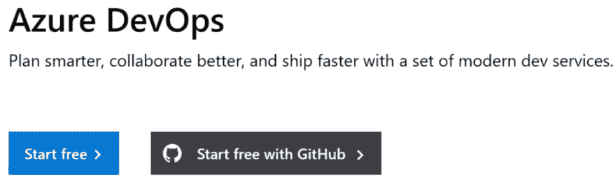
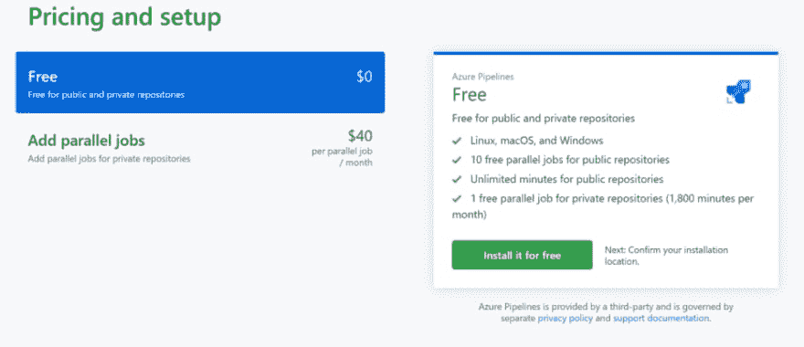
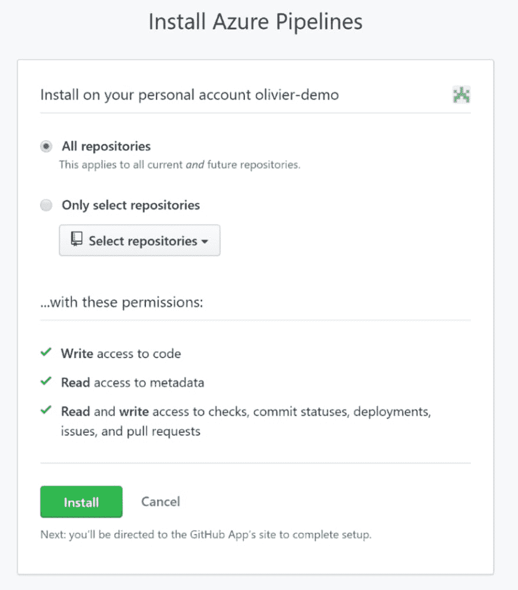
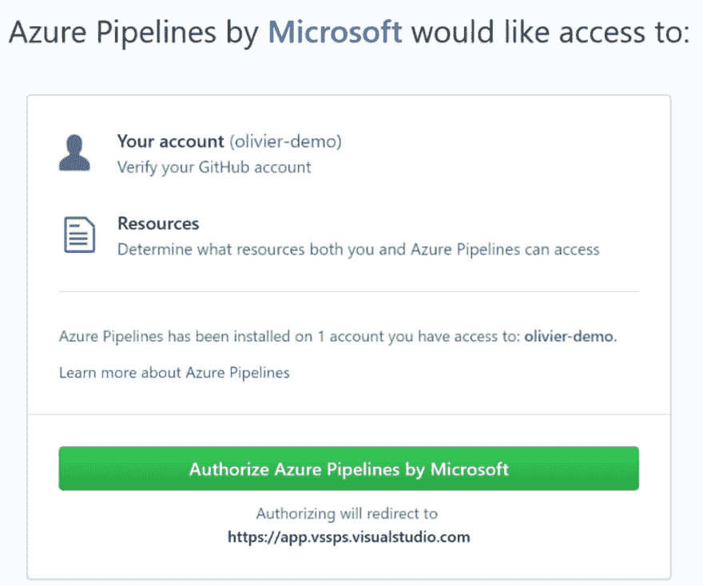
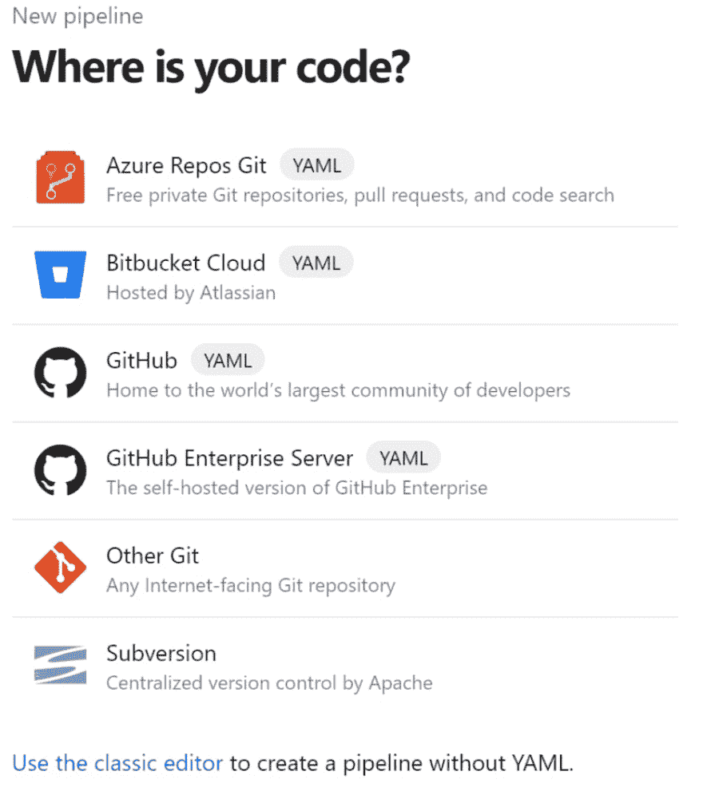
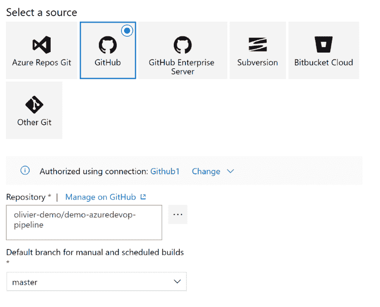
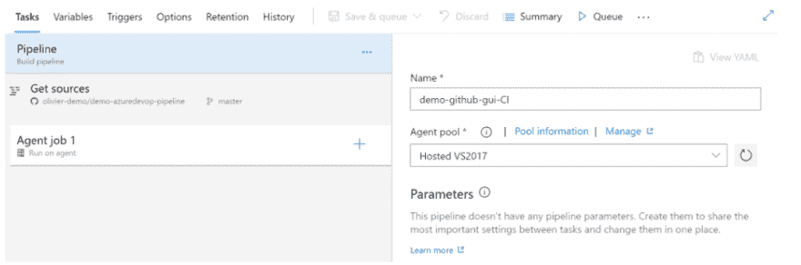
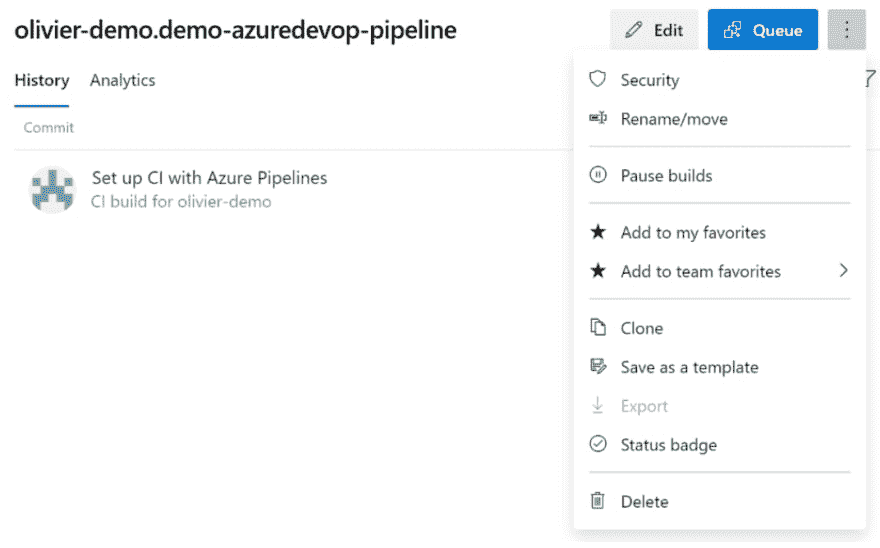

# 使用 GitHub 的 Azure DevOps 管道，简介

> 原文：<https://dev.to/omiossec/azure-devops-pipelines-with-github-introduction-43mi>

Azure DevOps 是一套以高效方式构建和交付产品的工具。这是一个在线应用程序，有一个板，Azure Board，用于 Scrum 和 Kaban，一个存储库，Azure Repos，使用 git 和 tfs，一个 Wiki，一个工件管理，Azure Artefact，一个探索性测试工具，Azure 测试计划和一个 CI/CD 管道，Azure DevOps 管道。
如果你想了解更多关于 Azure DevOps 的信息，你可以阅读[这篇介绍](https://dev.to/vishalservicenow/azure-devops-tutorial-why-should-you-use-devops-on-azure-397i)

我们如何使用 Azure DevOps 管道从 GitHub 存储库中启动管道来测试和构建代码？有几个步骤:

*   您需要一个 GitHub 帐户
*   您还需要一个 Azure DevOps 帐户(您也可以使用 GitHub 帐户登录 Azure DevOps)。

### 我们开始吧。

对我来说，最好在第一时间创建你的帐户和你的第一个 Azure DevOps 项目。你将有更多的控制权。干脆去[https://dev.azure.com](https://dev.azure.com)

[](https://res.cloudinary.com/practicaldev/image/fetch/s--mQ5gh-GW--/c_limit%2Cf_auto%2Cfl_progressive%2Cq_auto%2Cw_880/https://thepracticaldev.s3.amazonaws.com/i/9t8flcj5ku1pr0mhcxav.PNG)

您可以创建一个帐户，或者直接使用您的 Github 帐户。

在 GitHub 中，我们需要添加 Azure DevOps 扩展；只需点击“市场”并搜索 Azure Pipeline。

点击建立一个计划

[](https://res.cloudinary.com/practicaldev/image/fetch/s--9ACcWCdj--/c_limit%2Cf_auto%2Cfl_progressive%2Cq_auto%2Cw_880/https://thepracticaldev.s3.amazonaws.com/i/2ewndciftdncv98h2uec.PNG)

选择免费计划并点击“免费安装”。请注意，对于公共项目，您每月可以获得 10 个并行作业和无限分钟。

[](https://res.cloudinary.com/practicaldev/image/fetch/s--_T1jpmV6--/c_limit%2Cf_auto%2Cfl_progressive%2Cq_auto%2Cw_880/https://thepracticaldev.s3.amazonaws.com/i/i93vi5nz4dqs4pdgdqyc.PNG)

单击以安装完成

[](https://res.cloudinary.com/practicaldev/image/fetch/s--fYUBZMzB--/c_limit%2Cf_auto%2Cfl_progressive%2Cq_auto%2Cw_880/https://thepracticaldev.s3.amazonaws.com/i/8nxo8imijcz6og5by3x5.PNG)

你也可以用 Azure Board 应用程序做同样的事情。

Azure DevOps 项目不会自动公开。如果您想要 10 个作业和/或无限的构建分钟数，您需要确保您的项目可见性设置为 public。

我们现在可以创建一个构建管道。Azure DevOps 中有两种管道，GUI 管道和基于 YAML 的管道。

管道是运行在专门的计算机上的任务的集合，专门为此而创建，最终将被销毁。在 Azure DevOps 中，此计算机是一个代理。这个代理附带了运行构建任务的工具，编译器(Go .net、Visual Studio、...)，运行时和 SDK(。网，...)、工具(Git、Chocolatey、Nuget、NPM、…)、脚本引擎(PowerShell、Python、…)、驱动。

有几个在线代理:

*   Windows 2019 与 VS 2019
*   Windows 2016 与 VS 2017
*   Windows 2012 R2 与 VS 2015
*   Windows Server 1803 容器映像
*   Mac OS 10.14
*   Mac OS 10.13
*   Ubuntu 16.04 lt

这台计算机在 DS2 v2 虚拟机上的 Azure 上运行。它们在管道末端被隔离和删除。你可以查看[这一页](https://github.com/microsoft/azure-pipelines-image-generation)以获得更多关于这些代理商的信息。

### 为 GUI 管道

在 Azure DevOps 中，转到管道并点击新管道

[](https://res.cloudinary.com/practicaldev/image/fetch/s--aFRDPpfe--/c_limit%2Cf_auto%2Cfl_progressive%2Cq_auto%2Cw_880/https://thepracticaldev.s3.amazonaws.com/i/kgz3a6wuo1jvtszyqi8l.PNG)

点击“使用经典编辑器”

在选择源中，选择 GitHub，如果你看不到到你的 GitHub repos 的连接，你仍然可以在这里创建一个。

选择您的存储库和分支

[](https://res.cloudinary.com/practicaldev/image/fetch/s--3ByxLeJk--/c_limit%2Cf_auto%2Cfl_progressive%2Cq_auto%2Cw_880/https://thepracticaldev.s3.amazonaws.com/i/5qajwoq6hnl5bxzdgws2.PNG)

然后选择一个空作业

[](https://res.cloudinary.com/practicaldev/image/fetch/s--IhjD5F4z--/c_limit%2Cf_auto%2Cfl_progressive%2Cq_auto%2Cw_880/https://thepracticaldev.s3.amazonaws.com/i/qzonxq5y19w8oiv5rgwu.PNG)

现在，我们有了整合渠道。如果您看右边，您可以更改管道和默认代理的名称。您可以选择:

| 代理名称 | 操作系统映像 |
| --- | --- |
| 款待 | Windows 2012 R2 |
| 托管的 VS2017 | Windows 2016 |
| 使用 VS2019 托管 Windows 2019 | Windows 2019 |
| 托管 Windows 容器 | Windows Server 1803 容器 |
| 托管的 MacOs | Mac OS 10.14 |
| 托管 MacOS HighSierra | Mac OS 10.13 |
| 托管 Ubuntu 1604 | Ubuntu 16.04 lt |

选择适合您项目的代理，对于演示，我将使用“带 VS2019 的托管 Windows 2019”

点击“保存并排队”并选择“保存”以保存修改(如果点击“保存并排队”，将触发管道，并出现在构建历史中)。

在右边，您可以看到管道的第一个任务，“获取资源”。每次管道启动时，来自分支的源代码将被复制到代理上。

你可以通过点击它来控制行为。您可以在这里标记源代码，也可以签出子模块。

您可能需要在构建过程中使用一些值。它可以是一个内部版本号、一个路径、一个模块名，也可以是一些秘密值，比如密码、密钥等等。这就是“变量”选项卡的用途。你可以在这里添加一些变量，但是最好的方法是创建一个变量组并在这里链接它。

要添加一个变量组，你需要去左边的管道菜单中的库。点击“+变量组”添加一个新组。给新变量组命名，点击“+ Add”添加一个新变量及其值。注意右边的挂锁图标。如果你点击它，变量值被屏蔽。该值也将在控制台或日志中被屏蔽。这不是一个安全特性，因为脚本可以很容易地访问值和每个管理员。

如果您需要通过管道管理机密，您可以启用到 Azure 订阅的链接并选择密钥库。Azure DevOps 将充当密钥库的代理。在构建期间，您可以通过环境变量在代理主机中评估这些变量。

为了创建构建过程，我们需要向代理作业添加任务。单击代理作业名称旁边的+并选择一个或多个任务。它可以是一个脚本任务，一个测试，一个编译任务…你也可以浏览市场找到一个适合你的项目的任务。

任务一般包括代码编译、单元和验收测试、打包等相关任务。

默认情况下，如果任务失败，它会停止进程并报告错误，但您可以通过选择任务并转到左侧窗格的“控制选项”来控制此行为。您可以使用“出错时继续”选项来防止任务在失败时停止进程。在运行测试和发布测试分在两个任务中的情况下，它会很有用。

默认情况下，任何对 GitHub repos 的提交都不会触发管道。我们需要配置管道如何对提交或拉取请求做出反应。

“触发器”选项卡是我们可以启用或禁用持续集成的地方。你有两个主要的选择。

*   持续集成，分支中的每个提交都会触发构建过程
*   拉式请求验证，其中每个 PR 触发构建过程。您需要选择至少一个分支。

请注意，GitHub 允许来自分叉回购的 Pull 请求。分叉的 PR 将无法访问与构建相关的机密，这可能会导致构建错误。您可以使用“使机密可用于构建分叉”来启用这些机密，但这可能会导致一些安全问题。

### 为 YAML 基础管道

创建基于 YAML 的管道的过程没有很大的不同。

[](https://res.cloudinary.com/practicaldev/image/fetch/s--aFRDPpfe--/c_limit%2Cf_auto%2Cfl_progressive%2Cq_auto%2Cw_880/https://thepracticaldev.s3.amazonaws.com/i/kgz3a6wuo1jvtszyqi8l.PNG)

不需要点击“使用经典编辑器”，只需要点击 GitHub 即可。选择你的 GitHub repos，你必须选择一个选项，使用一个 starter yaml 文件，一个由 Azure DevOps 在你的 repos 中创建的 yaml 文件，或者选择一个现有的文件。

对于第一个，您会注意到一个名为“使用 Azure Pipelines 设置 CI”的新提交和 GitHib repos 中的一个新文件 azure-pipelines.yml。大多数管道配置都在这个文件中。

yaml 文件是一个层次结构

> x 管道
> x 阶段
> 
> x 工作
> x 步骤
> x 任务

你可以在这里找到完整的参考文献[。](https://docs.microsoft.com/en-us/azure/devops/pipelines/yaml-schema)

但是你可以从更简约的版本开始。

让我们从一个触发器开始，因为在 GUI 版本中你可以控制如何触发管道。

```
trigger: 
- master 
```

Enter fullscreen mode Exit fullscreen mode

这将为主分支

中的每个新提交触发构建管道，就像我们可以为同一分支的拉请求启用管道一样。

```
pr: 
- master 
```

Enter fullscreen mode Exit fullscreen mode

我们也可以从库中导入一个变量组

```
variables: 
-  group: VarGroupName 
```

Enter fullscreen mode Exit fullscreen mode

也可以定义硬编码变量

```
variables: 
   modulename: MyModule 
   DefaultVersion: 0.0.1 
```

Enter fullscreen mode Exit fullscreen mode

之后，我们可以设置代理主机版本

```
Pool: 
  vmImage: windows-2019 
```

Enter fullscreen mode Exit fullscreen mode

至于 GUI 版本，代理列表有限

| 映像名 | 操作系统映像 |
| --- | --- |
| vs2015-win2012r2 | Windows 2012 R2 |
| vs2017-win2016 | Windows 2016 |
| windows-2019 | Windows 2019 |
| win1803 | Windows Server 1803 容器 |
| macOS-10.14 | Mac OS 10.14 |
| macOS-10.13 | Mac OS 10.13 |
| ubuntu-16.04 | Ubuntu 16.04 lt |

最后，我们可以在步骤
下添加我们需要的任务

```
steps: 

- task: PowerShell@2 

  displayName: BuildScript 

  inputs: 

    targetType: filePath 

    filePath: '$(System.DefaultWorkingDirectory)\azdo-build.ps1' 
```

Enter fullscreen mode Exit fullscreen mode

*注意这里系统变量的使用*

与 GUI 版本一样，您可以添加一个或多个任务，并且可以控制任务在出现错误时的行为。

```
continueOnError: true 
```

Enter fullscreen mode Exit fullscreen mode

既然您已经看到了我们如何通过使用单个文件来设置管道，那么您可以看到基于 yaml 的管道不太容易，但是比 GUI 版本强大得多。

最后一件关于 Azure DevOps 管道的事情。怎样才能让每个人都注意到建筑的状况？

我们可以用徽章来做。徽章是 Azure DevOps 上托管的动态图像。映像根据构建、尚未运行、成功、失败的状态而变化。可以放入 GitHub 项目的 README.md 文件。要获得管道徽章，只需点击左侧的 3 个点。

[](https://res.cloudinary.com/practicaldev/image/fetch/s--SFaQL-xQ--/c_limit%2Cf_auto%2Cfl_progressive%2Cq_auto%2Cw_880/https://thepracticaldev.s3.amazonaws.com/i/6uuaji3bboumrz6rru0q.PNG)

点击“状态徽章”

您只需将 Markdown 复制并粘贴到您的 README.md 文件中。

这只是一个关于如何在 GitHub 中使用 Azure DevOps 管道的介绍。如您所见，YAML 是创建您的 CI 的最强大的工具。你也可以用 Azure DevOps 创建一个 CD 管道来交付产品。

*如果你会说法语，你可以看这个[视频](https://www.youtube.com/watch?v=_VoDJu0tnsk)我为巴黎的法国 PowerShell 用户组制作的关于构建和管道的视频(但是是法语的)*