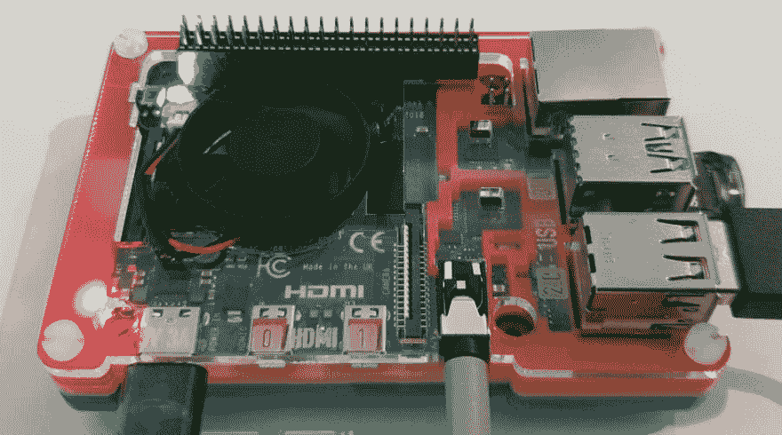
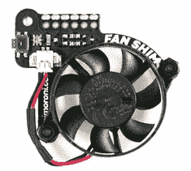
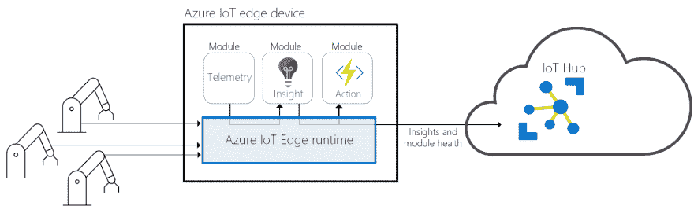

# Raspberry Pi Buster 上的 Azure IoT Edge 以及 Raspberry Pi 4 的提示

> 原文：<https://dev.to/azure/azure-iot-edge-on-raspberry-pi-buster-plus-tips-for-raspberry-pi-4-22nn>

# Azure IoT Edge on Raspberry Pi Buster plus tips for Raspberry Pi 4

[](https://res.cloudinary.com/practicaldev/image/fetch/s--vaeyRlYZ--/c_limit%2Cf_auto%2Cfl_progressive%2Cq_auto%2Cw_880/https://raw.githubusercontent.com/gloveboxes/Azure-IoT-Edge-on-Raspberry-Pi-Buster/master/resources/rpi4.jpg)

## 有用的参考文献

1.  [Azure 物联网边缘](https://azure.microsoft.com/en-au/services/iot-edge?WT.mc_id=devto-blog-dglover)
2.  [Azure 定制视觉](https://azure.microsoft.com/en-au/services/cognitive-services/custom-vision-service?WT.mc_id=devto-blog-dglover)

## 树莓派 4

如果你像我一样，那么你也无法抗拒树莓皮 4 4GB 的善良。我想提高我最喜欢的机器学习项目的推理性能- [用 Azure IoT Edge 和 Azure Cognitive Services](https://dev.to/azure/creating-an-image-recognition-solution-with-azure-iot-edge-and-azure-cognitive-services-4n5i) 创建一个图像识别解决方案。

作为一个粗略的指导，我的 [Azure Custom Vision](https://azure.microsoft.com/en-au/services/cognitive-services/custom-vision-service/?WT.mc_id=devto-blog-dglover) 模型的推理性能如下:

1.  树莓 Pi 4 4GB - 720 毫秒
2.  树莓派 3B Plus - 1.2 秒
3.  英特尔酷睿 i5-8250U (Surface Laptop 2) - 230 毫秒

## 拉斯扁克星

随着 [Raspberry Pi 4](https://www.raspberrypi.org/) 的发布，Raspberry Pi Foundation 已经从 Raspbian Stretch 迁移到 Buster (Debian 10)作为所有 Raspberry Pi 的默认 Linux 发行版。至少现在，它打破了一些东西。因此，这里有一些在运行 Raspbian Buster 的 Raspberry Pi 上运行 [Azure IoT Edge](https://docs.microsoft.com/en-us/azure/iot-edge/how-to-install-iot-edge-linux?WT.mc_id=devto-blog-dglover) 的提示和技巧。

## 安装拉斯扁克星

本文并不打算作为 Raspberry Pi 或 Azure IoT Edge 的入门指南。有关这些主题的更多信息，请阅读以下文章。

1.  我的[使用 Azure IoT Edge 和 Azure 认知服务创建图像识别解决方案](https://dev.to/azure/creating-an-image-recognition-solution-with-azure-iot-edge-and-azure-cognitive-services-4n5i)项目是开始使用 Azure IoT Edge 的好地方。

2.  我通常运行 Raspbian Lite (Headless)。查看本指南“[无头树莓 PI 3 B+ SSH WIFI 设置(MAC + WINDOWS)](https://desertbot.io/blog/headless-raspberry-pi-3-bplus-ssh-wifi-setup) ”。

## 拉斯边巴斯特上的天蓝色物联网边缘

### 树莓 Pi 4 提示

1.  [冷却您的覆盆子酱 4](#cooling-your-raspberry-pi-4)
2.  [从 USB 3 闪存或固态硬盘启动您的 Raspberry Pi 4](#booting-from-a-usb-3-flash-or-ssd-drive)

### Azure IoT Edge 和 Raspbian Buster 提示

1.  [在 Raspbian Buster 上安装 Docker](#installing-docker-on-raspbian-buster)
2.  [在 Raspbian Buster 上安装 Azure IoT Edge](#installing-azure-iot-edge-on-raspbian-buster)

## 给你的树莓派降温 4

Raspberry Pi 4 运行起来很热，您可能需要提供一些主动冷却来防止热节流。

我喜欢 Pimoroni 案例和风扇垫片，这是一个很好的紧凑的解决方案。注意，我和皮莫罗尼没有任何从属关系，我只是一个粉丝(双关，呻吟声)。树莓 Pi 4 还有其他很酷的解决方案。查看[树莓 Pi 4 Thermals 和风扇垫片](https://blog.pimoroni.com/raspberry-pi-4-thermals-and-fan-shim/)文章。

[](https://res.cloudinary.com/practicaldev/image/fetch/s--7i7VZa47--/c_limit%2Cf_auto%2Cfl_progressive%2Cq_auto%2Cw_880/https://raw.githubusercontent.com/gloveboxes/Azure-IoT-Edge-on-Raspberry-Pi-Buster/master/resources/fan-shim.jpg)

### 安装风扇垫片软件

查看[开始使用风扇垫片](https://learn.pimoroni.com/tutorial/sandyj/getting-started-with-fan-shim)文章。总之，安装 git 和 pip3 支持，克隆 Fan SHIM GitHub repo，安装依赖项，然后设置自动温度监控服务，根据需要打开风扇。

```
sudo apt install -y git sudo python3-pip && \
git clone https://github.com/pimoroni/fanshim-python && \
cd fanshim-python && \
sudo ./install.sh && \
cd examples && \
sudo ./install-service.sh --on-threshold 65 --off-threshold 55 --delay 2 
```

* * *

## 从 USB 3 闪存或固态硬盘启动

从 USB 3 引导的好处取决于你的 Azure IoT Edge 解决方案的磁盘 IO 密集程度。Raspberry Pi 4 引入了大幅改进的 USB 支持，当与 USB 3 SSD 驱动器结合使用时，磁盘 IO 性能令人印象深刻。查看我记录的 [USB 3 闪存和 SSD 磁盘性能](#usb-3-flash-and-ssd-disk-performance)数字。

### 使用测试版固件从 USB 启动您的 Raspberry Pi(2020 年 5 月)

[如何从 USB 固态硬盘或闪存盘启动 Raspberry Pi 4](https://www.tomshardware.com/how-to/boot-raspberry-pi-4-usb)

* * *

## 将 Docker 安装在 Raspbian Buster 上

```
curl -sSL get.docker.com | sh && sudo usermod pi -aG docker && sudo reboot 
```

## 在 Raspbian Buster 上安装 Azure IoT Edge

[](https://res.cloudinary.com/practicaldev/image/fetch/s--1nMXl_it--/c_limit%2Cf_auto%2Cfl_progressive%2Cq_auto%2Cw_880/https://raw.githubusercontent.com/gloveboxes/Azure-IoT-Edge-on-Raspberry-Pi-Buster/master/resources/iotedge.png)

回顾如何在基于 Debian 的 Linux 系统上安装 Azure IoT Edge 运行时。

### SSL Library libssl1.0.2

Buster 没有附带所需的 libssl1.0.2 库。作为临时解决方法，请在安装 IoT Edge 之前安装此库。

```
sudo apt-get install libssl1.0.2 
```

```
curl https://packages.microsoft.com/config/debian/stretch/multiarch/prod.list > ./microsoft-prod.list && \
sudo cp ./microsoft-prod.list /etc/apt/sources.list.d/ && \
curl https://packages.microsoft.com/keys/microsoft.asc | gpg --dearmor > microsoft.gpg && \
sudo cp ./microsoft.gpg /etc/apt/trusted.gpg.d/ && \
sudo apt-get update && \
sudo apt-get -y install iotedge 
```

### 添加物联网边缘连接字符串

```
sudo nano /etc/iotedge/config.yaml 
```

### 重启 Azure 物联网边缘

```
sudo systemctl restart iotedge 
```

## 使用私钥/公钥的 SSH 认证

[](https://res.cloudinary.com/practicaldev/image/fetch/s--5Ovy8wpi--/c_limit%2Cf_auto%2Cfl_progressive%2Cq_auto%2Cw_880/https://raw.githubusercontent.com/gloveboxes/Azure-IoT-Edge-on-Raspberry-Pi-Buster/master/resources/ssh-login.jpg)

为 SSH 登录和认证设置公钥/私钥非常方便(而且安全)。

下面创建一个新的 SSH 密钥，将公钥复制到 Raspberry Pi。采用默认选项。

### 来自 Windows

1.  使用内置的 Windows 10 (1809+) OpenSSH 客户端。首先安装 Windows 的 OpenSSH 客户端(仅一次操作)。

    从 **PowerShell 担任管理员**。

```
Add-WindowsCapability -Online -Name OpenSSH.Client 
```

1.  在 PowerShell 中，创建一个密钥对。

```
ssh-keygen -t rsa 
```

1.  从 PowerShell 中，将公钥复制到您的 Raspberry Pi 中

```
cat ~/.ssh/id_rsa.pub | ssh pi@raspberrypi.local "mkdir -p ~/.ssh; cat >> ~/.ssh/authorized_keys" 
```

### 来自 Linux、macOS 和 Windows 子系统

1.  创建您的密钥。通常是一次性操作。

```
ssh-keygen -t rsa 
```

1.  将公钥复制到您的 Raspberry Pi。从 Linux 和 macOS。

```
ssh-copy-id pi@raspberrypi.local 
```

## 工具

[](https://res.cloudinary.com/practicaldev/image/fetch/s--URH03Vvr--/c_limit%2Cf_auto%2Cfl_progressive%2Cq_auto%2Cw_880/https://raw.githubusercontent.com/gloveboxes/Azure-IoT-Edge-on-Raspberry-Pi-Buster/master/resources/tools.jpg)

用于 Windows 的 Torrent 工具(下载 Raspbian 图像的最快方式)

*   用于快速下载 Raspbian 图像的 Windows Torrent 实用程序
*   用 [Balena 蚀刻机](https://www.balena.io/etcher)将 Raspbian 刻录到 sd 卡上
*   【2019 年树莓 Pi 存储性能指标评测

## USB 3 闪存和 SSD 磁盘性能

作为参考，这些是我使用在 [Raspberry Pi 存储基准 2019](https://www.raspberrypi.org/forums/viewtopic.php?t=31925) 上找到的性能工具为各种驱动器记录的性能统计数据

## SD 卡 SanDisk 超 16GB

```
 Category                  Test                      Result
HDParm                    Disk Read                 40.22 MB/s
HDParm                    Cached Disk Read          39.47 MB/s
DD                        Disk Write                17.8 MB/s
FIO                       4k random read            2614 IOPS (10457 KB/s)
FIO                       4k random write           296 IOPS (1186 KB/s)
IOZone                    4k read                   8669 KB/s
IOZone                    4k write                  2808 KB/s
IOZone                    4k random read            8609 KB/s
IOZone                    4k random write           1480 KB/s

                          Score: 923 
```

### PNY 128

```
 Category                  Test                      Result
HDParm                    Disk Read                 98.99 MB/s
HDParm                    Cached Disk Read          70.08 MB/s
DD                        Disk Write                21.6 MB/s
FIO                       4k random read            2238 IOPS (8953 KB/s)
FIO                       4k random write           116 IOPS (464 KB/s)
IOZone                    4k read                   16067 KB/s
IOZone                    4k write                  2204 KB/s
IOZone                    4k random read            7747 KB/s
IOZone                    4k random write           461 KB/s

                          Score: 860 
```

### 闪迪超 64 GB

```
 Category                  Test                      Result
HDParm                    Disk Read                 551.09 MB/s
HDParm                    Cached Disk Read          77.30 MB/s
DD                        Disk Write                55.0 MB/s
FIO                       4k random read            994 IOPS (3976 KB/s)
FIO                       4k random write           312 IOPS (1250 KB/s)
IOZone                    4k read                   17479 KB/s
IOZone                    4k write                  1616 KB/s
IOZone                    4k random read            4052 KB/s
IOZone                    4k random write           1005 KB/s

                          Score: 1087 
```

### ASMT -型号:1153 - USB 3 固态硬盘

```
 Category                  Test                      Result
HDParm                    Disk Read                 297.42 MB/s
HDParm                    Cached Disk Read          264.49 MB/s
DD                        Disk Write                69.0 MB/s
FIO                       4k random read            15019 IOPS (60076 KB/s)
FIO                       4k random write           8239 IOPS (32957 KB/s)
IOZone                    4k read                   36059 KB/s
IOZone                    4k write                  27480 KB/s
IOZone                    4k random read            20925 KB/s
IOZone                    4k random write           33354 KB/s

                          Score: 6939 
```