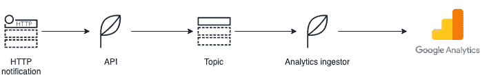

# 数据应用程序的 Azure 消息代理模式

> 原文：<https://dev.to/julienkervizic/azure-message-brokers-patterns-for-data-applications-1din>

[](https://res.cloudinary.com/practicaldev/image/fetch/s--yBTGkt6X--/c_limit%2Cf_auto%2Cfl_progressive%2Cq_auto%2Cw_880/https://cdn-images-1.medium.com/max/1024/0%2AK8LFtGiFSRF2m8Jj) 

<figcaption>照片由[阿德奥卢·埃莱图](https://unsplash.com/@adeolueletu?utm_source=medium&utm_medium=referral)于 [Unsplash](https://unsplash.com?utm_source=medium&utm_medium=referral)</figcaption>

我以前写过发布/订阅模式如何有助于将[机器学习模型投入生产](https://medium.com/analytics-and-data/overview-of-the-different-approaches-to-putting-machinelearning-ml-models-in-production-c699b34abf86#d6d6)，但是数据应用中的消息代理有着比机器学习更广泛的用途。在 Azure 上，有两个主要的消息代理，服务总线和事件中心。了解这些消息代理可以做什么，应该如何使用它们来开发数据应用程序，以及哪些消息代理更适合特定类型的用例，是充分利用它们的基础。

### **服务巴士和活动枢纽**

根据 Azure [文档](https://docs.microsoft.com/en-us/azure/event-grid/compare-messaging-services#comparison-of-services)，服务总线意味着高价值的消息传递，而事件中心意味着大数据管道。现在，这两种消息代理服务都可以在分析应用程序中使用，但关键是要理解每个系统的特殊性。

### **服务总线**

服务总线的一些关键特性包括重复检测、事务处理和路由。

#### **重复检测:**

Service Bus 在特定的 MessageId 中检查“requiresDuplicateDetection”属性设置为 true 的主题。

它基于一个重复的 DetectionHistoryTimeWindow 来回顾已经通过该主题的消息的历史。下面显示了一个包含重复数据删除机制的 ARM 模板示例:

```
{
  "$schema": "[https://schema.management.azure.com/schemas/2015-01-01/deploymentTemplate.json#](https://schema.management.azure.com/schemas/2015-01-01/deploymentTemplate.json#)",
  "contentVersion": "1.0.0.0",
  "parameters": {
  },
  "variables": { },
  "resources": [
    {
      "apiVersion": "2017-04-01",
      "name": "my\_sb\_namespace",
      "type": "Microsoft.ServiceBus/namespaces",
      "location": "West Europe",
      "properties": {
      },
      "resources": [
        {
          "apiVersion": "2017-04-01",
          "name": "my\_serviceBusTopicName",
          "type": "topics",
          "dependsOn": [
            "[concat('Microsoft.ServiceBus/namespaces/', 'my\_sb\_namespace')]"
          ],
          "properties": {
            **"requiresDuplicateDetection": "true",  
            "duplicateDetectionHistoryTimeWindow": "PT10M",**"path": "my\_serviceBusTopicName",
            "lockDuration": "PT5M",
          },
          "resources": []
        }
      ]
    }
  ],
  "outputs": {}
} 
```

例如，服务总线的这一属性可以用于应用程序从跟踪脚本中捕获订单信息，并希望确保下游系统中不会出现重复的信息，例如感谢页面上的页面刷新。

[](https://res.cloudinary.com/practicaldev/image/fetch/s--XCJXQ_VD--/c_limit%2Cf_auto%2Cfl_progressive%2Cq_auto%2Cw_880/https://cdn-images-1.medium.com/max/709/1%2A8nZUuFklFkJvCs1X_v40Uw.png)

上面显示了此类应用程序的一个示例:

*   跟踪脚本生成对 API 端点的 http 调用
*   API 将消息推送到启用了重复检测的服务总线主题
*   一个 analytics ingestor 应用程序读取主题订阅中的消息，并使用[测量协议](https://medium.com/analytics-and-data/the-complexity-of-implementing-google-analytics-22b3061248e6#a784)将数据推送到 Google Analytics

#### **窥视/锁定:**

Azure Service Bus 提供了两种处理消息方法，一种是对每个消息读取的破坏性方法，另一种是使用 peek /lock 机制的非破坏性方法。

设置非破坏性读取只需要在接收功能中设置一个参数: