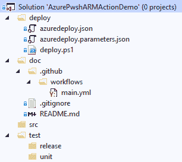
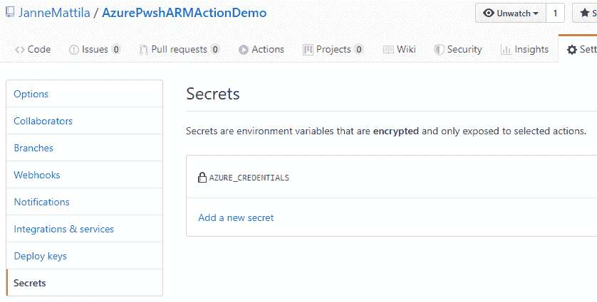
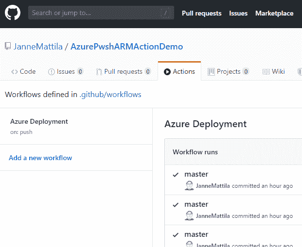
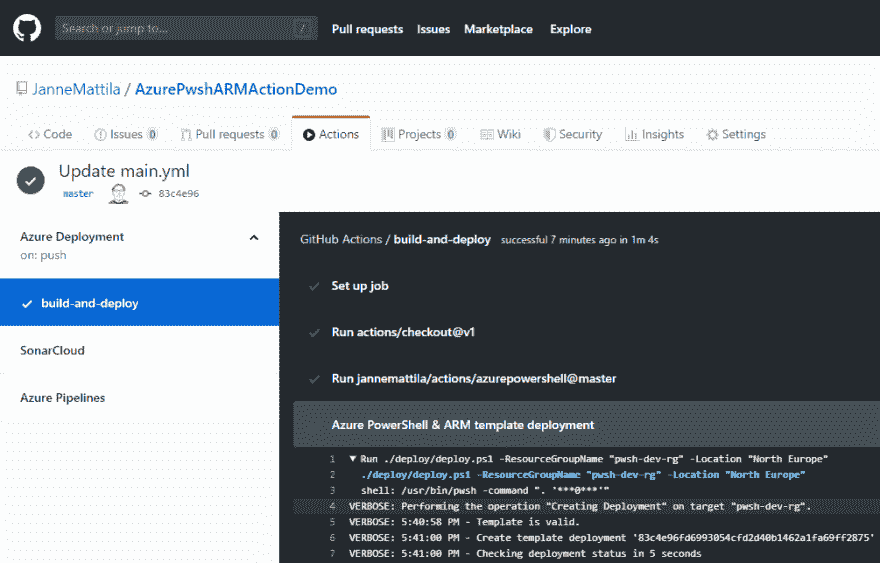
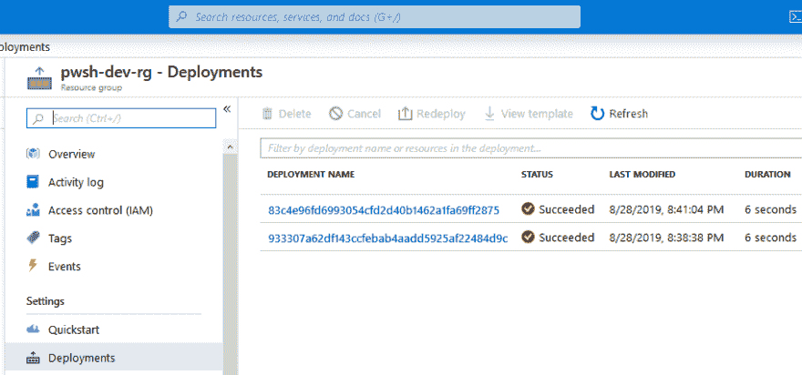
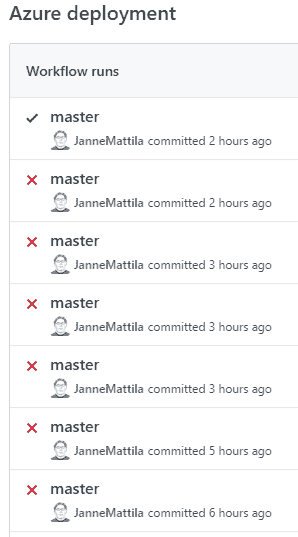

# 来自 GitHub 操作的 Azure PowerShell 和 ARM 模板部署

> 原文：<https://dev.to/janne_mattila/azure-powershell-and-arm-template-deployment-from-github-actions-2038>

本月初 [GitHub Actions 宣布支持 CI/CD](https://github.blog/2019-08-08-github-actions-now-supports-ci-cd/)。从那以后，我一直在想，这是我需要学习更多的东西。所以我决定检查一下添加 Azure PowerShell 支持有多容易(然后我可以将它用于我的 ARM 模板部署)。已经有可用的 az cli 操作:

##  [蔚蓝](https://github.com/Azure) / [动作](https://github.com/Azure/actions)

### 使用 Azure Actions 自动化 GitHub 工作流

<article class="markdown-body entry-content container-lg" itemprop="text">

# 用于部署到 Azure 的 GitHub 操作

[GitHub Actions](https://help.github.com/en/articles/about-github-actions) 为您提供了构建自动化软件开发生命周期工作流程的灵活性。

有了用于 Azure 的 GitHub Actions，你可以创建工作流，你可以在你的存储库中建立工作流来构建、测试、打包、发布和部署 T2 到 Azure。[了解更多与 Azure 的其他集成。](http://aka.ms/GitHubonAzure)

今天就开始使用[免费 Azure 帐户](https://azure.com/free/open-source)！

要轻松创建针对 Azure 的 GitHub CI/CD 工作流，请使用我们的 [Azure starter 模板](https://github.com/Azure/actions-workflow-samples)来部署您用流行语言和框架创建的应用，例如。NET、Node.js、Java、PHP、Ruby 或 Python，在容器中或在任何操作系统上运行。此外，单个行动回复在其自述文件中包含一个工作流程示例，以帮助您快速入门。

请尝试一下针对 Azure 的 [GitHub 操作，并通过 Twitter 在](https://docs.microsoft.com/azure/developer/github/github-actions) [@Azure](https://twitter.com/azuredevops) 上分享您的反馈。如果您遇到问题，请在…上打开一个问题

</article>

[View on GitHub](https://github.com/Azure/actions)

但我想复制我在 Azure DevOps 中使用多年的类似设置。因此，我决定尝试创造我自己的行动(当然同时也要学习这些行动是如何运作的)。

我为我的动作创建了 GitHub 存储库:

## /[动作](https://github.com/JanneMattila/actions)

### 用于 Azure PowerShell 和 ARM 模板部署的 GitHub 操作

<article class="markdown-body entry-content container-lg" itemprop="text">

# Azure PowerShell 操作

您可以在自己的 GitHub 工作流中使用这个 GitHub 操作来执行 Azure PowerShell，类似于 Azure DevOps 中的 [Azure PowerShell 任务](https://docs.microsoft.com/en-us/azure/devops/pipelines/tasks/deploy/azure-powershell?view=azure-devops)。

主要的用例是使用`deploy.ps1` (deployment entrypoint)调用 ARM 模板部署来简化你的模板部署，但是你当然可以将它用于任何你想到的 Azure 自动化场景。

在[这篇博客文章](https://dev.to/janne_mattila/azure-powershell-and-arm-template-deployment-from-github-actions-2038)中了解更多信息。

### 例子

下面是如何在自己的工作流程中执行 Azure PowerShell 的小例子:

```
name: Azure Deployment example
on: [push]
jobs
  build-and-deploy:
    runs-on: ubuntu-latest
    steps:
    - uses: actions/checkout@v1

    - uses: jannemattila/actions/azurepowershell@master
      with:
        creds: ${{ secrets.AZURE_CREDENTIALS }}

    - name: Azure PowerShell & ARM template deployment
      run: ./deploy/deploy.ps1 -ResourceGroupName "pwsh-dev-rg" -Location "North Europe"
      shell: pwsh
```

在本例中，您首先签出您的代码库，然后执行`/deploy/deploy.ps1` PowerShell 脚本…

</article>

[View on GitHub](https://github.com/JanneMattila/actions)I looked the az cli repository so that I would better understand the implementation details of their action. I decided to reuse their login instructions so that you can easily jump between az cli and Azure PowerShell. After learning the setup from az cli repository I decided to use a bit simpler setup. It means that I didn't use the components that are provided in the [GitHub Action Toolkit](https://github.com/actions/toolkit) but instead I just implemented simple 45 line solution that consist only 3 files. But clearly toolkit repository is the place to go when you're doing some serious development for your actions.

当我准备好 Azure PowerShell 操作后，我为演示应用程序创建了存储库:

## /[AzurePwshARMActionDemo](https://github.com/JanneMattila/AzurePwshARMActionDemo)

### 演示如何使用 Azure PowerShell GitHub action 通过 PowerShell 部署 ARM 模板。

<article class="markdown-body entry-content container-lg" itemprop="text">

# 使用操作演示部署 Azure PowerShell ARM 模板

演示如何使用 Azure PowerShell GitHub action 通过 PowerShell 部署 ARM 模板。

</article>

[View on GitHub](https://github.com/JanneMattila/AzurePwshARMActionDemo)

从 Azure 基础设施的角度来看，它有我最喜欢的设置:
[](https://res.cloudinary.com/practicaldev/image/fetch/s--BZSoD3wT--/c_limit%2Cf_auto%2Cfl_progressive%2Cq_auto%2Cw_880/https://thepracticaldev.s3.amazonaws.com/i/2f0ef7phnoe7wd12t24e.png)

那当然是指`deploy`文件夹和`deploy.ps1`和`azuredeploy*.json`文件。这个演示没有(还没有？)中有任何应用程序代码，但例如已经有管理 web 应用程序的操作，所以添加它会很容易:

##  [蔚蓝](https://github.com/Azure) / [ appservice-actions](https://github.com/Azure/appservice-actions)

### 支持 GitHub 开发人员使用 GitHub 操作部署到 Azure WebApps

<article class="markdown-body entry-content container-lg" itemprop="text">

***重要通知:***

***这个仓库中托管的动作现在被移到新的 GitHub 仓库中。请用新操作更新您的现有工作流，因为这些旧操作将被存档，不会收到任何更新。请参考 https://github.com/Azure/actions[的](https://github.com/Azure/actions)了解最新的行动回购详情。***
***例如，在您的工作流中，动作`azure/appservice-actions/webapp@master`应该替换为`azure/webapps-deploy@v1`。**T12】*

| 旧动作 | 新动作 |
| --- | --- |
| [Azure web app](https://github.com/Azure/webapps-deploy)(Windows/Linux web apps) | `azure/appservice-actions/webapp@master` | **T2`azure/webapps-deploy@v1`** |
| 用于容器的 Azure Web 应用(单/多容器应用) | `azure/appservice-actions/webapp-container@master` | **T2`azure/webapps-container-deploy@v1`** |

# 贡献的

这个项目欢迎投稿和建议。大多数贡献都要求您同意贡献者许可协议(CLA ),声明您有权并确实授予我们使用您的贡献的权利。详情请访问[https://cla.opensource.microsoft.com](https://cla.opensource.microsoft.com)。

当您提交拉取请求时，CLA 机器人将自动确定您是否需要提供 CLA 并适当地修饰 PR(例如，状态检查、评论)…

</article>

[View on GitHub](https://github.com/Azure/appservice-actions)

那些在`deploy`文件夹下的文件和我去年谈论和展示的完全一样。下一步是创建使用我以前创建的 Azure PowerShell 操作的新工作流。下面是[工作流程](https://github.com/JanneMattila/AzurePwshARMActionDemo/blob/master/.github/workflows/main.yml) :
的例子

```
name: Azure Deployment
on: [push]

jobs:
  build-and-deploy:
    runs-on: ubuntu-latest
    steps:
    - uses: actions/checkout@v1

    - uses: jannemattila/actions/azurepowershell@master
      with:
        creds: ${{ secrets.AZURE_CREDENTIALS }}

    - name: Azure PowerShell & ARM template deployment
      run: ./deploy/deploy.ps1 -ResourceGroupName "pwsh-dev-rg" -Location "North Europe"
      shell: pwsh 
```

重要的部分是`jannemattila/actions/azurepowershell@master`,这意味着我现在在这个工作流中重用我的另一个存储库中的动作。所以现在在你的行动中使用 Azure PowerShell 突然变得超级容易。这是我上面工作流程的最后一步。

请记住，在工作流可以工作之前，您需要正确设置 Azure 凭据:
[](https://res.cloudinary.com/practicaldev/image/fetch/s--BdlU4-8y--/c_limit%2Cf_auto%2Cfl_progressive%2Cq_auto%2Cw_880/https://thepracticaldev.s3.amazonaws.com/i/k51isnxwjhd2ppn06nyl.png)

以上工作流基于`on: [push]`(在工作流定义中)事件自动启动。我还可以在操作下查看我的工作流执行:

[](https://res.cloudinary.com/practicaldev/image/fetch/s--IpfpJPbd--/c_limit%2Cf_auto%2Cfl_progressive%2Cq_auto%2Cw_880/https://thepracticaldev.s3.amazonaws.com/i/eo282thqzhwv7xku4b5q.png)

您可以进一步深入到每次运行的详细信息:
[](https://res.cloudinary.com/practicaldev/image/fetch/s--dZOtBiXD--/c_limit%2Cf_auto%2Cfl_progressive%2Cq_auto%2Cw_880/https://thepracticaldev.s3.amazonaws.com/i/p4flh6y0nbpef6jkq4hw.png)

由于我在我的 PowerShell 文件中使用了 ARM 模板部署，我也可以在 Azure Portal 中看到我的部署:
[](https://res.cloudinary.com/practicaldev/image/fetch/s--_LFNwYyC--/c_limit%2Cf_auto%2Cfl_progressive%2Cq_auto%2Cw_880/https://thepracticaldev.s3.amazonaws.com/i/o003umhsdsp3m3c7n9uq.png) 
那个看起来很奇怪的部署名称来自`GITHUB_SHA`环境变量，该变量映射到该存储库中的提交 SHA。这意味着您可以完全回溯到实际的变更，并详细调查发生了什么:

```
[master ≡] # git checkout 933307a62df143ccfebab4aadd5925af22484d9c -b investigate-dev Switched to a new branch 'investigate-dev'
[investigate-dev] # git log
commit 933307a62df143ccfebab4aadd5925af22484d9c (HEAD -> investigate-dev)
Author: Janne Mattila
Date:   Wed Aug 28 20:37:24 2019 +0300
... 
```

我希望你对这篇文章感兴趣！

如果你认为我能一口气完成这件事...嗯不😊: [](https://res.cloudinary.com/practicaldev/image/fetch/s--9-PLtUHI--/c_limit%2Cf_auto%2Cfl_progressive%2Cq_auto%2Cw_880/https://thepracticaldev.s3.amazonaws.com/i/iq7h22b0faemqy14d1l9.png)