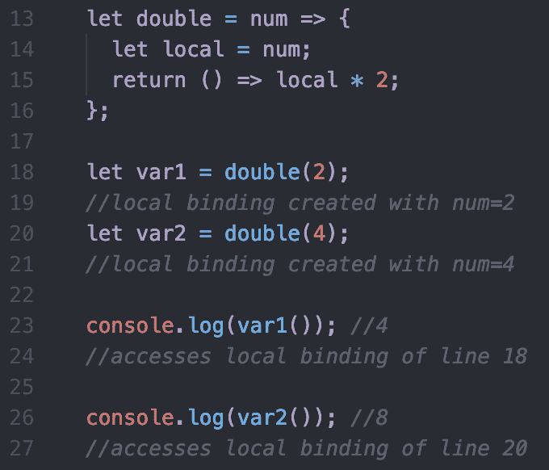
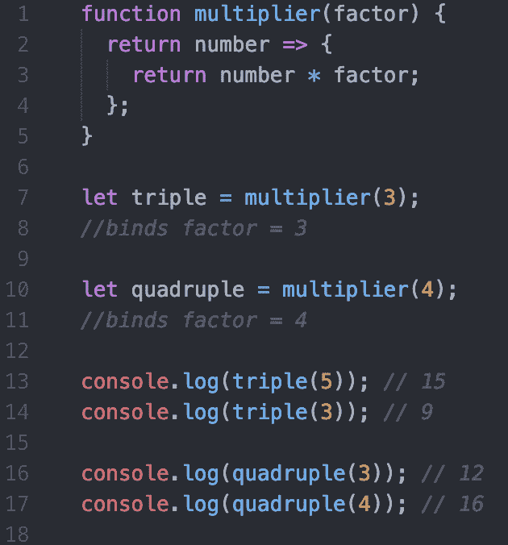

# 回到基础——JavaScript 闭包

> 原文：<https://dev.to/mollynem/back-to-basics-javascript-closures-17bh>

现在是我的 JavaScript 基础知识系列的第 2 部分了！本周我们将回顾闭包。我认为很有可能许多初学者理解这个概念，但是可能没有意识到我们称这个功能为闭包。让我们深入研究闭包的定义，并探索一些例子。

[MDN](https://developer.mozilla.org/en-US/docs/Web/JavaScript/Closures) 将闭包定义为*“函数和声明该函数的词法环境的组合。”*太好了..但是我们能不能更简单地用通俗的语言来表达呢？

把闭包想象成保存数据的函数。保留的数据由函数调用时范围内的任何变量或参数组成。每个函数调用都创建自己的保存数据，我们称之为*本地绑定*。我们可以访问本地绑定的特定实例的想法是闭包。

让我们看一些例子:

下面的代码展示了一个外部和内部函数。外部函数接收一个数字，将其赋给一个局部变量( *local* )并返回我们的内部函数。内部函数计算并返回局部变量乘以 2 的值。

<figure> 

<figcaption>演示多个本地绑定(闭包)</figcaption>

</figure>

如前所述，每次调用函数时，都会创建一个新的本地绑定。因此，一个函数可以有不同的本地绑定，如上面的代码所示。我们有一个访问绑定`num = 2`的闭包和一个访问绑定`num = 4`的闭包。我们还可以在程序中的任何地方调用`var1()`和`var2()`，它们将保持本地绑定。

下一个例子稍微复杂一点。它既考虑外部函数，也考虑内部函数，但是这次内部函数接受一个参数。这段代码的目标是构建一个 DRY 函数，为乘法创建一个蓝图。我们可以将这个函数绑定到一个因子(例如:5)，然后通过不同的数字反复重用。

<figure> 

<figcaption>函数见创建它的绑定，不叫</figcaption>

</figure>

上面我们在第 7 行和第 10 行创建了两个独立的环境。`triple`构建一个环境，其中`factor = 3`和`quadruple`在`factor = 4`处做同样的事情。现在看第 13 行，调用`triple(5)`返回的函数调用`factor = 3`，并识别出`5`的参数代表`num`。所以，返回`num * factor`的结果。

我希望这篇文章有助于提供更多关于什么是闭包的解释。欢迎在下面评论反馈，使用 closure 的例子，或者任何额外的提示！

