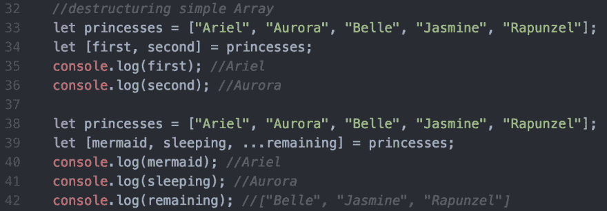
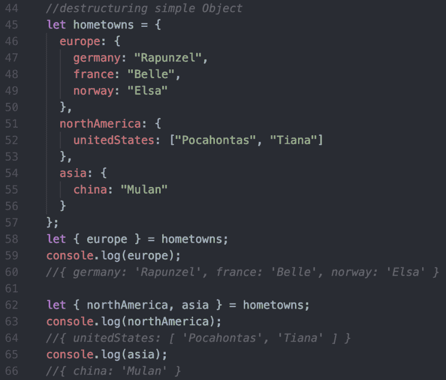
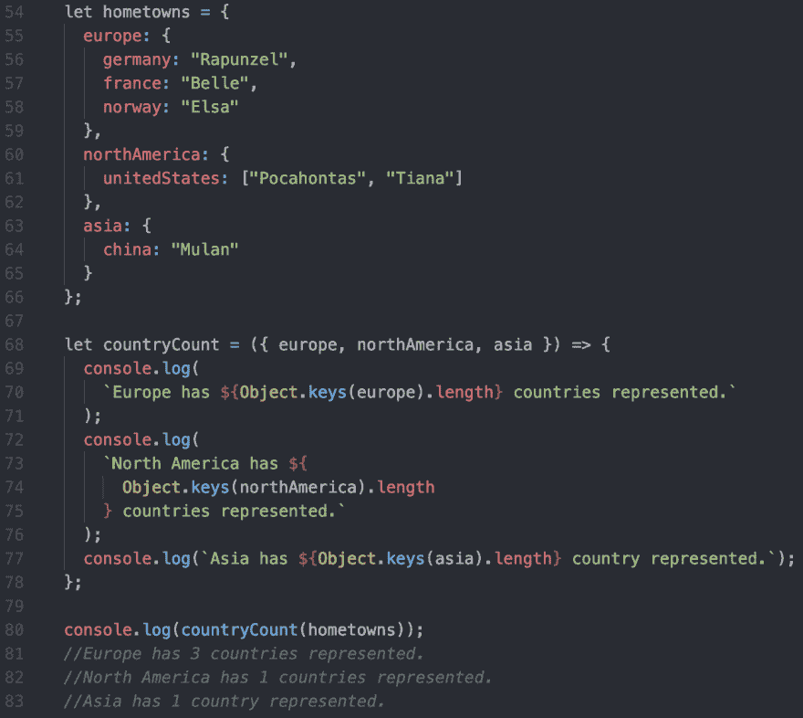

# 回到基础 JavaScript 中的简单析构

> 原文：<https://dev.to/mollynem/back-to-basics-simple-destructuring-in-javascript-2dog>

想减少输入，保持代码简洁，并快速访问对象和数组中的值吗？那你来对地方了。本周的回归基础系列将回顾不可思议的(也许被低估的？)JavaScript 中析构的特性。我将展示如何在像对象和数组这样的数据结构中“取一个峰值”,并为一个变量赋予特定的值，以便快速方便地引用。

顾名思义，析构有助于将复杂的数据结构简化成更小、更易管理的片段。当将对象/数组作为参数传递时，或者如果您想要频繁地访问对象中深度嵌套的值，这可能特别有帮助，因为您可以通过将值赋给变量来节省一些输入(以及潜在的打字错误)。

让我们从在 JavaScript 中析构数组和对象的简单例子开始。

下面你可以看到一个公主数组的例子👑。为了简单起见，我们将析构数组并创建对数组中前两个公主的简单引用——让我们称她们为`first`和`second`。在第 34 行，我们使用数组字面量，并把它赋给我们的原始数组。在数组中，我们列出了新的变量`first`和`second`，它们将按照相应的顺序映射到公主数组中的前两个元素。您可以在第 35 行和第 36 行看到日志。

另一种选择是将数组的剩余部分赋给一个变量。这可以通过使用 spread 操作符作为数组文本(`...remaining`)中的第三个也是最后一个变量来实现。您可以在第 40-42 行看到这个替代示例的日志。

<figure> 

<figcaption>两个变型的简单数组</figcaption>

</figure>

现在继续..让我们探索一个简单的对象示例。我们需要记录每个公主的家乡(我知道这很重要)。我们有一个相当大的对象，列出了每一位公主，她传说中的原籍国，以及这个国家所属的地区。虽然这只是公主的一小部分，我们可以想象一个完整的列表将创建一个更大的对象。假设在整个程序中，我们想要引用代表每个区域的对象。我们可以很容易地将我们的 hometowns 对象分解成代表每个地区的变量。

在第 58 行，我们使用 object literal 创建一个变量`europe`，并将其赋给对象`hometowns`。这个变量将被映射到 hometowns 对象中的键`europe`的值，如第 60 行所示。我们还可以在一个对象文本中声明两个变量，如`northAmerica`和`asia`,以提取剩余的两个嵌套对象——请看第 62-66 行！

<figure> 

<figcaption>可以一次赋值多个变量</figcaption>

</figure>

最后，让我们简单看看如何析构一个函数参数。从我们的 princess 数据中，您很想打印出每个地区代表的国家总数。要通过析构有效地实现这一点，传入较大的家乡对象并挑选出每个区域。然后，您可以记录每个 country 对象中的键数。注意，这里我们析构了每个区域，但是你也可以像前面的对象例子一样析构`{asia}`。

<figure> 

<figcaption>家乡对象被析构为函数参数</figcaption>

</figure>

我希望这篇文章有助于为 JavaScript 中的析构提供一些基础。在代码中还有很多其他很酷的方法可以利用析构，我鼓励你进一步探索。为了您的方便，我已经链接了 [MDN 文档](https://developer.mozilla.org/en-US/docs/Web/JavaScript/Reference/Operators/Destructuring_assignment)！

