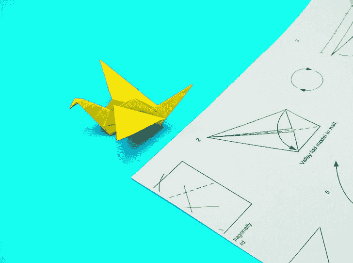
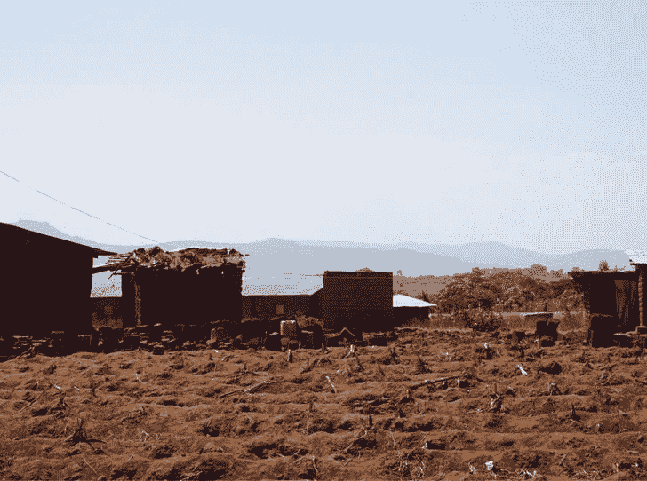
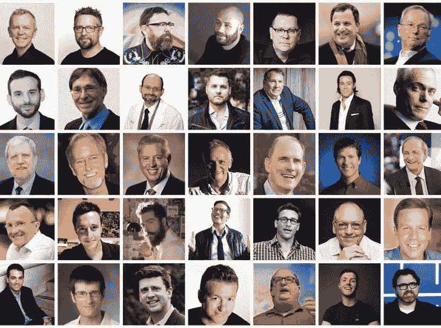
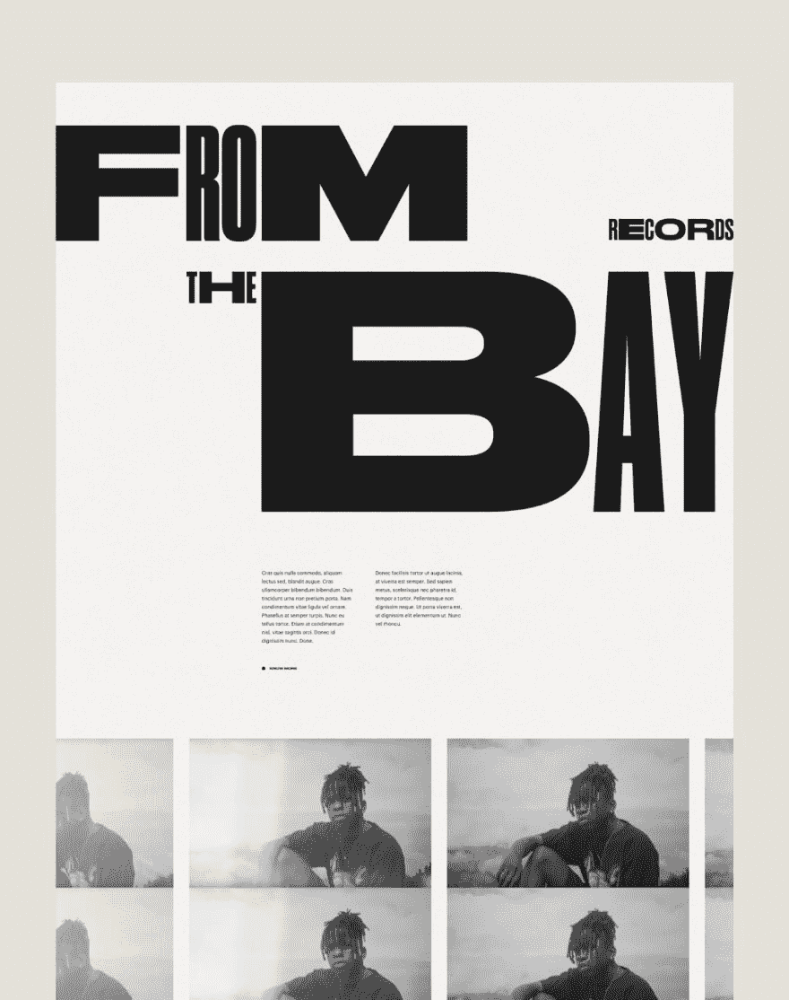
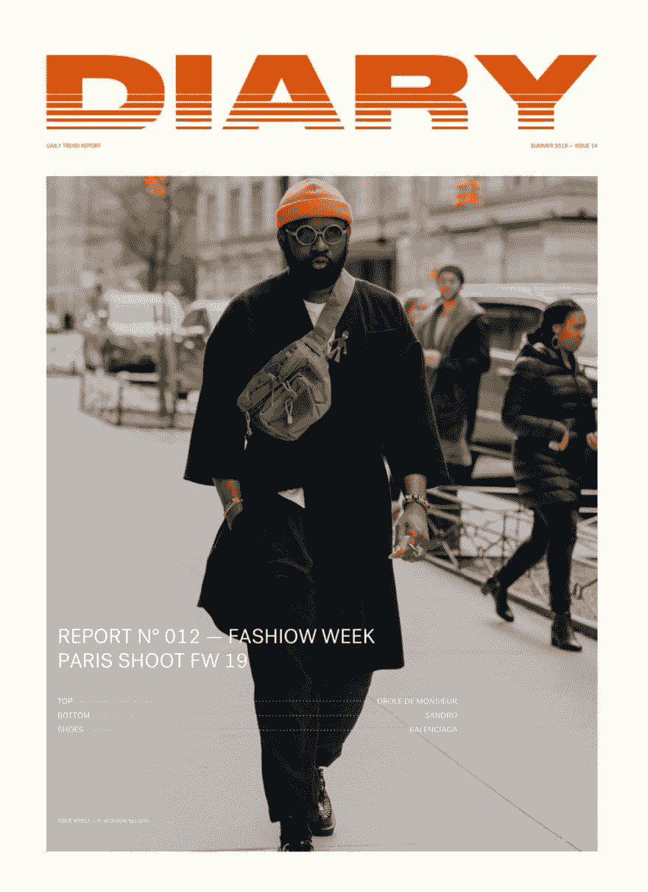
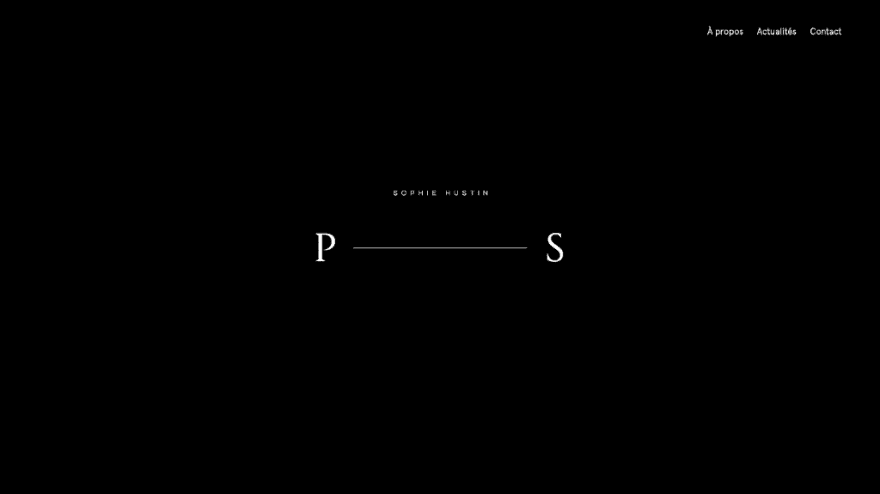

# 糟糕的设计师、气候变化、三角形设计师——本周还有更多 UX

> 原文：<https://dev.to/uxcollective/bad-designers-climate-change-triangle-shaped-designer-and-more-ux-this-week-1mpn>

#### *每周精选的设计链接，由你在 UX 集体的朋友带给你。*

“UX”这个词背后隐藏着糟糕的设计师吗？T3【→

UX 的设计师已经习惯了不对产品的最终外观负责，他们已经危险地远离了视觉设计工艺。

*   [**非用户伦理**](https://youthedata.com/2019/08/14/why-ethical-responsibility-for-tech-should-extend-to-non-users/) →责任是否应该延伸到非用户？
*   [**响应式网页**](https://dev.to/browserlondon/should-we-still-be-selling-responsive-web-design-cg2) →为什么我们还在卖响应式网页设计？

### 来自社区的故事

**→

由[阿迦·索斯泰克](https://medium.com/u/a1d379bddce3)**

 **

[**应对气候变化的弹性设计原则**](https://uxdesign.cc/product-design-principles-to-address-climate-change-8bb6e839f80d?source=friends_link&sk=53b7e34f4795891e9a4e16cb8c8bd237) →

作者[克里斯塔·唐纳森](https://medium.com/u/794bb8718c19)

[**10 个不是白人写的好设计**](https://uxdesign.cc/10-good-design-reads-that-arent-written-by-white-men-58943255d04e?source=friends_link&sk=f6292c5647d1a2f082706673b2c8ea73) →

安娜·萨拉森诺

更多头条新闻:

*   [**停止试图做出空中手势**](https://uxdesign.cc/stop-trying-to-make-air-gestures-happen-6ed6d76d55b7?source=friends_link&sk=8fff721065dda6ef76045ef1b1c747a1) → By [UX 羊驼](https://medium.com/u/57d82e2076ed)
*   [**如何成为三角形设计师**](https://uxdesign.cc/how-to-be-a-triangle-shaped-designer-cd44c605fbe?source=friends_link&sk=282162115459090a30bb53c6c99101f3) → By [阿曼·古普塔](https://medium.com/u/ca1e31f90a3e)
*   [**嘿，达美乐，你不送**](https://uxdesign.cc/hey-dominos-you-re-not-delivering-cc11fb74b267?source=friends_link&sk=7a63eafaffee69ee66e49aa0544972b5) →作者[凯瑟琳·麦克纳利](https://medium.com/u/888572c20b65)
*   [**UX 作为存在主义营销的副产品**](https://uxdesign.cc/ux-as-a-byproduct-of-existential-marketing-43fc6ebb00e2?source=friends_link&sk=06bc01e81338a4d99ee0a8061de83285) →作者[拉斐尔·贾兹](https://medium.com/u/9b48e198e695)
*   [**WeWork 写作:他们说的话每个月有 147 万的浏览量**](https://uxdesign.cc/wework-copywriting-what-they-say-to-1-47-million-pageviews-every-month-cd5373b08364?source=friends_link&sk=d2f2c5b231658122663a9f704a21b3dc) →作者
*   [**以投资者为中心的设计(以及创业失败的路径)**](https://uxdesign.cc/investor-centric-design-and-the-path-to-startup-failure-f7b948457c49?source=friends_link&sk=1844140c4192692ac1d274edadd30a2a) →作者[亨利·莱瑟姆](https://medium.com/u/244613a5d810)
*   [**真的必须是作坊吗？**](https://uxdesign.cc/does-it-have-to-be-a-workshop-9c242a05a43d?source=friends_link&sk=55777ae774de6c726fe779c043a308c4) →由[大卫·舍温](https://medium.com/u/5dd0e912d51f)

### 新闻&观点

*   [**设计层次**](https://docs.google.com/document/d/1qIH-eNkP4rNF0M1eCsHQNwRTWrP9Yg1-XUqWHPTKAkg/edit) →对讲机对层次和期望的规定。
*   [**打字延迟**](https://input-delay.glitch.me/) →输入延迟多烦人太烦人？
*   [**Chart.xkcd**](https://timqian.com/chart.xkcd/) →一个带有卡通风格图表的图表库。
*   [**给这款应用定价**](https://www.mcguffincg.com/what-consumers-would-pay-for-popular-free-apps/) →研究显示消费者给热门应用赋予多少价值。

 

<figcaption>特色作品:[蒂博·阿利→](http://www.thibaudallie.com/)</figcaption>

### 工具&资源

*   [**Threed**](https://threed.io/) →直接在浏览器中生成 3D 模型。
*   [**Get pasta**](https://getpasta.com/)→MAC 最灵活的剪贴板管理器。
*   [**如何换行**](https://css-tricks.com/almanac/properties/l/line-clamp/) →在特定行数截断文本。
*   [**负责任地工作**](https://www.workresponsibly.org/) →收集健康平衡的工作方法所需的资源。

* * ***