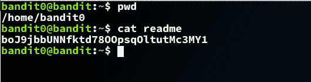

# 越线强盗 0 级 1 级演练

> 原文：<https://dev.to/kkaosninja/bandit-level-0-level-1-walk-through-18ah>

挑战页面= >[https://overthewire.org/wargames/bandit/bandit1.html](https://overthewire.org/wargames/bandit/bandit1.html)

记住一条信息，以避免任何混淆。

当一个强盗等级被称为 X 级-> Y 级时，这意味着你需要使用你已经拥有的 X 级也就是 banditX **的凭证来获得 Y 级也就是用户强盗的密码。**

在我们的例子中，我们有 bandit0 的凭证，所以我们需要使用这个获得 bandit1 的密码。

现在一切都清楚了，让我们看看说明。

> 下一级的密码存储在主目录下的 readme 文件中。使用这个密码通过 SSH 登录 bandit1。每当你找到一个关卡的密码时，使用 SSH(在端口 2220 上)登录到那个关卡并继续游戏。

**特别注意下面的章节**

> 解决这一关可能需要的命令
> ls，cd，cat，file，du，find

在许多情况下，当你正为下一步该做什么而绞尽脑汁时，命令列表是设计者留下微妙线索的地方。所以千万不要忽视。

提示 1:您需要以 bandit0 身份登录，然后获取存储在名为“readme”的文件中的密码。您认为哪个命令最适合显示文件内容？

* * *

提示 2:这是一个简单的挑战。试着谷歌一下，或者更好的是避开它！

* * *

很确定你想通了:)。即便如此，以下是解决方案

