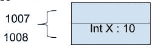
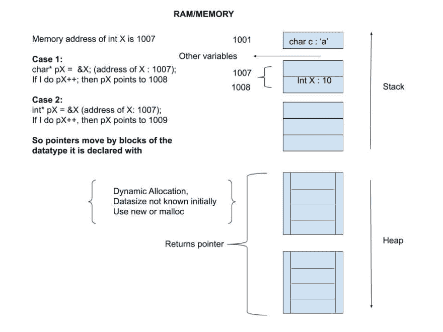
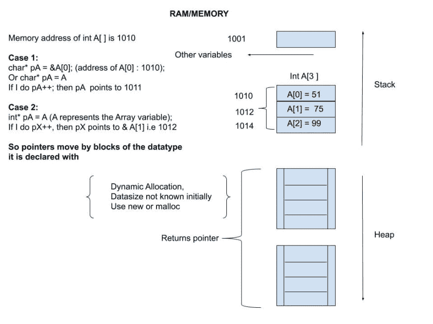
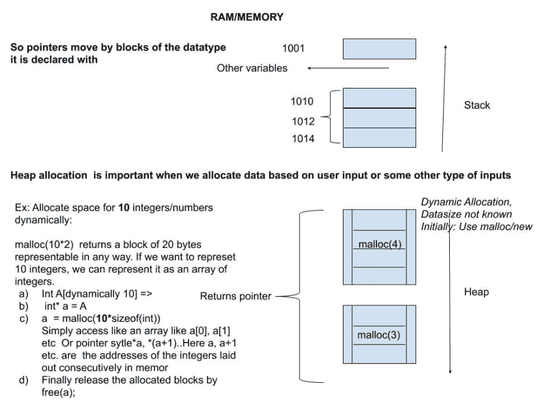

# 初学者的基本“C 指针”概念

> 原文：<https://dev.to/lucpattyn/basic-c-pointer-concepts-for-beginners-1epa>

*本文假设读者对[位和字节](https://en.wikipedia.org/wiki/Byte)有一个基本的概念。
也绝对的初学者可能想先看看前奏:
[初学者基本编程概念](https://dev.to/lucpattyn/basic-programming-concepts-for-beginners-2o73)*

在深入探讨指针之前，我们先讨论一下什么是指针，为什么需要指针。

什么是指针？

所有的语言都有变量，不管你是否明确声明了它们。在 C(和 C++)中，变量必须和它们的数据类型(字符、整数等)一起显式声明。
例如，int X = 10 形式的表达式表示 X 是一个整数类型变量，它占用内存中的 2 个字节(在某些情况下，根据编译器类型为 4 个字节)，值为 10。

图- a
 
这里 1007 和 1008 用来表示整数 X 用来保存值 10 的两个连续内存空间的各自地址。

指针只是一个变量，它能够保存这样的地址(1007，1008)并访问它所保存的地址内的值。请注意，这些地址可能不是那么好的数字

所以简单来说-
*指针就是一个指向其他变量的内存位置/地址的变量。*
例如，如果 int X 是一个整数变量，那么一个指针保存(或指向)变量 X 的第一个字节地址(图-a 的情况下是 1007)。

**为什么是指针？**

对于许多类型的应用程序来说，使用变量进行操作就足够了，但是当速度是一个主要因素，并且您需要从硬件中获得最佳性能时，您会选择指针。

指针赋予了 C/C++等低级语言非凡的能力，如处理数据、对图像进行特效处理、快速处理矩阵、访问操作系统分配的内存、视频缓冲区等。

指针可以用来以很高的速度遍历连续的内存位置，在遍历的同时，它可以超快地检查和操作数据。它可以用于将数据快速传递给其他过程/函数。对于图像/视频处理、渲染、应用效果，指针的性能是无与伦比的。与数组索引相比，指针在许多情况下能够表现出更好的性能。所以，在低级编程中(比如 C 和汇编)，内存和指针的知识是必须的。
但是在很好的掌握指针之前，最好对 RAM 的内存布局有一个基本的概念。

**堆栈、堆和指针..**

内存在概念上分为两个部分:堆栈和堆。

下图是内存和变量的概念表示

图- b

当我们事先知道所需的内存量时，堆栈用于声明变量和数组。在堆栈中声明变量非常容易。比如只写 int n，立刻分配一个 2 字节(或者 4)的空间。

声明 int array[100],然后立即分配一个连续的内存空间来保存 100 个整数。

当我们在堆栈中不断声明变量时，变量被一个接一个地堆叠起来。

堆的情况不同。在堆中，操作系统管理内存，我们请求操作系统分配一块内存给我们使用。然后，操作系统决定在内存堆中的什么地方创建一个块。在 C 中，我们通常使用 malloc 来实现这一点，而在 C++中，新的关键字做得更好。

通常，当内存分配依赖于用户输入或基于运行应用程序前不可预见的某些情况时，就需要堆分配。

如果我们事先知道飞机上有 500 个座位，那么我们可以在堆栈中声明 int seats[500]来保存座位相关数据。
座位相关数据可以简单到 1 或 0，以表示座位是否被预订。
然而，如果我们不知道某一天有多少乘客将登机，并且我们依赖于操作员在航班起飞前输入这些信息，那么我们使用 malloc 在堆中保留足够的空间来保存乘客数据。

如果是 Stack 中的变量，比如“int x”，要访问 x 中包含的值，我们只需使用 x (ex。y = x + 1)。
为了知道 x 的内存地址，我们用& x. & x 返回为整数保留的内存中两个连续字节的第一个字节地址。但是简单地写下 x 只是给了我们一个地址，但是为了处理这个地址，我们需要把它存储在某个地方，因此需要指针。
指针是一个足够大的变量，可以容纳一个内存地址。

为了区分普通变量和指针，我们在声明过程中使用了一个*号，例如
char* p 或 int* p.
你可以把它写成 char * *p* ，int * *p* 这样，但我个人更喜欢把它写成 char* *和 int* *这样，它们显式地把指针与数据类型关联起来。

如前所述，我们需要指针和指针算法来快速检查内存地址，必要时快速访问数据。如果 p 是一个指向内存地址的指针，*p 用于访问内存地址中的值。这是一个让年轻程序员困惑的部分，因为他们把它和指针 p.
的声明混淆了，当声明我们在使用 a *时，然后当访问一个地址中的值时，我们也在访问 a *。
我建议用以下方式将其概念化:

1)指针类型数据用* *声明；*因此，一旦我们第一次写入 int* p 或 int *p，就会创建一个足够大的内存空间来保存一个内存地址(通常是 8 到 16 个字节，具体取决于硬件的性质)。

2)在声明之后，只要我们给指针分配一些内存地址或者用指针做指针算术，我们就简单地使用指针变量名(例如。p = q + 1)

3)像 int x 这样的普通变量有两个属性:一个是我们通过变量名访问的值，另一个是我们通过&x;
访问的它的内存位置为了存储变量的地址(也就是& x ),我们需要一个指针，我们已经像 int* p 一样声明了它；
所以我们写 p = & x，意思是:
* x 的存储地址(即& x)指向之前已经声明的指针 p。

4)稍后，如果我们需要知道存储在 p 所指向的内存地址中的值是什么，我们使用*p。

换一种说法，
当你看到类似 int* p = & x 的语句时，我们实际上是将两个语句合并为一个，即
I)int * p；
ii)p =&x；

根据上图(图 b ),您可以看到两种情况(情况 1 和情况 2)。

有趣的是——一个指针实际上不需要一个 char/integer 数据类型与之相关联，你可以写 void* p = (void*) &x;
我们在声明的时候指定了数据类型，以便让编译器理解当你试图对它进行操作时指针应该如何动作。

在第一种情况下，声明一个字符指针(即 char* p)意味着指针操作是基于字节的，所以如果你写一些 p++，p 将指向下一个字节。如果你写 char* q = p + 1，q 就指向紧接在 p 后面一个字节的内存地址。

对于情况 2，int* p = &x 和 p++，p 跳过两个字节。在 int* q = p + 1 的情况下，q 将跳过两个字节(整数的大小)并指向整数 p 之后的下一个地址块。

因此，有了指针，我们可以自由地在内存中移动，但是要记住，自由越大，责任越大。

那么数组和它们的指针呢？

数组是一块连续的内存字节。

指向数组的指针的概念对于像 int x 这样的普通变量几乎是一样的，但是稍微解释一下可能会有帮助:

当我们处理一个数组的指针时，技巧是将指针赋给数组的头(即数组第一项的地址)。

如果我们用 int myArray[3]在 stack 中声明一个数组，数组的第一个元素是 Array[0]，数组[0]的地址可以通过应用于普通变量的相同技术来检索。
记得我们把 int x 的地址赋给指针 p 为:
p =&x；因此，对于 myArray[0]，我们用同样的方法
p =&myArray[0]；

为了方便阅读，我们规定将&myArray[0]写成 myArray。
所以不用 p = & myArray[0]，我们可以写成 p = myArray

一些初学者认为 myArray 也是一个指针变量，因为我们可以直接给指针赋值。其实不然，myArray 只是一种方便的重写方式&myArray[0]。
不能做 myArray++或 myArray = Array1(其中 Array1 是某个其他数组变量)。
就像& x + 1 会跳过 x 取下一个地址，myArray + 1 会跳过 myArray[0]指向下一个地址。(所以 myArray + 1 就是 myArray 的地址[1])

我们最多可以说:
*如果我们有一个名为 myArray 的数组，用 int myArray[100]在堆栈中声明，那么 myArray 表示第一个元素的内存地址(即& myArray[0])，也是堆栈变量 myArray 的名称，占用了内存中的一大块空间。*

希望下图(图- c)能阐明数组背后的整个概念，与图 b 中的情况 1 和 2 相比，情况 1 和情况 2 更有意义:

图- c

现在我们已经讨论了一点堆栈，让我们把注意力转向堆。

堆中的变量是通过 malloc 和 new (new 只适用于 C++)这样的系统调用来分配的。由于操作系统选择了内存中的位置，访问内存的唯一方法就是通过指针。

所以像 malloc 这样的函数获取要分配的连续字节数，并返回一个地址/位置给所分配的内存，我们将它保存在一个指针中供以后访问。

例，
int numOfPassengers = 10；
int * p = malloc(number of passengers * sizeof(int))；
p[0] = 1(或*p = 1)
p[1] = 1(或*(p+1) = 1)

这里，因为我们计划分配一个整数数组，所以通过 sizeof 我们首先得到一个 int 的大小(通常是 2 或 4，取决于编译器)。然后将 sizeof(int)乘以预期的整数个数(例如 10)，我们得到 10 个整数所需的分配大小。

(*在 C++里东西看起来有点干净像 int** p = new int[10]；)

当我们处理完内存和块中包含的值时，我们必须通过调用 free(例如 free(p))，否则程序将会泄漏内存并可能被系统关闭。

下图进一步展示了从点 **a** 到 **d** 的堆分配。
步骤 A 表示需要分配连续放置在内存中的块，它基本上是一个数组(表达式 A[dynamic 10]只是我们需要一个动态数组的思维过程的反映)。
步骤 b 告诉我们，我们需要一个指针来保存数组
*我们还没有对分配的内存做任何事情，这不是 C 代码的一部分，只是解释在采取行动之前的思考过程*。
*步骤 c* 是实际的 C 代码，它执行我们在步骤 A 和 b 中讨论的操作，即 malloc(10*sizeof(int))执行动态声明 int A[10]的工作，指针 int* a 指向该数组。
步骤 d 是关于工作完成后释放内存。

图- d

希望，这有助于消除很多打算以 C/C++深入复杂系统开始惊心动魄的职业生涯的初学者所面临的困惑。

结束，
Mukit

附注:初学者的任务-尝试分析封面图像中发生的事情(ok int **ptr 应命名为 int **doubleptr)。提示:指针是一个变量，可以被另一个指针指向