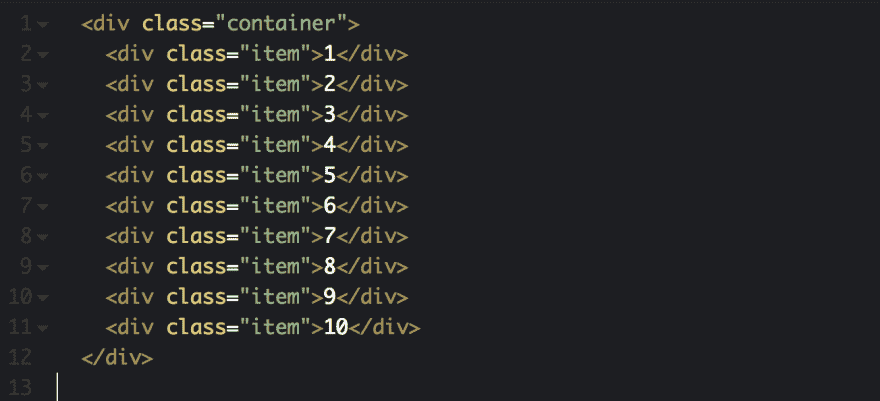
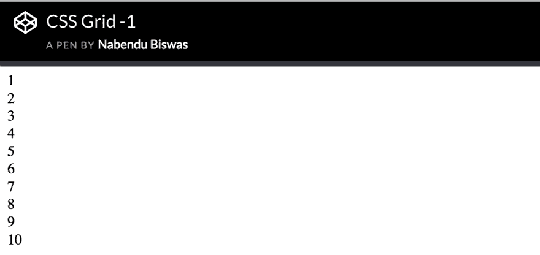
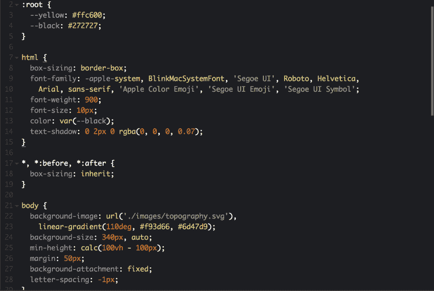
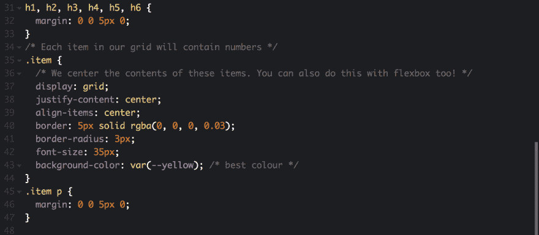
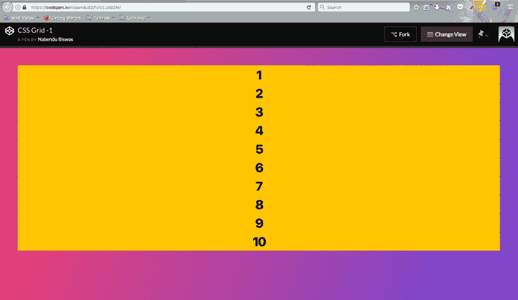
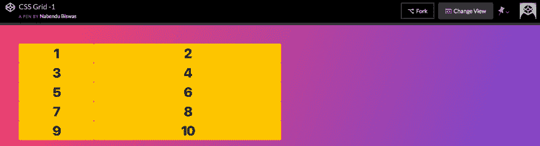
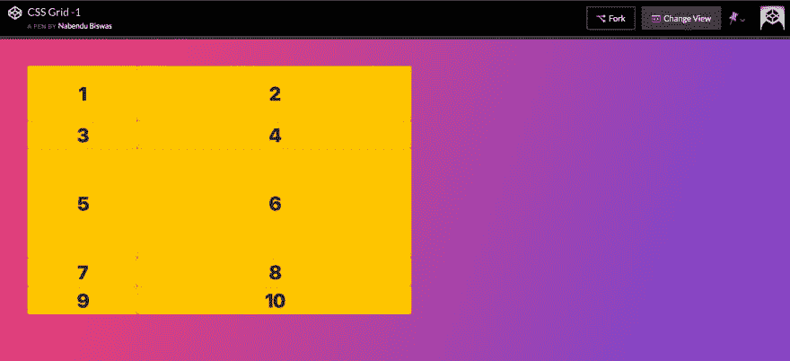
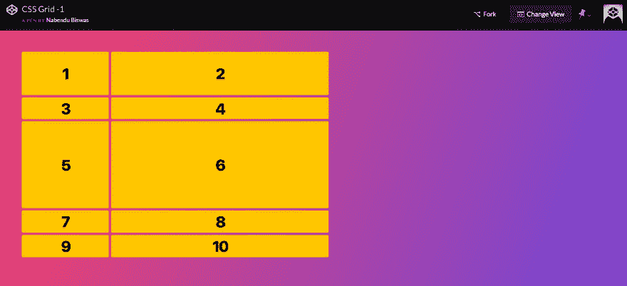

# CSS 网格基础-1

> 原文：<https://dev.to/nabendu82/basics-of-css-grid-1-3c9a>

正如我在之前关于 flexbox 的博客中所写的，它帮助我走出了引导陷阱。我还使用了 CSS 的另一个新功能，叫做 grid。这是一个很棒的系统，可以用来开发整个网站。

我通常在我的项目中使用 flexbox 和 Grid 的组合。CSS grid 可以很容易地将整个页面分成列和行，并且有很多种放置元素的方式。

快速参考 Grid [这篇关于 CSS 技巧的](https://css-tricks.com/snippets/css/complete-guide-grid/)文章的最佳资源。

然后还有来自[韦斯·博斯](https://cssgrid.io/)的这个很棒的**免费**教程。这个博客系列也是受那个系列的启发和基于那个系列的。

我将在教程中使用这个[笔](https://codepen.io/nabendu82/full/zJddGM/)。

让我们首先在一个包含类容器的 div 中创建一些包含类项的 div。正如您所假设的，容器将是 Grid，项目将是它的子容器。

[ ](https://res.cloudinary.com/practicaldev/image/fetch/s--bm80tj0v--/c_limit%2Cf_auto%2Cfl_progressive%2Cq_auto%2Cw_880/https://cdn-images-1.medium.com/max/2608/1%2AjyBELuQZa8vvVc9sz4DfiQ.png) *基本分部*

它将产生下面的。因为 div 是行级元素，所以每个 div 将一个接一个地堆叠。

[](https://res.cloudinary.com/practicaldev/image/fetch/s--H00TAdq3--/c_limit%2Cf_auto%2Cfl_progressive%2Cq_auto%2Cw_880/https://cdn-images-1.medium.com/max/2344/1%2AeeKzoPkJI-CDpp_BrpwzyQ.png)T3】结果

让我们做一点发型，这样看起来会更好。所有教程都将使用相同的基本样式。它包含了基本的字体，背景颜色和 css 来居中显示项目的内容。

[ ](https://res.cloudinary.com/practicaldev/image/fetch/s--LKwpQqu4--/c_limit%2Cf_auto%2Cfl_progressive%2Cq_auto%2Cw_880/https://cdn-images-1.medium.com/max/3696/1%2AH-XbRINY-HJzNxTwRDD55A.png) *基础 css-1*

[ ](https://res.cloudinary.com/practicaldev/image/fetch/s--IMNKaACP--/c_limit%2Cf_auto%2Cfl_progressive%2Cq_auto%2Cw_880/https://cdn-images-1.medium.com/max/3688/1%2A_UfdnzxVBJvc-_bK5K7BGg.png) *基础 css -2*

现在我们的代码笔看起来像。

[ ](https://res.cloudinary.com/practicaldev/image/fetch/s--O2sPW19b--/c_limit%2Cf_auto%2Cfl_progressive%2Cq_auto%2Cw_880/https://cdn-images-1.medium.com/max/5756/1%2A1DaWCVG6CNHYDSoX1bK97w.png) *美女*

现在让我们开始磨碎。与 flexbox 一样，我们添加了 display 属性。我们将在 CSS 中添加以下内容。

```
.container {
 display: grid;
 } 
```

如果我们检查，它不会改变什么。因为在网格中我们必须指定列和/或行属性。列属性由 **grid-template-columns** 指定。所以，下面的意思是创建两列。一个 200 像素，另一个 500 像素。

```
.container {
      display: grid;
      grid-template-columns: 200px 500px;
    } 
```

这会将我们的 10 个项目排列成 200px 和 500px 两列。

[ ](https://res.cloudinary.com/practicaldev/image/fetch/s--ktK0egFS--/c_limit%2Cf_auto%2Cfl_progressive%2Cq_auto%2Cw_880/https://cdn-images-1.medium.com/max/5760/1%2A76Ia3nIqKL2Z8x4qS36gQg.png) *安排*

现在让我们通过 grid-template-rows 添加 row 属性。下面将创建 3 行—100 像素、50 像素和 200 像素；

```
.container {
      display: grid;
      grid-template-columns: 200px 500px;
      grid-template-rows: 200px 100px 300px;
    } 
```

这将导致下面的结果。但是等等，我们有 5 行和最后 2 行，不需要我们指定的大小。创建它们是因为我们有更多的项目可以放入我们的 2 列 3 行系统。因此，grid 创建了它们，并将行高作为其中数字的默认高度。我们将在后面的系列文章中了解更多。

[](https://res.cloudinary.com/practicaldev/image/fetch/s--Ltc5XgOi--/c_limit%2Cf_auto%2Cfl_progressive%2Cq_auto%2Cw_880/https://cdn-images-1.medium.com/max/5760/1%2ArXrdqTTQ-2aSk7IZZR4nZQ.png)

最后，让我们添加一些项目之间的差距。这可以通过属性 **grid-gap** 在 Grid 中轻松完成。

```
.container {
      display: grid;
      grid-template-columns: 200px 500px;
      grid-template-rows: 100px 50px 200px;
      grid-gap: 5px;
    } 
```

这导致行和列都有 5px 的间隙。

[ ](https://res.cloudinary.com/practicaldev/image/fetch/s--YYsxQ2AP--/c_limit%2Cf_auto%2Cfl_progressive%2Cq_auto%2Cw_880/https://cdn-images-1.medium.com/max/5760/1%2A_TxXU0NDM16MGP0Cfmn2mA.png) *本教程的最终形象*