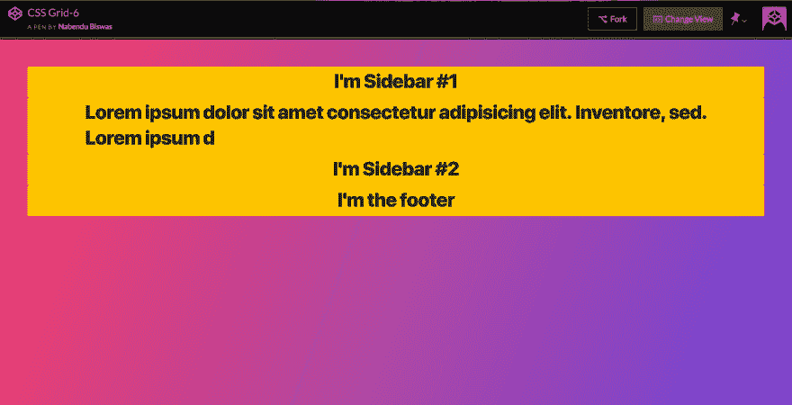
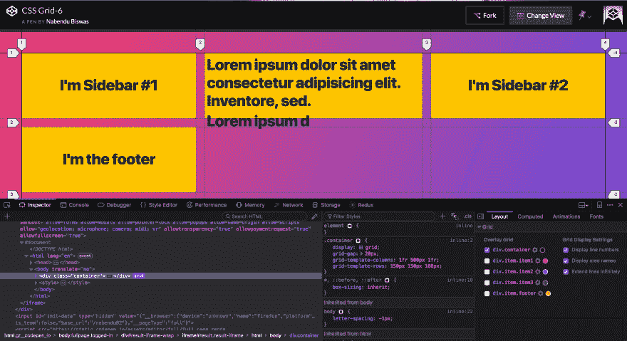
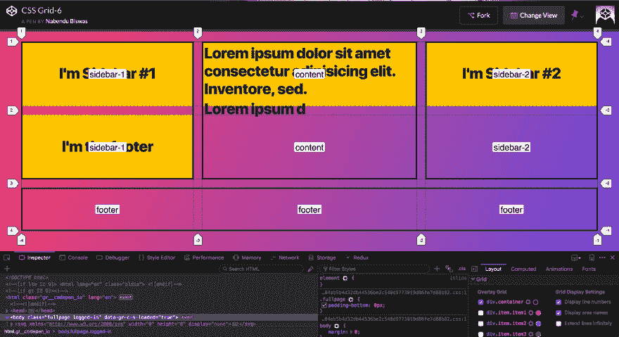
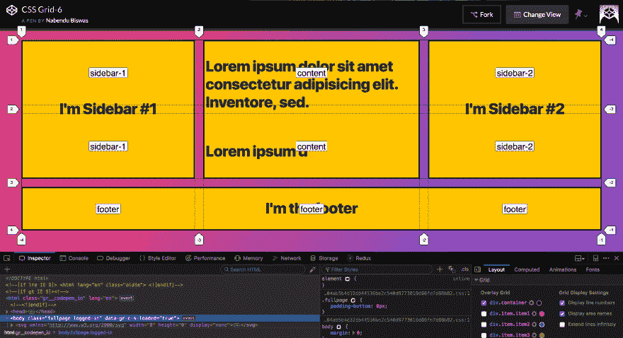
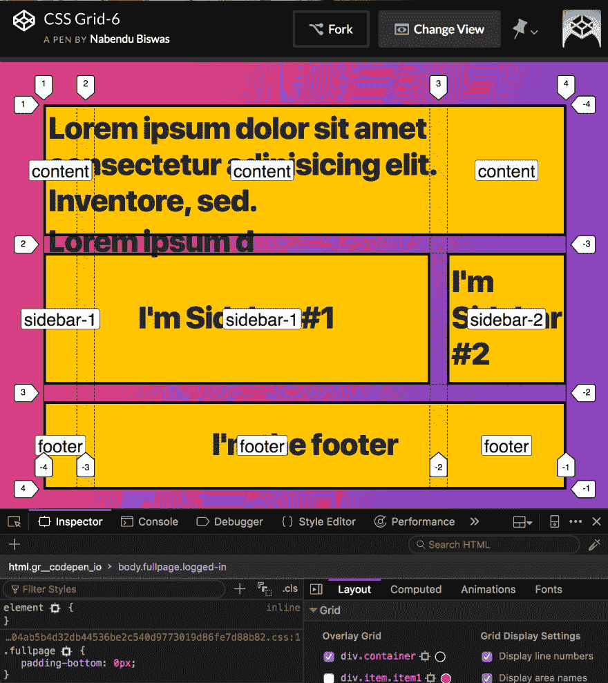
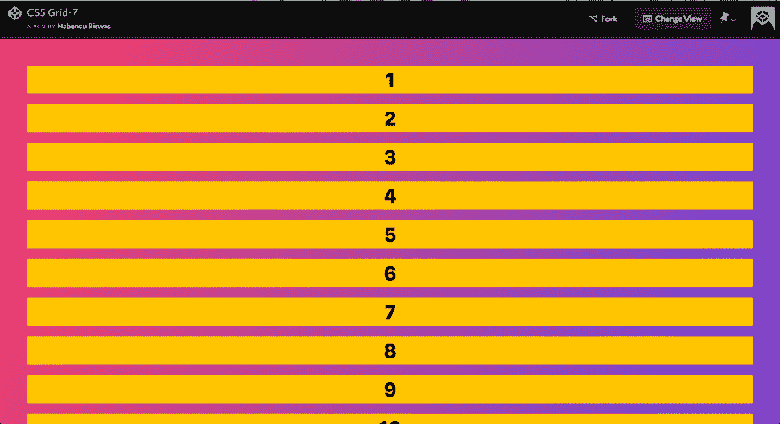
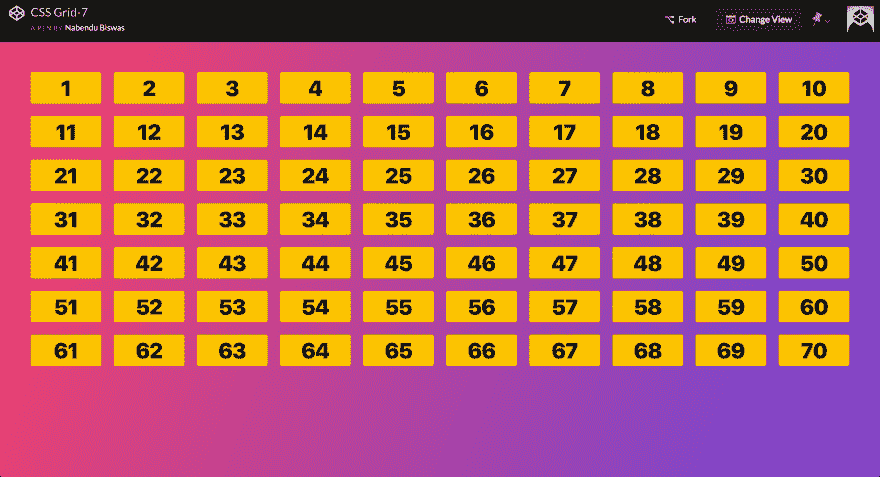
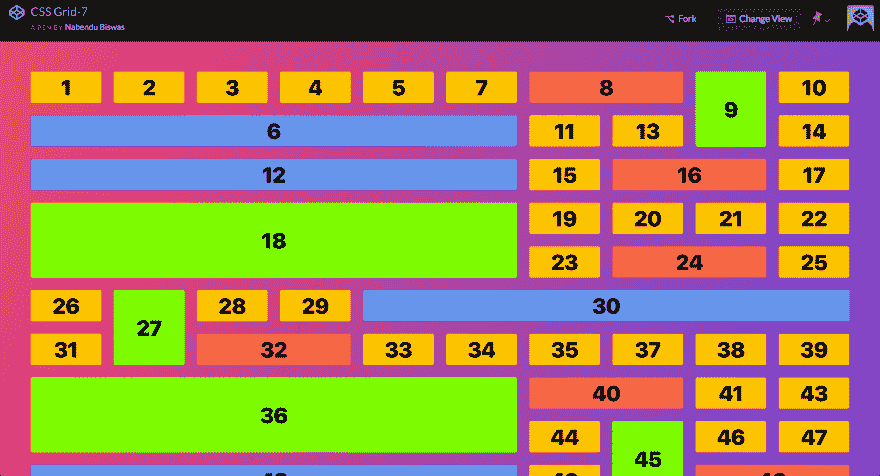

# CSS 网格基础-6

> 原文：<https://dev.to/nabendu82/basics-of-css-grid-6-1dfb>

欢迎来到本系列的第 6 部分。

在本系列的第 4 部分中，我们使用了网格-列和网格-行的概念来放置项目。在这一部分中，我们将使用另一个强大的网格概念，称为**网格模板区域**来放置项目。

我们将在教程中使用这个[代码笔](https://codepen.io/nabendu82/full/Eeorqx/)。本教程使用基本代码如下。

```
<div class="container">
    <div class="item item1">
      <p>I'm Sidebar #1</p>
    </div>
    <div class="item item2">
      <p>Lorem ipsum dolor sit amet consectetur adipisicing elit. Inventore, sed.</p>
      <p>Lorem ipsum d</p>
    </div>
    <div class="item item3">
      <p>I'm Sidebar #2</p>
    </div>
    <div class="item footer">
      <p>I'm the footer</p>
    </div>
  </div> 
```

也就是下面。我们基本上想有一个 2 边栏，一个主要内容和页脚。

[ ](https://res.cloudinary.com/practicaldev/image/fetch/s--KhA_4Wnu--/c_limit%2Cf_auto%2Cfl_progressive%2Cq_auto%2Cw_880/https://cdn-images-1.medium.com/max/5760/1%2AUTjaypUscWVyXlKPifdClA.png) *基础知识*

现在，我们将有网格布局。我们将有 3 列和 3 行。

```
.container {
      display: grid;
      grid-gap: 20px;
      grid-template-columns: 1fr 10fr 1fr;
      grid-template-rows: 150px 150px 100px;

} 
```

[](https://res.cloudinary.com/practicaldev/image/fetch/s--Gtie6wgx--/c_limit%2Cf_auto%2Cfl_progressive%2Cq_auto%2Cw_880/https://cdn-images-1.medium.com/max/5760/1%2AsVUUJdpIRkxT-KcIRUPt2Q.png)T3】结果

现在，让我们有 2 个侧栏，1 个主要内容和 1 个页脚布局。我们通过网格-模板-区域来实现，格式如下。我们提到每一行将包含什么。

```
.container {
      display: grid;
      grid-gap: 20px;
      grid-template-columns: 1fr 10fr 1fr;
      grid-template-rows: 150px 150px 100px;
      grid-template-areas:
        "sidebar-1  content   sidebar-2"
        "sidebar-1  content   sidebar-2"
        "footer     footer    footer"

} 
```

现在我们的布局与开发工具打开，将显示模板区域。

[ ](https://res.cloudinary.com/practicaldev/image/fetch/s--B1x_SLYo--/c_limit%2Cf_auto%2Cfl_progressive%2Cq_auto%2Cw_880/https://cdn-images-1.medium.com/max/5760/1%2Aw4M20lYyMvY7rhjplGouVQ.png) *模板区域*

现在要放置内容，我们只需选择项目，然后使用**网格区域**。在下面的页脚代码中，我们将使用**。页脚{grid-area:页脚；}**
我们选择页脚类，然后使用 grid-area 属性。

```
<body>
  <div class="container">
    <div class="item item1">
      <p>I'm Sidebar #1</p>
    </div>
    <div class="item item2">
      <p>Lorem ipsum dolor sit amet consectetur adipisicing elit. Inventore, sed.</p>
      <p>Lorem ipsum d</p>
    </div>
    <div class="item item3">
      <p>I'm Sidebar #2</p>
    </div>
    <div class="item footer">
      <p>I'm the footer</p>
    </div>
  </div>

<style>
 .container {
      display: grid;
      grid-gap: 20px;
      grid-template-columns: 1fr 10fr 1fr;
      grid-template-rows: 150px 150px 100px;
      grid-template-areas:
        "sidebar-1  content   sidebar-2"
        "sidebar-1  content   sidebar-2"
        "footer     footer    footer"
    }

   .footer {
      grid-area: footer;
    }

.item1 {
      grid-area: sidebar-1;
    }

.item2 {
      grid-area: content;
    }

.item3 {
      grid-area: sidebar-2;
    }

</style>
</body> 
```

[](https://res.cloudinary.com/practicaldev/image/fetch/s--su1GxbNn--/c_limit%2Cf_auto%2Cfl_progressive%2Cq_auto%2Cw_880/https://cdn-images-1.medium.com/max/5760/1%2AB9lB6HUUcKhcHnKV6gBYyA.png)T3】结果

通过使用网格模板区域，使用媒体查询也非常容易。您只需定义新的布局。我们定义了一个宽度为 700 像素的媒体查询，如下所示。

```
[@media](http://twitter.com/media) (max-width: 700px) {
      .container {
        grid-template-areas:
          "content    content     content"
          "sidebar-1  sidebar-1   sidebar-2"
          "footer     footer      footer"
      }
    } 
```

这就形成了完美的平板电脑布局。

[ ](https://res.cloudinary.com/practicaldev/image/fetch/s--G0MhxNF5--/c_limit%2Cf_auto%2Cfl_progressive%2Cq_auto%2Cw_880/https://cdn-images-1.medium.com/max/2784/1%2AqFHj2jfDZra5fCf6Kf93lg.png) *牌匾布局*

我们将研究网格的一个惊人特性，通过它我们可以创建传说中的**砖石布局**。

我们将使用这个[代码笔](https://codepen.io/nabendu82/full/QVaRjM/)来完成这一部分。它有 70 个项目。

```
<body>
  <div class="container">
    <div class="item item1">1</div>
    <div class="item item2">2</div>
    <div class="item item3">3</div>
    <div class="item item4">4</div>
    <div class="item item5">5</div>
    <div class="item item6">6</div>
    <div class="item item7">7</div>
    <div class="item item8">8</div>
    <div class="item item9">9</div>
    <div class="item item10">10</div>
    <div class="item item11">11</div>
    <div class="item item12">12</div>
    <div class="item item13">13</div>
    <div class="item item14">14</div>
    <div class="item item15">15</div>
    <div class="item item16">16</div>
    <div class="item item17">17</div>
    <div class="item item18">18</div>
    <div class="item item19">19</div>
    <div class="item item20">20</div>
    <div class="item item21">21</div>
    <div class="item item22">22</div>
    <div class="item item23">23</div>
    <div class="item item24">24</div>
    <div class="item item25">25</div>
    <div class="item item26">26</div>
    <div class="item item27">27</div>
    <div class="item item28">28</div>
    <div class="item item29">29</div>
    <div class="item item30">30</div>
    <div class="item item31">31</div>
    <div class="item item32">32</div>
    <div class="item item33">33</div>
    <div class="item item34">34</div>
    <div class="item item35">35</div>
    <div class="item item36">36</div>
    <div class="item item37">37</div>
    <div class="item item38">38</div>
    <div class="item item39">39</div>
    <div class="item item40">40</div>
    <div class="item item41">41</div>
    <div class="item item42">42</div>
    <div class="item item43">43</div>
    <div class="item item44">44</div>
    <div class="item item45">45</div>
    <div class="item item46">46</div>
    <div class="item item47">47</div>
    <div class="item item48">48</div>
    <div class="item item49">49</div>
    <div class="item item50">50</div>
    <div class="item item51">51</div>
    <div class="item item52">52</div>
    <div class="item item53">53</div>
    <div class="item item54">54</div>
    <div class="item item55">55</div>
    <div class="item item56">56</div>
    <div class="item item57">57</div>
    <div class="item item58">58</div>
    <div class="item item59">59</div>
    <div class="item item60">60</div>
    <div class="item item61">61</div>
    <div class="item item62">62</div>
    <div class="item item63">63</div>
    <div class="item item64">64</div>
    <div class="item item65">65</div>
    <div class="item item66">66</div>
    <div class="item item67">67</div>
    <div class="item item68">68</div>
    <div class="item item69">69</div>
    <div class="item item70">70</div>
  </div>

<style>
    .container {
      display: grid;
      grid-gap: 20px;
    }
  </style>
</body> 
```

[ ](https://res.cloudinary.com/practicaldev/image/fetch/s--EUrGXm6t--/c_limit%2Cf_auto%2Cfl_progressive%2Cq_auto%2Cw_880/https://cdn-images-1.medium.com/max/5760/1%2AVJs6CJc9RmvClPw9zpNyTQ.png) *基础知识*

现在我们有 10 列，每列 1fr。

```
.container {
      display: grid;
      grid-gap: 20px;
      grid-template-columns: repeat(10, 1fr);
    } 
```

[](https://res.cloudinary.com/practicaldev/image/fetch/s--hBAee_WL--/c_limit%2Cf_auto%2Cfl_progressive%2Cq_auto%2Cw_880/https://cdn-images-1.medium.com/max/5760/1%2AaG-cVKId0G41a6YmcJHO8A.png)T3】结果

现在让我们添加一些不规则的项目，使他们不同的大小。

```
.item:nth-child(6n) {
      background: cornflowerblue;
      grid-column: span 6;
    }

    .item:nth-child(8n) {
      background: tomato;
      grid-column: span 2;
    }

.item:nth-child(9n) {
      background: lawngreen;      
      grid-row: span 2;
    } 
```

这将导致这其中有许多空白空间。

[](https://res.cloudinary.com/practicaldev/image/fetch/s--9M0hH51u--/c_limit%2Cf_auto%2Cfl_progressive%2Cq_auto%2Cw_880/https://cdn-images-1.medium.com/max/5760/1%2AO10K4Ho5ywA5vbVEyBlv4Q.png)T3】结果

现在只有一个属性 *grid-auto-flow* :密集；解决这个问题。该酒店试图通过移动物品来优化闲置空间。

```
.container {
      display: grid;
      grid-gap: 20px;
      grid-template-columns: repeat(10, 1fr);
      grid-auto-flow: dense;
    }

    .item:nth-child(6n) {
      background: cornflowerblue;
      grid-column: span 6;
    }

    .item:nth-child(8n) {
      background: tomato;
      grid-column: span 2;
    }

.item:nth-child(9n) {
      background: lawngreen;      
      grid-row: span 2;
    } 
```

[ ](https://res.cloudinary.com/practicaldev/image/fetch/s--MKwGqlgb--/c_limit%2Cf_auto%2Cfl_progressive%2Cq_auto%2Cw_880/https://cdn-images-1.medium.com/max/5760/1%2A1S-gpTg79OwXFGMviCnWYA.png) *完美的砖石*

这导致了完美的砌筑，但是不能保证项目的顺序。所以，我们应该只在项目顺序不重要的时候使用它。

本教程的第 6 部分到此结束。