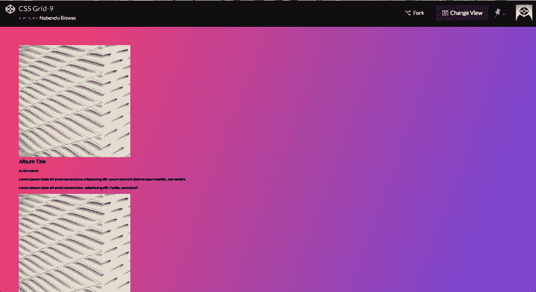
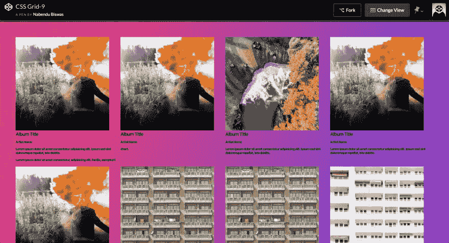
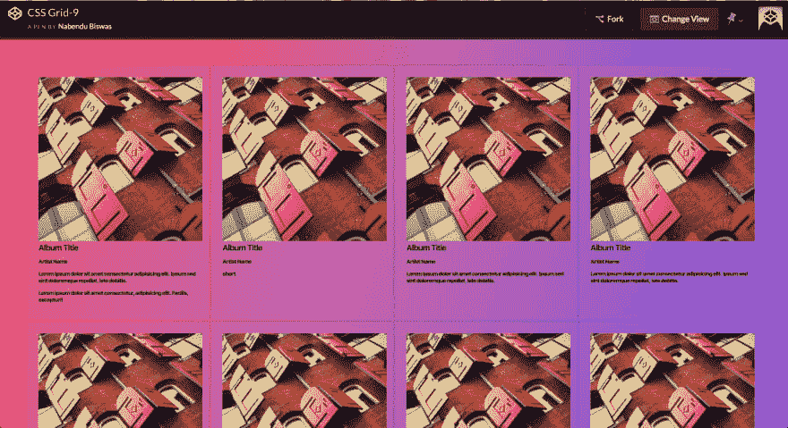
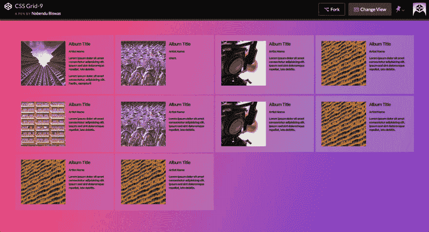
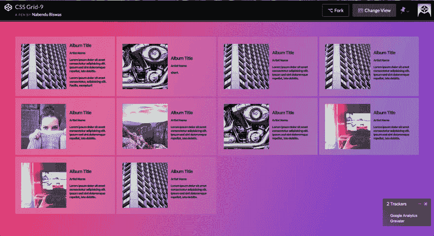
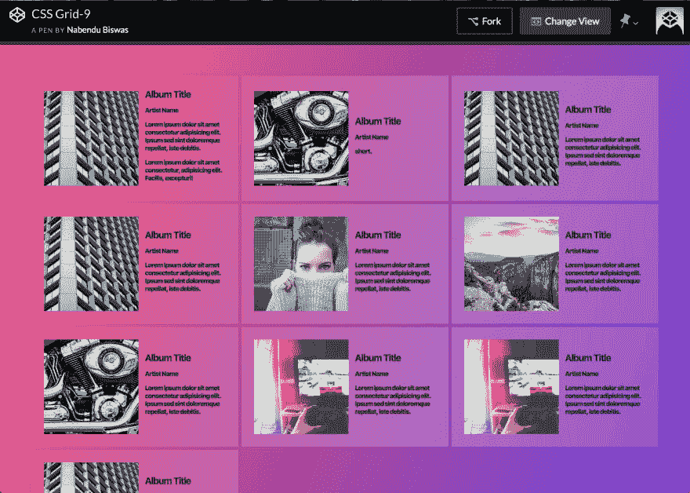
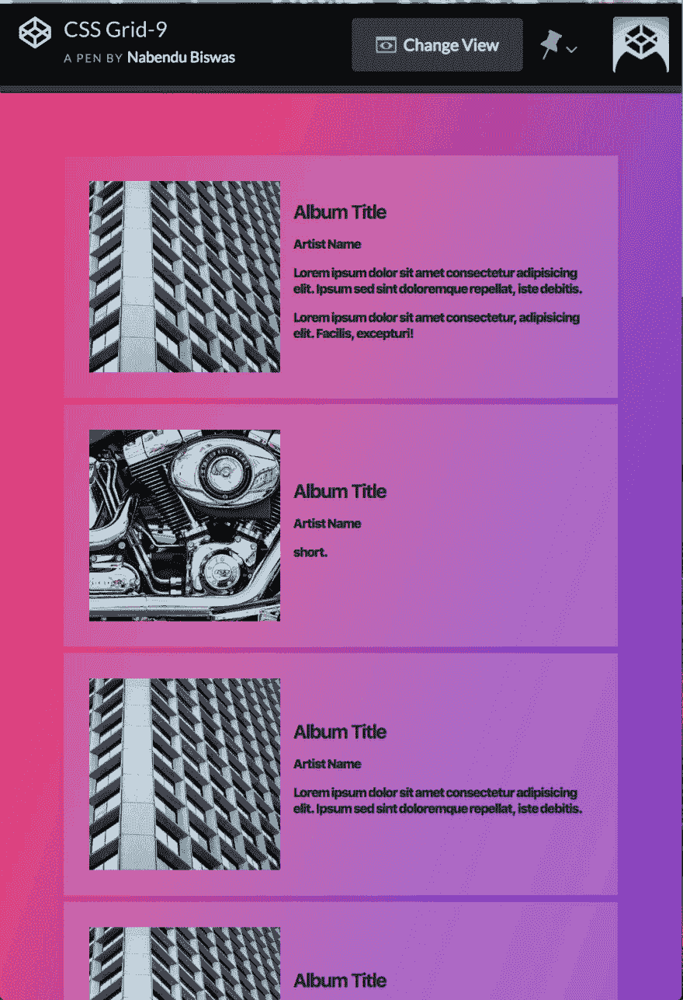

# CSS 网格基础-8

> 原文：<https://dev.to/nabendu82/basics-of-css-grid-8-1n1f>

欢迎来到这个系列的最后一部分。

我们将把这个[代码笔](https://codepen.io/nabendu82/full/qMKBOw/)用于相册布局页面。没有任何风格(通用风格除外)的基础代码在这里。

```
 <body>

    <div class="albums">
        <div class="album">
          
          <div class="album__details">
            <h2>Album Title</h2>
            <p class="album__artist">Artist Name</p>
            <p class="album__desc">Lorem ipsum dolor sit amet consectetur adipisicing elit. Ipsum sed sint doloremque repellat, iste debitis.</p>
            <p class="album__desc">Lorem ipsum dolor sit amet consectetur, adipisicing elit. Facilis, excepturi!</p>
          </div>
        </div>
        <div class="album">
          
          <div class="album__details">
            <h2>Album Title</h2>
            <p class="album__artist">Artist Name</p>
            <p class="album__desc">short.</p>
          </div>
        </div>
        <div class="album">
          
          <div class="album__details">
            <h2>Album Title</h2>
            <p class="album__artist">Artist Name</p>
            <p class="album__desc">Lorem ipsum dolor sit amet consectetur adipisicing elit. Ipsum sed sint doloremque repellat, iste debitis.</p>
          </div>
        </div>
        <div class="album">
          
          <div class="album__details">
            <h2>Album Title</h2>
            <p class="album__artist">Artist Name</p>
            <p class="album__desc">Lorem ipsum dolor sit amet consectetur adipisicing elit. Ipsum sed sint doloremque repellat, iste debitis.</p>
          </div>
        </div>
        <div class="album">
          
          <div class="album__details">
            <h2>Album Title</h2>
            <p class="album__artist">Artist Name</p>
            <p class="album__desc">Lorem ipsum dolor sit amet consectetur adipisicing elit. Ipsum sed sint doloremque repellat, iste debitis.</p>
          </div>
        </div>
        <div class="album">
          
          <div class="album__details">
            <h2>Album Title</h2>
            <p class="album__artist">Artist Name</p>
            <p class="album__desc">Lorem ipsum dolor sit amet consectetur adipisicing elit. Ipsum sed sint doloremque repellat, iste debitis.</p>
          </div>
        </div>
        <div class="album">
          
          <div class="album__details">
            <h2>Album Title</h2>
            <p class="album__artist">Artist Name</p>
            <p class="album__desc">Lorem ipsum dolor sit amet consectetur adipisicing elit. Ipsum sed sint doloremque repellat, iste debitis.</p>
          </div>
        </div>
        <div class="album">
          
          <div class="album__details">
            <h2>Album Title</h2>
            <p class="album__artist">Artist Name</p>
            <p class="album__desc">Lorem ipsum dolor sit amet consectetur adipisicing elit. Ipsum sed sint doloremque repellat, iste debitis.</p>
          </div>
        </div>
        <div class="album">
          
          <div class="album__details">
            <h2>Album Title</h2>
            <p class="album__artist">Artist Name</p>
            <p class="album__desc">Lorem ipsum dolor sit amet consectetur adipisicing elit. Ipsum sed sint doloremque repellat, iste debitis.</p>
          </div>
        </div>
        <div class="album">
          
          <div class="album__details">
            <h2>Album Title</h2>
            <p class="album__artist">Artist Name</p>
            <p class="album__desc">Lorem ipsum dolor sit amet consectetur adipisicing elit. Ipsum sed sint doloremque repellat, iste debitis.</p>
          </div>
        </div>

    </div>

    <style>

    </style>
    </body> 
```

我们有一个**相册**类，它包含了所有的**相册**。每个**相册**都有一个来自 unsplash 的大小为 300x300 的随机图像。然后是一个**相册 _ _ 细节**类，它包含一个标题( **h2** )、一个带有**相册 _ _ 艺术家**类的段落以及一两个带有**相册 __desc** 类的段落。

[ ](https://res.cloudinary.com/practicaldev/image/fetch/s--JpRE4BFb--/c_limit%2Cf_auto%2Cfl_progressive%2Cq_auto%2Cw_880/https://cdn-images-1.medium.com/max/5760/1%2Anazw1s0C8qGiUUHajc3ckg.png) *没有任何风格*

我们想让我们的相册完全响应，所以我们将使用下面的代码用于**相册**类。

```
 .albums {
          display: grid;
          grid-template-columns: repeat(auto-fit, minmax(300px, 1fr));
          grid-gap: 5px;
        } 
```

我们的色谱柱使用 minmax，宽度为 300px 或 1fr。这将导致我们的大部分完全响应布局已经完成。

[ ](https://res.cloudinary.com/practicaldev/image/fetch/s--xsUGdA9x--/c_limit%2Cf_auto%2Cfl_progressive%2Cq_auto%2Cw_880/https://cdn-images-1.medium.com/max/5760/1%2ATeX6RnLf073oJ0wv8Z0eMw.png) *漂亮的一个*

让我们给每个单独的相册，背景，框阴影和填充。

```
 .albums {
          display: grid;
          grid-template-columns: repeat(auto-fit, minmax(300px, 1fr));
          grid-gap: 5px;
        }

       .album {
          background: rgba(255, 255, 255, 0.2);
          box-shadow: 0 0 5px rgba(0, 0, 0, 0.1);
          padding: 20px;
        } 
```

这将导致下面的结果。

[](https://res.cloudinary.com/practicaldev/image/fetch/s--ZIgpdc3x--/c_limit%2Cf_auto%2Cfl_progressive%2Cq_auto%2Cw_880/https://cdn-images-1.medium.com/max/5760/1%2AWQtHeZ4gIrUH9hcWxCdyyg.png)T3】结果

现在，我们希望相册细节显示在图像的右侧。因此，我们将使每张专辑也成为一个网格。它将有两列-150 像素和 1fr 宽。

```
 .album {
          background: rgba(255, 255, 255, 0.2);
          box-shadow: 0 0 5px rgba(0, 0, 0, 0.1);
          padding: 20px;
          display: grid;
          grid-template-columns: 150px 1fr;
          grid-gap: 10px;
        } 
```

我们遇到了一个问题。我们的图像没有采用期望的 150 像素的列，而是采用了它的原始大小 300 像素。

[ ](https://res.cloudinary.com/practicaldev/image/fetch/s--HO0u1ZcR--/c_limit%2Cf_auto%2Cfl_progressive%2Cq_auto%2Cw_880/https://cdn-images-1.medium.com/max/5760/1%2AJv5d9_bG72rmgqfk4sSeFA.png) *一只臭虫*

我们可以通过选择图像类 **album__artwork** 并使宽度为 100%来修复它。

```
 .album__artwork {
          width: 100%;
        } 
```

[ ](https://res.cloudinary.com/practicaldev/image/fetch/s--BsFyEGqC--/c_limit%2Cf_auto%2Cfl_progressive%2Cq_auto%2Cw_880/https://cdn-images-1.medium.com/max/5760/1%2AHdeGb8Ba2eYWSifliRhafA.png) *问题解决*

让我们做最后一件事，垂直对齐我们的相册类的列。

```
 .albums {
          display: grid;
          grid-template-columns: repeat(auto-fit, minmax(300px, 1fr));
          grid-gap: 5px;
        }

       .album {
          background: rgba(255, 255, 255, 0.2);
          box-shadow: 0 0 5px rgba(0, 0, 0, 0.1);
          padding: 20px;
          display: grid;
          grid-template-columns: 150px 1fr;
          grid-gap: 10px;
          align-items: center;
        }   

        .album__artwork {
          width: 100%;
        } 
```

这将导致我们的最终产品。

[ ](https://res.cloudinary.com/practicaldev/image/fetch/s--Nok11o6N--/c_limit%2Cf_auto%2Cfl_progressive%2Cq_auto%2Cw_880/https://cdn-images-1.medium.com/max/5760/1%2AJzKLQoXa6BJPXLgBVq7boQ.png) *桌面视图*

[ ](https://res.cloudinary.com/practicaldev/image/fetch/s--GocIHEbe--/c_limit%2Cf_auto%2Cfl_progressive%2Cq_auto%2Cw_880/https://cdn-images-1.medium.com/max/4384/1%2AuCjO7Kl5qU2W_N0fr0V72g.png) *石碑查看*

[ ](https://res.cloudinary.com/practicaldev/image/fetch/s--6tvmp_xs--/c_limit%2Cf_auto%2Cfl_progressive%2Cq_auto%2Cw_880/https://cdn-images-1.medium.com/max/2144/1%2AsT1RGWguUcZMdfGujmrcrA.png) *移动视图*

> 所以，你可以看到我们制作了一个完全响应的专辑布局，*没有使用任何媒体查询*。

CSS 网格系列到此结束。希望你能从中学到一些有用的东西。