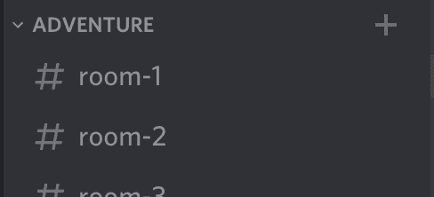
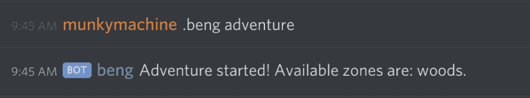
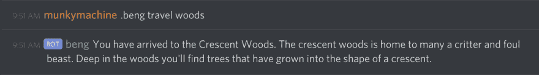

# 战斗引擎开发日志#2 -冒险时间

> 原文：<https://dev.to/kamajigames/battle-engine-devlog-2-adventure-time-21hh>

欢迎回到战斗引擎开发博客！我要炫耀一下 *beng* 的下一个重大技术关和核心机械师，开始一场冒险。

我们必须决定如何开始一次冒险，从哪里开始，以及如何维持。

*   在一个由 beng 发起的群 DM？
*   在一个由 beng 创建的文本频道中？
*   在服务器管理员创建的预定义频道中？

我们登陆了预先定义好的频道，现在是为了探险使用，因为这是最容易设置和清晰定义的。您可以在服务器上输入这些预定义的房间之一:

[](https://res.cloudinary.com/practicaldev/image/fetch/s--nWsjdt0_--/c_limit%2Cf_auto%2Cfl_progressive%2Cq_auto%2Cw_880/https://thepracticaldev.s3.amazonaws.com/i/qmb2j7ot9wjrwpnvio1f.png)

一旦进入一个房间，简单地要求 beng 开始一次冒险。如果该频道中还没有正在进行的冒险，将会创建一个新的会话。

```
.beng adventure 
```

[](https://res.cloudinary.com/practicaldev/image/fetch/s--ggqQ9khj--/c_limit%2Cf_auto%2Cfl_progressive%2Cq_auto%2Cw_880/https://thepracticaldev.s3.amazonaws.com/i/eath5645vq0qxlri2okp.png)

一旦你开始冒险，你就可以决定你想去哪里旅行。我们认为我们应该定义不同的地点(区域)来适应变化。在撰写本文时，已经定义了一个起始区，新月形树林！

```
.beng travel woods 
```

[](https://res.cloudinary.com/practicaldev/image/fetch/s--N5r6E8HN--/c_limit%2Cf_auto%2Cfl_progressive%2Cq_auto%2Cw_880/https://thepracticaldev.s3.amazonaws.com/i/675cci1z8vvdreo47z0g.png)

这是停下来提及*鼻涕虫* (s)的好时机，因为“woods”是新月形伍兹的鼻涕虫。所有在战斗引擎中设计的信息都必须有一个一致的标识符，通过文本与那个东西交互。是的，鼻涕虫*可以*被改变，但这是不可能的，因为我们将希望保持一致性，向后兼容。

开始冒险的最后，也可能是最令人兴奋的部分是邀请你的朋友。我们想要两个世界中最好的:

*   作为一群朋友与冒险互动
*   允许其他人观看和评论冒险，而不需要参与

为了实现这两个目标，团队领导者(开始冒险的人)可以通过名字邀请其他不和谐的用户。

```
.beng invite @Blaschko#2026 
```

现在我们准备好狂欢了！下节课是回合制战斗的基础。

来和我们打声招呼吧！[加入战斗引擎不和](https://discord.gg/cG2ReFR)。

想帮忙或报告一个错误？查看当前问题，并在 GitLab 上为 [Battle Engine 投稿。欢迎所有技能和经验水平，无论是内容写作，艺术，发展，或只是想法！](https://gitlab.com/kamajigames/battle-engine)