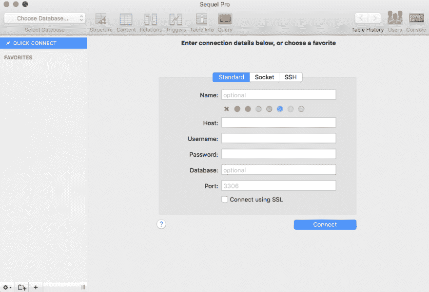
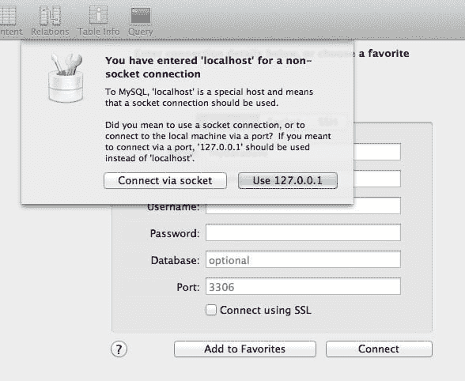
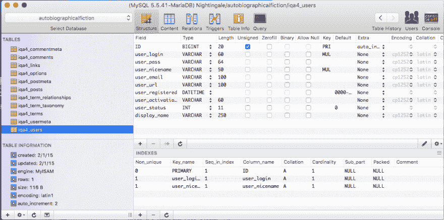

# 成为专业人士:续集专业人士

> 原文：<https://dev.to/chapmancarin/be-a-pro-a-sequel-pro-1ami>

我并不羞于承认:我热爱 MySQL。我喜欢要求高、紧张的原始 MySQL 查询以及它们所有愚蠢的、天后式的要求。我喜欢含糊不清的错误消息，它几乎没有提供任何关于错误的信息，同时让你觉得自己像个傻瓜，不知道自己的错误是什么。

我喜欢 MySQL 的所有这些，因为 MySQL 就像我一样:脾气暴躁、傲慢、无所不知的混蛋。更重要的是，MySQL 对待我就像我对待我的合作伙伴一样。

我也会这样做，比如告诉我的伴侣他搞砸了，但拒绝明确地告诉他他是如何搞砸的，让他自己去解决(他应该已经解决了)。我也对他发表令人讨厌的、学究式的评论(他应该自己解析它们的意思)。我也提出了过分的要求，比如毛巾必须如何折叠，我的哪些衣服不能放在烘干机里(不，我不在乎标签上说可以放在烘干机里，那些裤子永远不能放在烘干机里，非常感谢你，先生)。

我不知道他为什么和我在一起。我不确定为什么我会留在 MySQL。
这也是我决定尝试 Sequel Pro 的原因。

正如 Sequel Pro 的人所说，该程序是“一个快速、易于使用的 Mac 数据库管理应用程序，用于处理 MySQL 数据库。”这里注意，这只是针对 Mac 用户的。如果你喜欢 PC(实际上我也喜欢)，你应该看看 MySQL Workbench。但是回到以 Mac 为中心的 Sequel Pro。这是一个非常简单、直观的程序，可以在这里免费下载。

你可以把 Sequel Pro 想象成一个烤箱手套。你一定要有吗？没有。但是(在这里，让我们假装我知道如何烹饪东西，并且在我的生活中以前做过类似“制作砂锅”的事情，哈，是的，我肯定没有做过)当你从烤箱中取出砂锅时，如果你先戴上烤箱手套来保护自己免受烤箱/MySQL 会暴露给你的所有烫伤，这肯定会更容易和更令人愉快。

Sequel Pro 介于您和 MySQL 之间，为您提供了一种更加直观和简单的方式来完成诸如编写查询、创建和管理数据之间的关系等工作。
其实一开始就很直观。一旦你下载并打开它，你会看到这个屏幕

这是我见过的最不吓人的编码相关页面之一。这很好。
在那里，如果你点击“连接”，而没有在空白处输入任何信息，Sequel Pro 会提示你这个

`Insufficient details provided to establish a connection. Please enter at least the hostname.`

如果你是一个像我一样的人(无知，不清楚这里/那里/任何地方发生了什么，只是试图假装直到我成功)，那么你可能会这样，“嗯，好吧，我不知道我的主机名是什么，但我知道每次我创建 MySQL 数据库时，我只需将' localhost '作为主机，将' root '作为用户，所以我将尝试用' localhost '作为' host '空白，用' root '作为' username '空白。”你可以输入，然后 Sequel Pro 会非常友好地提示你这条清晰的信息:

在这一点上，即使你不知道 127.0.0.1 是什么，你可能会想，“127 听起来不像插座那么奇怪，所以说吧，给我那个，”你会明智地选择年轻的学徒。Sequel Pro 会像雨后的雏菊一样向你敞开心扉。

从那里，你会看到，像魔术一样，Sequel Pro 已经可以访问你机器上的所有 MySQL 数据库。它们会在左上角的“选择数据库”下拉列表中，如上图所示。

一旦你选择了一个数据库，你可以打开任何一个表，得到一个类似这样的视图

看看这个组织和结构是多么干净！不用再费力地在终端中查看您的表和/或编写半英里长的查询来美化您的表的内容视图，只是为了使它们清晰易读。现在，您只需双击一个表格，就可以获得这个美妙的对称视图。请注意您识别主键的速度有多快。请注意，对于数据的“类型”等内容，您有下拉选项，这有助于避免在您今天已经键入 VARCHAR 50 次时出现的语法错误。

最后，我最喜欢的部分之一是底部的“索引”部分，它向您展示了一个表的主键和外键之间的关系，只需快速浏览一下就可以轻松理解。更好的是，如果您导航到“Relations”屏幕，它会给出外键是什么、它们来自哪个表以及它们的名称和列在这个表中是什么的漂亮布局。所有这些都使得剖析 MySQL 表及其关系更加容易。

最后我必须提到的是，Sequel Pro 实际上会*告诉你你的错误是什么*如果你有任何错误。如果你没有对 MySQL 做过太多的修改，这听起来可能没什么大不了的，但是一旦你看到这个错误大约 70 多次，

`You have an error in your SQL syntax: check the manual that corresponds to your MySQL version for the right syntax to use near 'id int AUTO_INCREMENT PRIMARY KEY, setup varchar(250) NOT NULL,' at line 2`

而你*仍然*还没有看到任何关于你编码的“手册”,你已经准备好让别人告诉你你该死的错误是什么了。

最近，当我不得不将一个 690 行、15 列的 CSV 文件导入 MySQL 数据库时，我开始欣赏 Sequel Pro 的这个特性。文件中有一个错误，我花了几个小时在 MySQL 上，试图猜测它可能是什么。不过，当我切换到使用 Sequel Pro 时(导入和导出数据也有非常直观的功能)，我导入了 CSV 文件，编写了一个查询，并立即在我的查询的一部分下面得到了曲线。徘徊在这一部分，Sequel Pro 直接告诉我，我不能在列名中使用“Dec ”,因为它是一个保留关键字，是 MySQL 中“decimal”的缩写。现在，你可能会认为 MySQL 足以提醒我这一事实，但是没有。就像是，“我不喜欢你或者你提出的问题，我拒绝帮助你们任何一个。”Sequel Pro 两分钟，问题就解决了。

简而言之，尽管我仍然认为 MySQL 是最好的，Sequel Pro 使数据更容易查看/理解，并且它在处理错误方面是老大。我非常支持在获得一个让一切变得更容易的安全网之前，知道如何在最基础的层面上做事情，所以我仍然建议先学习原始的 MySQL。但之后，下载 Sequel Pro，为自己节省时间。另外，请知道我实际上并没有把我的伴侣当狗屎。那只不过是一个玩笑，让我明白我的意思。但是 MySQL 是合法的。