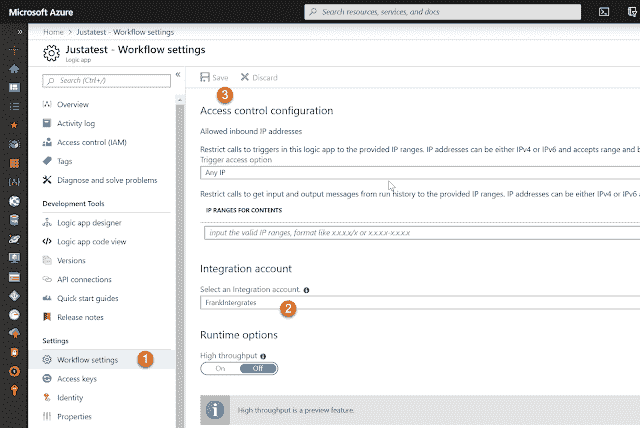
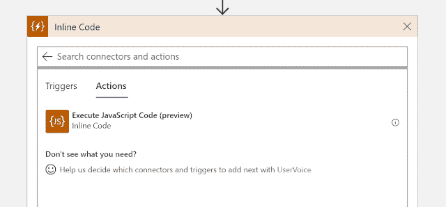
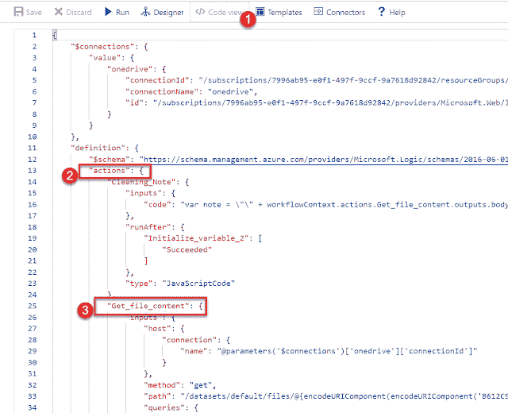
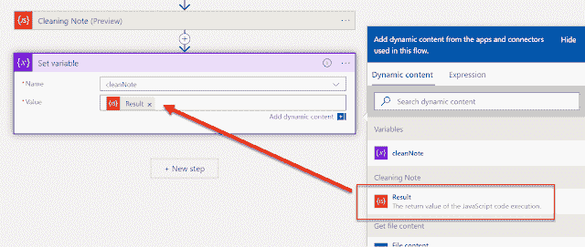
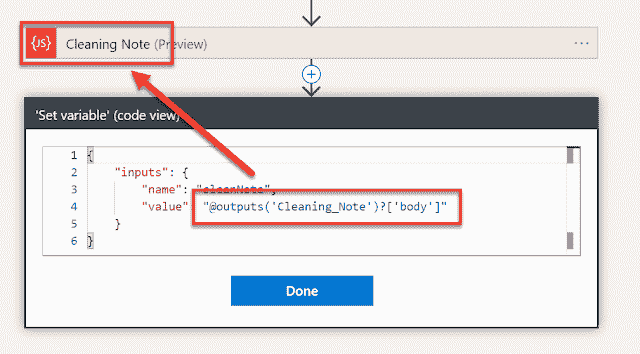
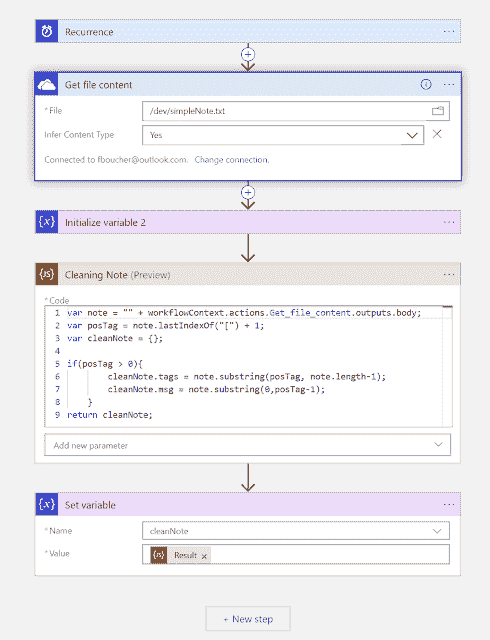
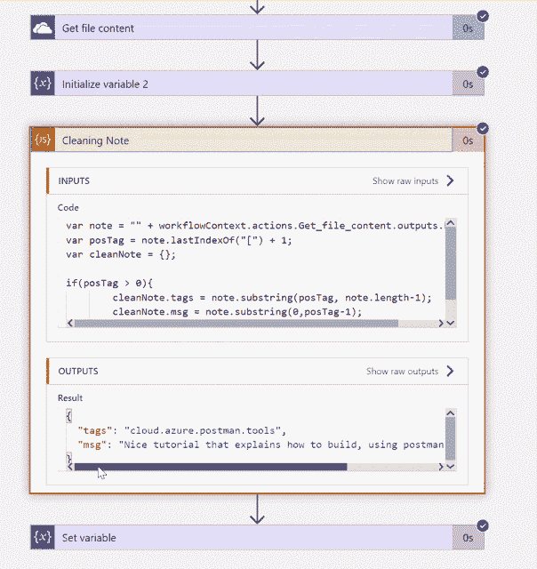

# 通过在 Azure Logic 应用中使用内联代码来提高工作效率

> 原文：<https://dev.to/fboucheros/be-more-productive-by-using-inline-code-in-your-azure-logic-app-1hk2>

在我正在做的一个使用 Azure Logic 应用的项目中，我需要操作字符串。我可以创建 API 或 Azure 函数，但代码非常简单，没有使用任何外部库。在这篇文章中，我将向您展示如何使用新的内联代码直接在您的逻辑应用程序中执行您的代码片段。

### 快速上下文

Logic 应用程序将从我的 OneDrive 中读取一个文件(它也可以与 DropBox、Box 等一起使用。).这里有一个文件的例子:

```
Nice tutorial that explains how to build, using postman, an efficient API.[cloud.azure.postman.tools] 
```

目标是从文本中提取方括号中包含的标签。

### 逻辑 App:获取文件内容

从 Azure 门户，通过点击左上角的大绿色“+”按钮并搜索 Logic App 来创建一个新的 Logic App。

对于这个演示，我将使用*间隔*作为触发器，因为我将手动执行逻辑应用程序。

第一步是从 OneDrive 连接器执行**获取文件内容**操作。一旦您授权 Azure 访问您的 OneDrive 文件夹，请选择您要读取的文件。对我来说，是`/dev/simpleNote.txt`

### 积分账户

要访问 **workflowContext** ，Azure Logic 应用程序需要一个集成帐户。下一步是创建一个。保存当前逻辑 App，点击右上角的大“+”按钮。这一次寻找整合。选择**积分账户**，并完成表格创建。

[](https://1.bp.blogspot.com/-GWYRjJYFpAk/XQKuEXiwVzI/AAAAAAAA9Eg/qwzrnrrdUP8MydX2oSRWAizZHlaC7AungCLcBGAs/s1600/SetIntegrationAccount.png)

我们现在需要将它分配给我们的逻辑应用程序。从 Logic App blade 的选项列表中选择工作流设置。然后选择您的集成帐户，不要忘记保存！

### 逻辑 App:内联代码

要在工作流程结束时添加操作，请单击*新步骤*按钮。搜索**内嵌代码**，选择动作**执行 JavaScript 代码**。

[](https://1.bp.blogspot.com/-MZY5Yq_cZZo/XQKuDVCiRKI/AAAAAAAA9EY/LxVwK2SlhVw9dw3uofRePmzcYbIToGgIACEwYBhgL/s1600/ExecuteJSCode.png)

在将代码复制粘贴到新的*内联代码*动作之前，让我们快速浏览一下。

```
var note = "" + workflowContext.actions.Get_file_content.outputs.body;
var posTag = note.lastIndexOf("[") + 1;
var cleanNote = {};

if(posTag > 0)
{ 
   cleanNote.tags = note.substring(posTag, note.length-1); 
   cleanNote.msg = note.substring(0,posTag-1); 
}
return cleanNote; 
```

在第一行，我们指定一个变量*注意*的内容 **Get_file_content** 输出。我们使用 workflowContext 访问它。该上下文可以访问触发器和操作。要查找操作的名称，可以用下划线字符“_”替换空格。

[](https://1.bp.blogspot.com/-SbmvidS1dFs/XQKuDXOQPCI/AAAAAAAA9Ew/jOdt_uYOnNwGZ3cfLmw7AS8OsL71t2tfACEwYBhgL/s1600/CodeView.png)

您还可以切换到代码视图，查看 JSON 代码中所有组件的名称。

### 逻辑 App:使用内联代码结果

当然，您可以将内联代码的输出用于其他步骤。你只需要使用动态内容菜单中的*结果*。

[](https://1.bp.blogspot.com/-_--r8MfeMKo/XQKuEZRPSKI/AAAAAAAA9E4/IvughQqHNfMiq0Mki1YhitlGG_81Hqp2gCEwYBhgL/s1600/SetVariable.png)

如果出于某种原因，动态内容列表不包含您的内联代码，您可以随时直接添加代码`@body('Cleaning_Note')?['body']`。

[](https://1.bp.blogspot.com/-Ryee22dXo8k/XQKuDZaxfbI/AAAAAAAA9Ew/-kWRujzZQnkvDTD5tN5g3REh6N7hZe42wCEwYBhgL/s1600/CodeInCase.png)

您的逻辑应用程序现在应该如下所示:

[](https://1.bp.blogspot.com/-2sA-vwAQc5I/XQKuFLNBmCI/AAAAAAAA9E8/vv3Ljb-AVXcYWO0puHz11BShbZv4ktiqwCEwYBhgL/s1600/final_LogicApp.png)

### 裁决

内联代码非常有前途。现在它仅限于 JAvaScript，不能访问变量和循环。然而，对于不需要任何引用的简单代码，维护和部署起来更容易。[您可以在这里了解更多关于保险范围的信息](http://bit.ly/AzLogicAppInline)。

果然如这个结果所示。

[](https://1.bp.blogspot.com/-UGUaF7Ne91c/XQKuFUWpaYI/AAAAAAAA9FA/5TC65hzdgMMv8uaE-fNo8IVeBXPBqES2QCEwYBhgL/s1600/RunResults.gif)

### 你更喜欢观看还是阅读

如果你喜欢，我也有这个帖子的视频。

[https://www.youtube.com/embed/VEQHQlWz-OE](https://www.youtube.com/embed/VEQHQlWz-OE)

##### 参考文献

*   [微软文档内联代码](http://bit.ly/AzLogicAppInline)
*   [微软文档 Azure 逻辑应用](http://bit.ly/AzLogicApp)
*   [微软文档集成账户](http://bit.ly/IntegrationAccount)
*   如果您没有 Azure 订阅，请[注册一个免费的 Azure 帐户](https://azure.microsoft.com/free/?WT.mc_id=cloud5mins-youtube-frbouche)