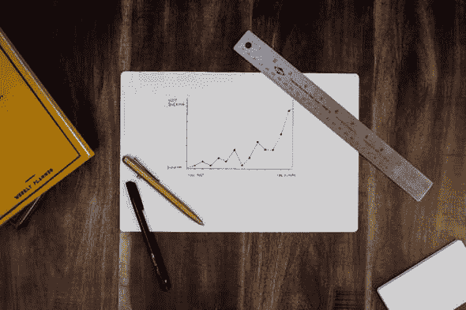

# 成为最完美的队友！

> 原文：<https://dev.to/dorshinar/be-the-perfect-teammate-2nlm>

我敢打赌，你过去都有过你无法忍受的队友。每个人都有他/她自己的理由，也许你不喜欢他们的专业能力，他们早上呼吸的味道，或者他们在严肃的会议上开的不恰当的玩笑。另一方面，我敢打赌，你的团队中有一些人，你觉得他们对团队是一个积极的补充，以至于你不记得没有他们。我会试着在这里列出一些我认为可以让某人成为更好的队友的事情。

## 学会倾听

 照片由[穆罕默德·梅特里](https://unsplash.com/@mohammadmetri)在 [Unsplash](https://unsplash.com/) 拍摄

当我想到一个好的队友时，成为一个好的倾听者是我首先想到的。没有人喜欢固执的人，他们总是对自己的方式如此自信。你可能是团队中最有经验的开发人员。这并不意味着你什么都知道。你不可能什么都知道。

在某些情况下，你有义务听取其他人的意见，无论是你的团队领导、高层管理人员还是产品部门，但这不是评判你倾听技能的时候。你是在你的同事、员工或任何与你职位相同或比你低的人面前被评判的。

这个定义既适用于和你一起工作的资深、老练和有经验的工程师，也适用于你职业生涯初期的初级人员。作为一名低年级学生，当一名高年级学生倾听你的意见时，感觉当然很好，当他们接受你的意见时，感觉更好。

## 每个人都可以教你一些东西

 摄影 [NESA 制作](https://unsplash.com/@nesabymakers)上 [Unsplash](https://unsplash.com/)

我知道嘲笑在工作的第一天就建议完全重构的新手很有趣。他显然不知道你为了让代码运行起来所经历的挣扎。他不会在晚上随叫随到的时候醒来，也不会因为一个你无法解决的难以捉摸的错误而差点弄坏一把椅子。

所有这些经历最终让你创造了今天的产品。这没有什么可嘲笑、贬低或侮辱的。然而，有些事情用一双新的眼睛会更容易看到，那些你已经忽略了的，习惯了的或者只是从来没有优先考虑过的事情。新的人，新的见解，所以即使他们说梦话，至少也应该值得一听。

## 无能的队友可以肆虐

 照片由[斯特拉·卡拉曼](https://unsplash.com/@stellacaraman)在 [Unsplash](https://unsplash.com/) 上拍摄

没有人能同时擅长所有的事情，尤其是当他们缺乏经验的时候。但是你应该总是渴望尽你所能做到最好。如果你不这样做，你的队友可能会觉得你拖累了他们，拖了团队的后腿，或者基本上帮不上什么忙。

如果你觉得自己处于那种境地(不要和冒名顶替综合症混淆，那完全是另外一个问题)，你有很多选择。到目前为止，我能给出的最好建议就是简单地寻求帮助。找一个你信任的人，认为他们是你的好榜样，问问他们是如何走到这一步的。他们在成长的道路上做了什么，你也能做些什么。

不管你的导师会给你什么建议，你都有很多事情可以做。你可以自学(通过阅读文章，或者在像 Udemy 或 T2 coursera 这样的网站上学习课程)，在家练习(个人项目是一个很好的起点，为开源项目做贡献是另一个)

如果你觉得自己站在了对立面，作为高级工程师，有一个没有经验的工程师拖累你，你的目标应该是让他们振作起来。他们甚至可能没有意识到他们没有发挥出自己的全部潜力，而你的工作就是向他们展示他们能够实现什么。提供结对编程课程、建议或技术资源，帮助你的队友不断提高。只是不要用居高临下的方式，因为你不想恐吓或冒犯任何人。另外，没人喜欢炫耀。

## 你不必成为团队中最好的开发人员

 照片由[克里斯·利维拉尼](https://unsplash.com/@chrisliverani)在 [Unsplash](https://unsplash.com) 上拍摄

如果你不是最锋利的工具也没关系。通常会有一个人永远在公司里，知道系统中的每一点代码，甚至在你有机会查看日志之前就能发现问题。没关系。大部分公司都会指导你，辅导你，所以你总能比昨天更好。我甚至会说，如果你在一个感觉不到进步的位置上，站起来离开。我们很幸运能在一个非常理想的领域工作，而且工作机会很容易找到。

我的主要观点是，你不应该害怕或担心你的地位。成为一名高级工程师需要时间和实践，所以不要急于求成，只关注你的个人成长。

处于中间实际上是一个很好的位置。你可以向那些你认为更有经验的人学习，你也可以教公司里新来的人和一般的编码新手。我坚信教学是学习的最好方式——它迫使你对一门学科有真正深刻的理解，这样你就不会迷惑或误导他人。

## 第一印象很重要，但第二印象更重要

 照片由[艾萨克·史密斯](https://unsplash.com/@isaacmsmith)在 [Unsplash](https://unsplash.com)

你的第一天似乎是最重要的一天，这一天将标志着你在公司的剩余时间。在这一天，人们会第一次见到你，和你说话，评价你。这一天可能会非常紧张。你不想说错，这样人们就不会认为你是个傻瓜，或者你不专业。你也不想把咖啡洒在衬衫上，看起来像个办公室呆子。

我说-那是错的。如果平均来说，一个工程师在他的职位上呆了大约 3 年(给或拿)，这意味着你将有大约 365*3-1=1094 天来弥补第一印象。不要烦恼，犯错是正常的，那些不幸将会成为你以后和你的同龄人开玩笑的话题，当他们了解真正的你的时候。

当然，我希望这是不言而喻的，一个糟糕的第二印象(以及第三、第四等等)会完全毁掉一个好的第一印象，所以也要注意这一点。正如我说过的，没有人喜欢有口臭的同事，或者说话粗鲁的同事。

## 总结归纳

这些是我对如何成为一个好队友的想法。我认为一个好的队友必须有很好的倾听技巧和意愿，你必须知道每个人都可以并且愿意教你一些东西。一个好的队友也不一定是最好的忍者，也不一定要给人留下最好的第一印象，但你必须弥补糟糕的第一印象。

谢谢你的阅读，希望你喜欢！

佩里·格罗内在 [Unsplash](https://unsplash.com) 上拍摄的封面图片