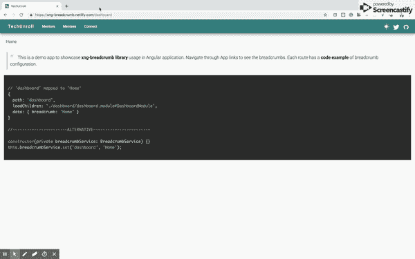

# 创建角度库时要考虑的 5 件事

> 原文：<https://dev.to/udayvunnam/be-the-thanos-of-your-angular-library-11oe>

> 初学者创建和发布第一个 Angular 库的基本清单和最佳实践

如果您计划创建一个库，不要等待。现在是时候了。当前的开源工具让一切变得如此无缝。下面是我发布第一个库的步骤。在我们进行的过程中，您可以查看 [GitHub repo](https://github.com/udayvunnam/xng-breadcrumb) 作为参考。

*   规划您的图书馆
*   为图书馆设置角度工作空间及其演示应用程序
*   同情你的用户和开发伙伴
*   配置 CICD
*   向全世界宣布

# ✅Plan 贵库

有一个简单的图书馆如何工作的设计和它提供的合同。

Angular 常用的前缀是`ng`或`ngx`(对 ng2、ng4、ng7 等说不。它们似乎被绑定到特定版本)。Angular 的大多数库都采用了`ng`和`ngx`前缀，所以我使用了`xng`前缀。

在选择了库的名称之后，使用 package.json 创建一个简单的文件夹，并将其发布到您的帐户下的 npm。按照[指南发布具有基本设置](https://docs.npmjs.com/creating-and-publishing-unscoped-public-packages)的 npm 包。(这确保了包名可用以及您对它的所有权)。如果您希望的常规包名不可用，您甚至可以使用作用域 packages @scope/package-name。

尝试创建一个独特的库，它可以执行以下任何操作

*   让特定的任务变得简单
*   提供可配置的解决方案
*   调整功能
*   提供可视化用户界面组件
*   简化流程

库 API 设计——正确的东西必须是你的库的默认值。我们不需要用户指定冗余配置，否则就是默认配置。

我已经用以下 API 设计了 xng-bread crumb-

1)在 html 中添加面包屑选择器，无论用户想在哪里显示面包屑。

2)如果没有提供配置，则显示与路径相同的默认面包屑。用户只需添加`<breadcrumb></breadcrumb>`即可快速启动。

3)声明式:通过在 App 的路由配置中直接定义，为路由添加自定义标签。

4)动态:提供一个惰性更新路由标签的服务。例如:在产品详细信息页面中，我们在 URL 中显示产品 id，但希望在面包屑中显示产品名称，这是从服务器异步获取的。

5)跳过面包屑中显示的特定路径。即使出现在 URL 中的路径在 breadcrumb 中也没有任何意义。我们必须提供隐藏它的方法。

首先从发布有用的特性开始，从用户反馈和特性请求开始迭代。

# ✅Setup 角形库和一个演示应用

有了 Angular CLI，只需几个命令就可以设置一个库和一个演示应用程序。您可以使用演示应用程序测试您的库使用情况。感谢 Angular CLI😍。

您已经为您的库选择了一个唯一的名称。对我来说，就是`xng-breadcrumb`。以下是使用库及其演示应用程序启动角度工作空间的基本命令。

```
1) ng new xng-breadcrumb --createApplication=false
2) ng g application xng-breadcrumb-app --style=scss
3) ng g library xng-breadcrumb --prefix=xng
4) git init
5) npm link ./dist/xng-breadcrumb && npm link xng-breadcrumb 
```

*   `ng new xng-breadcrumb --createApplication=false`生成一个空白的角度工作空间。如果 createApplication 不为 false，则唯一的库名称实际上应用于演示应用程序，稍后您需要在 angular.json 中对其进行重命名。在接下来的步骤中，我们可以在项目文件夹下创建库和演示应用程序。

*   在项目下创建一个演示应用程序，用于测试你的库和应用程序。

*   在项目文件夹中创建一个库，包含所有必要的构建和打包步骤。

*   `git init`在工作区内将它移动到一个 git repo 中，这样你就可以从一开始就跟踪一切。

*   在开发过程中，在编译的项目文件夹中运行`npm link`(。/dist/library)和项目根的`npm link library-name`。`npm link` symlinks 编译后的包文件夹到 npm 包，你对库的任何修改都会立即反映在演示应用中。

xng-breadcrumb 的[演示应用](https://xng-breadcrumb.netlify.com)展示图书馆的使用-

[](https://res.cloudinary.com/practicaldev/image/fetch/s--R90fC_NL--/c_limit%2Cf_auto%2Cfl_progressive%2Cq_66%2Cw_880/https://user-images.githubusercontent.com/20707504/60205896-0211f080-9870-11e9-9b14-9a3382945c64.gif)

# ✅Empathize 与你的用户和开发伙伴

不管你的库有多好，人们都不会使用它，除非你提供好的文档，所以，提供一个自述文件

*   *快速入门* -使用图书馆的最简单方法。从你的图书馆开始尽可能简单。

*   *用法和 API*-库 API、特性和做平常事情的常见模式应该被记录。好的文档可以为用户节省大量时间。他们不必深究代码，或者选择一个额外的库，或者在库已经提供的情况下实现一个定制的解决方案。

*   *演示 URL* -在应用程序中提供一个你工作图书馆的游乐场。

*   *开发指南*，*贡献指南*将欢迎其他开发者来贡献。

*   *徽章* -添加徽章以显示部署状态、测试状态、发布版本和其他回购活动

一个清晰的许可让你有信心使用你的库。MIT 是开源的事实标准。要了解许可的重要性，请阅读 [React 的许可在开发者强烈反对后从自己的定制许可变为 MIT 的许可](https://thenextweb.com/dd/2017/09/25/facebook-re-licenses-react-mit-license-developer-backlash/)。

## 示意图

向库提供原理图(特定于角度)。用户可以很容易地使用`ng add`将你的库的基础版本包含到他们的项目中。

`ng add`上的`xng-breadcrumb`原理图将执行以下操作。

1)将库安装并添加到 package.json 中

2)将`BreadcrumbModule`导入到根模块。

3)将`<breadcrumb></breadcrumb>`标签放在 html 的根位置。

4)使用 ng update 自动更新库。

Angular 已经提供了大量关于[原理图创作](https://angular.io/guide/schematics-authoring)和[库创建](https://angular.io/guide/creating-libraries)的文档。

# cid

CICD 是软件开发的标准。自动化一切-林挺、构建、测试、发布到 npm 和演示应用部署。您只需设置一次，让生活变得更轻松。测试你的代码，但不要测试用户:)

*   林挺的*漂亮的*和*健壮的*在 git 上自动提交

*   用于配置 CICD 的 *CircleCI* 或 *Travis*

*   *Netlify* 用于托管演示应用

xng-breadcrumb 使用 [CircleCI](https://github.com/udayvunnam/xng-breadcrumb/blob/master/.circleci/config.yml) 按照以下步骤进行配置，演示应用程序托管在 [Netlify](https://xng-breadcrumb.netlify.com) 上。

1) *构建*和*测试*每个分支的每个提交。

2) *只有在代码推送或者 PR 合并到总分行的情况下，才部署*演示 app( `netlify deploy`)。构建和测试应该能够成功部署。

3) *向 npm( `npm publish`)发布*，每当在回购中使用`git tag vX.Y.Z`标记新的发布

# ✅Announce 将其推向世界

你付出了很多努力。现在是时候展示给世界使用了。在 LinkedIn，Twitter，Reddit 和任何有你目标受众的平台上宣布。

对贡献、错误修复和特性请求保持开放。

一旦你的图书馆被发现是有用的，并获得足够多的用户，谷歌会负责其余的工作。

* * *

如果您计划将面包屑添加到您的 Angular 项目中，请尝试使用 [xng-breadcrumb](https://github.com/udayvunnam/xng-breadcrumb) 。

如果您希望创建一个具有完整设置的角度库，请检查 [Git repo](https://github.com/udayvunnam/xng-breadcrumb) 。欢迎投稿、问题和功能请求。

你有什么想让我知道的吗？通过 [LinkedIn](https://www.linkedin.com/in/udayvunnam/) 或 [Twitter](https://twitter.com/codeasync) 联系

注意:我已经在[medium.com](https://medium.com/@udayvunnam/https-medium-com-udayvunnam-be-the-thanos-of-your-angular-library-320f93ddc9ec)交叉发布了这篇文章