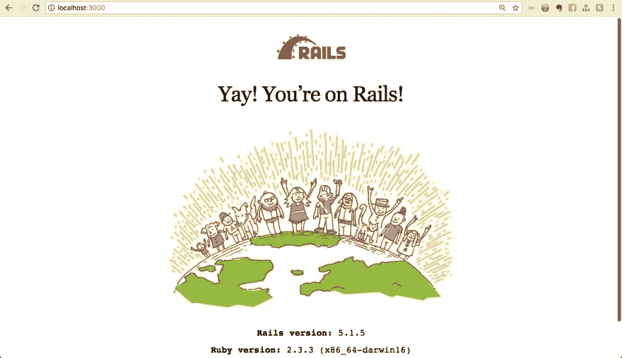

# 初学者关注 Ruby on Rails -第 1 部分(安装- Windows)

> 原文：<https://dev.to/iphytech/beginner-s-focus-on-ruby-on-rails-part-1-installation-windows-fd1>

我最近开始探索 ruby，我很惊讶我能用 ruby 和它的 web 框架(Ruby on Rails)完成什么。本教程是为即将到来的 ruby on rails 技术小组的 Nsukka 女性研讨会而编写的。

> 我不会抓住机会向[*Ruby Together Foundation*](https://rubytogether.org/)大声疾呼，感谢他们在我通过 [*RubyMe 计划*](https://rubyme.org/) 成为一个拥有 Ruby、Ruby on Rails 等的开源 rockstar 的过程中所给予的持续支持
> 
> Rubyme 计划是一个针对早期 Ruby 开发人员的付费指导计划。这旨在通过在导师的帮助下为开源项目做贡献来帮助早期职业开发人员积累专业开发经验。

我和我的导师为 [GitHub](https://github.com/Iphytech/ifme) 上的 *If-Me* 开源项目做贡献。

# 简介

在我开始列出我们将需要的工具之前，让我简单介绍一下 ruby，ruby on rails 是什么，以及使用它们可以实现什么。

##### 红宝石

Ruby 是一种动态类型和垃圾收集的编程语言。它支持多种编程范例，包括过程式、面向对象和函数式编程。[此处阅读更多内容](https://www.ruby-lang.org/en/about/)。

想深入了解 Ruby 吗？我在这里推荐这个教程[。](https://www.learnenough.com/ruby-tutorial/hello_world)

##### 红宝石轨道

这是一个 Ruby 的 web 框架。你也可以用它和 API 建立一个网站。

想了解更多[见本 doc](https://www.railstutorial.org/book) 。

* * *

在创建新的 Ruby on Rails 应用程序之前，您需要在本地机器(Windows)上安装以下工具。

所以为了安装 Rails，我们必须先安装 Ruby，要下载 Ruby，访问这个[链接](https://rubyinstaller.org/downloads/)，用 DEVKIT 安装*下的任何版本。*

1.  点击下载的 Ruby 包，
2.  打开它
3.  选择*我接受许可*
4.  选中可将拼音添加到路径中。
5.  检查关联。rb，。rbw 文件。
6.  点击安装
7.  立即按照说明完成安装

这将把 Ruby 和 DevKit(开发工具包)安装到您的本地机器上。

当安装完成后，点击 finish，它将提示终端出现，只需点击 enter，它将安装所有需要的软件包。

要确认 Ruby 是否安装成功，打开终端并输入`ruby --version`

要查看已安装的 gem 包列表...类型`gem list`

既然我们已经确认我们的机器上已经安装了 ruby，那么让我们快速安装 Rails (Ruby Web Framework)。

要安装导轨，请遵循以下说明:

1.  打开你的终端，输入`gem install rails --no-document`

`no-document`意味着我们不想在系统上安装 Rails 文档。

注意:这将会安装将近 40 颗宝石

检查一切是否正常-

打开你的终端
检查红宝石型`ruby --version`检查 T4 型`bundler --version`检查捆扎机型
检查导轨型`rails --version`

让我们创建一个 rails 项目来确认我们的安装。

`cd desktop`光盘到桌面-
制作目录- `mkdir rails-project`
光盘到 rails-项目- `cd rails-project`
创建 rails 应用- `rails new test`

* * *

注意:如果你遇到一个 sqlite 问题....请浏览此页面解决此问题[链接](https://github.com/sparklemotion/sqlite3-ruby/issues/224)

* * *

要解决此问题:

在代码编辑器中打开项目，

转到 gemfile 并添加这个

搜索`gem sqlite3`，然后用下面的命令替换它

`gem 'sqlite3', git: "https://github.com/larskanis/sqlite3-ruby", branch: "add-gemspec"`

现在在您的终端中:

测试项目光盘- `cd test`

类型`bundle install`

现在一切应该都好了。

耶！我们已经成功地在我们的机器上安装了`Ruby`、`Rails`
，我们还创建了 rails 应用程序。

要运行应用程序...

键入`rails s`或`rails server`

打开浏览器，输入`localhost:3000`

如果你看到下图

恭喜你。你坚持到了最后。