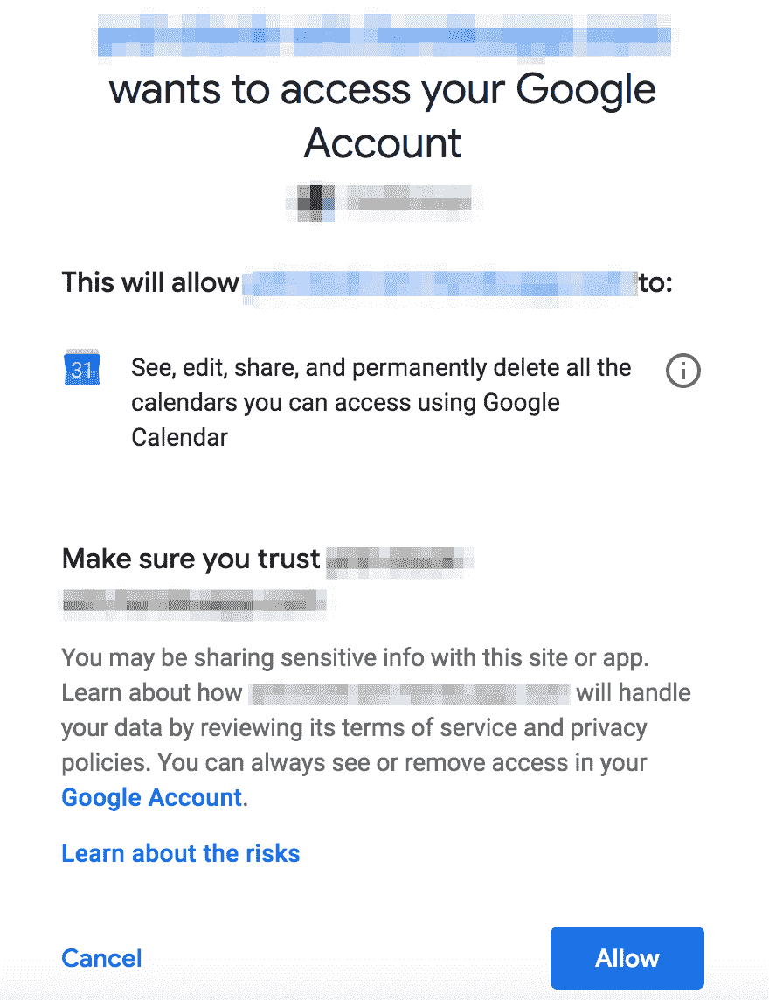

# OAuth 初学者指南:使用 Google API 理解访问令牌和授权代码

> 原文：<https://dev.to/risafj/beginner-s-guide-to-oauth-understanding-access-tokens-and-authorization-codes-2988>

作为用户，使用你的谷歌账户(或脸书、推特等)很容易也很方便。)登录其他服务。

1.  你点击“用谷歌登录”按钮
2.  您将被重定向到同意屏幕
3.  你点击“允许”
4.  页面重定向到实际的应用程序

但是实际上有很多事情正在进行，作为一名开发人员来理解这一点是很有用的。当我第一次在 Rails 中实现 OAuth 时，我使用了一个外部库( [`sorcery`](https://github.com/Sorcery/sorcery) gem 的外部模块),这让我很容易掩饰这个过程。然而，当我想定制一些东西时，我意识到有必要对它有更好的理解。我决定在没有任何认证助手 gems 的帮助下重新实现这个流程。

基于我所学到的，我写了这个 OAuth 流的基本解释，以及什么是授权码和访问/刷新令牌。我使用 Google 作为 OAuth 提供者。

这篇文章是为不太熟悉 OAuth 的人写的。换句话说，如果你已经知道它是如何工作的，并且能够理解谷歌的 OAuth [指南](https://developers.google.com/identity/protocols/OAuth2WebServer)，这篇文章对你来说可能太初级了。

# 什么是授权码和访问令牌？

在 OAuth 流程中，您的应用程序需要向 Google 发送两个请求。第一个请求是获得一个**授权码**，第二个请求是获得一个**访问令牌**。它们都是[长弦](https://stackoverflow.com/a/10299106/11249670)的形式，但用途不同。
这种类似的术语一开始可能会比较棘手，所以我们先简单介绍一下它们是什么。

我打赌这个屏幕看起来很熟悉。**授权码**是用户在这个屏幕上同意后，谷歌发送回你的应用程序的代码。

[](https://res.cloudinary.com/practicaldev/image/fetch/s--LWuZ-jwZ--/c_limit%2Cf_auto%2Cfl_progressive%2Cq_auto%2Cw_880/https://thepracticaldev.s3.amazonaws.com/i/txuse5twhl8flhukvj5l.png)

这个代码可以用来获得一个**访问令牌**。一旦收到授权码，就将它放入 params 中，并向 Google 发送第二个请求，实质上是说“给我一个访问令牌，这样我就可以代表这个用户发送请求了？”
谷歌对此的回应应该包括一个访问令牌。通过将这个令牌放在你的请求头中，你可以在用户的 Google 日历中创建新事件或访问用户的 Gmail。

## 重点注意事项:

### 授权码

*   仅对一次性使用有效，因为它的唯一用途是用它来交换访问令牌
*   很快过期(根据这篇[文章](https://www.oauth.com/oauth2-servers/authorization/the-authorization-response/)，OAuth 协议建议的最长时间是 10 分钟，许多服务的授权码甚至会更早过期)

### 访问令牌

*   可以使用授权码获得
*   代表用户放入任何对 Google 的 API 请求的头部
*   一小时后过期(如果你使用的不是谷歌，过期时间可能会有所不同)

访问令牌过期一小时后，您会做什么？你必须让用户重新登录才能得到一个新的吗？不。你可以得到一个叫做**刷新令牌**的东西，它允许你获得新的访问令牌。更多信息请见本文最后一节。

# OAuth 步步为营

让我们再看一遍基本的 OAuth 流程，除了这一次，我们是从开发人员的角度，而不是从用户的角度来看。我还包含了 Ruby 代码片段。

注意:我跳过了你必须做的第一个配置，那就是在 [Google API 控制台](https://console.developers.google.com/apis/dashboard)中创建你的`client_id`和`client_secret`。这份[指南](https://developers.google.com/adwords/api/docs/guides/authentication#create_a_client_id_and_client_secret)会带你一步步走过去。

### 第一步。用户点击应用程序中的“使用 Google 登录”按钮

### 第二步。重定向至谷歌同意屏幕

在我的例子中，点击按钮调用`oauths_controller`的`oauth`方法，然后重定向页面。

```
# oauths_controller.rb
def oauth
  args = {
    client_id: ENV['GOOGLE_CLIENT_ID'],
    response_type: 'code',
    scope: 'https://www.googleapis.com/auth/userinfo.email https://www.googleapis.com/auth/userinfo.profile https://www.googleapis.com/auth/calendar',
    redirect_uri: 'http://my-app.com/oauth/callback?provider=google',
    access_type: 'offline'
  }
  redirect_to 'https://accounts.google.com/o/oauth2/v2/auth?' + args.to_query
end 
```

Enter fullscreen mode Exit fullscreen mode

查询参数的快速解释:

*   `client_id`是您在 Google API 控制台中创建的。我刚刚把它存储在一个环境变量中。
*   `response_type: 'code'`表示您需要一个授权码来获取访问令牌。
*   `scope`定义你需要什么样的权限。除了用户名和电子邮件地址之外，我还需要访问用户的 Google 日历，这就是为什么我有上面的三个范围。范围的完整列表可以在[文档](https://developers.google.com/identity/protocols/googlescopes)中找到。
*   是用户点击“允许”后，谷歌重定向到的 URI。你不能把任何随机的 URI 放在这里；它需要与您在 Google API 控制台中添加的一个 URIs 相匹配。
*   `access_type: 'offline'`与我上面提到的刷新令牌有关，我们将在稍后的中讨论。

### 第三步。用户点击同意屏幕上的“允许”

### 第四步。页面重定向到您的`callback_uri`

谷歌处理这部分。在我的例子中，调用了`oauths_controller`的`callback`方法。

```
# routes.rb
get 'oauth/callback', to: 'oauths#callback' 
```

Enter fullscreen mode Exit fullscreen mode

来自 Google 的这个传入请求的参数包括一个授权代码(在`params[:code]`中)。

### 第五步。将授权码换成访问令牌

接下来，您需要向 Google 的 token 端点(`/oauth2/v4/token`)发出 HTTP POST 请求，以获得一个访问令牌来交换您刚刚收到的授权码。

注意:我使用 [`HTTParty`](https://github.com/jnunemaker/httparty) gem 来发出 HTTP 请求，但这当然不是强制性的。

```
# oauths_controller.rb
def callback
  # Exchange the authorization code for an access token (step 5)
  query = {
    code: params[:code],
    client_id: ENV['GOOGLE_CLIENT_ID'],
    client_secret: ENV['GOOGLE_CLIENT_SECRET'],
    redirect_uri: 'http://my-app.com/oauth/callback?provider=google',
    grant_type: 'authorization_code'
  }
  response = HTTParty.post('https://www.googleapis.com/oauth2/v4/token', query: query)

  # Save the access token (step 6)
  session[:access_token] = response['access_token']
end 
```

Enter fullscreen mode Exit fullscreen mode

至于这个帖子请求中的参数，如果你感兴趣的话，这篇文章提供了一个很好的解释。

### 第六步。保存访问令牌

如上面代码片段的最后部分所示，我将返回的`access_token`保存在会话中。现在，每当我想代表用户向 Google API 发出请求时，我都可以使用这个令牌。

例如，要获得用户的 Google 日历事件列表:

```
headers = {
  'Content-Type': 'application/json',
  'Authorization': "Bearer #{session[:access_token]}"
}
HTTParty.get(
  'https://www.googleapis.com/calendar/v3/calendars/primary/events',
  headers: headers
) 
```

Enter fullscreen mode Exit fullscreen mode

我们走吧！现在，我们已经使用授权令牌成功实现了 OAuth 流。

# 使用刷新令牌获取新的访问令牌

如上所述，访问令牌在一定时间量(例如 1 小时)后到期。如果你的应用程序的登录也在同一时间或更早过期，你没有什么可担心的——用户无论如何都要重新登录。

但是，如果你的应用程序允许用户登录更长时间(毕竟，在许多情况下，一个小时后被踢出应用程序可能是令人讨厌的)会怎么样呢？Google 的访问令牌仍然会过期，因此对 Google API 的任何请求都会被拒绝。

这就是**刷新令牌**的用武之地。只要在初始重定向(步骤 2)中指定了`access_type: 'offline'`，就可以在返回访问令牌的响应(步骤 5)中获得一个。

与访问令牌不同，刷新令牌没有设置过期时间。如果您的访问令牌已经过期，您可以使用带有 HTTP POST 请求的刷新令牌获得一个新的令牌，如下所示:

```
query = {
  'client_id': ENV['GOOGLE_CLIENT_ID'],
  'client_secret': ENV['GOOGLE_CLIENT_SECRET'],
  # Assuming we've saved the refresh_token in the DB along with the user info
  'refresh_token': current_user.refresh_token,
  'grant_type': 'refresh_token',
}
response = HTTParty.post(
  'https://www.googleapis.com/oauth2/v4/token',
  query: query
)

session[:access_token] = response['access_token'] 
```

Enter fullscreen mode Exit fullscreen mode

## 刷新令牌陷阱

### 1。你应该重复使用它们

每次请求新的访问令牌时，通常都希望使用相同的刷新令牌。出于这个原因，谷歌只在用户第一次同意并登录你的应用时给你一个刷新令牌(离线访问时为 [docs](https://developers.google.com/identity/protocols/OAuth2WebServer#offline) ):

> 该值指示 Google 授权服务器在您的应用程序第一次用授权代码交换令牌时返回一个刷新令牌和一个访问令牌。

这意味着将刷新令牌存储在长期存储中非常重要，比如数据库。

注意:如果您确实需要在用户每次登录时获取一个新的刷新令牌，您可以在[步骤 2](https://dev.to/risafj/beginner-s-guide-to-oauth-understanding-access-tokens-and-authorization-codes-2988#step-2-redirect-to-the-google-consent-screen) 中的授权请求中的参数中添加`prompt=consent`。这将要求用户每次登录时都同意，但响应将总是包括一个新的刷新令牌。

### 2。它们也会变得无效

虽然刷新令牌不会在设定的时间后过期，但它们在某些情况下会失效( [docs](https://developers.google.com/identity/protocols/OAuth2#token-expiration) ):

> 您必须编写自己的代码来预测授予的刷新令牌可能不再工作的可能性。刷新令牌可能由于以下原因之一而停止工作:
> 
> *   用户已取消你的应用的访问权限。
> *   刷新令牌已有六个月未使用。
> *   用户更改了密码，刷新令牌包含 Gmail 范围。
> *   用户帐户已超过授予的(实时)刷新令牌的最大数量。目前每个客户端的每个用户帐户有 50 个刷新令牌的限制。如果达到限制，创建新的刷新令牌会自动使最旧的刷新令牌失效，而不会发出警告。

例如，如果用户撤销了您的应用程序的访问权限，任何使用现有刷新令牌获取新访问令牌的请求都将停止工作。在这种情况下，您需要让用户注销并重新登录，以便获得新的刷新令牌。

* * *

在这个帖子中，我手动处理所有事情，不依赖于像`devise`、`sorcery`或`omniauth-google-oauth2`这样的宝石。我并不是说这是最好的方法。实际上，使用这些宝石可能更容易。这篇文章的目标是回顾实际发生的事情，以免盲目地让 gems 处理所有事情。感谢阅读！