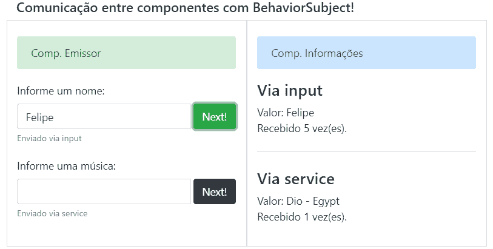

# 用于组件间通信的行为主体

> 原文：<https://dev.to/felipedsc/behaviorsubject-para-comunicacao-entre-componentes-3kpj>

在组件之间传输数据的最简单方法是使用*入站属性* (@Input)和 **EventEmitter** (@Output)。这往往就足够了，但我们可能会遇到一些问题:

*   如果我们要更改正在传递的变量数据*？我们是否需要重新渲染组件？*
**   如果我们要在检测到值更改时执行一些逻辑呢？*   如果子组件更改此数据怎么办？唯一的选择是创建“返回路径”来警告父零部件？*   如果多个组件需要一个集中的源，是否有方法可以维护该源？*

 *解决这些问题的另一种方法是使用**行为主体**，而不是将公共属性传递给其他组件。其功能让人联想到 **EventEmitter** ，但它是**可观察到的**，将始终以数值进行实例化和初始化。我们可以通过*入站属性*将此**行为主体**传递给其他组件，也可以将其集中到负责通信的服务中，这样，多个组件就可以订阅(订阅)此数据源，并保持其最新状态

* * *

### 摘要

在父组件或服务中，我们必须创建并实例化一个“**”行为主体“**”以供其他组件或服务使用。通过 **next()** 方法将新值发送给**【行为主体】**。有了**订阅()**，我们就能侦测到何时发生变更。我们可以在 **subscribe()** 期间获取当前值，并将其传递给某个变量或访问**属性**的**行为主体**的*行为主体名称】的*值也可以使用**管道异步** : *行为主体名称|异步*在 html 模板中显示值。

* * *

### 在实践中

我将简要说明它的用途，并在最后提供一个功能示例，例如 praxe。除了主组件之外，我还有两个组件，一个用于输出值，另一个用于显示值:

[](https://res.cloudinary.com/practicaldev/image/fetch/s--B4ZnXBsI--/c_limit%2Cf_auto%2Cfl_progressive%2Cq_auto%2Cw_880/https://thepracticaldev.s3.amazonaws.com/i/w392ja32fureofvs4r3k.PNG)

* * *

#### 行为主体通过入站属性

**app.component** 是我们的「父元件」，负责建立**行为主体**的例项，该例项将传递给子元件:

```
export class AppComponent {
  nomeBehaviorSubjectPai= new BehaviorSubject<string>("Felipe");
} 
```

Enter fullscreen mode Exit fullscreen mode

然后我们会有 2 个子组件，**发射器. component** 和**viewer . component**。两者均将通过*入境财产*获得**行为主体父项**。
我们定义了两者的输入。没有必要像在 **app.component** 中所做的那样实例化**行为主体**:

```
@Input() nomeBehaviorSubject: BehaviorSubject<string>; 
```

Enter fullscreen mode Exit fullscreen mode

```
<div class="row">
  <div class="col-6 border">
    <app-emissor class="m-1" [nomeBehaviorSubject]="nomeBehaviorSubjectPai"></app-emissor>
  </div>
  <div class="col-6 border">
    <app-visualizador class="m-1" [nomeBehaviorSubject]="nomeBehaviorSubjectPai"></app-visualizador>
  </div>
</div> 
```

Enter fullscreen mode Exit fullscreen mode

在**emitter . component**中，我们将通过**【next()**方法将新值发送给**subject behaviation**，为此，我创建了以下方法，该方法将由模板:

```
 enviarViaInput(nome: string) {
    this.nomeBehaviorSubject.next(nome);
  } 
```

Enter fullscreen mode Exit fullscreen mode

这样，我们已经可以通过我们的**查看器接收到的**行为主体直接访问该值。component 。我在你的模板中这样做了，如下面的代码:
*备注。:不是显示*
值的唯一方法

```
<div class="col-12">
  Valor: {{nomeBehaviorSubject | async}}
  <br>
  Recebido {{nomeCount}} vez(es).
</div> 
```

Enter fullscreen mode Exit fullscreen mode

请注意，我还显示了**name count**。我们也可以订阅**【行为主体名称】**，接收发行的金额，并执行一些逻辑。在这种情况下，我只是数一下收到的证券的数量:

```
 ngOnInit() {
    this.nomeBehaviorSubjectSubscription = this.nomeBehaviorSubject.subscribe(valor => {
      this.nomeCount++;
    });
  } 
```

Enter fullscreen mode Exit fullscreen mode

* * *

#### 行为主体通过服务

其用法将类似于上述示例，但使用的服务创建了实例**行为主体**，在本例中为 **app.service** ，使用了一些方法传递新值并获得了实例**行为主体**:【12304】

```
export class AppService {
  private musicaServiceBehaviorSubject = new BehaviorSubject<string>(`Dio - Egypt`);

  constructor() { }

  alterarMusica(valor: string) {
    this.musicaServiceBehaviorSubject.next(valor);
  }

  obterMusica() {
    return this.musicaServiceBehaviorSubject;
  }
} 
```

Enter fullscreen mode Exit fullscreen mode

**发射机. component** 将接受注射服务，并可通过**变音()方法**T4]传递新值

```
constructor(private appService: AppService) { }

enviarViaService(musica: string) {
  this.appService.alterarMusica(musica);
} 
```

Enter fullscreen mode Exit fullscreen mode

同样，**viewer . component**也接受注射服务，并使用**订阅** do **行为主体**来执行逻辑:

```
ngOnInit() {  
  this.musicaSubscription = this.appService.obterMusica()
    .subscribe(valor => {
      this.musicaCount++;
    });
} 
```

Enter fullscreen mode Exit fullscreen mode

我还创建了一种方法**【get music()**来访问模板的值。get 将允许我们访问**音乐**，就像它是我们组件中的一个通用变量，如所示:

```
get musica(): string {
  return this.appService.obterMusica().value;
} 
```

Enter fullscreen mode Exit fullscreen mode

```
<div class="row">
    <div class="col-12">
        <h4>Via service</h4>
    </div>
    <div class="col-12">
        Valor: {{musica}}
        <br>
        Recebido {{musicaCount}} vez(es).
    </div>
</div> 
```

Enter fullscreen mode Exit fullscreen mode

* * *

#### Vamos ver functionando？

*我建议在新标签中打开。*
[https://stackblitz.com/edit/angular-comunicacao-behaviorsubject?embed=1&&](https://stackblitz.com/edit/angular-comunicacao-behaviorsubject?embed=1&&)
如果要在新标签中打开或无法看到嵌入式，请单击[此处](https://stackblitz.com/edit/angular-comunicacao-behaviorsubject)。

* * *

请注意，我提出了给予**行为主体**的问题()。假如你没看过我以前的帖子，我在上面证明了这一点的重要性:
[观察:取消注册(取消注册)很重要！](https://dev.to/felipedsc/observables-cancelar-inscricao-unsubscribe-e-importante-51bc)*