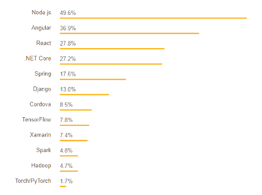
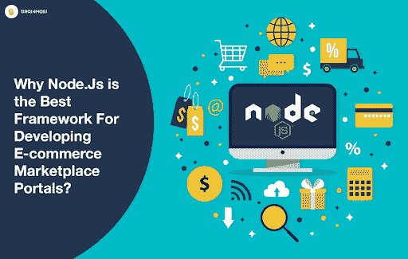
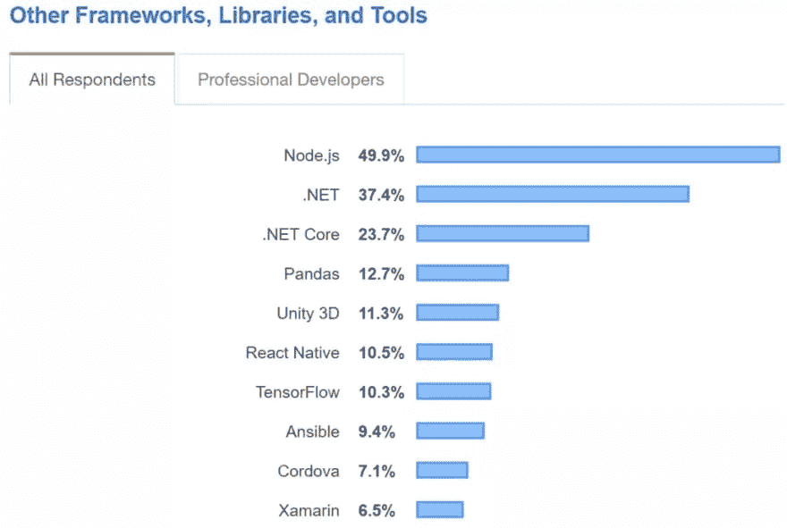
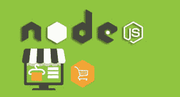
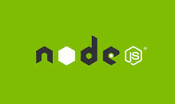
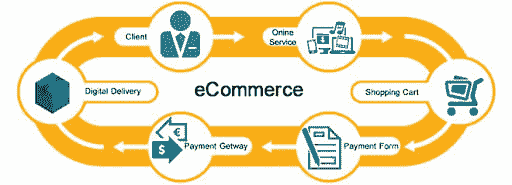

# Node.js 在电子商务行业的 10 大优势

> 原文：<https://dev.to/patricia248/benefits-of-implementing-node-js-in-e-commerce-industry-33o5>

据估计，到 2021 年，将有 21.4 亿人在网上购物。你想成为他们的最佳选择吗？随着电子商务行业的竞争逐年激烈，这并不容易。

如果不包括中国，那么在世界其他地方大约有 200 万到 300 万家电子商务公司。你的目标是在他们中脱颖而出吗？为此，你必须提供一些非同寻常的东西来吸引买家。

你必须打牢你的基础。你的公司在网络平台上的形象就是一个网站。让每个人都可以完美地交互和无缝地使用它。您可以通过使用高效的编程工具来实现这一点。

如果你已经登陆了这个页面，那么我假设你对 Node.js 是否适合你的电子商务业务感到困惑。我会试着回答我们的客户在博客中经常提出的问题

> 电子商务开发最好的编程工具是哪个？
> 
> node.js 框架对电商开发有多好？
> 
> 使用 node.js 对我的电商平台开发有什么好处？
> 
> 如果我使用 Node.js，会省钱吗？
> 
> 我能用 Node.js 开发一个可扩展的安全的电子商务网站吗？

javascript framework node.js 是电子商务行业的流行选择。根据 [Stack Overflow](https://insights.stackoverflow.com/survey/2018#technology-frameworks-libraries-and-tools) 的调查，它是最流行的框架。以下是他们的调查结果:

我们已经对这个框架有了基本的了解。这是一个开源框架，使其非常经济实惠且具有成本效益。Node.js 提供可伸缩性和稳定性的能力是它更适合电子商务公司的主要原因之一。

它是在 chrome V8 上开发的，以提供丰富的 javascript 库模块而闻名。Node.js 被顶尖的全球品牌用来开发他们的主要应用程序。

其中一些是网飞、优步、沃尔玛、LinkedIn、易贝、NASA、LinkedIn 和 Paypal。认为它是创建电子商务网站的最佳平台。所以，让我们来探究这种流行观点背后的原因。

以下是 Node.js 适合电子商务平台开发的主要原因:

> 可扩展性
> 支持社区
> 快速
> 高效性能
> 跨平台
> 最佳插件
> 开源
> 数据流一致性
> 易于沟通和管理
> 经济高效

## **【Node JS 在电子商务中的头号优势:可扩展性**

对于电子商务企业来说，可伸缩性非常重要。很明显，很多人会使用你的应用。随着业务的增长，用户数量也会增加。每个人都能够完美地使用你的平台是非常重要的。

因此，你不能冒险用一个不能提供太多可伸缩性的编程工具来开发你的电子商务平台。Node.js 提供了惊人的可伸缩性，因为异步架构是通过 Node.js 编程创建的。这使您能够实现巨大的可伸缩性。

这个框架的默认特性是为简单的应用程序提供极高的可伸缩性。它允许添加新的模块，以提高效率和可扩展性。它的可定制功能非常适合电子商务网站。

## **【Node JS 在电子商务的第二大优势:支持性社区**

大量的功能、特性和设计使得这个 Javascript 框架变得复杂。有时候，[雇佣的移动应用开发者](https://www.pixelcrayons.com/hire-mobile-app-developers?utm_source=Dev.toshi&utm_medium=shivangi&utm_campaign=10%20Top%20Advantages%20of%20Node.js%20in%20eCommerce%20Industry)在这个平台上工作的时候会寻求支持。

来自社区的大量支持为他们提供了可行的解决方案。像 GitHub 和 StackOverflow 这样的网站以在 Node.js 编程中提供建设性的支持而闻名。随着 49.9%的被调查者投赞成票，Node.js 被宣布为最受欢迎的框架。

毫无疑问，这些社区成员是使用 Node.js 开发电子商务网站的巨大支持者。这是因为社区不断地致力于漏洞，并向其用户提供更好和先进的结果。

## **# 3 Node JS 在电子商务中的优势:快速安全的性能**

在选择编程工具之前，速度是极其重要的判断特征之一。Node.js 提供了巨大的速度，因为它是在一个强大而快速的引擎上开发的，即谷歌 Chrome 的第 8 版。

使用 Node.js 时，您可以完全摆脱检查安全系数的负担。因此，您可以毫不犹豫地将支付网关功能集成到您的电子商务网站中。

像 Paypal 这样的全球顶级品牌已经有效地利用 Node.js 的速度来支持其庞大的网络流量。它是最快、最安全的 JS 框架之一，这使得它广受欢迎。

## **# 4 Node JS 在电子商务中的优势:高效的性能和错误处理**

Node.js 性能可观，速度快，安全性超高。与 PHP 等其他语言相比，这个 Javascript 框架以相对较低的成本提供了更好的结果。

查看产品特性、选择产品和支付选项等活动。都被 Node.js 编程简化了。除了最终结果，对于 web 开发公司来说，确保他们使用的编程工具是否能够处理错误也是很重要的。

Node.js 在检测错误方面提供了惊人的透明度和便利性。这将减少你项目的完成时间，这在战略上是非常重要的。它将让你在第一次尝试中就获得一个健壮的电子商务平台。

## **# 5 Node JS 在电子商务中的优势:跨平台**

你知道任何可以用于前端和后端开发的编程技术吗？Node.js 就是这种神奇技术的一个例子。如果一种语言不能在两端流动，那么开发人员还必须掌握其他语言的知识。

但是 Node.js 使这成为可能，这是一个杰出的例外。它采用了非常流行的语言进行前端开发；Javascript 到服务器端的开发。它的代码也可以重用，因为它提供了同样的选项。我想，现在你知道为什么 Node.js 成为了每个电商开发公司的不二之选了吧。

## **#6 电子商务中 Node JS 的优势:最优插件**

使用 Node.js 开发电子商务网站的最大好处之一是可以访问现成的扩展。它们对所有人都是免费的。你可以很容易地从 GitHub 这样的网站上下载它们。你将不必多花一分钱。这些插件可以让你加快开发的进程。

## **# 7 Node JS 在电子商务中的优势:开源**

开源显然意味着获取一切，这增加了成本效益。Node.js 是最大的 javascript 语言开源平台。天真的开发者可以接触到有经验的开发者和专业人士。

它们可以帮助纠正代码。除此之外，你可以享受更多的功能和更好的特性，证明 node.js 对电子商务是有益的。

## **# 8 Node JS 在电子商务中的优势:数据流的一致性**

用 node.js 处理文件非常容易，这是因为它的体系结构是以这样一种方式开发的，即相应的结果和 HTTP 请求将通过单个数据流。

这使得视频的上传速度很快。您的客户将能够快速做出购买决定，跳出率也会降低。这是 node.js 在电子商务中最大的优势。

## **# 9 Node JS 在电子商务中的优势:易于沟通和管理**

在发展你的电子商务网站时，你的首要任务是什么？我确信是与客户的实时交流支持了最佳的互动。Node.js 将为您提供用于此目的的所有基本特性。

因为它支持开发的两个方面，前端和后端，所以与客户端即时交互变得非常简单。node.js 编程可以轻松支持基于聊天的平台。所以，在电子商务网站中实现这一点变得很容易。

除此之外，管理产品非常容易。它不影响供应商是一个还是有多个供应商。在 NoSQL 数据库的帮助下，产品列表管理变得简单了。

## **# 10 Node JS 在电商方面的优势:性价比高**

您知道吗，与雇佣独立的前端和后端开发人员相比，全栈开发人员更便宜？Node.js 为您提供了一个相当外交化的解决方案。

通过使用 Node.js，您可以消除为前端和后端开发分别雇用开发人员的需要。这是因为 Node.js 可以用于这两者。这使得它非常经济实惠。此外，它是一个开源平台，有许多免费插件。

## **结论:**

电子商务商务平台需要一个可扩展的、安全的、快速的编程工具来进行开发。Node.js 以优惠的价格提供所有这些服务。由此得出结论，它是开发电子商务网站的最佳编程工具。

希望获得一个强大的电子商务平台来加速增长的商人应该选择[雇佣电子商务开发公司](https://www.pixelcrayons.com/ecommerce-development/?utm_source=Dev.toshi&utm_medium=shivangi&utm_campaign=10%20Top%20Advantages%20of%20Node.js%20in%20eCommerce%20Industry)，他们在提供 node.js 开发服务方面有专长。

有没有关于 Node.js 对于电子商务的好处的其他信息？如果你有，你可以在下面的评论区和我分享。我相信交换信息可以丰富我们的知识。